The conditioning of the air in the FWD and AFT cargo compartments is fully automatic. The operation for these compartments is similar so we will look at the forward cargo compartment, then we will see the differences for the AFT.

Ambient air from the cabin area enters the cargo compartment via an inlet isolation valve.

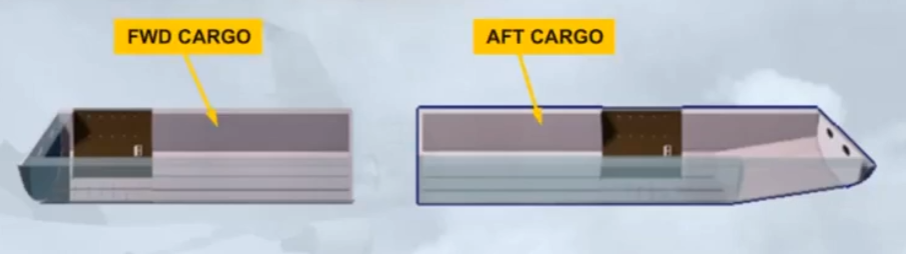

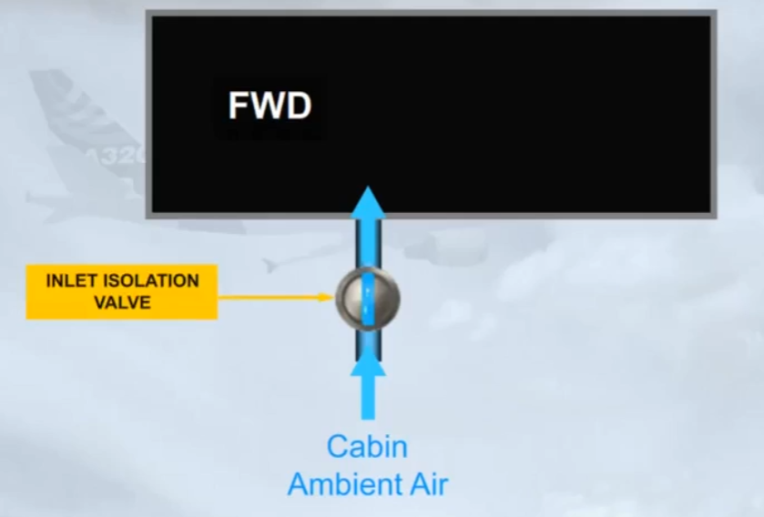

The air is removed from the compartment either by anextraction fan (when running), or by differential pressure (whenin flight). Then, the air is discharged overboard via an outlet isolation valve.

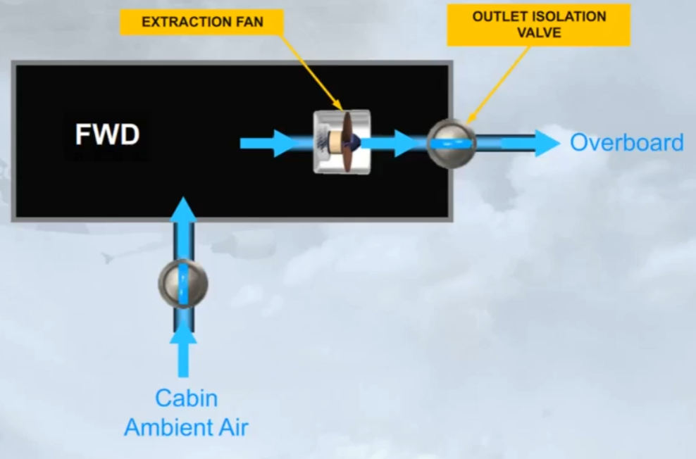

The operation of the two isolation valves and the extraction fan is controlled automatically by a cargo ventilation controller.

Note: the extraction fan will be running if on ground or if the differential pressure is less than 1 psi.

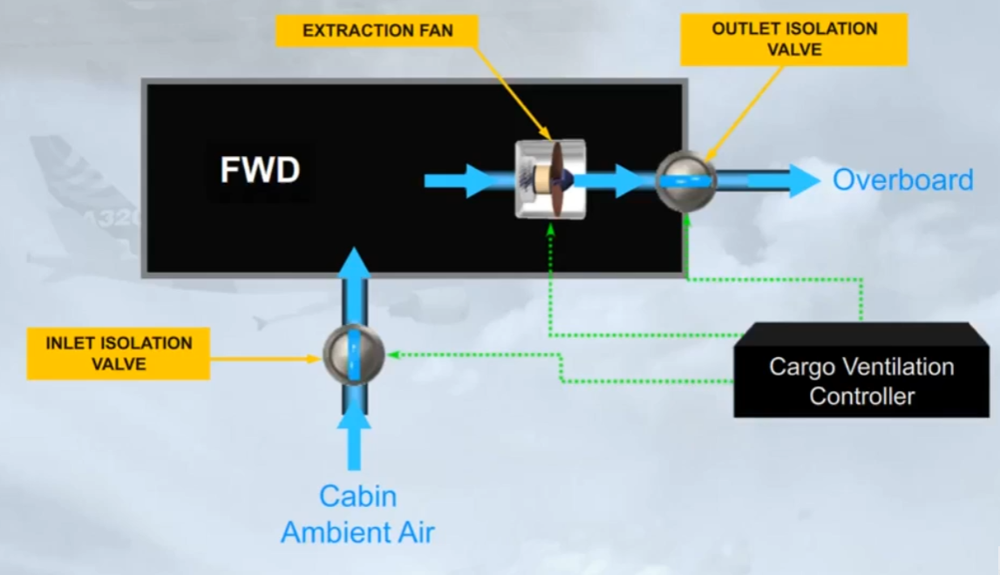

For the FWD cargo heating system (if installed), hot bleed air from cockpit and cabin hot air duct, is supplied via a trim air valve. The operation of the cargo trim air system is very similar to the trim air system of the air conditioning system.

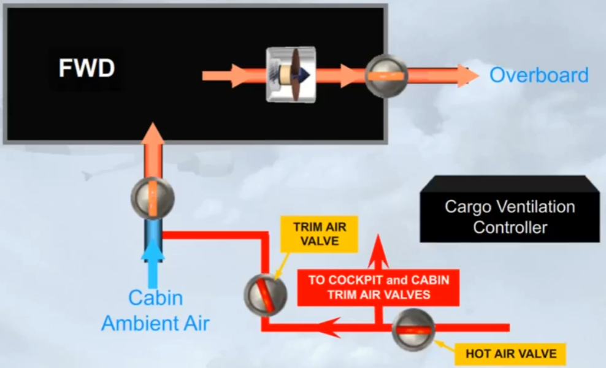

The FWD cargo heating Controller controls the related TRIM AIR valve and monitors the related duct inlet and zone temperatures.

Note: Compartment heating is not available when the forward cargo door is open or when the HOT AlR valve is closed.

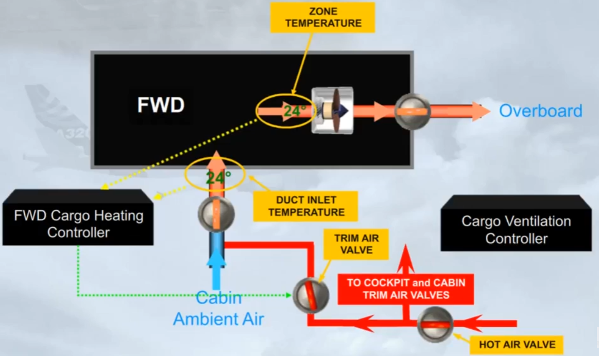

For the AFT cargo compartment, the same cargo ventilation controller controls the inlet and outlet isolation valves, and the extraction fan.

Note: the extraction fan runs continuously, as long as the related isolation valves are open.

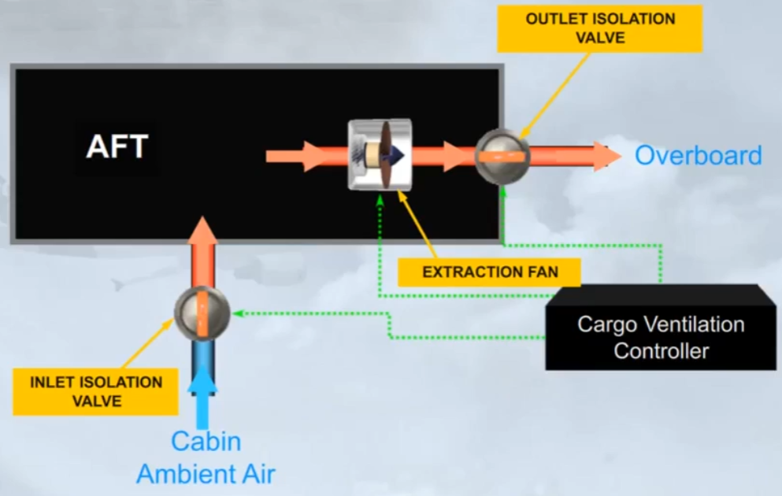

For the AFT cargo heating system (if installed), the hot air from bleed system iss upplied to the related TRIM AIR valve via a cargo pressure regulating valve.

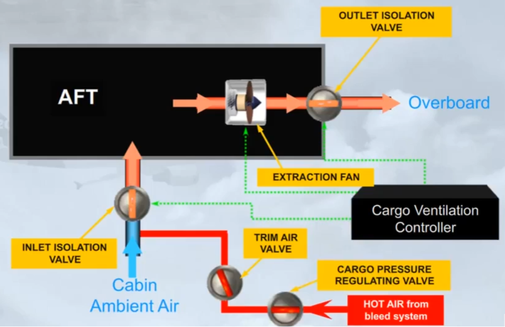

The AFT cargo heating Controller controls the related TRIM AIR valve and monitors the related duct inlet and zone temperatures

Note: Compartment heating is not available when the AFT cargo door is open or when the cargo pressure regulating valve is closed.

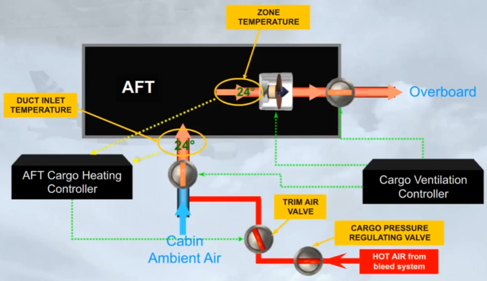

Let's see how information on the cargo conditioning system is presented to the pilots.

Let's look at the ECAM COND page.

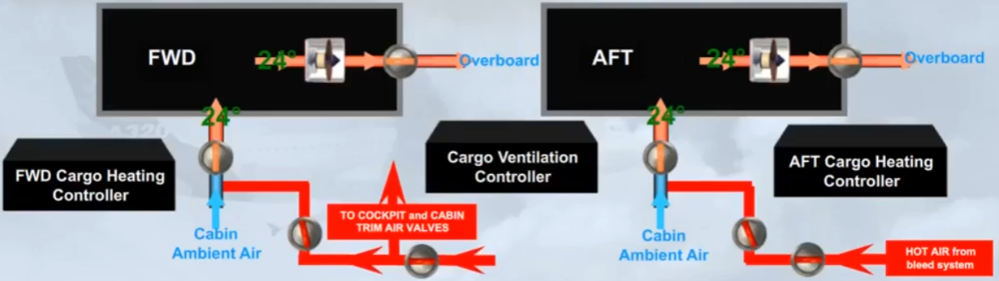

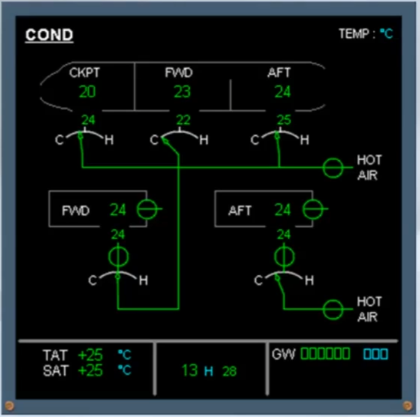

On the ECAM COND page the indications related to each cargo compartment are:
- The inlet and outlet isolation valves

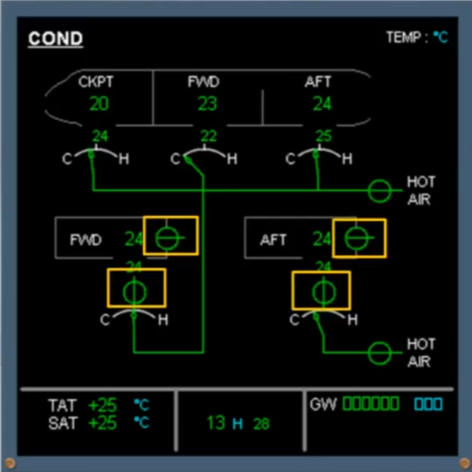

- The trim air valves

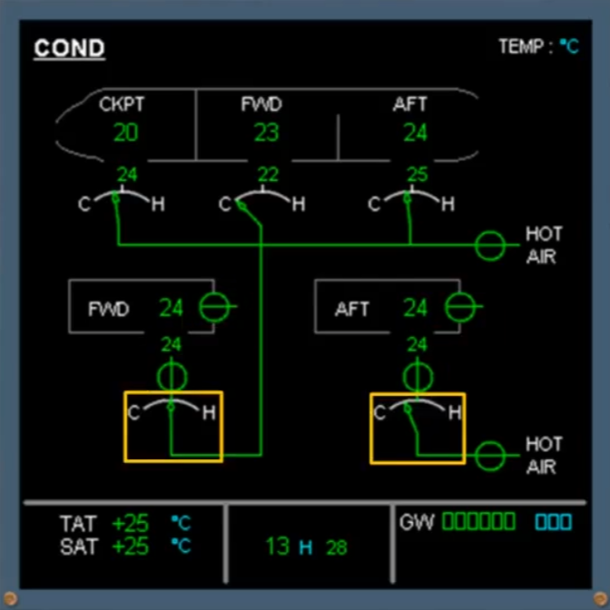

- The duct inlet temperature

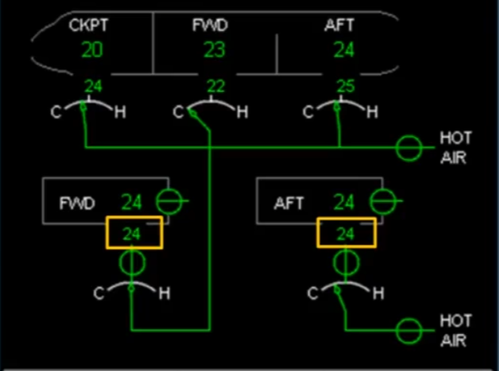

- The zone temperature and...

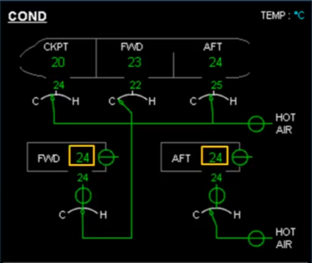

- The hot air valve for cockpit, cabin and FWD cargo trim air supply

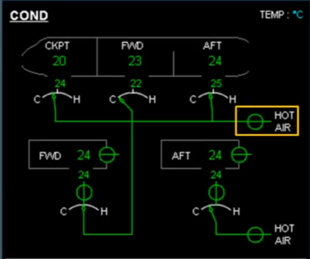

- The aft cargo pressure regulating valve

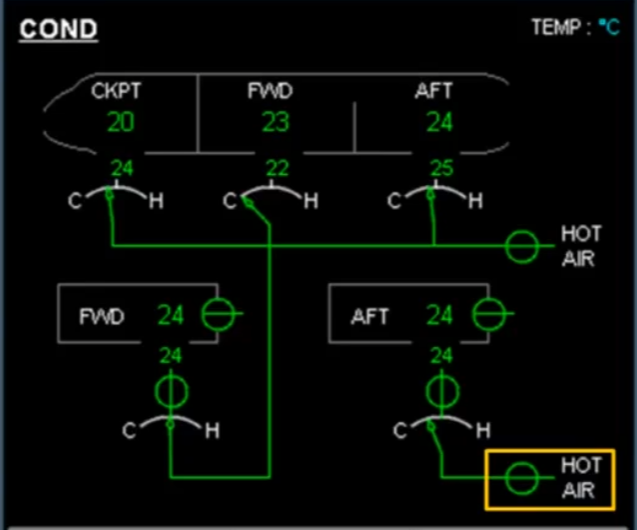

Notice that there are no indications for the extraction fans.

On the overhead panel there is a CARGO HEAT panel which contains the controls related to cargo heating (if installed) and cargo ventilation.

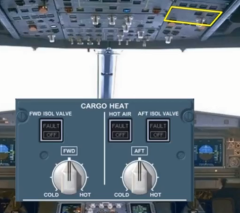

For each cargo compartment, there is an ISOL VALVE pb-sw. These pushbutton switches normally remain in their "lights out" auto position. In this case, the cargo ventilation controller will automatically open and close the isolation valves.

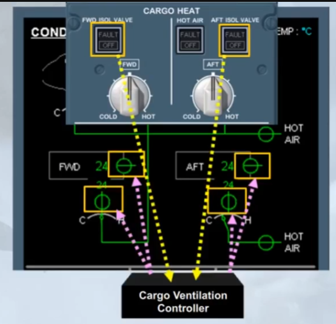

The temperature selectors send demand signals to the related cargo heating controllers. The cargo heating controller then moves the related trim air valve to adjust the temperature of the air entering the compartment.

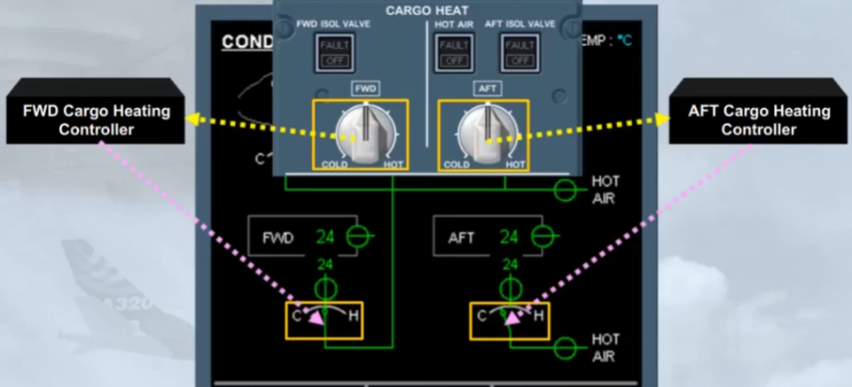

The HOT AlR pb-sw controls the aft cargo pressure regulating valve via the aft cargo heating controller. This pb-sw normally remains inthe "lights out" auto position.

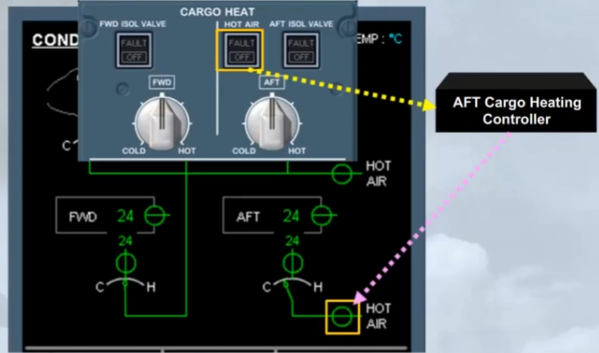

The normal operation of the cargo conditioning system only requires following pilot inputs:
- Confirm that the pushbutton switches are in their normal "lights out" position, and
- Set the required temperatures.

Note: the mid position of the temperature selector is approximately 15° C.

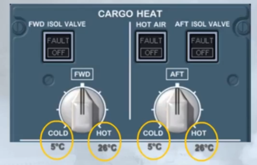

***Module completed***

## Video study

- Watch the video available on [YouTube](https://www.youtube.com/watch?v=ut0iIlzUa_k&list=PLKEybvo562LtwmnZOjo8jN7J75vXGqMzq&index=34)