This is a demonstration of an in-flight pack overheat. You are the PNF. You are currently flying at your cruise flightlevel, everything is normal.

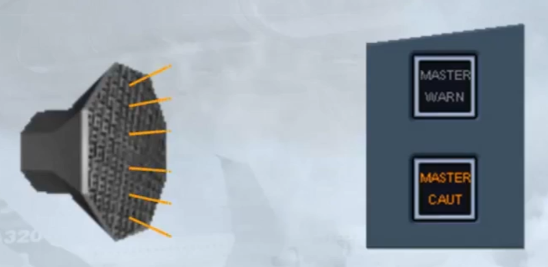

Let's look at the indications:
- A failure message and associated ECAM procedure have appeared on the EWD
- The ECAM BLEED page has been automatically called to show amber indications
- A FAULT light has illuminated on the AIR COND control panel.

Note: the caution message is triggered if the pack outlet temperature has been detected above a high limit or, during the flight, it has been four times above the amber temperature indication threshold

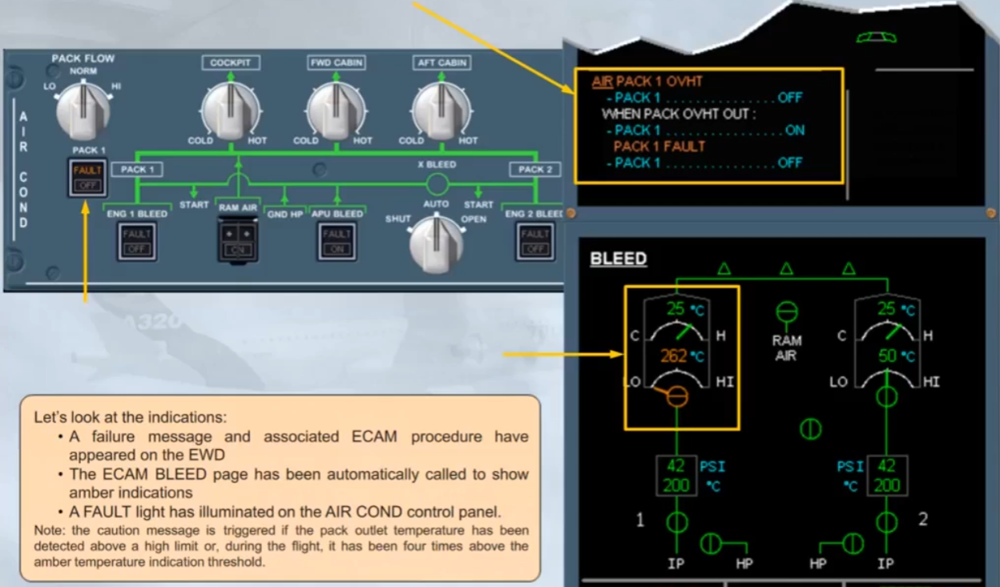

Before you begin, notice that the pack flow control valve has closed. This occurred automatically to protect the pack from damage, as the compressor outlet temperature amber limit has been exceeded.The valve color indication is amber, because the valve position disagrees with the pb-sw position.

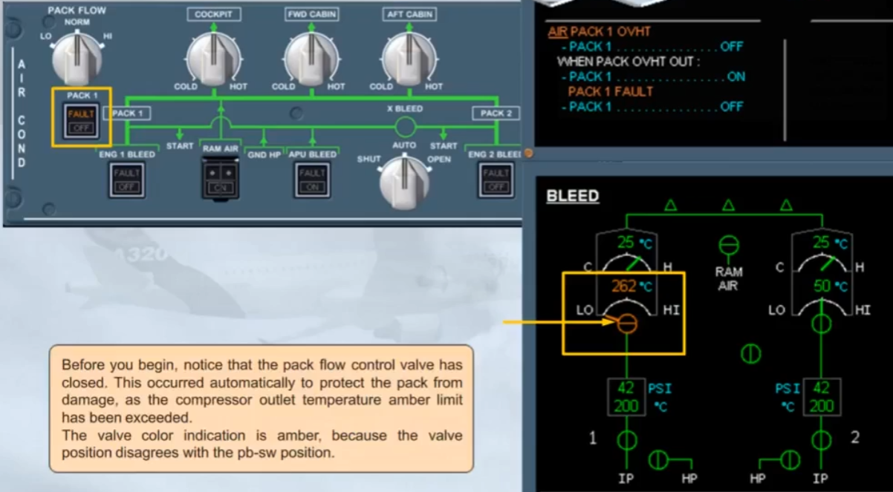

The first step on the ECAM is to turn PACK 1 off. This is to match pack pb sw with the pack valve position. And also as a preparation to reset the pack.

Note that the fault light on the pack pb-sw is on, to help to locate it, and to inform about the overheat condition.

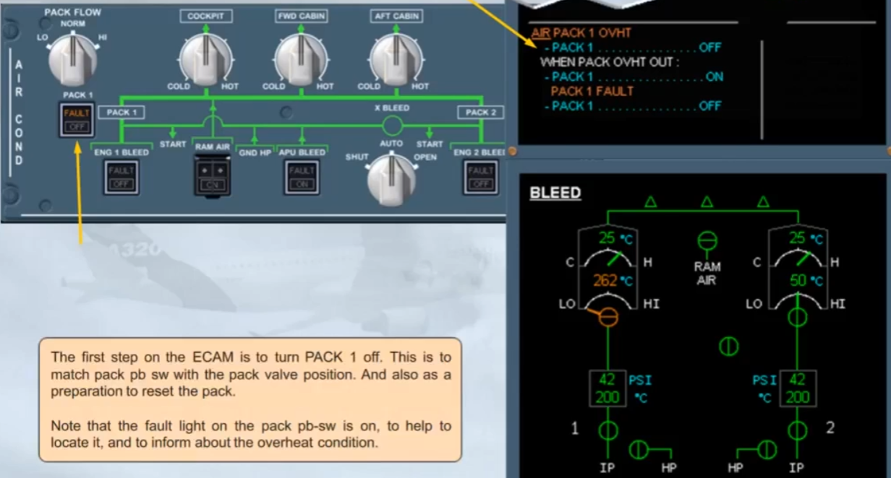

The PACK 1 pb-sw has been pressed to OFF. Its OFF light comes on, and the pack valve indication turns green showing valve/switch agreement.

Notice that the FAULT light is still on.

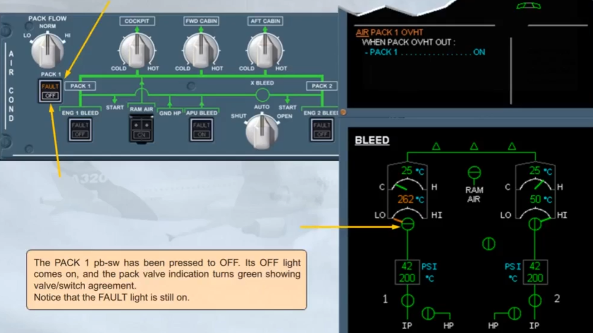

The completed procedural step disappears from the EWD. The compressor outlet temperature is now decreasing. Let's move on to the next step of the procedure, which is not an action but a condition line. We have to determine if the pack overheat is out.

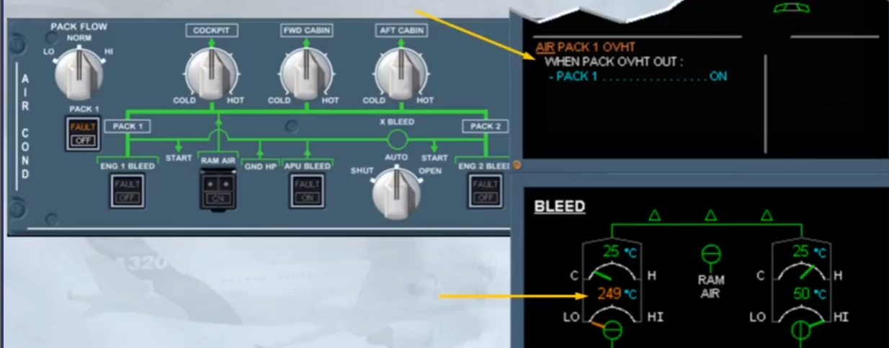

The fault light is off, and the compressor outlet temperature indication is green. So we can conclude that the overheat is out.

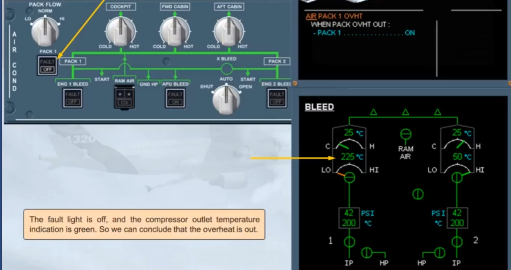

Therefore, do the next ECAM action by switching PACK 1 back on.

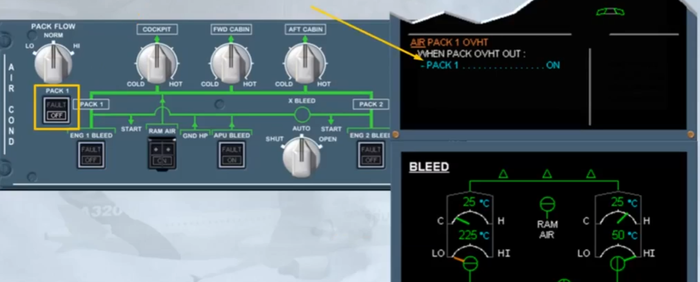

When the PACK pb-sw is set back to on:
- The OFF light goes off
- Normal memos replace the failure message on the EWD because the failure condition no longer exists and
- The System Display returns to the CRUISE page.

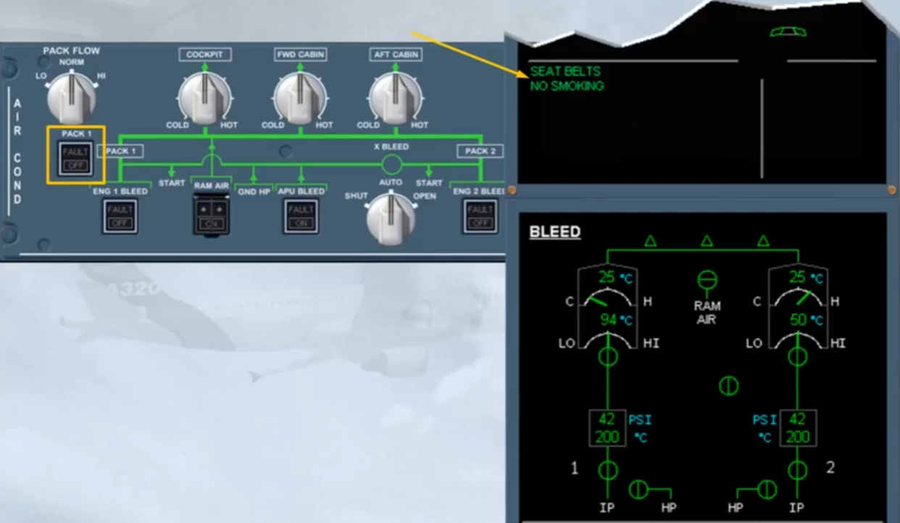

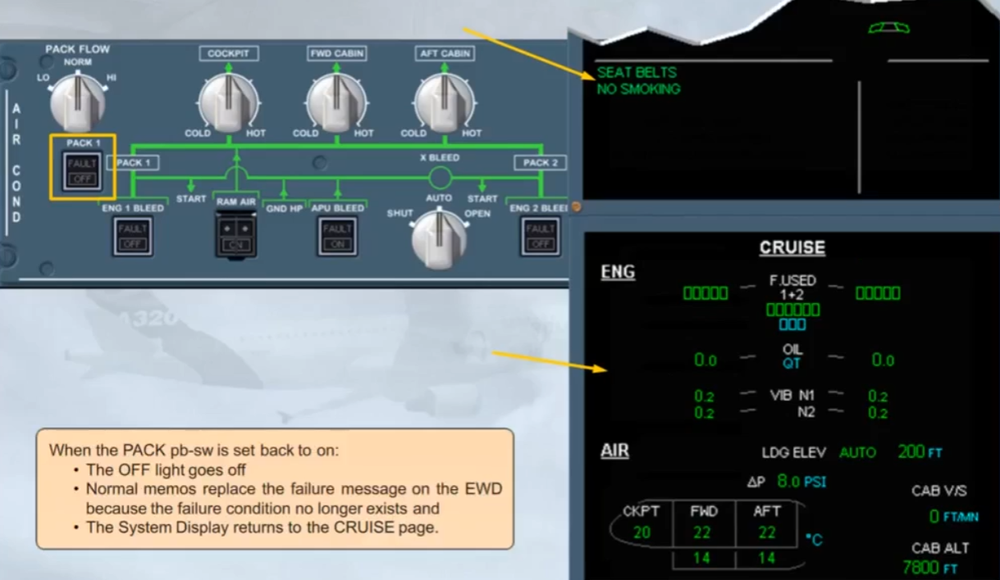

You have now completed the ECAM actions. The pack overheat condition has gone and the pack is reset.

Let's now review some other abnormal conditions.

If an ECAM or a QRH procedure requires the use of the RAM AIR pb, a RAM AIR inlet flap is operated by lifting the guard and pushing the pb.

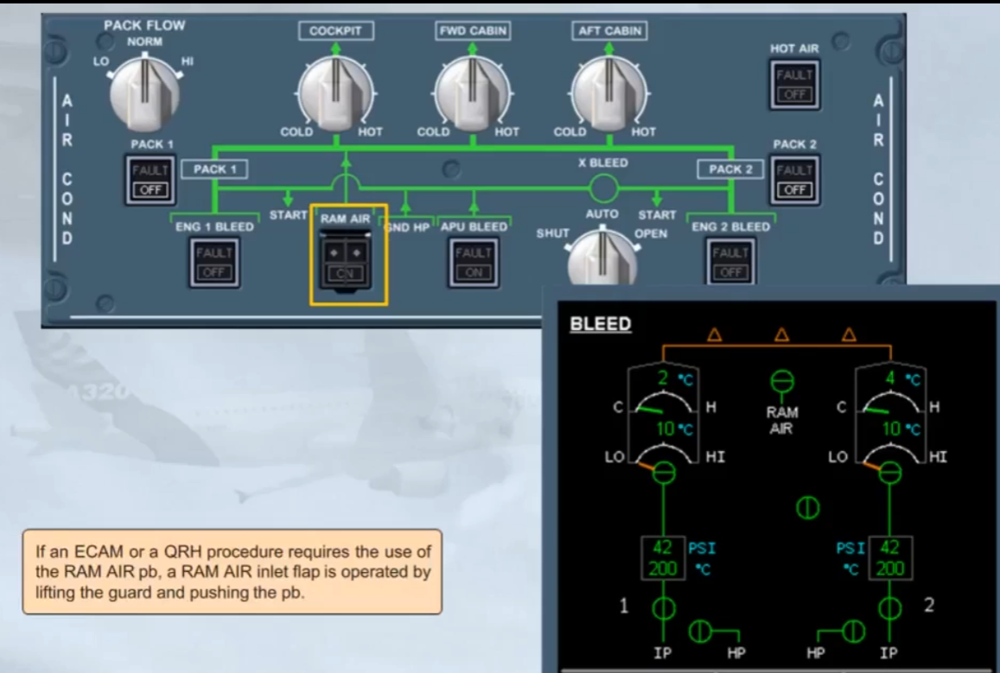

When this pb is pressed:
- The ON light comes on
- The flap opens
- The indication changes on the ECAM BLEED page.

Note: Outside ram airflow is directly supplied to the mixer unit if the cabin differential pressure is below 1 psi.

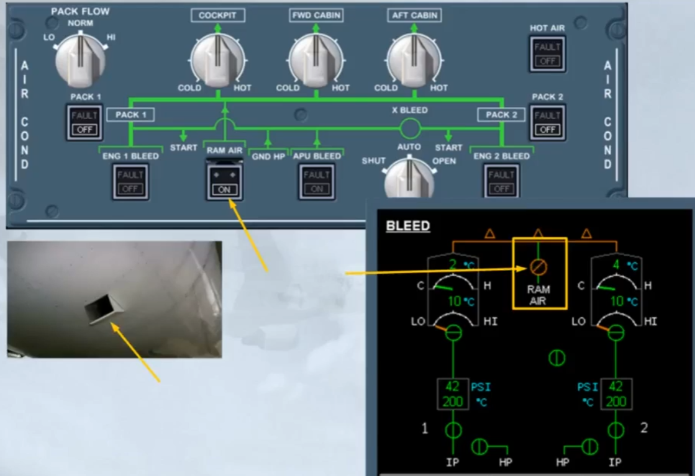

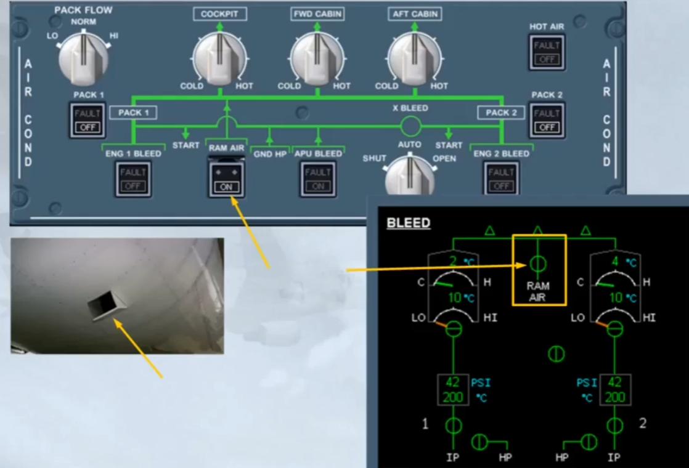

Let's look at another abnormal indication.

If too much hot air is mixed with the mixer unit cold air, and as soonas the related duct inlet temperature is excessive, the FAULT light comes on and the TRIM AIR and HOT AIR valves are automatically closed, to prevent an uncomfortable ambient temperature.

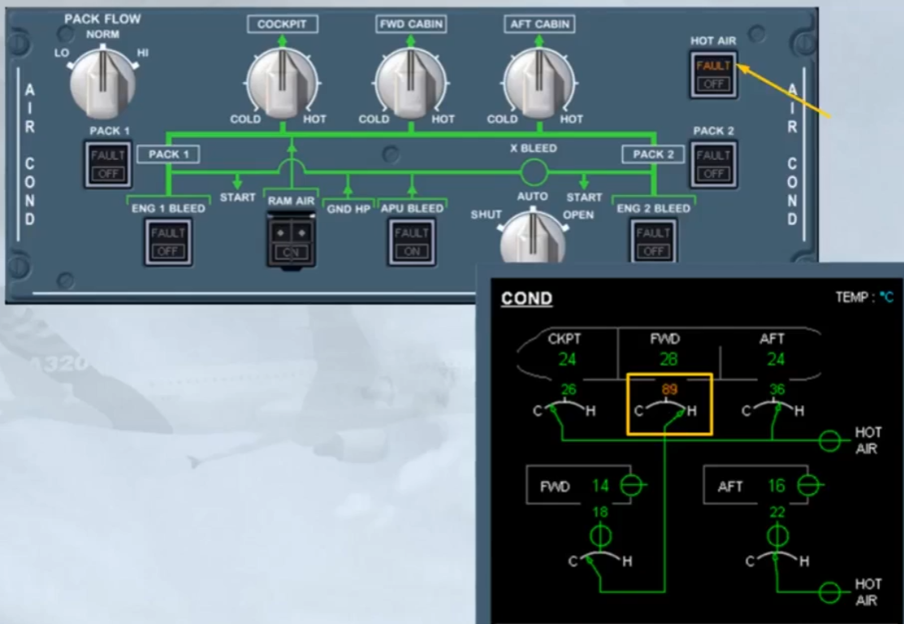

The FAULT light goes off only if the HOT AIR pb-sw is set to OFF, and the related faulty duct inlet temperature has dropped
below 70°C.

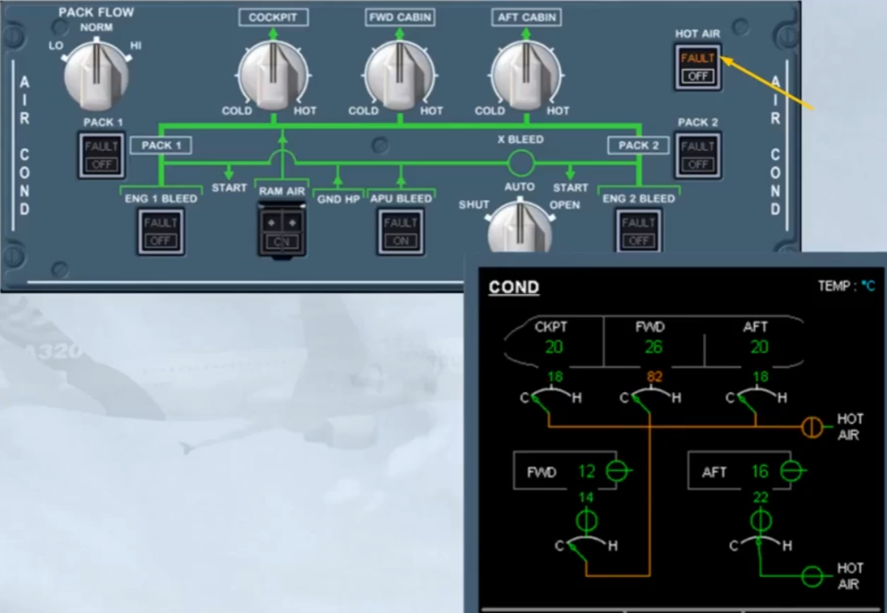

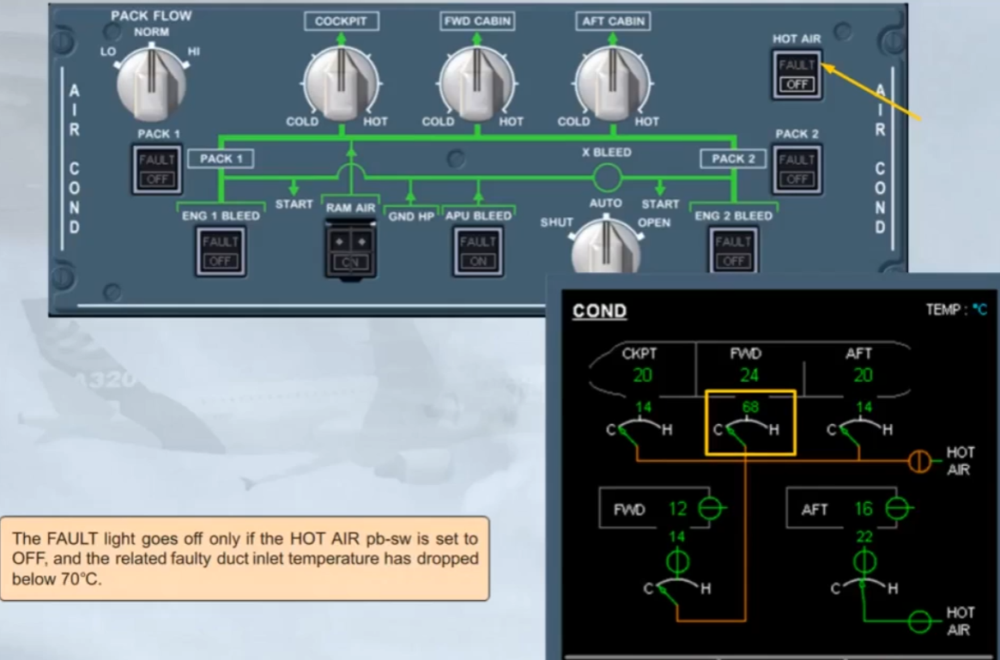

***Module completed***

## Video study

- Watch the video available on [YouTube](https://www.youtube.com/watch?v=9ACX-Veorl8&list=PLKEybvo562LtwmnZOjo8jN7J75vXGqMzq&index=33)