## Overview

The A320 is the most advanced single-aisle aircraft in service today, with fly-by-wire flight controls. The A320 is a medium range civil transport aircraft. This twin-engine aircraft is equipped with the following engines:
- CFM International (CFM 56-5), or
- International Aero Engines (IAE V2500).

With a Maximum Take-Off Weight (MTOW) of 77 T, the range of the A320 is around 3000 nm, as shown on the different maps.

Note: the A320 generic(一般的，通用的) MTOW is 75.5 T.

Optionally, the A320 family can be now equipped with sharklets allowing the performances to be improved by around 3.5%, so the range may be increased by around 100 nm, or the payload may be increased by around 500 kg (or 1100 lbs).

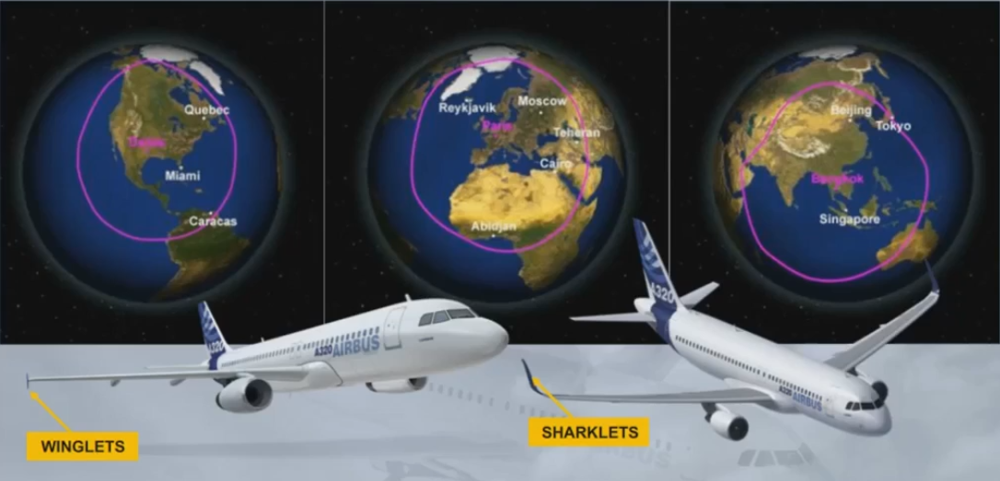

On the A320, the layout for passenger seating may be different to comply with operating requirements, but for a typical two-class seating it is 150 pax, and for a typical high density seating it is 180 pax.

Note: For the payload, pax and baggage weights are based on 90.7 kg (200 lb).

As an option, additional fuel tanks can be installed.

---

## Exterior

### Dimensions
Please, have a look on these dimensions.

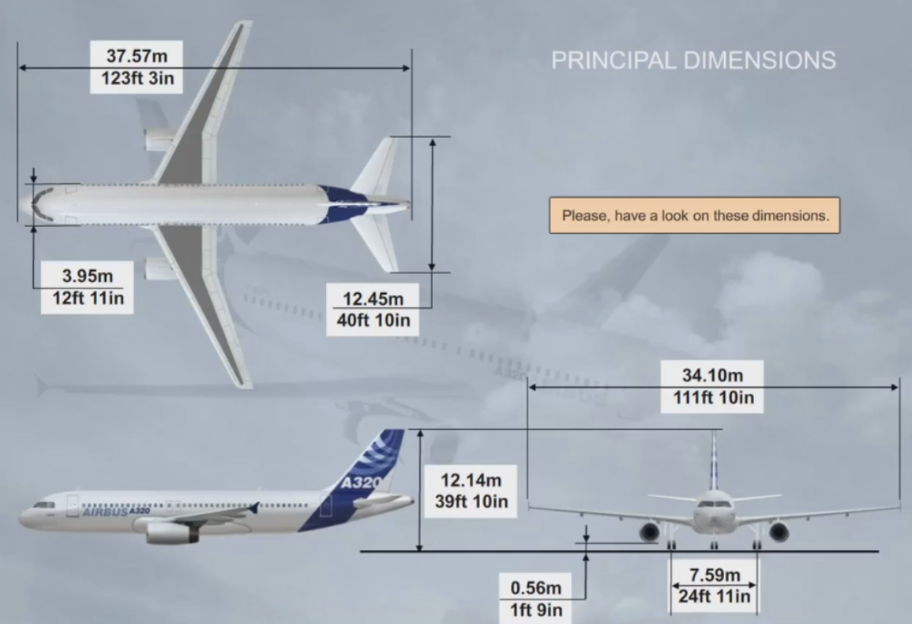

The procedure to do a 180° turn on the runway is on the Standard Operating Procedures. In order to help the turn, asymmetrical thrust may be applied on the external engine, and depends on the engine type:

- For CFM engine, around 50% to 55% of N1
- For IAE engine, around 1.05 of EPR.

A 180° turn can be done by the CM2, butsymmetrically.

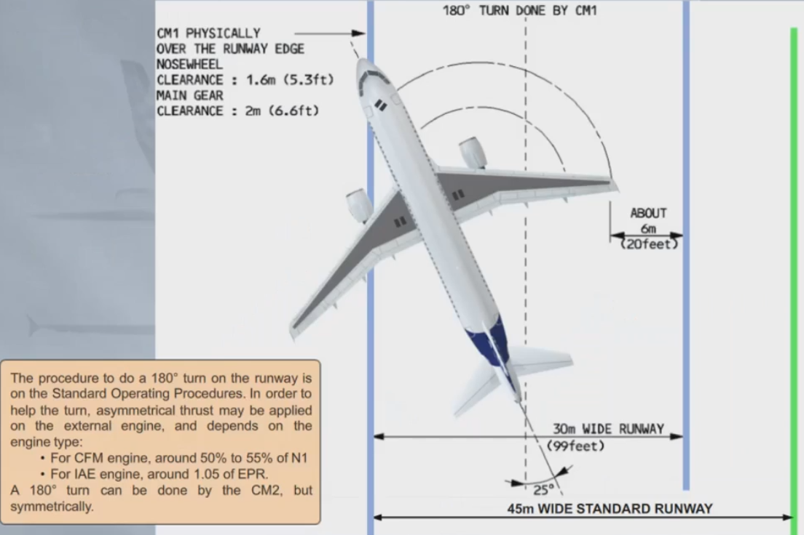

For the A320, if the wing clears the obstacle, then the tail will also clear it as it is inside the radius of the wing.

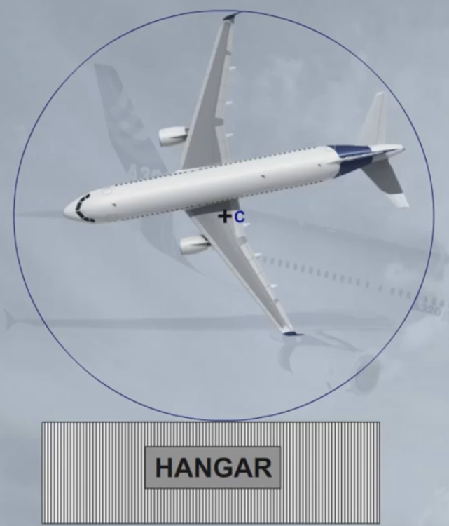

### Fuselage

The following areas are unpressurized:
- The tail cone
- The main gear bay
- The air conditioning packs
- The nose gear bay
- The radome.

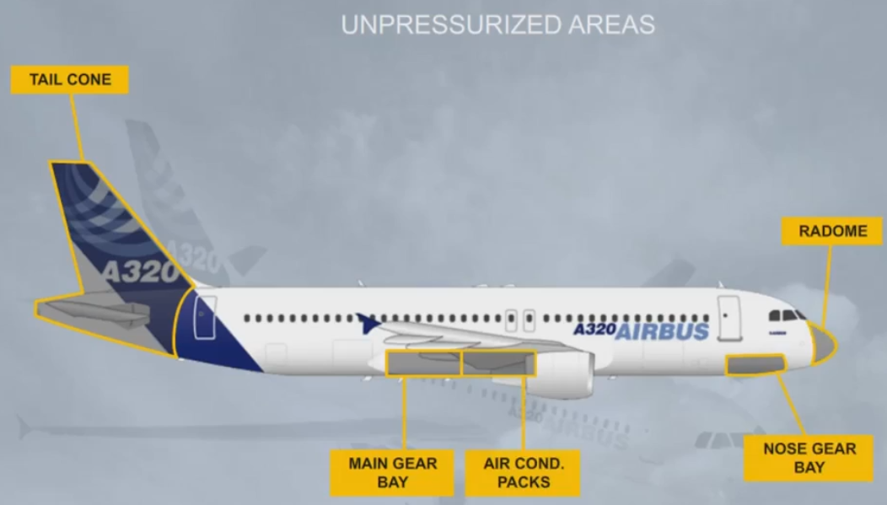

Let's briefly familiarize you with the location of the communication antennas:
- VHF 1
- VHF 2
- VHF 3
- HF 1, and HF 2.

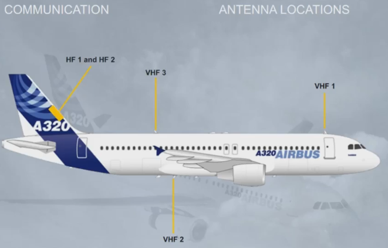

Let's now have an overview of the location of the navigation antennas:
- Radar
- Localizer and Glide Slope
- DME 1 and 2
- ATC
- GPS 1 and 2
- Marker
- TCAS
- ADF 1 and 2
- Radio Altimeter
- ELT (Emergency Locator Transmitter)
- VOR 1 and 2.

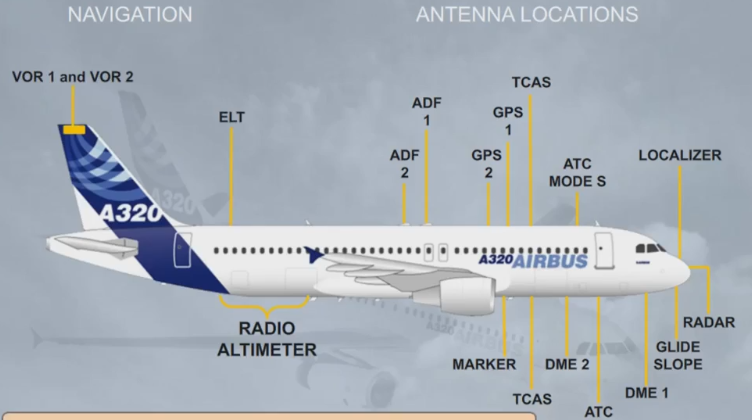

There are three cargo compartments:

- A forward cargo compartment
- An aft cargo compartment
- A bulk cargo compartment.

The size of the fuselage accommodates standard containers.

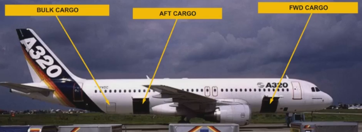

---

## Cockpit

The cockpit is designed for a two crew member operation with one or two observer seats.

The cockpit of the A320, a two-man "glass' cockpit, is the most advanced cockpit of any civil airliner.
It has an optmized layout of six LCD display units. The absence of control columns between the pilots and instruments ensures excellent visibility of all instruments.
The system controls are located on an overhead panel in such a way that both crew members can monitor them.

The pilots seats are electrically or manually adjustable.
All the seat adjustments will be shown during the simulator session.

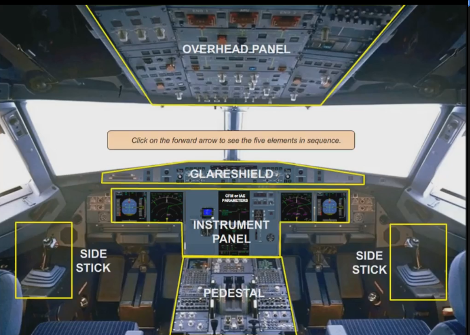

---

The overhead panel is used:
- During the preflight to check that all the lights are out (dark cockpit philosophy), and
- In flight to carry out emergency, or abnormal procedures.

The central part of the overhead panel is dedicated to the following aircraft

systems:
- AIR COND
- ELEC
- FUEL
- HYD
- FIRE.

Note: The most frequently used controls are at the bottom part, as shown.

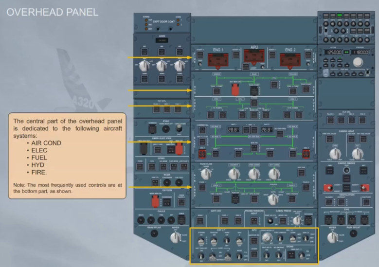

For a closer view, let's take the FUEL panel.

The related system name is written on the left and right side. 

For each system there is a green schematic diagram(示意图).

Notice all pushbutton switches are in lights out configuration.

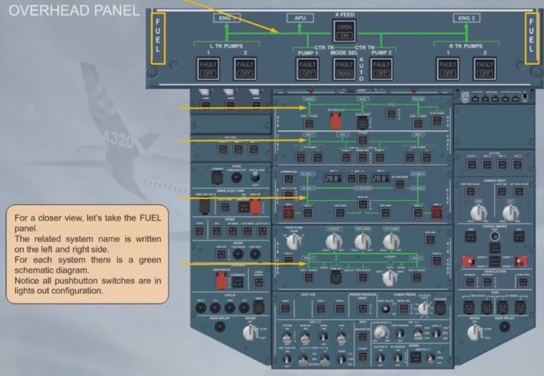

---

The glareshield is used by the pilots for flight guidance and short term flight management.
It is also used to control the Electronic Flight Instrument System (EFIS).

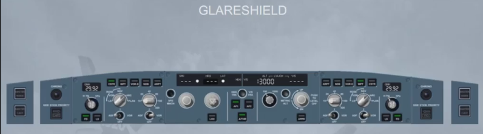

---

The instrument panel gives the following information to the pilots:

- Flight information through the Electronic Flight Instrument System (EFIS), and Integrated Standby Instrument System (ISIS)
- System information through Electronic Centralized Aircraft Monitoring (ECAM).

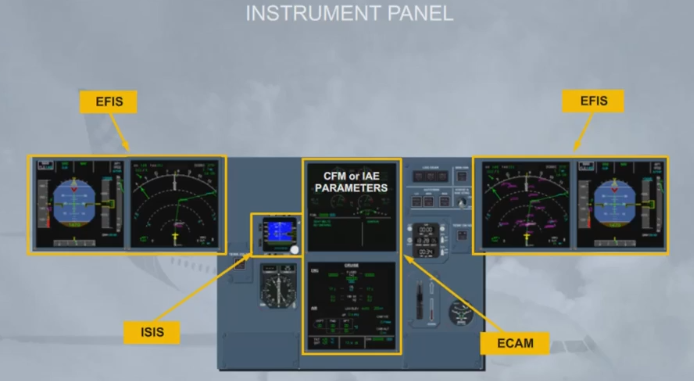

---

Now let's see how we deal with units in this course.
Individual airlines can choose which units they wish to use for some parameters on the ECAM screens. In the examples shown we have highlighted the areas on the screens where the units used could differ.
For US units option, the comfort temperatures will be in ° F, and the weights will be in lbs.
For Metric units option, the comfort temperatures will be in °C, and the weights will be in kg.

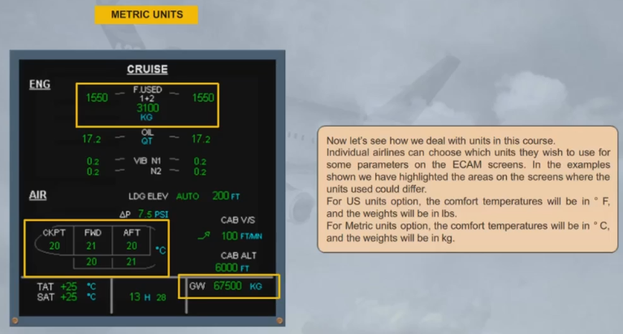

Because these indications are only mentioned in a few areas of the ground school course, we will use blue boxes to indicate that the units may differ depending on the choice of your airline. The green boxes mean that the information in this area of the screen is not mandatory to be shown for the related studied system. Of course, when the air conditioning,or the fuel system, is being studied the appropriate unit values will be shown.

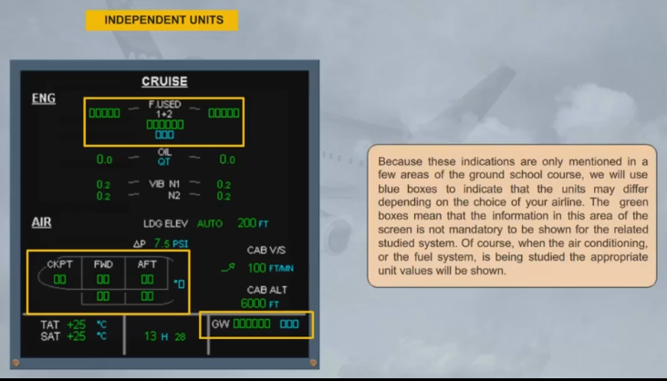

---

Like on a conventional aircraft, on the pedestal they are:
- The radio communication controls
- The flaps and slats control
- The speed brake control
- The engine controls...

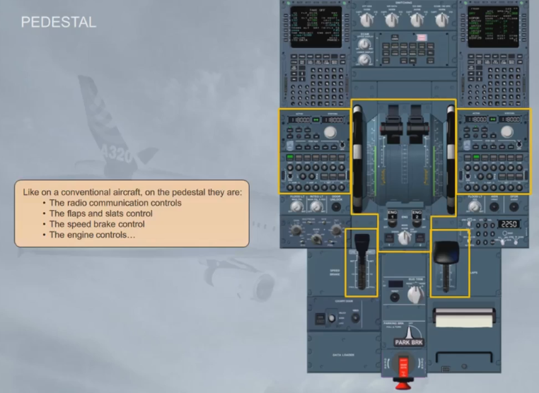

The pedestal also has:
- The ECAM Control Panel (ECP)
- The Multipurpose Control Display Units (MCDUs) which are the long term interface with the Flight Management and Guidance System (FMGS).

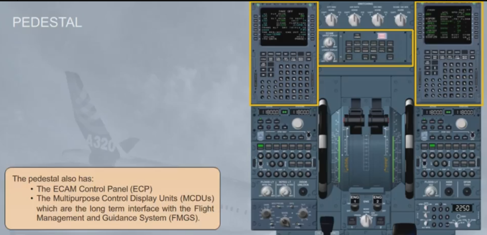

---

The aircraft is flown manually using either side stick. They are installed on the left and right hand sides of the cockpit.

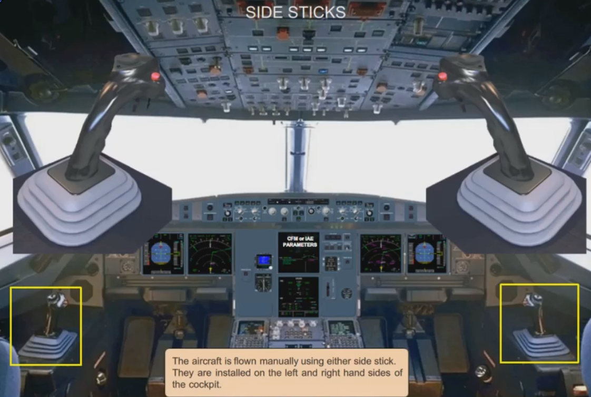

***Module completed***

## Video study

- Watch the video available on [YouTube](https://www.youtube.com/watch?v=2KOM_tz_aeI&list=PLKEybvo562LtwmnZOjo8jN7J75vXGqMzq&index=1)

