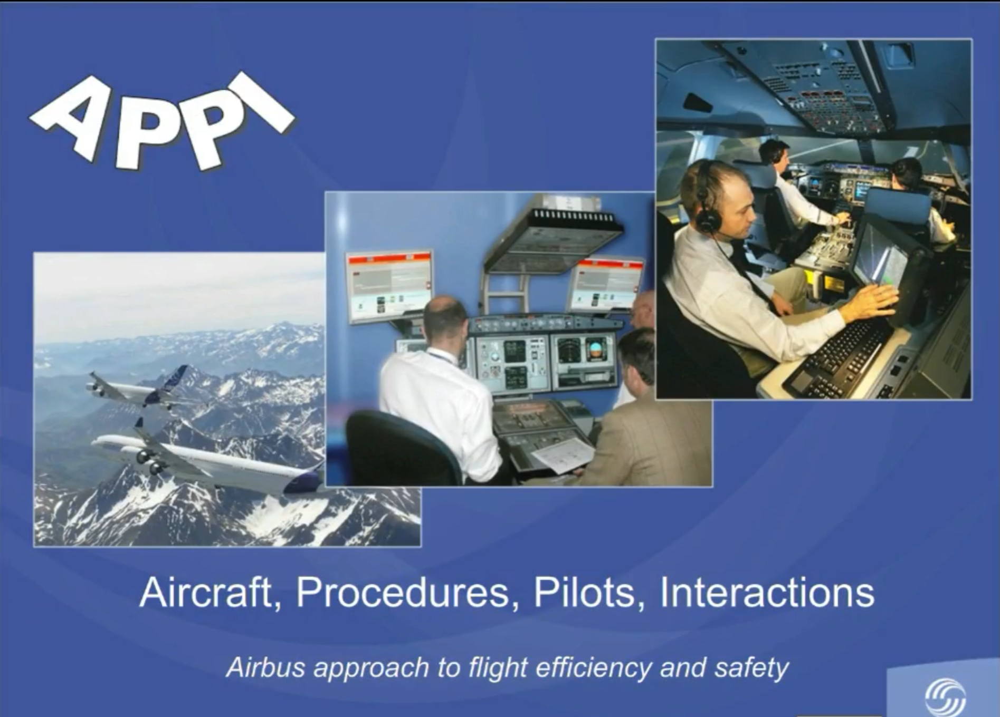
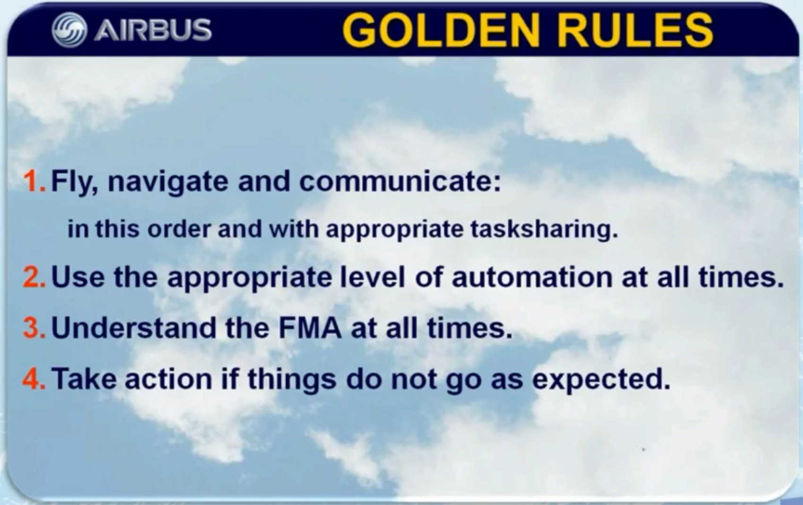
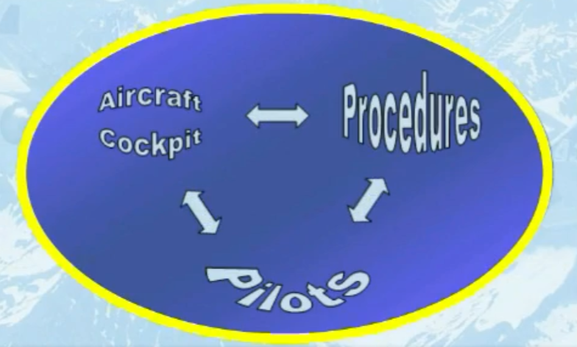
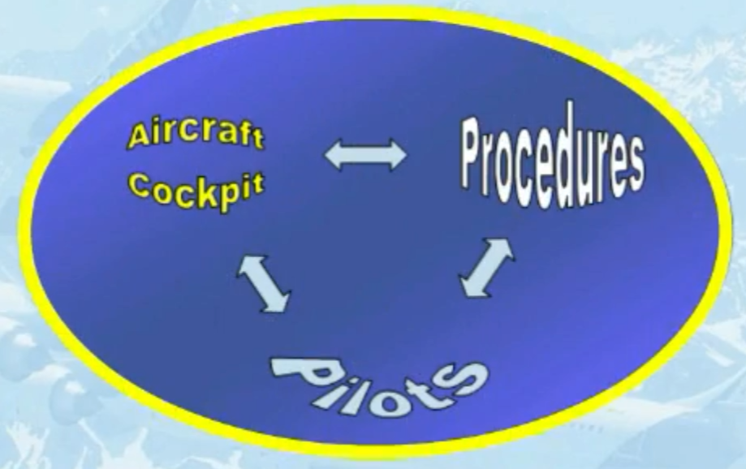
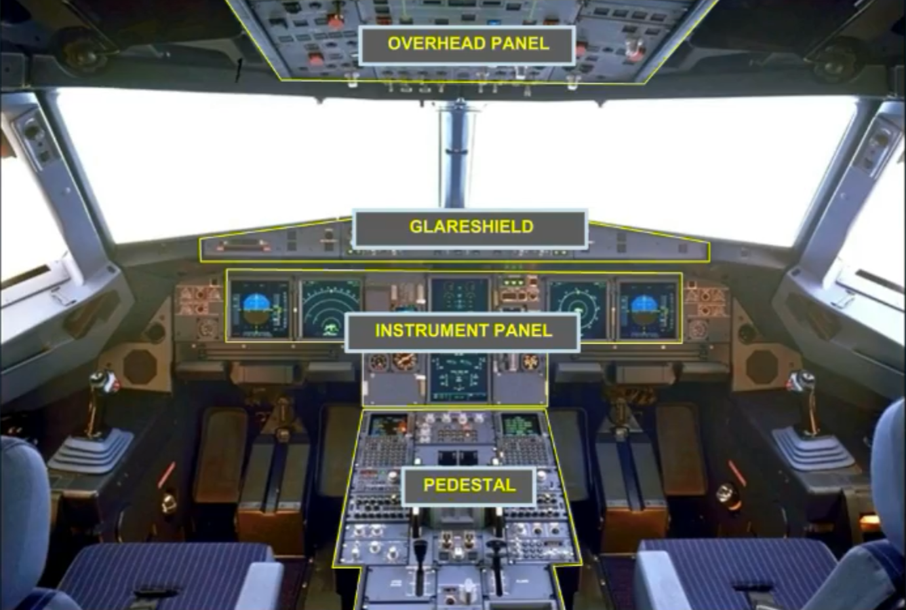
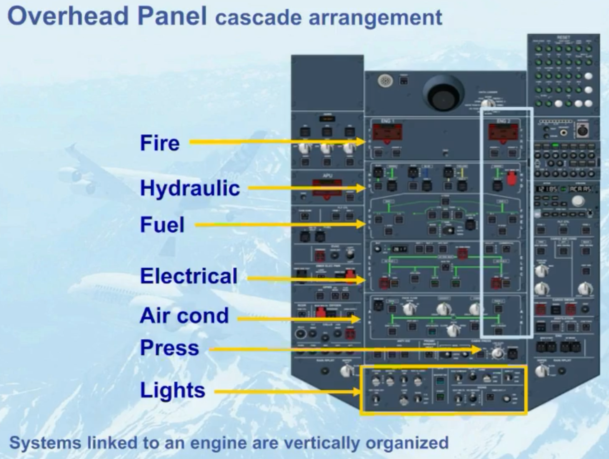
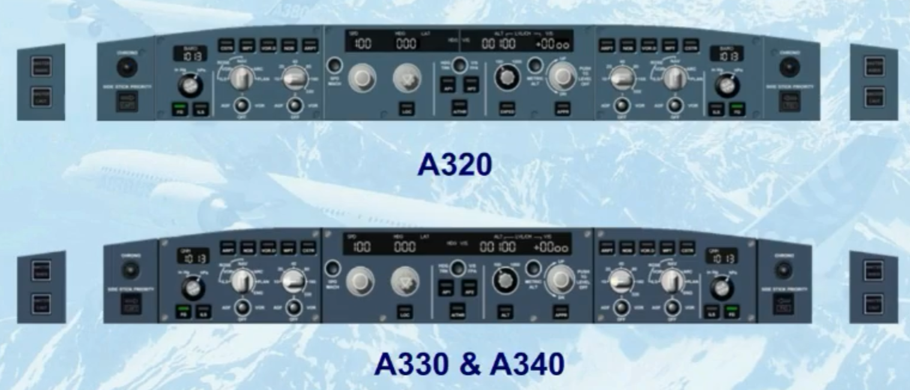
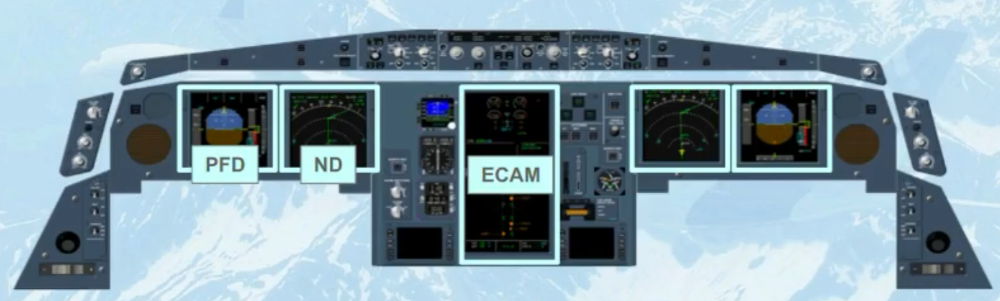
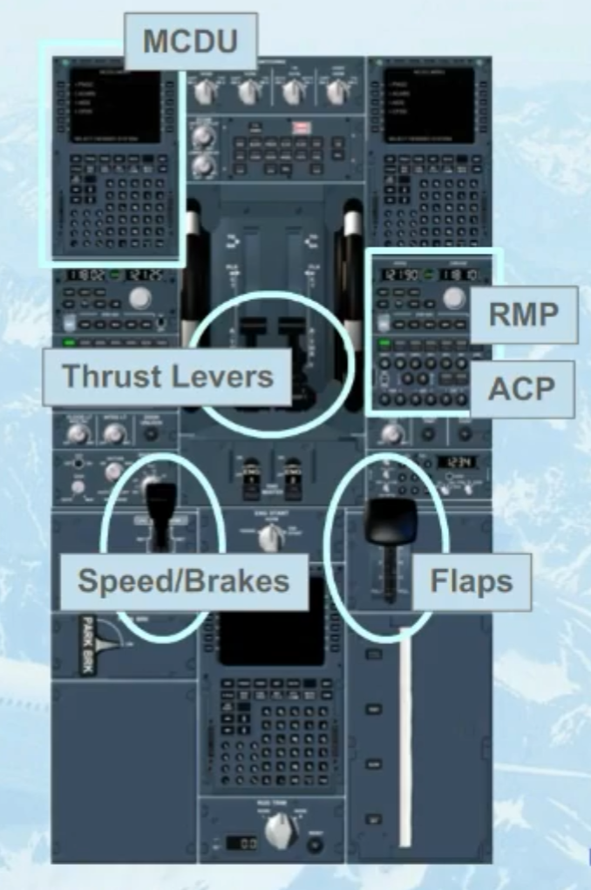

## Foreword

- This module has been developed for the entire Airbus Fly-By-Wire aircraft family rather than for a specific aircraft type.

- The examples, illustrations and interfaces shown in this presentation are common for the A320, A330, A340 or A380.

- Objective:

To introduce the high level principles designed to ensure a safe and efficient Airbus aircraft flight

- The safety and efficiency of an Airbus flight is dependent on:

    - Aircraft design
    - Procedure design
    - Proper operation by crews following a few GOLDEN RULES

Foreword - Golden Rules

1. Fly, navigate and communicate: in this order and with appropriate tasksharing.
2. Use the appropriate level of automation at all times.
3. Understand the FMA at all times.
4. Take action if things do not go as expected.

GOLDEN RULES

1. Fly, navigate and communicate:
in this order and with appropriate tasksharing.

    - Fly the Aircraft, Fly the Aircraft, Fly the Aircraft ...

    - Don't allow anything to distract you from your role as PF or PNF!

    - PNF must ACTIVELY MONITOR the flight parameters and highlight any excessive deviations.

    - Both pilots must maintain their Situational Awareness and immediately resolve any uncertainty as a crew.

2. Use the appropriate level of automation at all times.

    - The appropriate level of automation depends upon the situation and the task. Pilot judgment prevails, including selecting manual flight.

    - Understand the implication of the intended level of automation.

    - Select the intended level.

    - Confirm the expected aircraft reaction.

3. Understand the FMA at all times.

    - Monitor your FMA.

    - Announce your FMA.

    - Confirm your FMA.

    - Understand your FMA.

4. Take action if things do not go as expected.

    - By PF changing the level of automation.

    - By PF reverting to manual flight.

    - By PNF taking action:
        - Question,
        - Challenge,
        - *Take-over*.

What is a safe and efficient flight, and how do we achieve it?

- A safe and efficient flight results from effective interaction between:
    - Airbus cockpit philosophy
    - Procedures
    - Pilots (human mechanisms and behaviors)
    - Interactions Between Cockpit, Pilots And Procedures

## I. Airbus Cockpit Philosophy

Introduction to Airbus cockpit and Fly by Wire

The objective is to ensure Safety, Passenger Comfort and Efficiency in that order of priority by:

- Simplifying the crew's task by enhancing situation and aircraft status awareness

- Providing automation to reduce pilot workload, according to the situation

- To accommodate a wide range of pilot skill levels and experience acquired on previous aircraft

### Cockpit: Design principles

- Arrangement of Panels
    - Cockpit Layout corresponding to pilots' needs

- Automation

- Alerts

- Family concept
    - Safe and efficient transition from one Airbus aircraft to another

#### Arrangement of Panels

- Location of the main controls take into account :

    - The relative **importance** of each system,

    - The **frequency** of operation by the pilots,

    - The **ease** with which controls can be reached,

    - The **shape** of the control.

- General

- Overhead Panel
    - cascade arrangement. Systems linked to an engine are vertically organized

- Glareshield

    - Short term tactical controls for auto flight system.
    - Operation can be achieved 'heads up' and within easy reach of both pilots.

- Instruments panel
    - Display units are located in the full view of both pilots
    - Display units to :
        - **fly** (PFD)...(Primary Flight Display)
        - **navigate** (ND) ... (Navigation Display)
        - **monitor** the various aircraft systems (ECAM)
            - ECAM :Electronic Centralized Aircraft Monitor

Pedestal

- Controls for:

    - Engine thrust,
    - Configuration
    - Navigation
    - Communication

MCDU: Multipurpose Control and Display Units
RMP: Radio Management Panel
ACP: Audio Control Panel

***To Be continued***