The Autopilot (AP), Flight Director (FD) and Auto THRust (A/THR) are all integrated within the Flight Guidance (FG). They operate in various modes so as to guide the aircraft to associated targets such as speed, heading, glide slope or FMS lateral F-PLN.

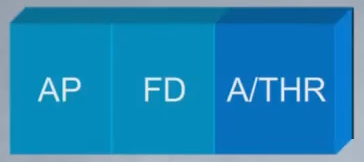

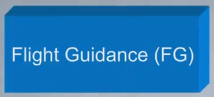

An FG mode and its associated target are MANAGED when the FG guides the aircraft along the flight plan or when the aircraft flies a speed profile computed by the FMGS.

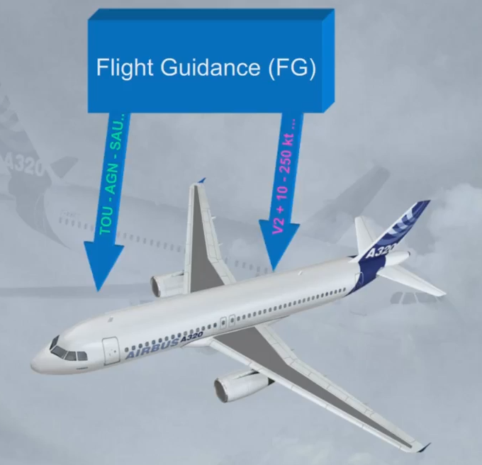

In this example, NAV mode is the managed lateral mode which allows the FG to guide the aircraft along the lateral F-PLN.

CLB mode is the managed vertical mode which guides the aircraft along the vertical F-PLN.

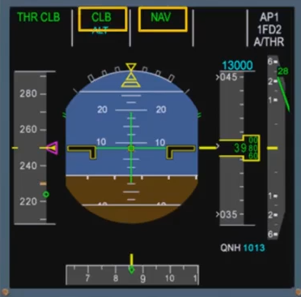

An FG mode and its associated target are SELECTED when the FG guides the aircraft to a target, selected by the pilot on the FCU.

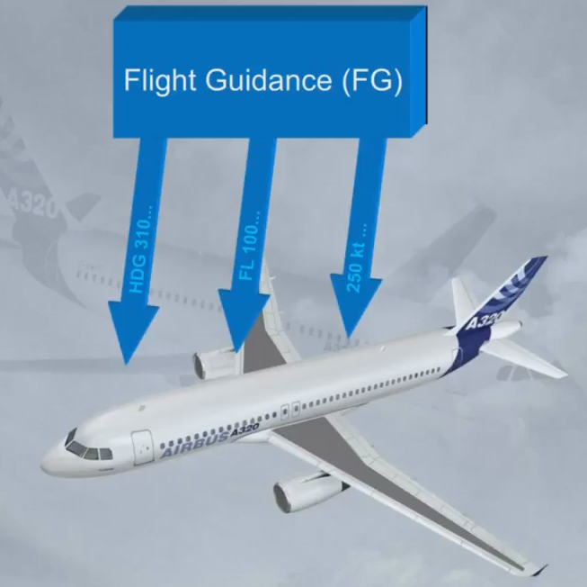

In this example, HDG mode is the selected lateral mode and OPEN DES is the selected vertical mode.

 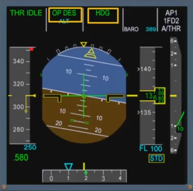

The pilot can engage selected modes by pulling the corresponding selection knobs on the FCU.

 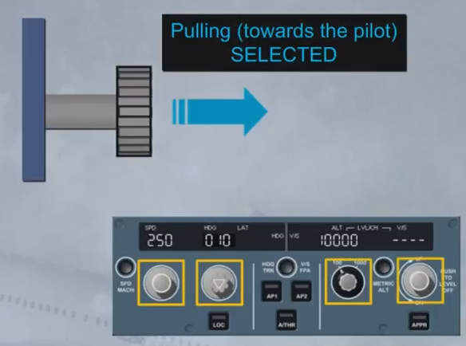

The pilot can engage the managed modes by pushing the appropriate selection knobs on the FCU.

 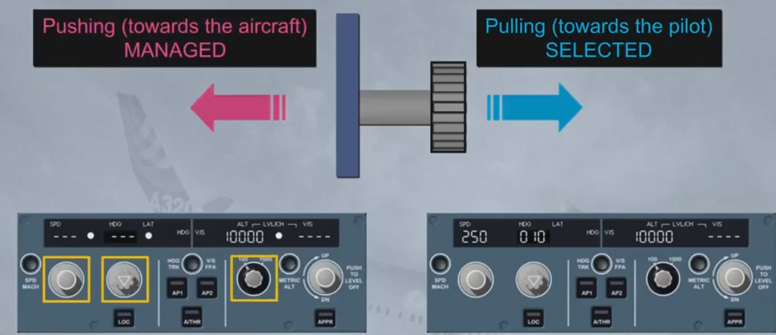

When selected by the pilot on the FCU, the speed target is used by the AP/FD or A/THR as a constant target and is indicated in blue on the PFD.

 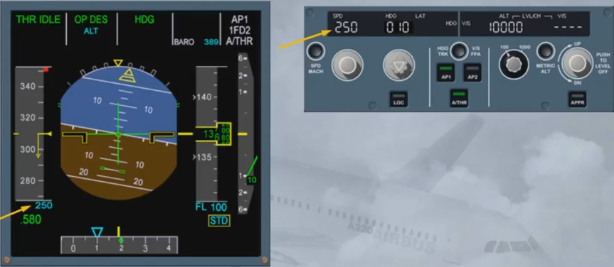

When managed by the FMS, the speed target is automatically adjusted by the FMS according to the speed profile computed. The speed target is indicated in magenta on the PFD.

 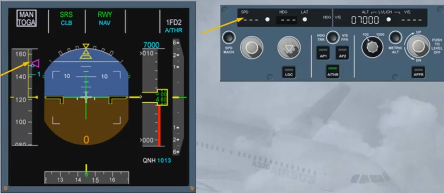

The AP/FD and A/THR are integrated, which means that there is an interaction between AP/FD vertical modes and A/THR modes.

 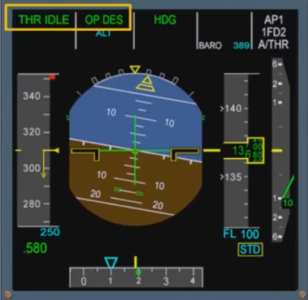

When the AP/FD pitch or vertical mode controls a vertical trajectory, the A/THR controls the speed or Mach.

Note: if both AP/FD are OFF, the A/THR controls the speed.

 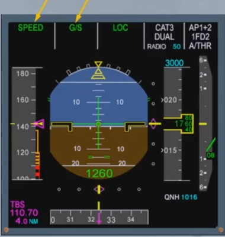

 AP/FD controls a vertical trajectory:
- V/S (or FPA)
- ALT (or ALT*)
- DES on geometric segment
- G/S (or G/S*)
- FINAL APPROACH.

A/THR is in SPEED or MACH mode.

 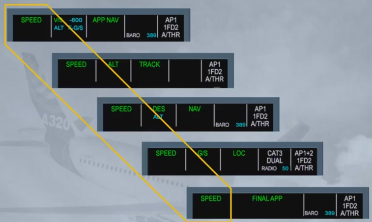

 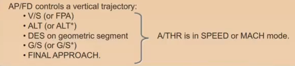

When the AP/FD pitch or vertical mode controls a speed or Mach target, the A/THR controls a fixed thrust level.

 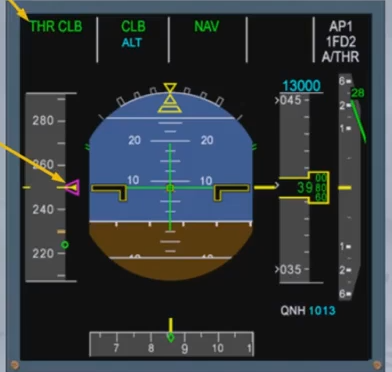

AP/FD controls a speed target by adjusting the aircraft pitch in:
- OPEN CLB or CLB
- OPEN DES
- takeoff and go around in SRS (Speed Reference System).

A/THR is in thrust mode.

 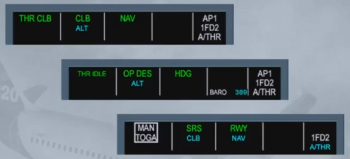

 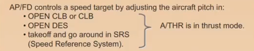

As a general rule, the FG guides the aircraft along the F-PLN when managed modes are engaged:
- Along the primary lateral F-PLN in NAV mode
- Along the primary vertical F-PLN in CLB/DES modes: the aircraft will climb or descend satisfying all altitude and speed constraints.

 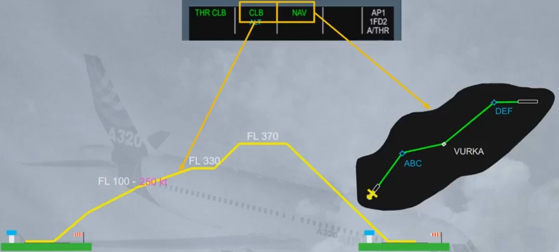

The constraints defined in the vertical F-PLN are related to the lateral F-PLN.

If the pilot chooses to fly away from the lateral F-PLN (in HDG or TRK modes) the CLB or DES modes are no longer available (reversion modes) and the constraints are disregarded.

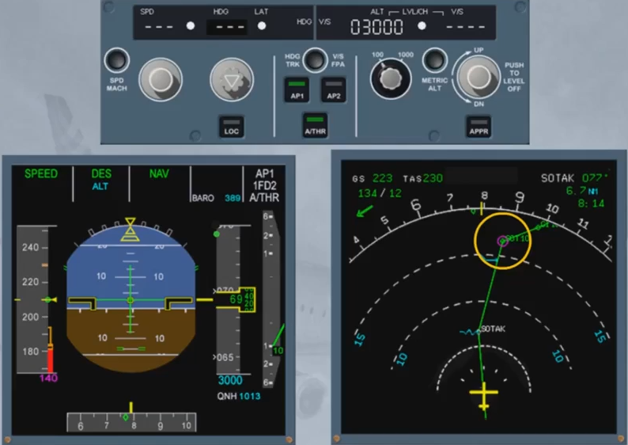

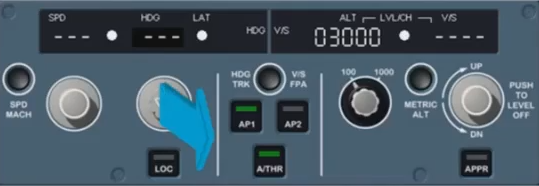

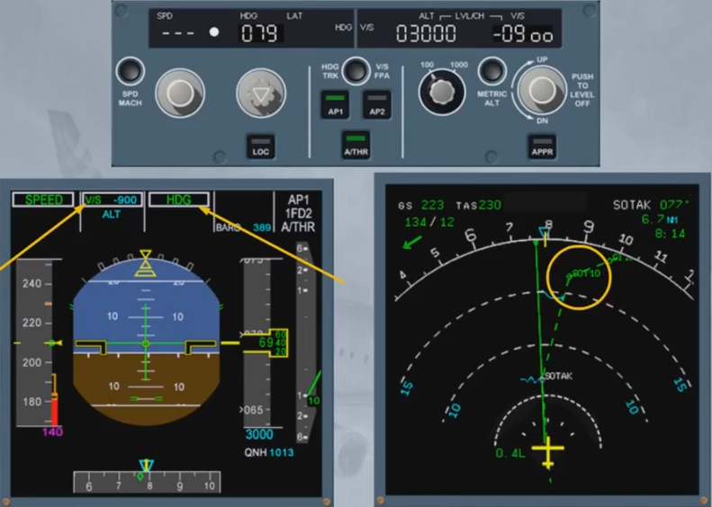

The NAV mode is the lateral managed mode which guides the aircraft on the active leg defined by the FROM and the TO waypoints.

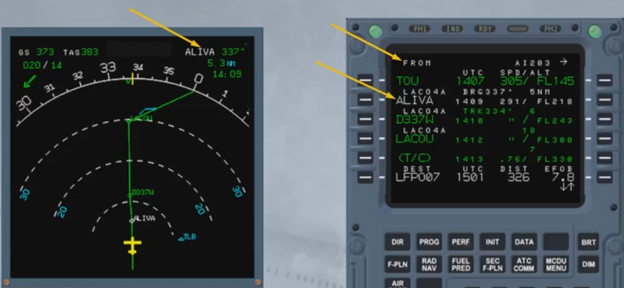

The NAV mode engages automatically after takeoff. It may be armed or engaged at any time in flight by pushing the HDG knob on the FCU.

When NAV is engaged, the lateral F-PLN is displayed as a green solid line on the ND.

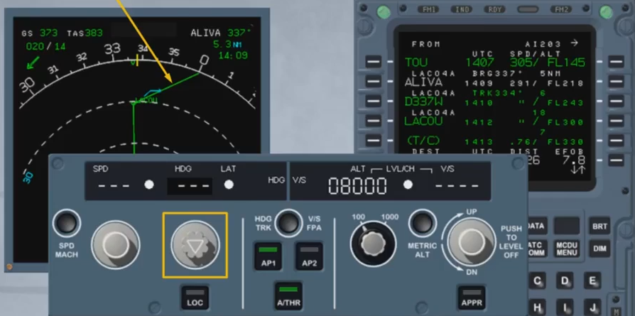

When flying away from the lateral F-PLN (HDG mode), the pilot can resume the normal navigation by pushing the HDG sel, arming NAV.

Condition: The track line must intercept the active leg.

If the pilot arms NAV:
- NAV is displayed in blue on the FMA
- An intercept point is computed and the flight plan display changes from dotted line to green solid line.

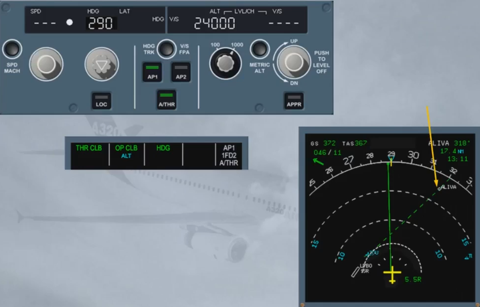

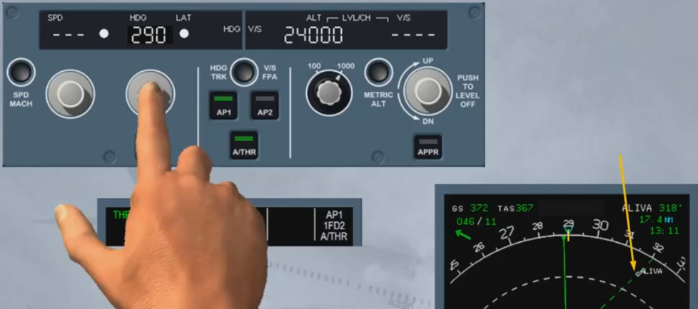

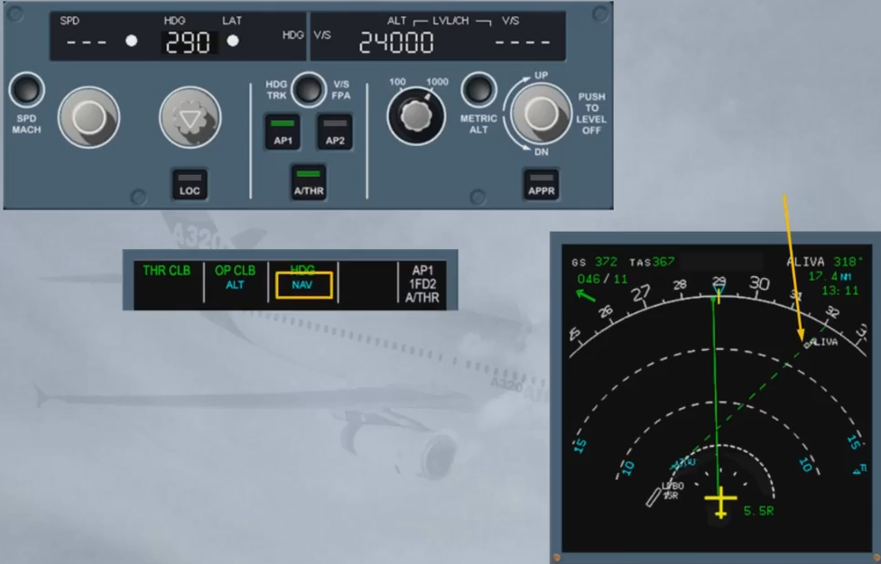

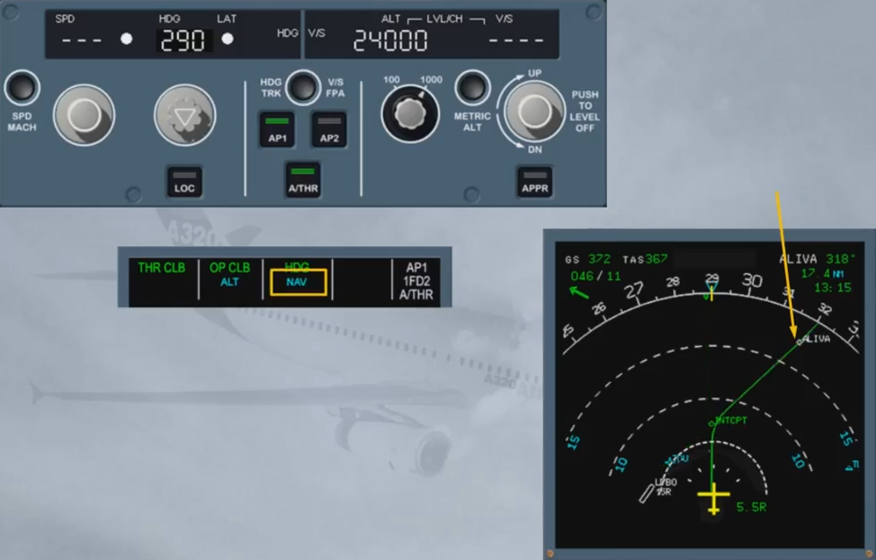

In order to follow a vertical profile, the pilot can:
- Pull the ALT sel knob to engage OP CLB/OP DES selected modes
- Push the ALT sel knob to engage CLB/DES managed modes (if the lateral NAV mode is already engaged)
- Select a target V/S or FPA by pulling the V/S knob.

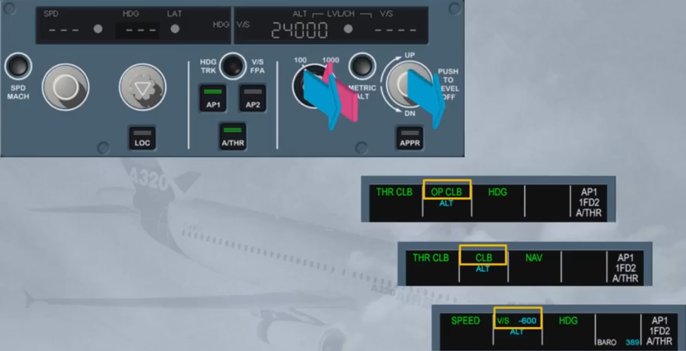

The OPEN CLIMB mode is a selected mode. It uses the AP/FD pitch mode to maintain a speed/Mach (managed or selected) while the A/THR maintains climb thrust.

OPEN CLIMB is automatically engaged when the lateral flight plan is lost.

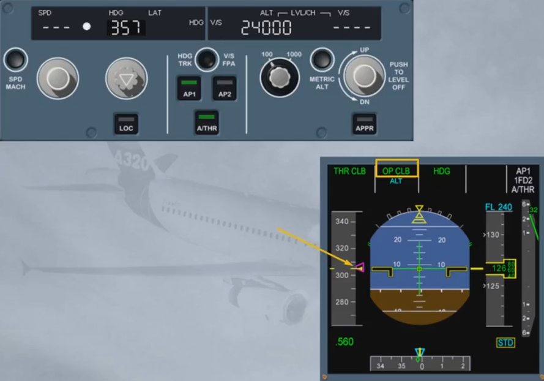

The CLB mode of AP/FD is a managed mode. It adjusts the pitch of the aircraft so as to climb towards a target altitude.

This, at a target speed with a fixed thrust level controlled by the A/THR in thrust mode. CLB is automatically engaged at acceleration altitude.

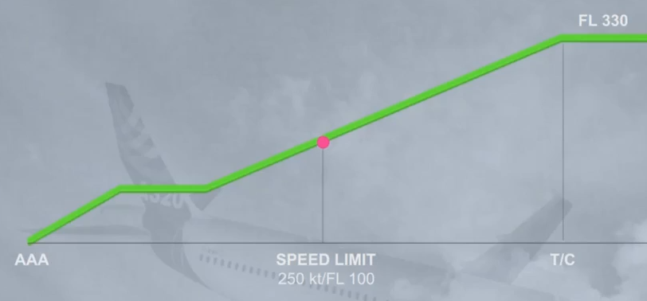

The CLB mode of AP/FD is a managed mode. It adjusts the pitch of the aircraft so as to climb towards a target altitude.

This, at a target speed with a fixed thrust level controlled by the A/THR in thrust mode.

CLB is automatically engaged at acceleration altitude.

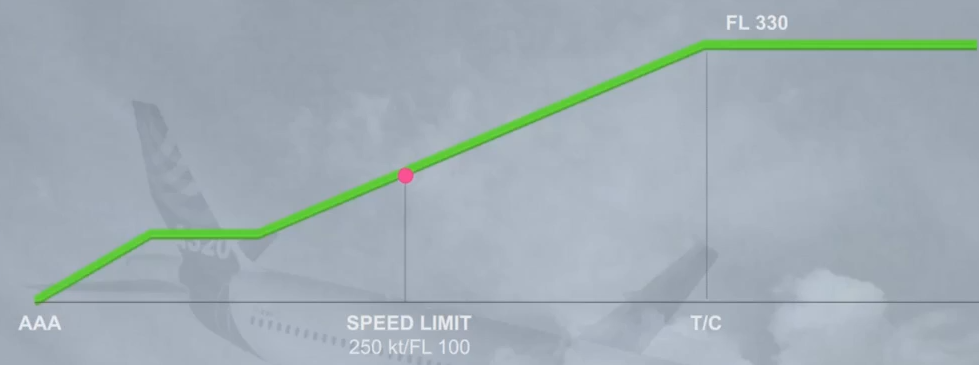

In CLB mode, altitude constraints related to waypoints will be taken into account.

Constraints can be respected or missed.

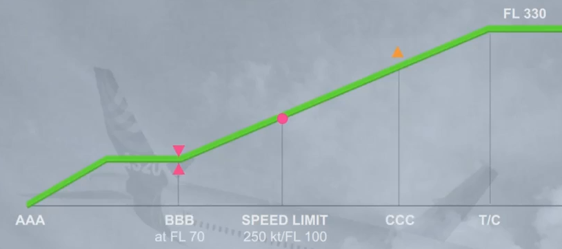

CLB is always associated to ALT mode.

ALT is displayed in blue if no altitude constraint is associated.

ALT is displayed in magenta if an altitude constraint is associated to a waypoint.

 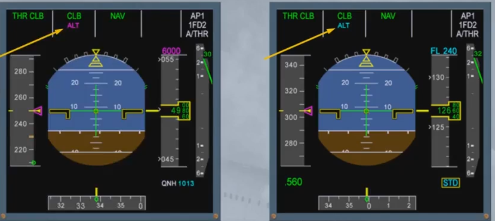

A magenta level off arrow indicates where the aircraft will reach the constraint altitude.

A blue start of CLIMB arrow indicates where the aircraft will resume the climb once the waypoint is sequenced.

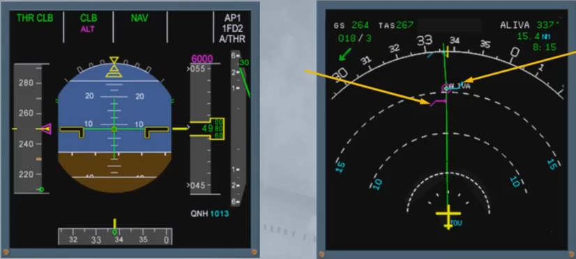

The DES mode of the AP/FD guides the aircraft along the FMS computed descent path so as to descend to the FCU selected altitude.

The DES path includes several segments:
- From top of descent to first constraint waypoint: idle segment
- Several geometric segments computed up to reach 1000 ft with Vapp.

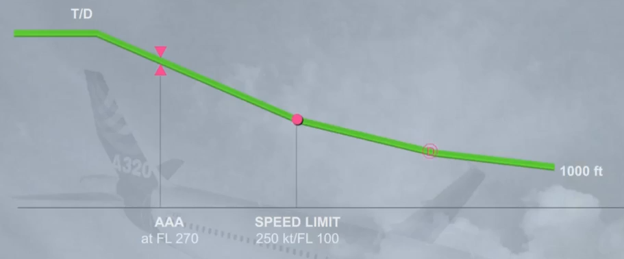

The DES mode guides the aircraft along the pre-computed trajectory with speed target managed. A target speed range indicates to the pilot the acceptable speed variations required to track the descent path.

A vertical deviation symbol is also displayed on the altitude scale with digital value provided on the PROG page.

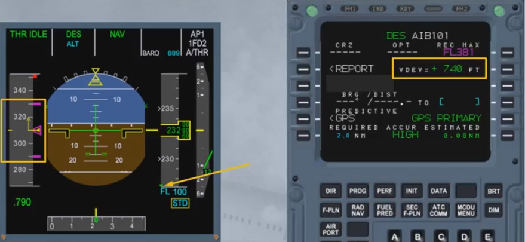

If the aircraft is above the flight path, the DES mode will command a pitch down to recover the FMS descent path.

This symbol indicates where the descent path will be recovered assuming that half speed brakes will be extended.

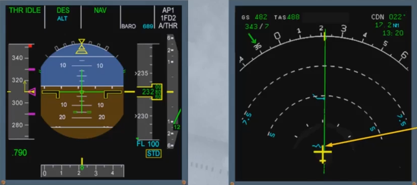

If the aircraft is below the flight path, the DES mode will maintain the current speed (or lower limit of the speed range) until the descent path is recovered.

Thrust might be added to recover the descent path.

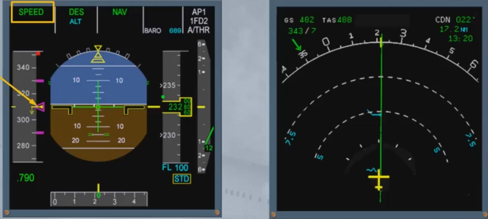

Descent mode respects the altitude/speed constraints when feasible. ALT is armed in magenta and target altitude is magenta if the FCU altitude is set lower than the constraint. If the altitude is set higher, then ALT and target altitude are displayed in blue.

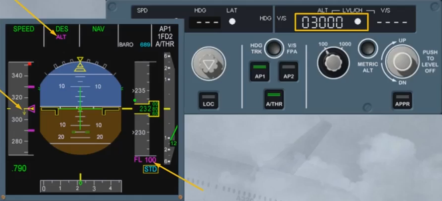

If HDG or TRK mode is engaged, NAV managed mode is lost and the DES mode reverts to V/S or FPA mode. The aircraft continues its
descent with the same V/S or FPA towards the FCU selected altitude disregarding any altitude constraints.

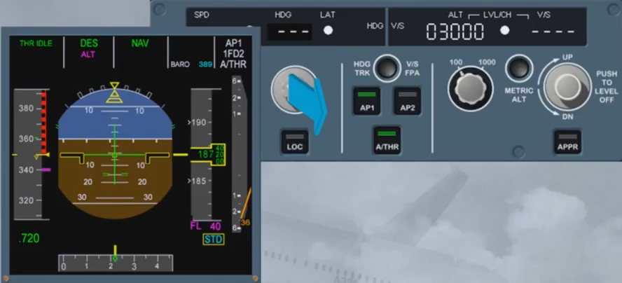

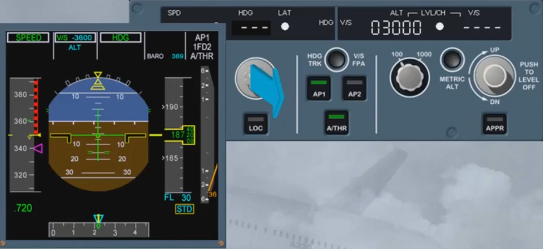

When the aircraft reaches CRZ FL as set on PROG page, the AP/FD goes into ALT CRZ mode.

The target Mach number is the ECON CRZ Mach number.

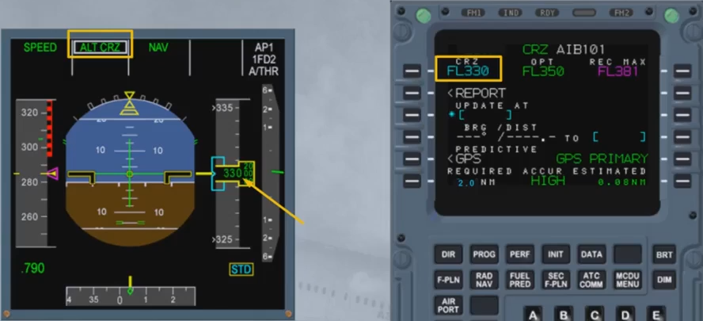

If the aircraft is cleared by ATC at a level different from the one inserted in the PROG page, ALT will be displayed on PFD.

It is recommended to update the CRZ FL on the PROG page to the new value for flight efficiency.

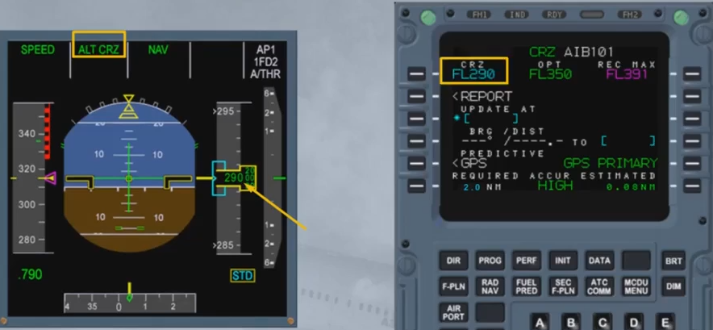

---

The RWY mode provides lateral guidance orders during take off roll and initial climb out (up to 30 ft) if a LOC signal is available.

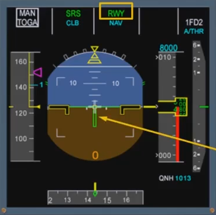

Provided V2 is inserted in the PERF page and slats are extended, the Speed Reference System (SRS) will engage automatically at power application (FLEX or TOGA). SRS is a vertical mode which controls the pitch and maintains the speed at V2 + 10 kt as a minimum (or V2
in case of engine failure) up to acceleration altitude.

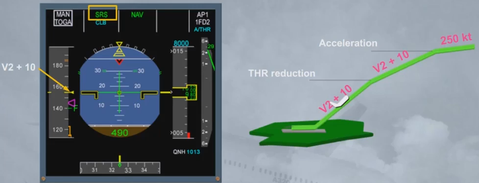

NAV engages automatically around 30 ft provided a flight plan has been inserted with RWY and SID.

At thrust reduction altitude, LVR CLB flashes: the pilot must set the thrust levers in the CLB detent.

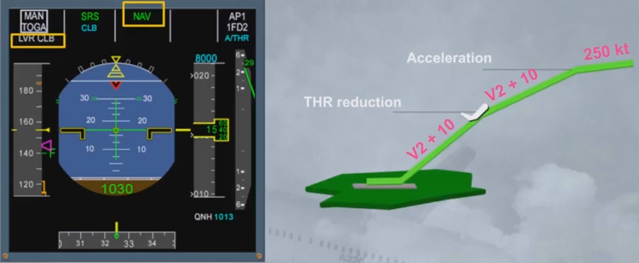

At acceleration altitude, the FG provides a pitch down in order to ease the acceleration towards the initial CLB speed of 250 kt. SRS is replaced by CLB mode.

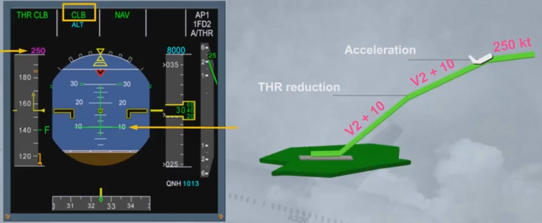

---

Precision approaches can be flown using:
- Selected modes
- Managed modes, where AP/FD provides guidance laterally and vertically.

The FMGC provides automatic guidance on the Localizer (LOC) and Glide Slope (G/S) provided:
- ILS approach has been selected in the F-PLN using the ARRIVAL lateral revision, or
- The ILS frequency and course have been inserted through the RAD NAV page.

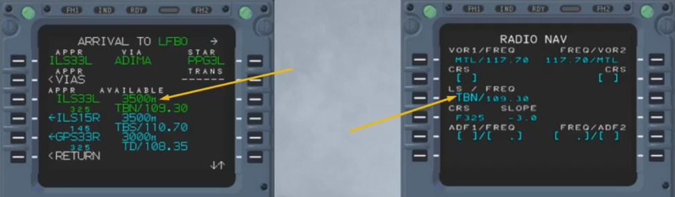

The localizer can be intercepted in HDG or in NAV mode. If the interception is completed in NAV mode, accuracy must be checked high, unless GPS is primary.

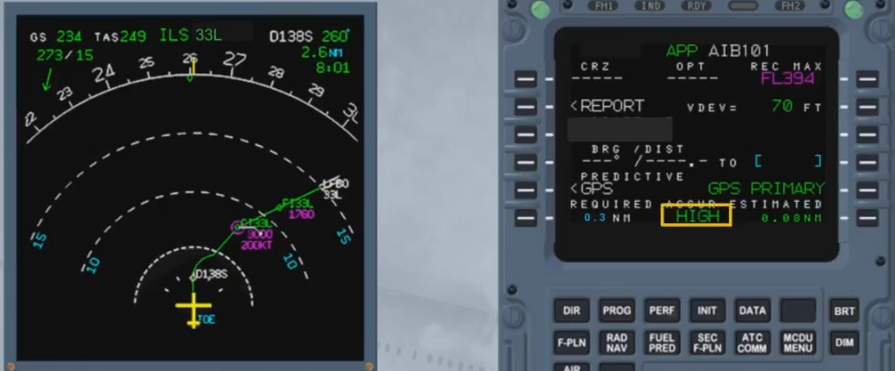

LOC and G/S can be armed using the APPR mode pb provided:
- The ILS and RA are not faulty
- Aircraft is above 400 ft
- ILS frequency and course are set identically on both receivers.

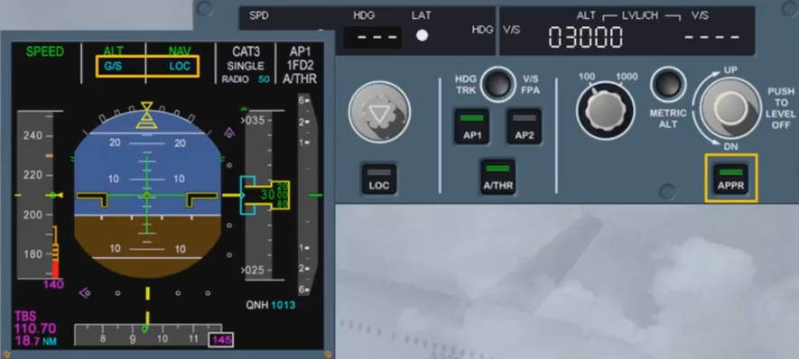

When the localizer is captured, LOC* mode engages. Once the aircraft is established on the localizer axis, LOC mode engages.

The localizer is intercepted before the G/S.

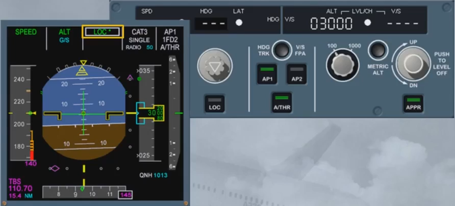

When the G/S is captured, G/S* mode engages and switches to G/S mode when the aircraft is established.

AS a general rule, G/S* and G/S will engage only if LOC* or LOC is engaged.

Note: G/S* and G/S may engage before LOC* for certain aircraft, if required by the airline.

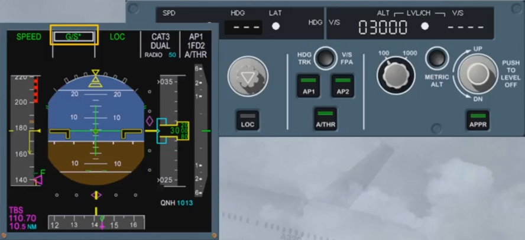

In case of ILS ground transmitter failure, AP/FD remains in LOC G/S modes. 

The localizer and glide slope deviations are lost and the FD bars flash.

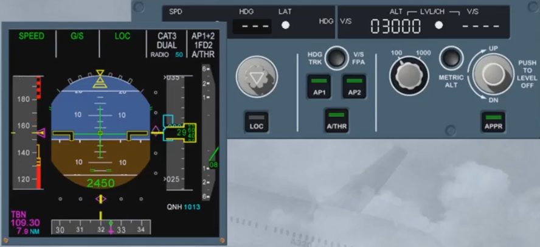

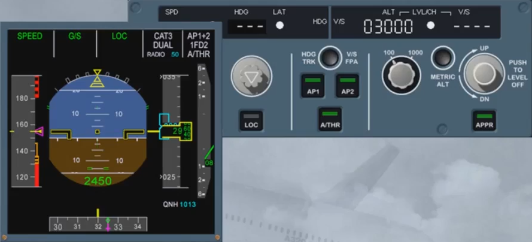

In case of dual receiver failure, LOC and G/S reverts to HDG-V/S, the APs trip off and the ILS scales are removed.

In this case, interrupt the approach unless you have the runway in sight.

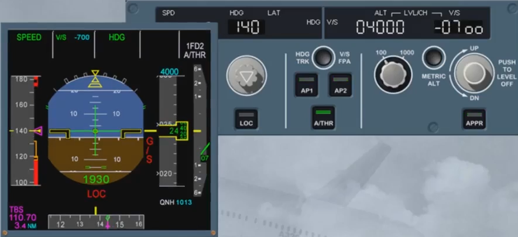

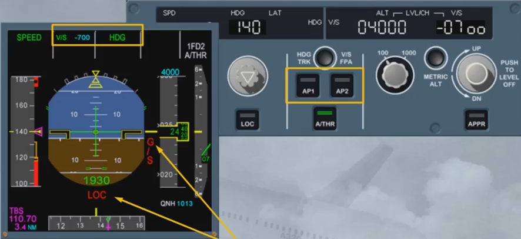

Land mode engages automatically when the aircraft is below 400 ft and LOC and G/S are engaged. The input on the FCU are then no longer taken into account by the FG.

LAND mode can only be disengaged by a go around.

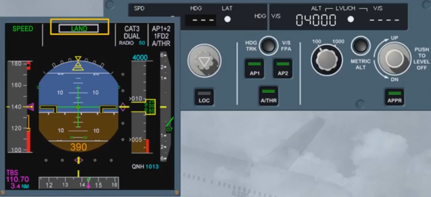

At 40 ft RA the FLARE mode engages.

At 30 ft, if the AP is engaged, AP/FD guides the aircraft on the runway centerline and provides the required pitch attitude for the flare.

If A/THR is active, thrust reduction is activated and a RETARD callout is activated at 10 ft.

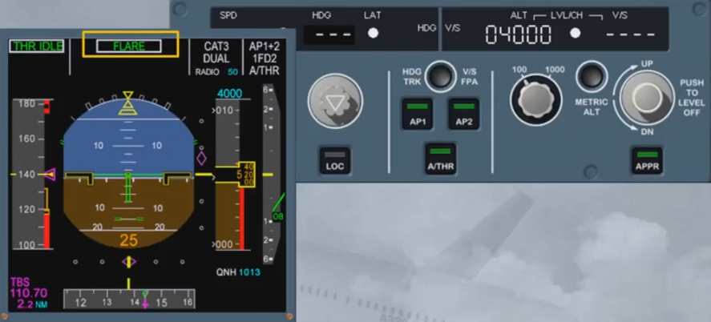

An AUTOLAND red warning will be triggered below 200 ft RA if:
- Both APs trip off, or
- Excessive deviations in LOC (above 15 ft) or G/S (above 100 ft) occur, or
- The LOC signal is lost above 15 ft or G/S above 100 ft, or
- A difference between both RA indications occurs.

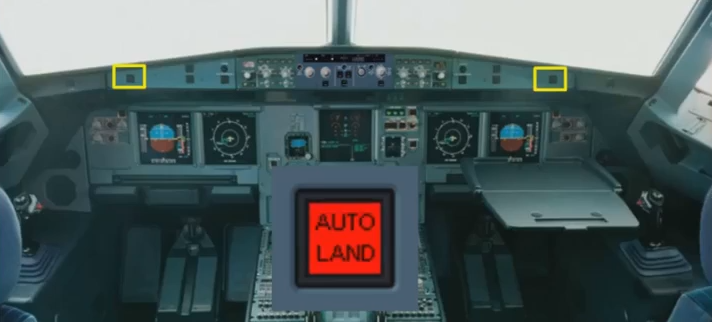

Non precision approaches can be flown using:
- Selected modes
- Managed modes where AP/FD provides guidance laterally and vertically.

The use of TRK/FPA is highly recommended.

The managed mode can be used if the approach is defined in the database. The type of approach must be inserted in the flight plan and NAV aids (with related course) must be tuned manually through the RAD NAV page.

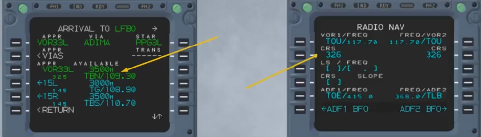

Navigation accuracy must be cross-checked using raw data information versus the FMS position unless "GPS PRIMARY" is displayed.

If navigation accuracy is cross-checked "LOW" the approach must be flown using selected modes (HDG-V/S or TRK-FPA).

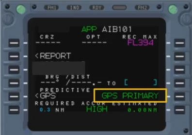

Pushing the APPR pb on the FCU will arm the lateral mode.

APP NAV and FINAL are displayed in blue on the FMA.

If NAV mode was already engaged, APP NAV engages immediately.

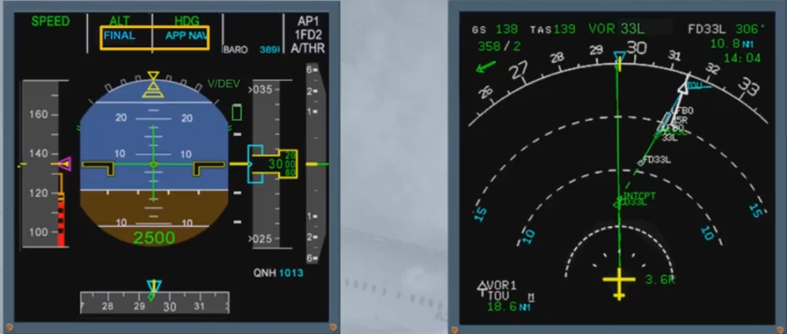

If the interception is completed using HDG or TRK modes, the track line must intercept the active leg;

APP NAV will engage when the intercept conditions are met.

Note: do not forget to clear all remaining waypoints which do not belong to the approach.

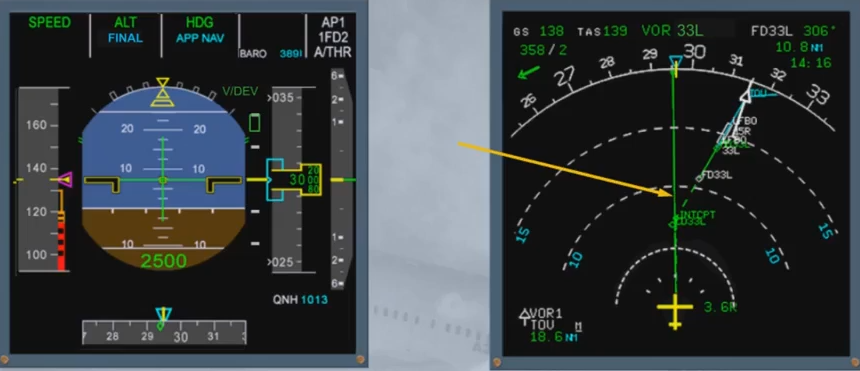

FINAL APP engages when the aircraft intercepts the descent profile. The FINAL guides the aircraft on the profile down to MDA (or MDH).

A V/DEV symbol shows the deviation from the preplanned descent path.

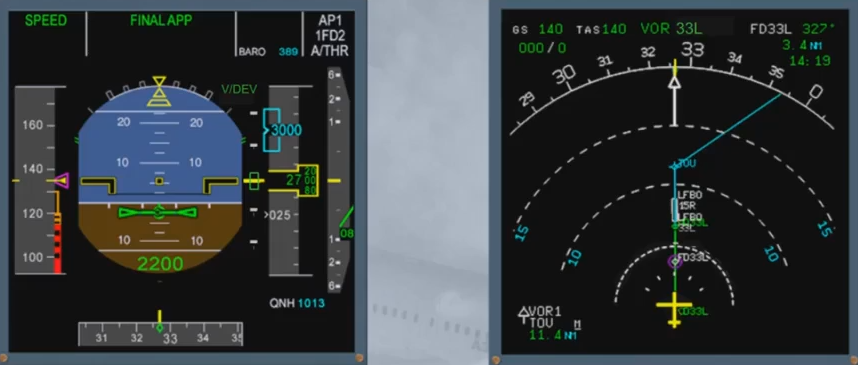

The FINAL APP disengages if HDG-V/S or TRK-FPA modes are engaged or if the pilot pushes the LOC pb.

The FINAL APP mode disengages and the A/P disconnects when reaching MDH/MDA - 50 ft or 400 ft AGL, if MDH/MDA was not entered.

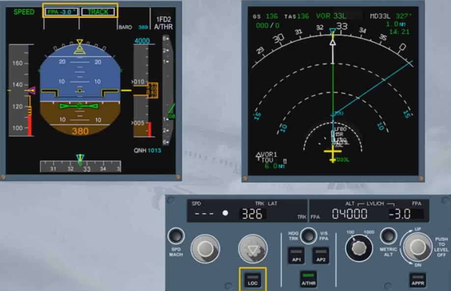

Raw data information (using VOR, ADF needles) must be displayed to cross check lateral deviation: revert to HDG/TRK in case of excessive deviation.

If during approach, GPS primary is lost, a triple click aural warning is triggered and so, you must cross check your navigation accuracy.

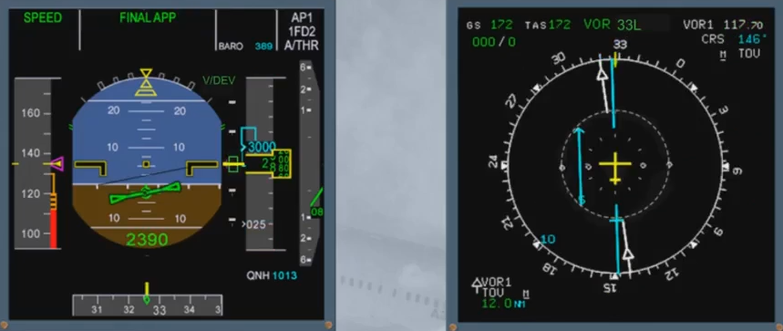

***Module completed***

## Video study

- Watch the video available on [YouTube](https://www.youtube.com/watch?v=cUNj9yMqAKs&list=PLKEybvo562LtwmnZOjo8jN7J75vXGqMzq&index=15)