The Auto Flight System (AFS) on the A320 family is designed for assisting the pilot in flying the A/C within the normal flight envelope, hence enhancing safety, and optimizing performance.

This module is an introduction to the AFS. Let's begin by building up a basic conceptual diagram.

The AFS could be represented as four main sections. 

At the heart of the system is a computation and processing section, the brain!

The central processing section has access to several information sources. The pilots have access to the central processing section via input devices. 

Finally, after computation and processing, commands are provided to output devices.

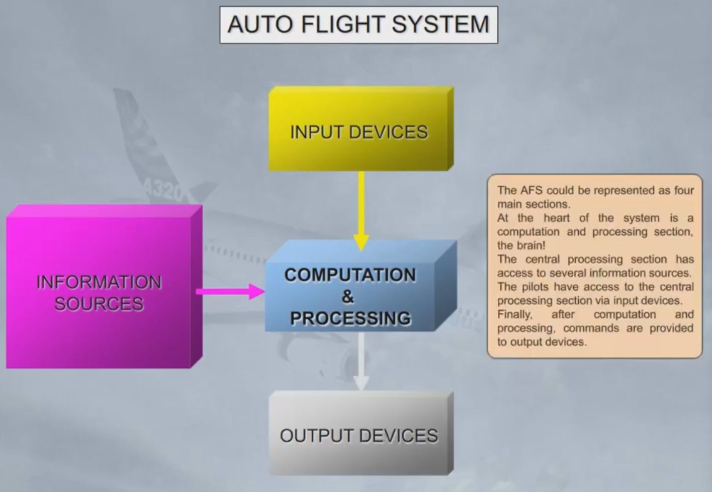

For the AFS in the A320 family, computation and processing are done by two Flight Management Guidance Computers (FMGCs). The two FMGCs are identical and normally work together, so for training purposes we will group them as the Flight Management Guidance System (FMGS).

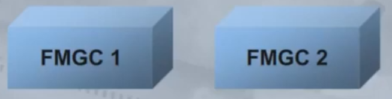

The FMGS receives:
- Navigation information - which contains details of airfields, navaids, airways, routes, waypoints, procedures(SIDs, STARs, approaches, missed approaches), etc...
- Aircraft performance information
- The Air Data and Inertial Reference System (ADIRS) and the Global Positioning System (GPS) for position and dynamic information, (you will learn about them in the navigation chapter)
- The clock
- Radio navigation information.

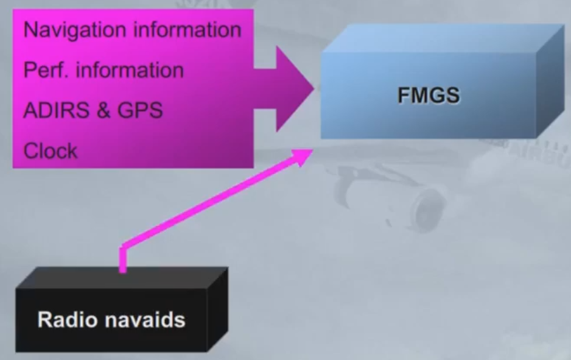

The pilots provide inputs to the FMGS using:
- Two Multipurpose Control and Display Units (MCDU), for long term interventions, and
- A single Flight Control Unit (FCU), for short term interventions.

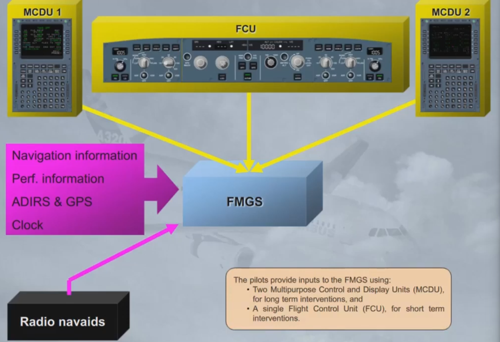

The FMGS provides outputs to:
- The Flight Directors (FDs) and Autopilots (APs) for pitch, roll and yaw control
- The Autothrust (A/THR) - for thrust control
- The MCDUs and EFIS - for the display of information, and
- The navigation radios - for the automatic tuning of radio aids.

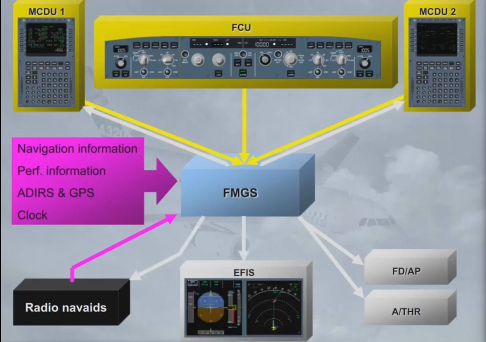

The FMGS is divided into three main parts:
- Flight management
- Flight guidance
- Flight augmentation.

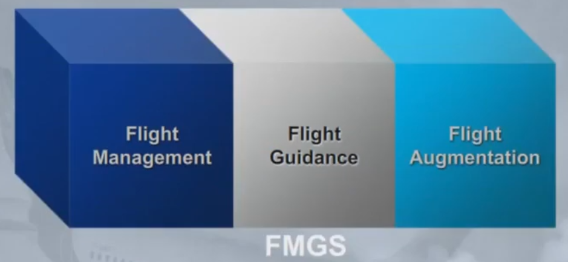

 The flight management part of the FMGS controls the following functions:
 - Navigation - the position of the aircraft and the estimated accuracy of this position
 - Flight planning - the flight plan computation
 - Performance optimization - costs, speeds and altitude optimization
 - Predictions - the accurate estimates for waypoints, altitudes, speeds, fuel, destinations and alternates
 - Display management - the control of information to the EFIS system to display autoflight modes and navigation information.

 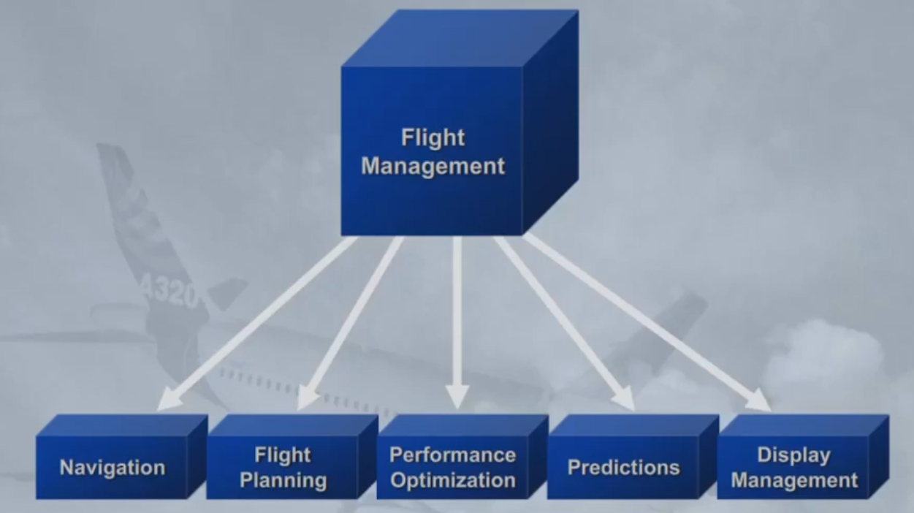

The flight guidance part of the FMGS provides:
- Autopilot commands to automatically control pitch, roll and yaw
- Autothrust commands to automatically control thrust
- Flight director commands for the pilot to control the pitch, roll, and yaw.

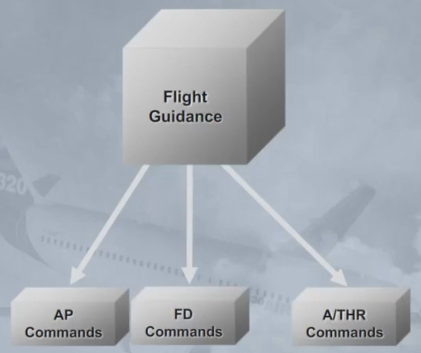

The Flight Augmentation (FAC) part of the FMGS provides:
- Flight envelope computations (minimum speed such as Vis or maximum speed such as Vmo or Vfe)
- Maneuvering speed computation (for example best speed to fly in a given flap configuration)
- Windshear detection which triggers the windshear warning
- Angle Of Attack protection (a-Floor protection), triggered when the AC Angle Of Attack is above a pre-determined threshold.

Note: The FAC has various yaw functions such as yaw damping, turn coordination and others which wil be reviewed in the F/CTL chapter.

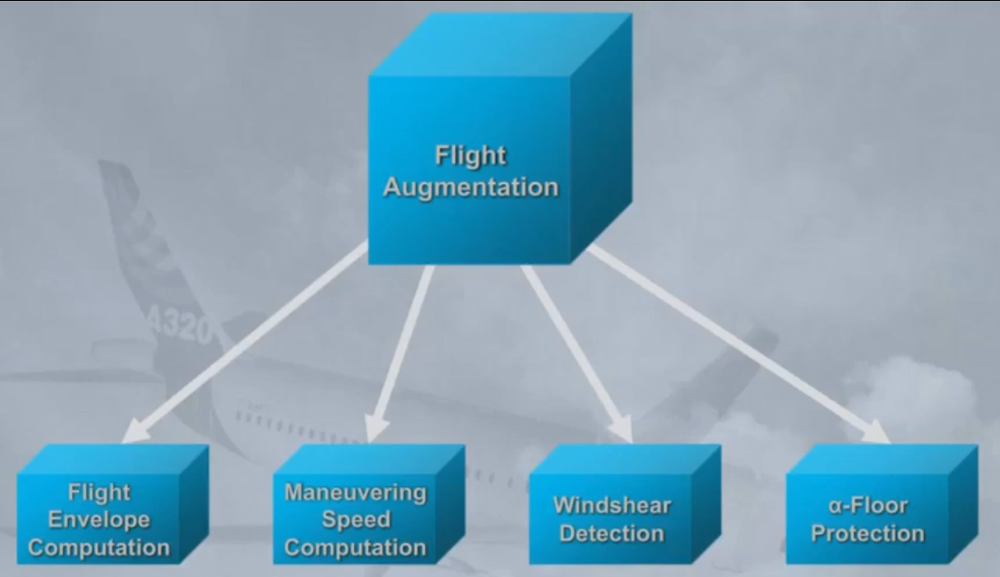

As a general rule, the two FMGCs have access to information provided by on-side sensors, except for certain parameters or in case of failures.

They exchange information for validity comparison purposes.

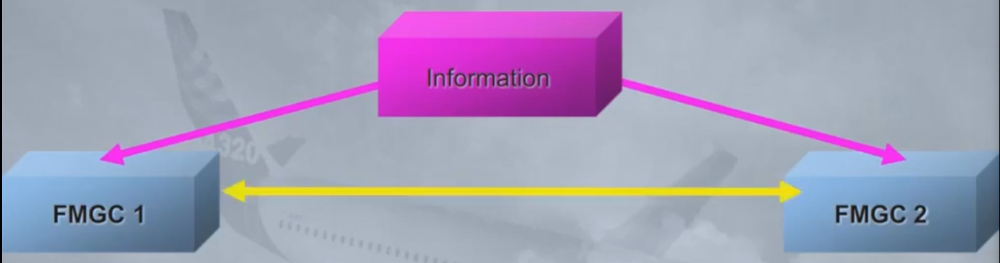

For example, information from MCDU 1 is received by FMGC 1 and transmitted to FMGC 2. All FMGCs and MCDUs are then synchronized.

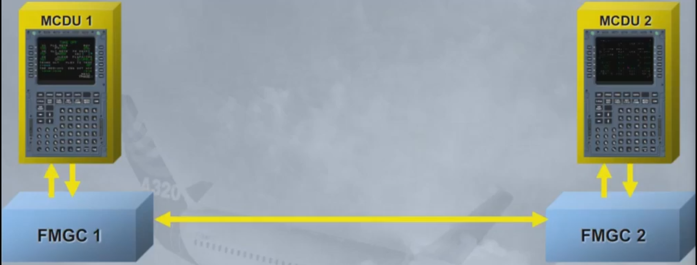

The inputs from the FCU are fed to both FMGCs.

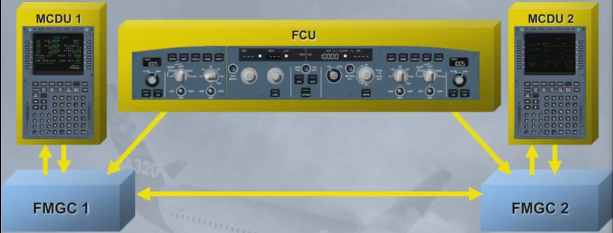

Both FMGCs send their commands to the FDs, the APs and, the autothrust system. According to a given internal logic, one FMGC is declared master (e.g.: if AP 1 is ON, FMGC 1 is master). Amongst others things, this determines which A/THR channel is operative.

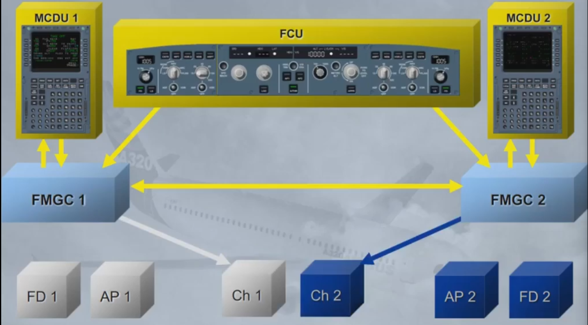

The controls and indicators found in the cockpit are:
- 1 Flight Control Unit (FCU)

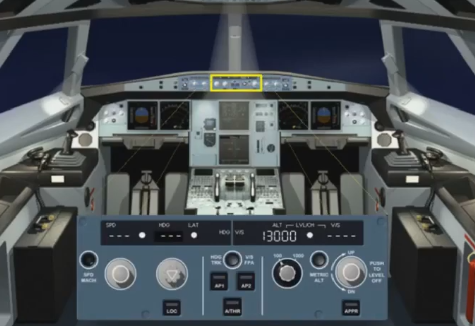

- 2 FD pbs installed on the EFIS control panels and the associated EFIS displays

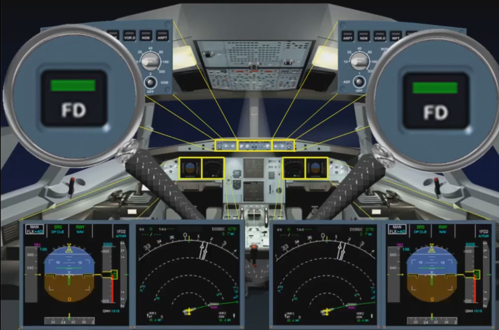

- 2 Multipurpose Control and Display Units (MCDU)

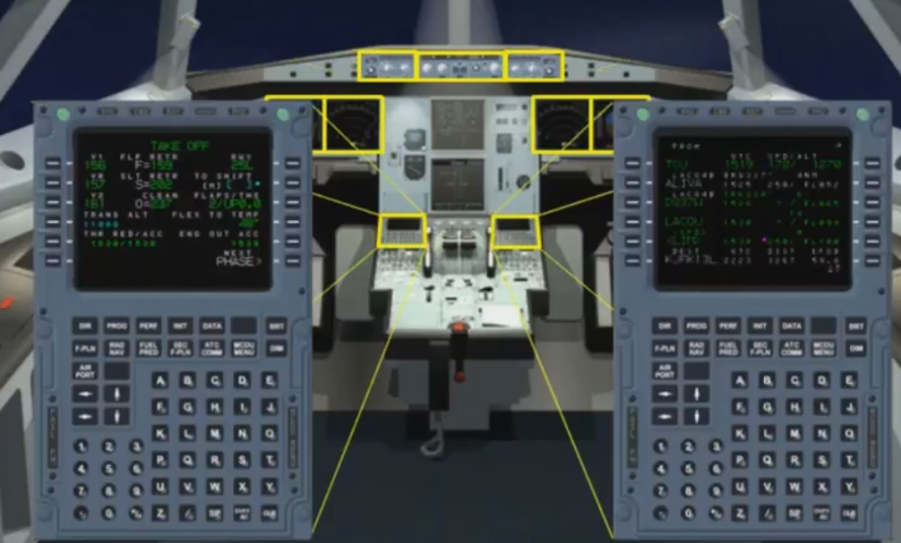

- 2 thrust levers mainly in interface with A/THR.

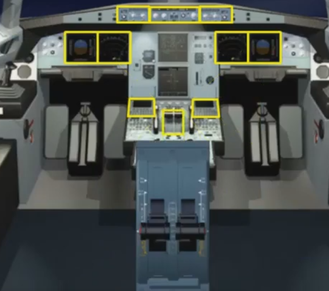

You have just reviewed the overall presentation of the Auto Flight System. In the next modules, we will review
each component in more detail.

***Module completed***

## Video study

- Watch the video available on [YouTube](https://www.youtube.com/watch?v=cUNj9yMqAKs&list=PLKEybvo562LtwmnZOjo8jN7J75vXGqMzq&index=8)