We will now look at how the Flight Guidance achieves its automatic thrust control function:
- The Autothrust system, or A/THR.

The A/THR can work in two different modes:
- SPEED mode: the A/THR continuously adjusts the thrust in order to maintain a target speed or Mach, e.g. during cruise or approach
- THRust mode: the A/THR sets a given thrust e.g. MAX CLB or IDLE.

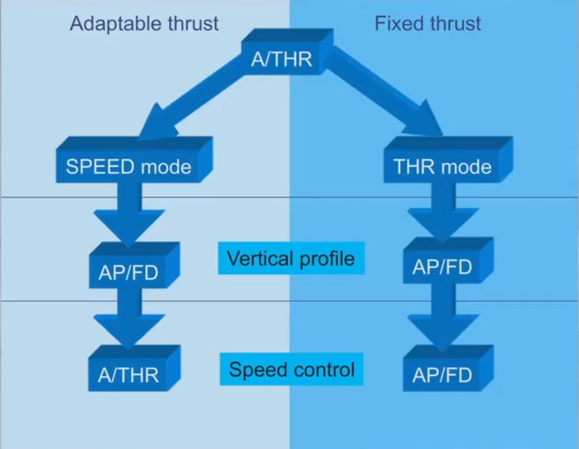

The A/THR modes are automatically linked to AP/FD vertical modes:
- When AP/FD vertical mode controls a trajectory, e.g. altitude hold, V/S,GIS..., the ATHR is in SPEED mode
- When AP/FD vertical mode adjusts the A/C pitch in order to keep a target speed or Mach, e.g. climb, descent..., the A/THR is in THR mode.

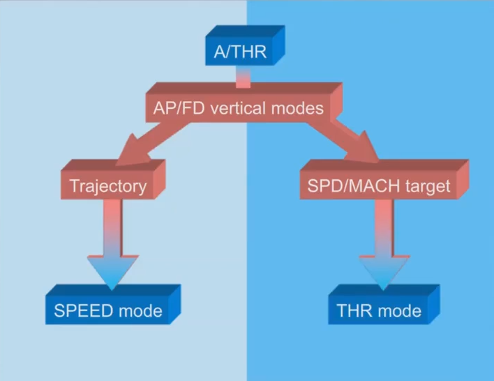

The main A/THR controls available for the pilots are the thrust levers.

On the Airbus fly by wire family, the A/THR does not back drive the thrust levers while it adjusts the thrust.

Let's have a closer look at them.

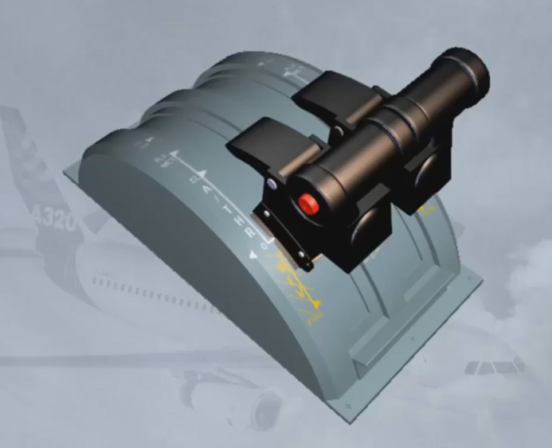

When the A/THR is OFF, the crew controls the thrust, as usual, by moving the thrust levers over a quadrant.

For forward thrust, this quadrant carries four physical detents or stops which are:
- IDLE
- CL for max climb thrust
- FLEX/MCT for FLEX thrust at TO or Max Continuous Thrust
- TOGA for max TakeOff or Go Around thrust

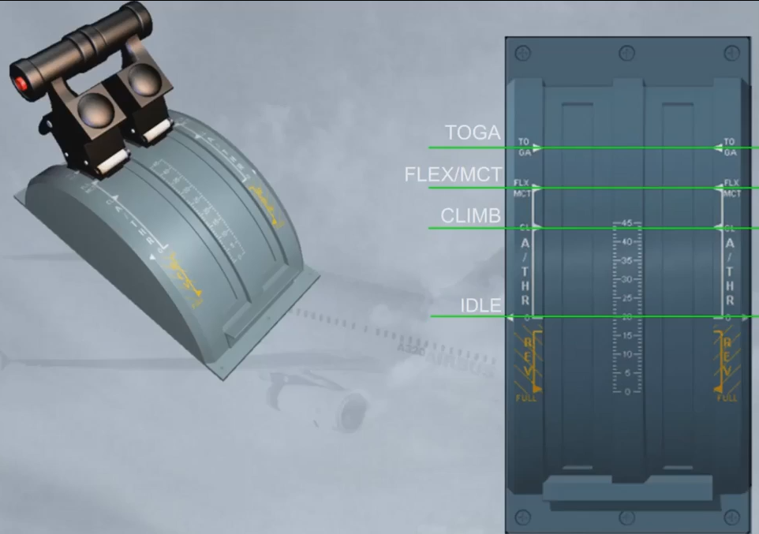

The A/THR can only work when the thrust levers are set forward of the IDLE detent and up to the CLB detent (or MCT detent in case of engine failure).

If the thrust levers are set by the pilot in the reverse position, the A/THR cannot operate.

Note: The ALPHA FLOOR function is an exception which will be covered later on.

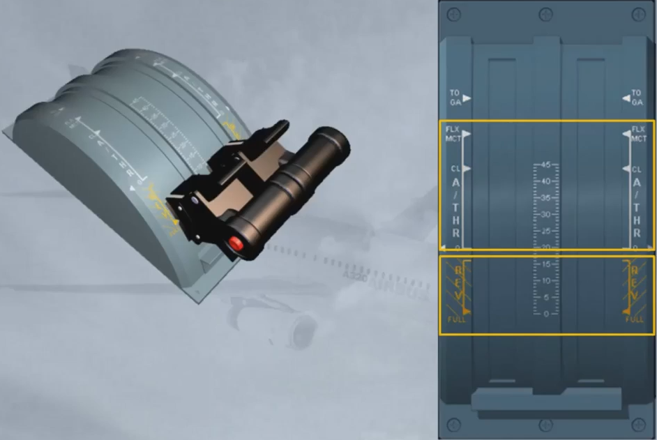

When A/THR is on, the thrust lever position determines the maximum thrust which can be commanded by the auto thrust (for example, to accelerate in SPEED mode)

On the "thrust" gage, which we will be talking about in the engine chapter, the thrust lever position is indicated by a symbol. It materializes the maximum thrust available for the A/THR in a normal operation.

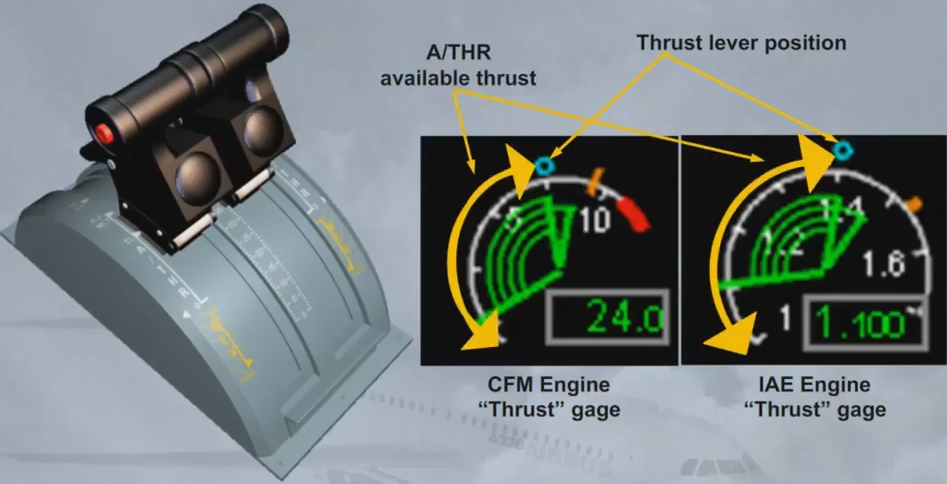

The A/THR has three states. It can be either:
- Disconnected, or OFF
- Armed, ready to be set to ON by a specific pilot action on the thrust levers
- Active, or ON.

Let's see these states in more detail.

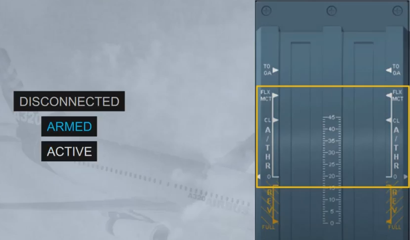

We are taxiing to the runway...

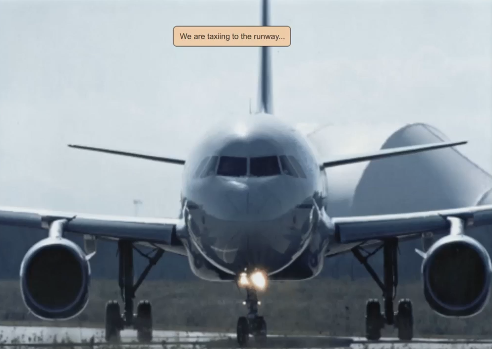

Because we are on the ground the A/THR is necessarily disconnected. This is confirmed by the absence of any A/THR related indications on the FMA and by the extinguished A/THR pb on the FCU. Thrust is manually adjusted by the crew as required to taxi the aircraft.

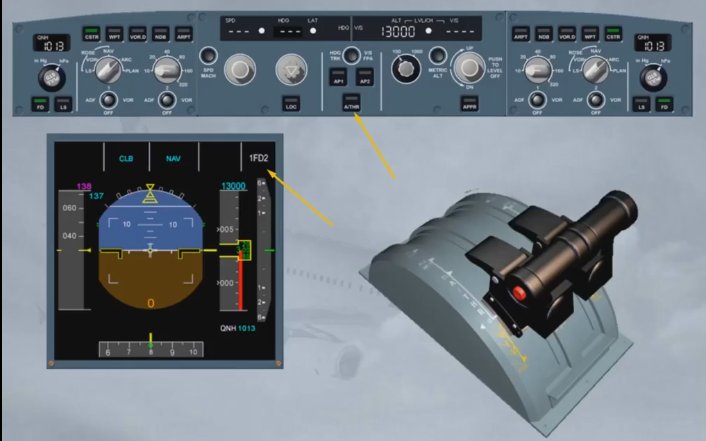

You are cleared for takeoff.

The Pilot Flying must manually set the thrust levers to FLEX or TOGA to initiate the takeoff roll.

As soon as the thrust levers are set in the TOGA position, the FMA shows:
- A/THR blue: indicating that A/THR is armed
- MAN TOGA white: indicating that the pilot manually controls the thrust via the thrust levers set in TOGA.

Note: TOGA is the maximum thrust available for Takeoff.

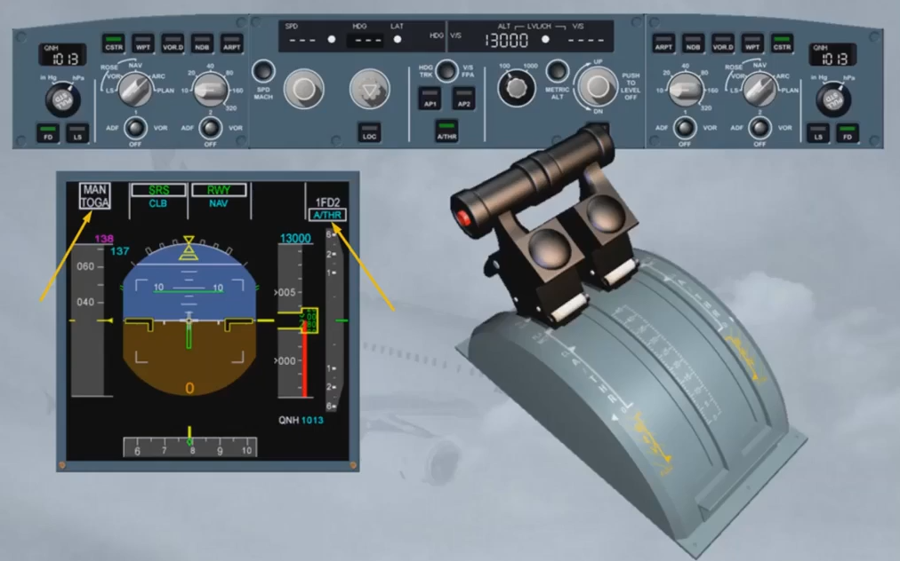

At the same time, on the FCU, the A/THR pb light illuminates in green.

The fact that the A/THR is armed, means that it is ready to be engaged by a pilot action on the thrust levers.

Note that when the A/THR is armed the pilot has manual control on the thrust with the thrust levers.

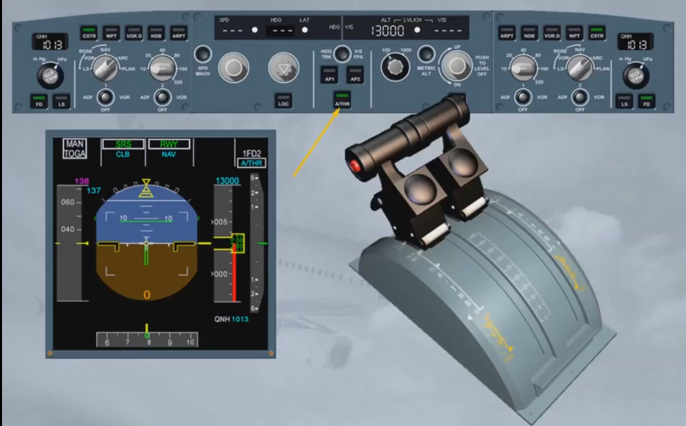

Crossing the thrust reduction altitude (THR RED ALT) the pilot must manually set the thrust levers to CL detent. On the FMA aflashing "LVR CLB" prompts the pilot to set the thrust levers backinto CL detent. We will set climb thrust for you.

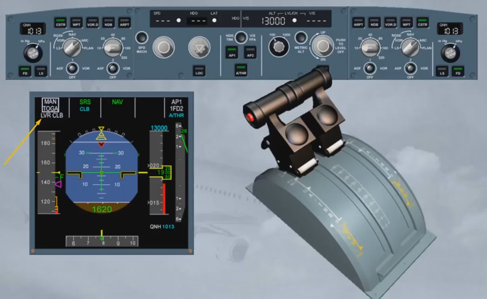

Notice that on the FMA:
- A/THR white: indicates that the A/THR is ON
- THR CLB green: indicates that the A/THR is in THRust mode

Since the Thrust levers are set to CL and the AP commands a climb mode, the A/THR commands THRUST CLIMB.

The white boxes around the modes highlight the fact that a mode change has occurred on the FMA.

Note: The AP1 vertical mode adjusts the pitch to maintain the takeoff scheduled target speed.

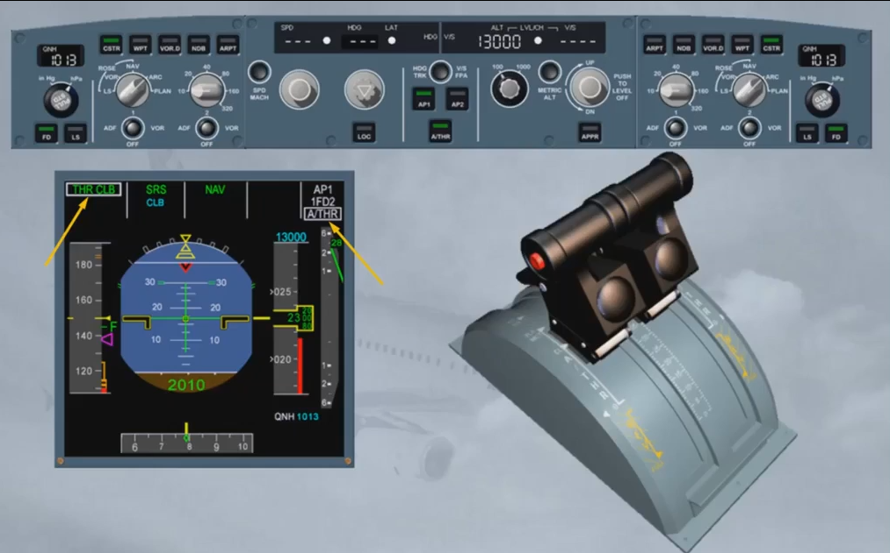

In normal operation when A/THR is ON, the levers are left in the CL detent throughout the flight until the flare. The A/THR adjusts the thrust, as required, between IDLE and MAX CLB but the thrust levers, not being back driven by the A/THR, remain in the CL detent, as set by the pilots.

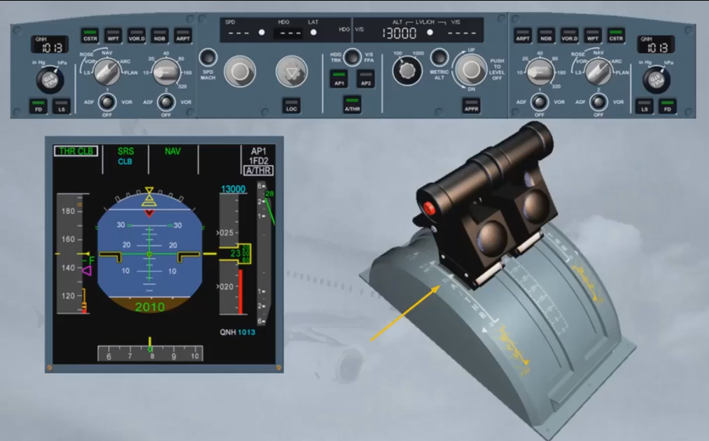

Crossing the ACCeleration ALTitude (ACC ALT), the FM Climb phase is initiated. The A/THR maintains CLB thrust while the vertical mode (CLB) adjusts the pitch to accelerate the aircraft towards the new speed target: the initial climb speed, here is 250 kt.

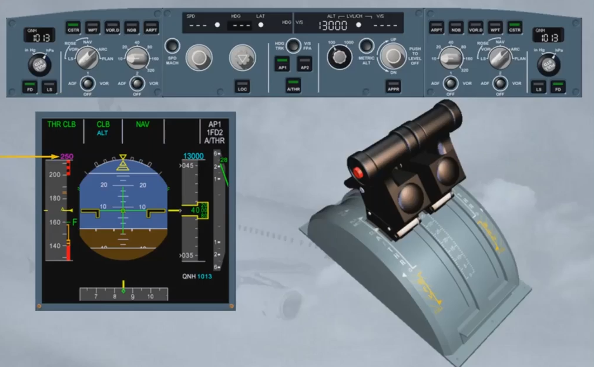

If, at any moment, the pilot needs some additional thrust, he will push the thrust levers forward from CL detent. He will then manually control the thrust.

In that case:
- MAN THR is displayed in white on the FMA
- A/THR is displayed in blue since the A/THR is armed.

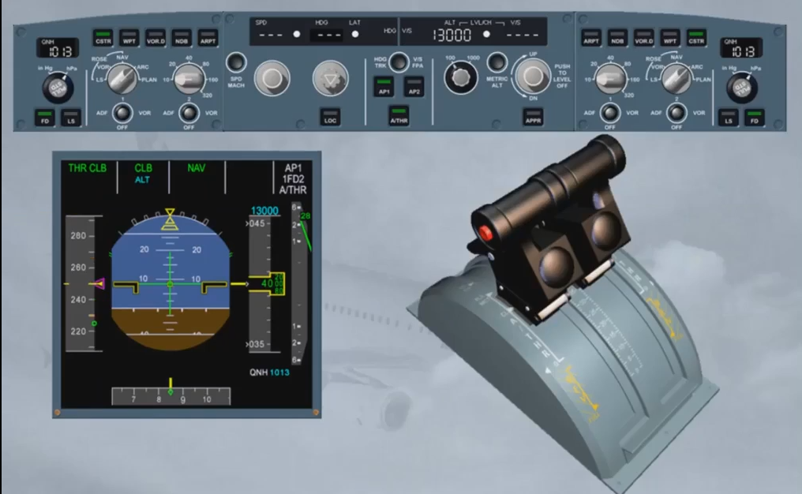

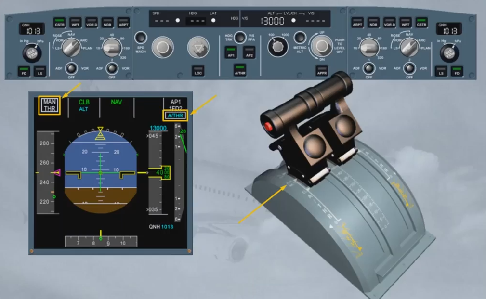

Whenever the pilot brings the thrust levers back into CL detent, the A/THR is automatically back ON in the applicable mode.

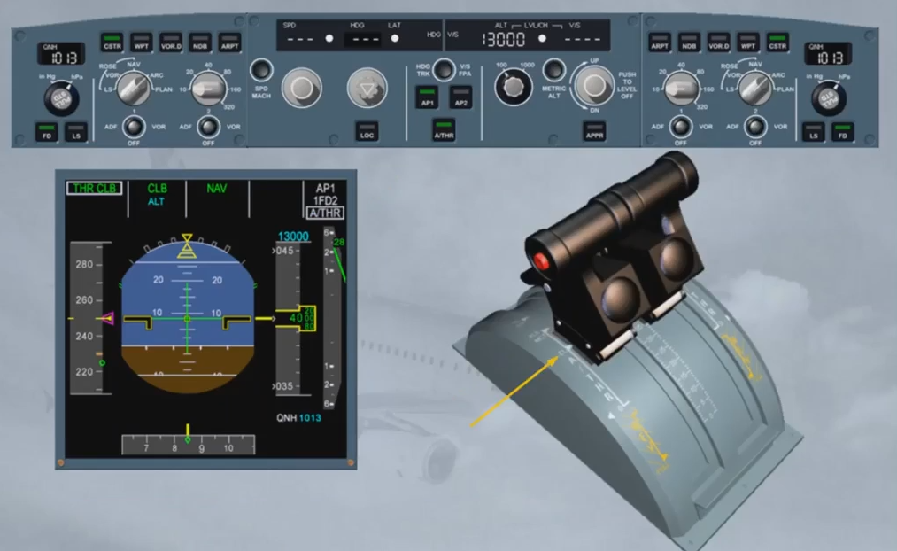

Note that the A/THR may be ON, in flight, provided the thrust levers are set above idle to CL detent (all engines operating), or above idle to MCT (one engine inoperative).

Beyond these detents, the pilot has manual control on the thrust.

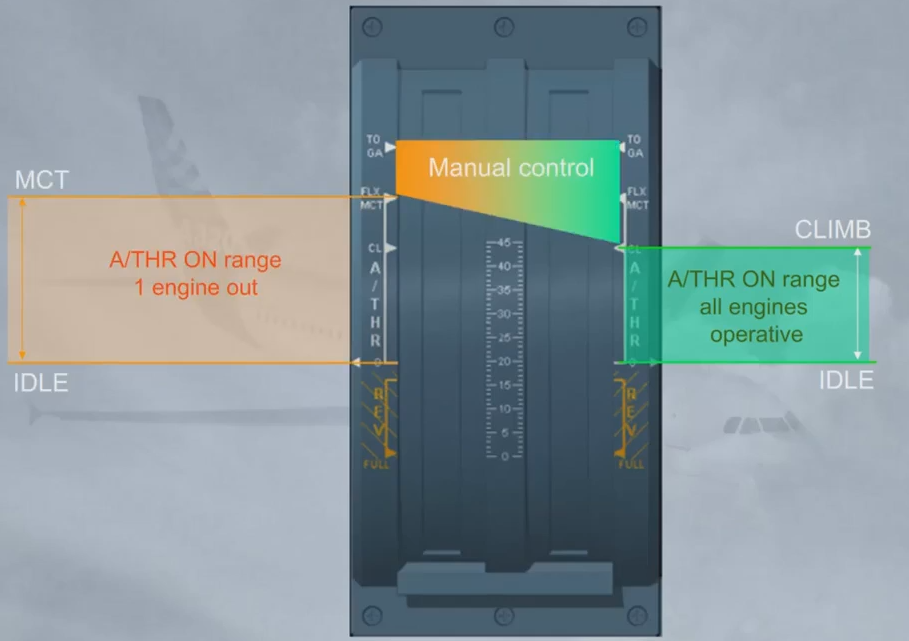

When the aircraft reaches the target altitude, AP/FD switches to ALT mode; the A/THR switches to SPEED (MACH) mode, as indicated on the FMA. In this mode the A/THR continuously adjusts the thrust to maintain the target speed (Mach).

A/THR is also in SPEED mode when AP/FD vertical modes are V/S or FPA, G/S and generally during the approach.

We are now in approach, just before flare. You fly the aircraft manually with the autothrust engaged.

Note that the A/THR is in SPEED mode. During a hand flown FLARE, the pilot has to reduce the thrust for landing. He will do so by bringing the thrust levers back to IDLE at about 20 ft.

Note: If he does not do so, the A/THR will increase thrust to maintain the speed. A "RETARD" auto call out comes up at about 20 ft as a reminder, to retard the thrust levers.

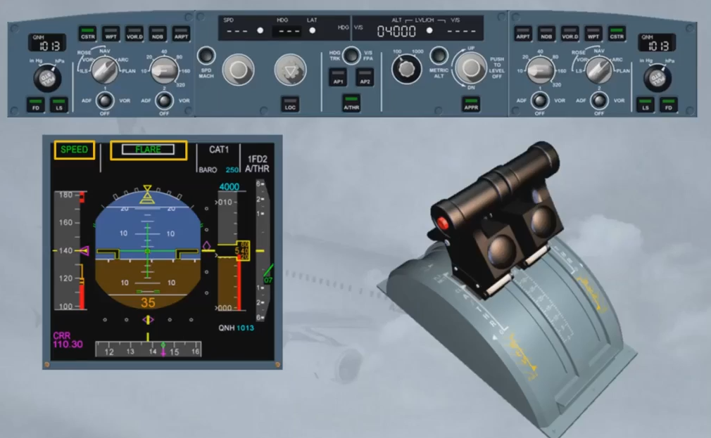

Thrust levers are now set to idle. This turns the A/THR off.
Note that:
- On the FMA, the white A/THR indication is no longer displayed
- The FMA A/THR column is blank
- On the FCU, the A/THR pb is now extinguished.

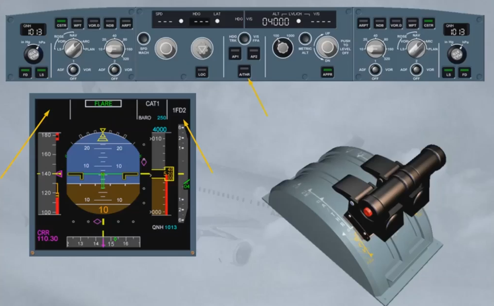

We have just seen how to turn the A/THR off, by setting the thrust levers back to IDLE for landing.

The recommended procedure to set the ATHR off in flight, in order to avoid any thrust change at A/THR disconnection, is:
 1) To move the thrust levers back so that the thrust lever position symbol roughly matches the present N1 or EPR

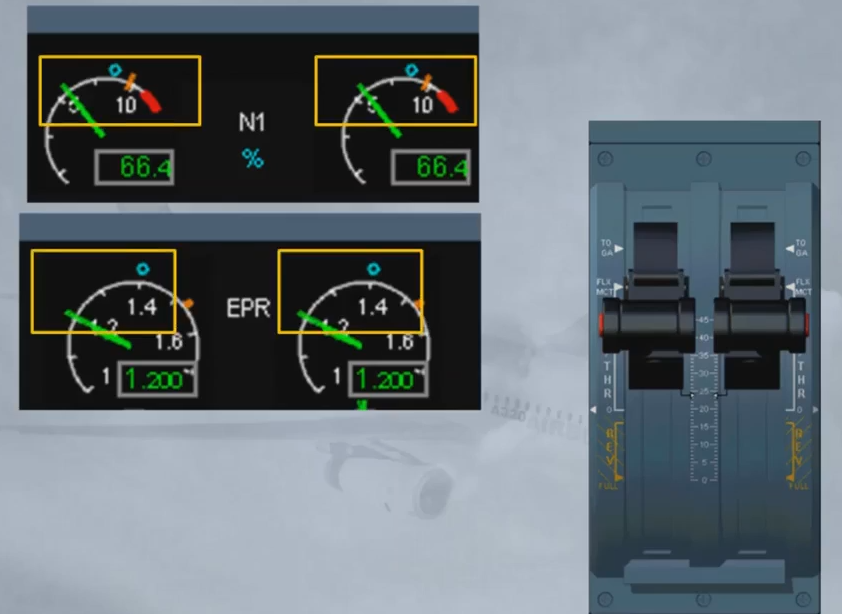

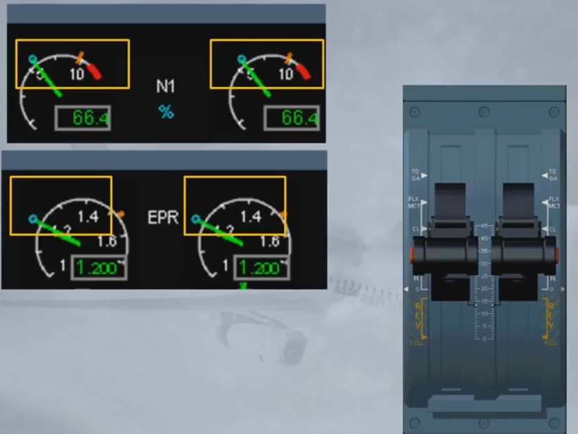

2) To press the instinctive disconnect pb located on the thrust levers

Note: Pressing at least one pb for more than 15 seconds will inhibit the A/THR including ALPHA FLOOR protection, for the remainder of the flight.

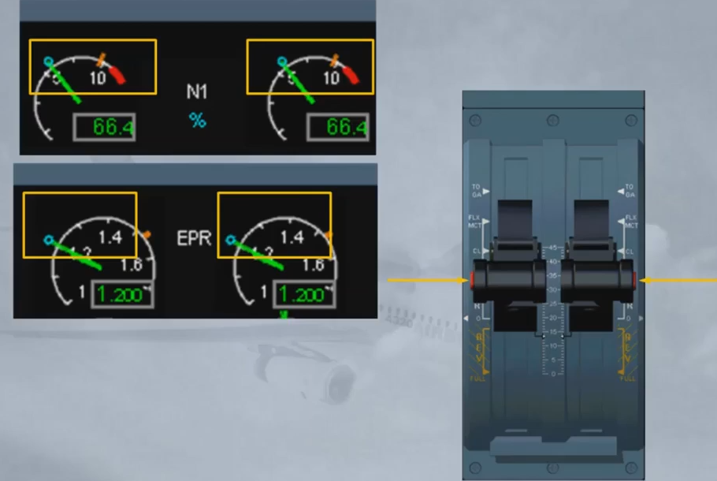

When the A/THR is OFF during flight, in order to turn it ON again, press the A/THR pb on the FCU with the thrust levers in or below CL detent.

Note: You can disconnect the A/THR by pressing the A/THR pb on the FCU. This is NOT the standard recommended procedure.

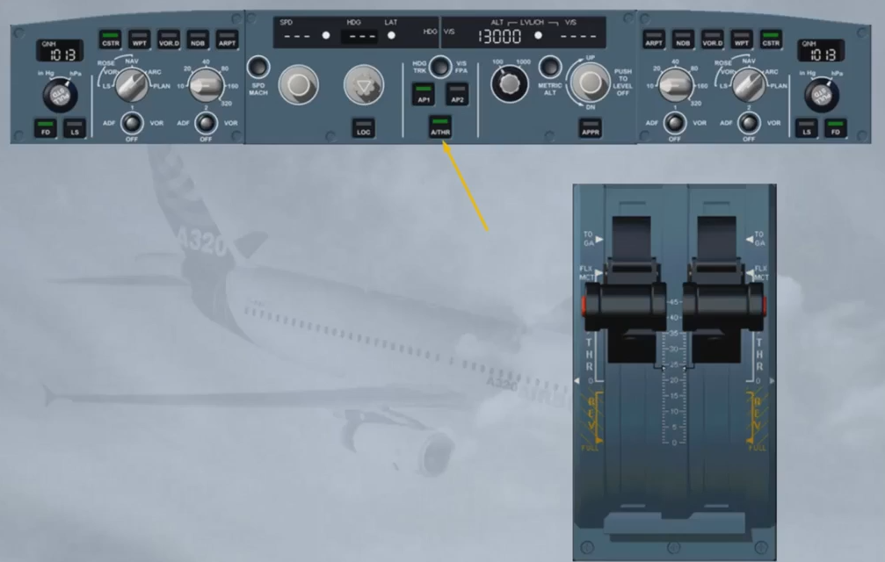

***Module completed***

## Video study

- Watch the video available on [YouTube](https://www.youtube.com/watch?v=cUNj9yMqAKs&list=PLKEybvo562LtwmnZOjo8jN7J75vXGqMzq&index=12)