The Flight Control Unit, or FCU, is the "short term actions" interface with the FMGS.

It is used to arm or engage the guidance modes and to select their associated targets. It is also used to set the Auto-Pilots (APs) and/or Auto-THRust (A/THR) on.

The FCU has two channels. Each channel is able to drive the entire FCU.

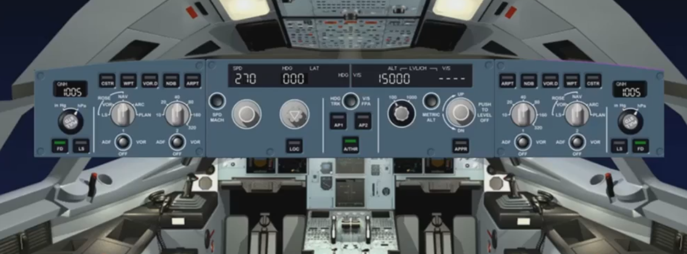

For the rest of this module, we will concentrate on the center part of the FCU.

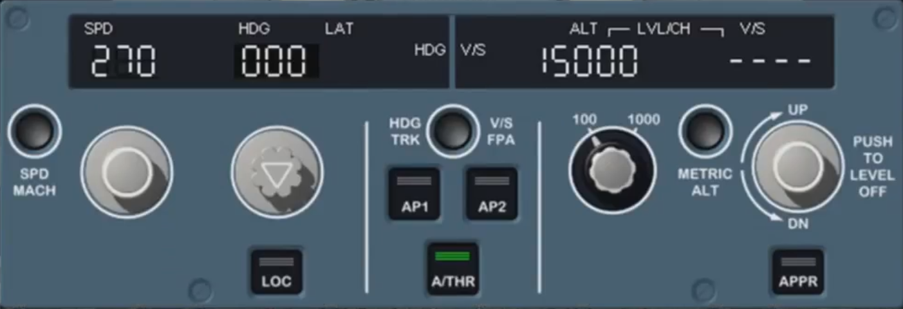

The pilot uses the FCU to select targets and arm/engage their related modes:
- For speed/Mach
- For lateral guidance (e.g. HDG)
- For vertical guidance (e.g. V/S).

The pilot also uses it to set the APs and A/THR to ON.

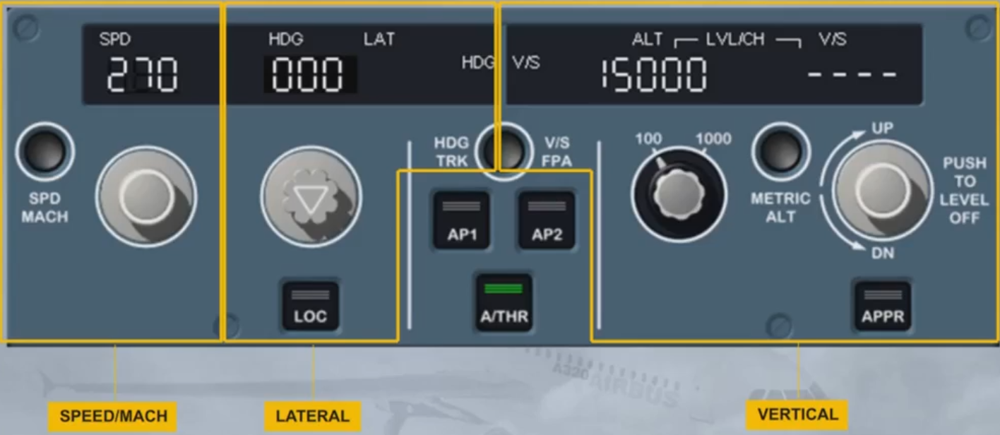

We can find, in the control areas, four selector knobs and their associated windows as well as two mode engagement pushbuttons.

As an option a third one can be installed.

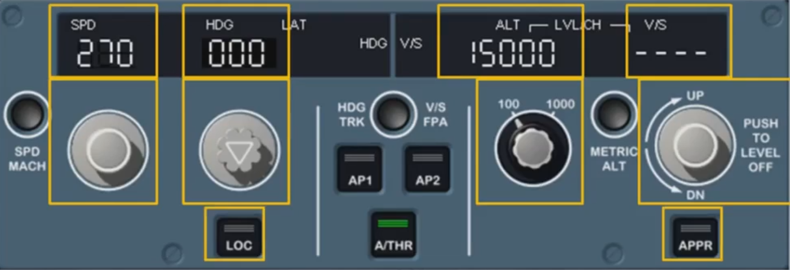

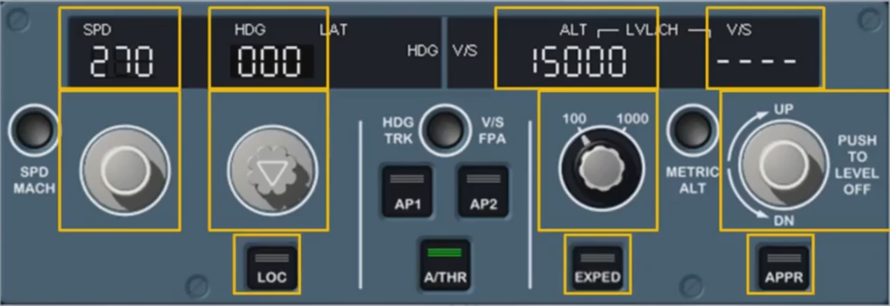

As a general rule, if you turn a selector knob you select a guidance target. If you then pull the same knob, you engage a mode which will guide the A/C to the selected target. Such a mode is a selected mode.

The selected target is clearly displayed on the associated window and on the associated PFD scale using a blue target symbol.

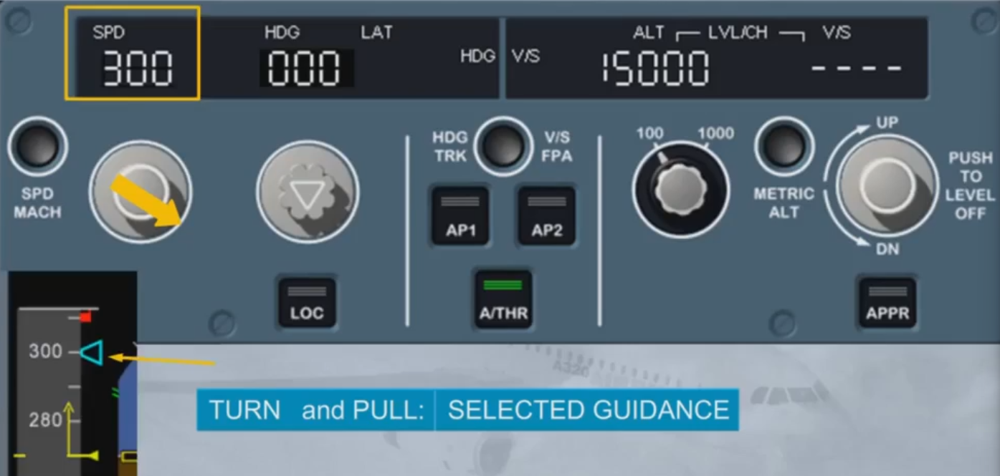

On the other hand, if you push a selector knob you arm or engage a mode which will guide the A/C to a target managed by the FMGS. Such a mode is a managed mode.

In this case, the associated window (except the altitude one) displays dashes with a white dot.

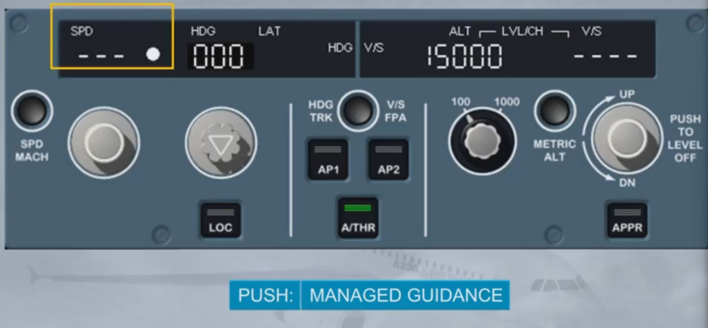

Let's now have a closer look at the SPEED/MACH section. The SPD/MACH selector knob enables you to select the target speed for the AP or A/THR.

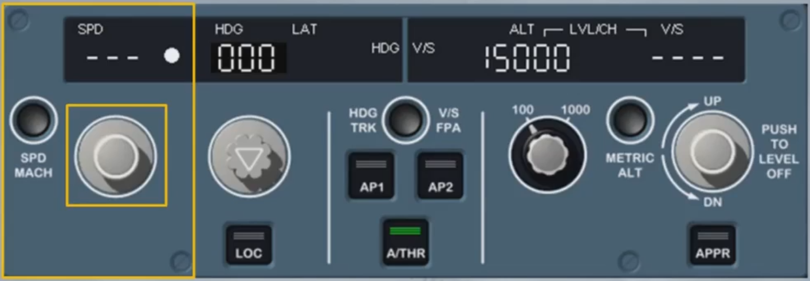

This selection is done by turning the selector knob. The selected speed is then displayed on the window.

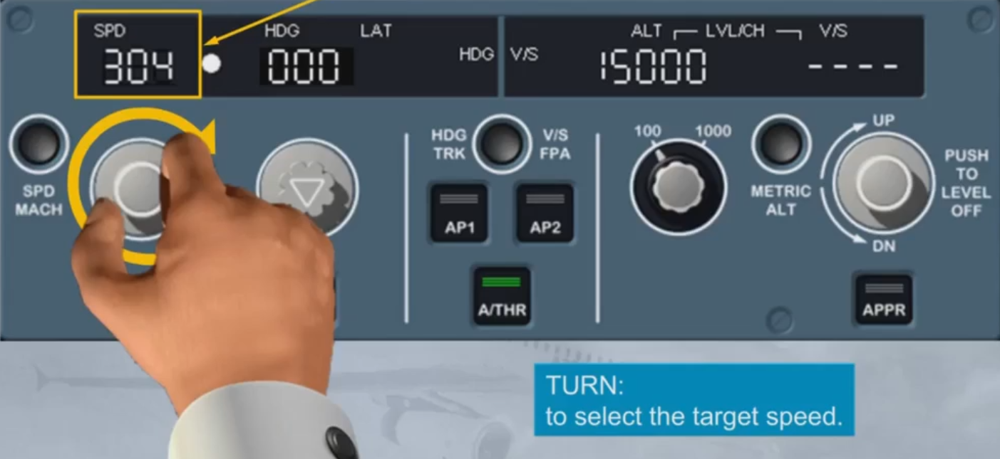

By pulling the speed knob you engage the SELECTED SPEED mode for the AP and/or A/THR, which will guide the aircraft tothe selected speed target.

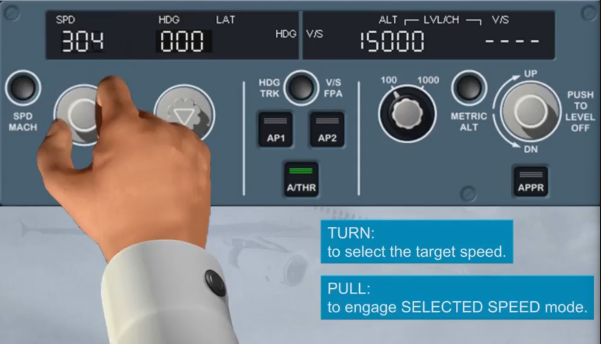

By pushing the speed knob you engage the MANAGED SPEED mode for AP and/or A/THR. This will guide the aircraft to the managed speed target profile as computed by the FM.

The speed window displays, in this case, dashes as well as an illuminated white managed speed/Mach dot.

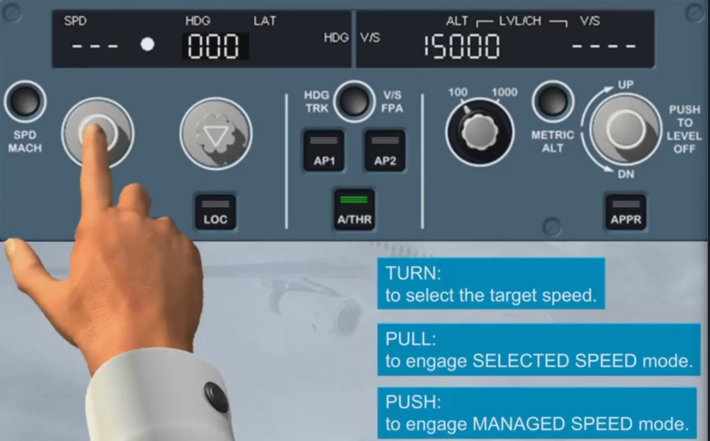

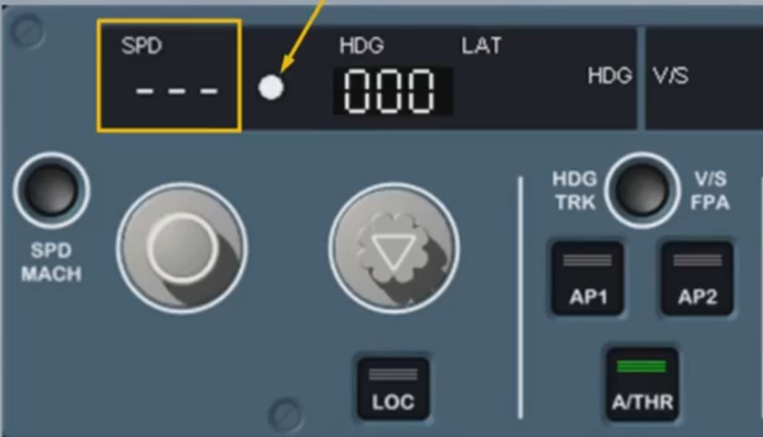

The selection in the speed window can either be a speed or a Mach. In normal operation, the change from speed to Mach target occurs automatically in climb at around FL300 and vice versa in descent.

However you can toggle the selected target between speed and Mach by pushing the SPD/MACH pb on the FCU at any time. The current selection is clearly indicated by a SPD or MACH legend on the display. 

That is all for the speed/Mach area.

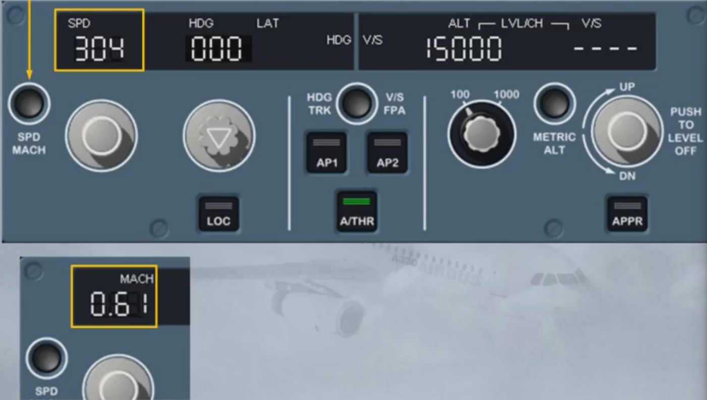

Let's now learn more about the lateral area.

Like the speed selector, the HDG/TRK can be turned, pulled or pushed:
- By turning it, you select a heading (or track) target (we will see later on how to toggle between HDG and TRK)
- By pulling it, you engage the SELECTED HEADING or TRACK mode for the AP/FD

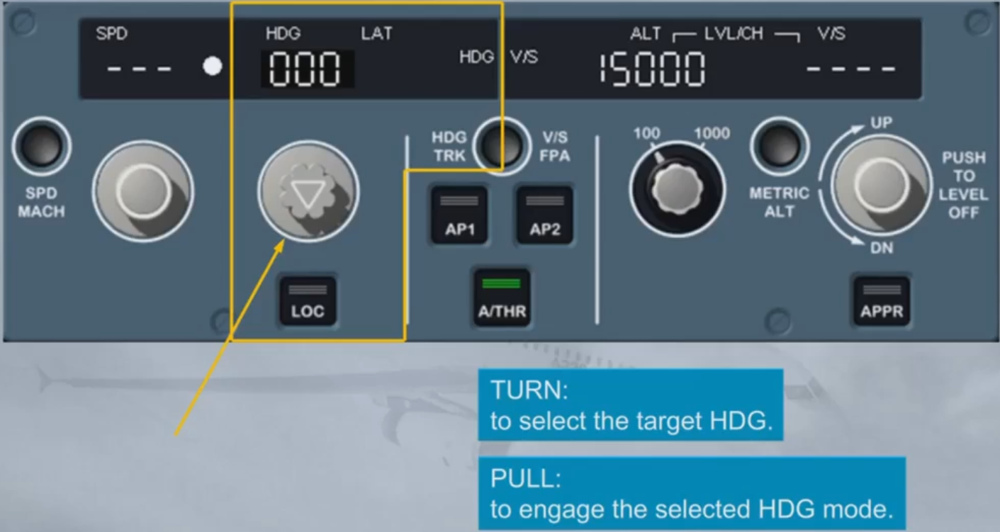

- By pushing it, you arm/engage the MANAGED NAV mode for the AP/FD which will guide the A/C along the active leg of the primary F-PLN.

In this case, the window displays dashes as well as an illuminated white managed lateral dot.

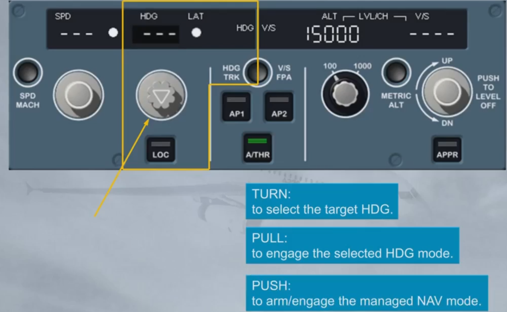

The HDG-V/S/TRK-FPA pb is used for the display of Flight Path Vector (FPV) or BIRD on or off the PFD. When the BIRD is ON, your flight reference is the Flight Path Vector (the aircraft trajectory). When the BIRD is OFF, your flight reference is the attitude of the aircraft.

The consequence for the AP/FD is that you change their basic guidance references from TRK-FPA (BIRD ON) to HDG-V/S (BIRD OFF).

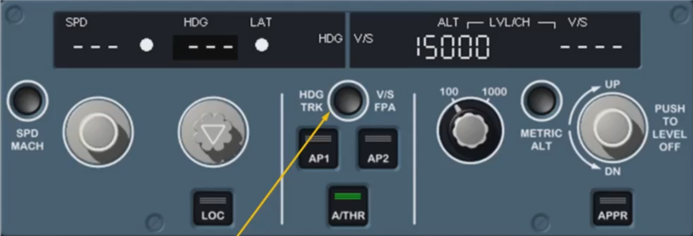

The flight reference selected here is attitude (BIRD OFF). The aircraft attitude symbol is your flight reference and if the FD is ON, the FD cross bars are displayed. The selection is also indicated by HDG-V/S legends on the FCU display.

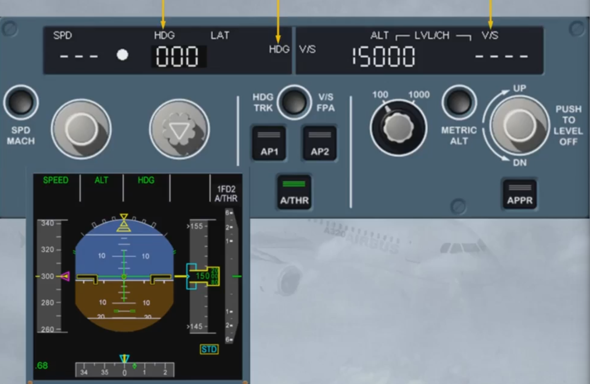

Change the reference

The selected flight reference is now the Flight Path Vector (BIRD ON). The BIRD symbol is your flight reference and materializes the aircraft current trajectory. If the FD is ON, the FD Flight Path Director (FPD) is displayed. The selection is now indicated by TRK-FPA legends on the FCU display.

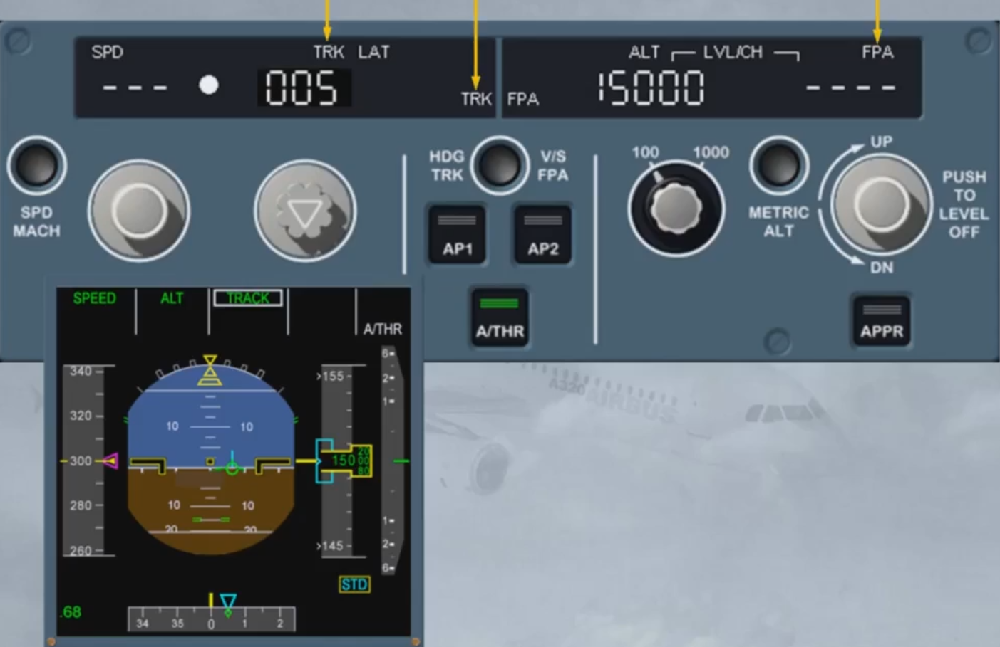

The vertical area is divided into two parts:
- The first one relates to the altitude
- The second one relates to V/S or FPA guidance modes.

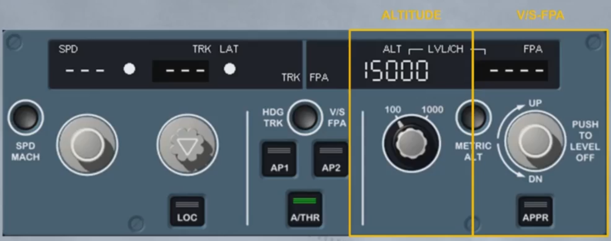

The altitude window is never dashed. It always displays the target altitude which is systematically selected by the crew as the next applicable clearance altitude.

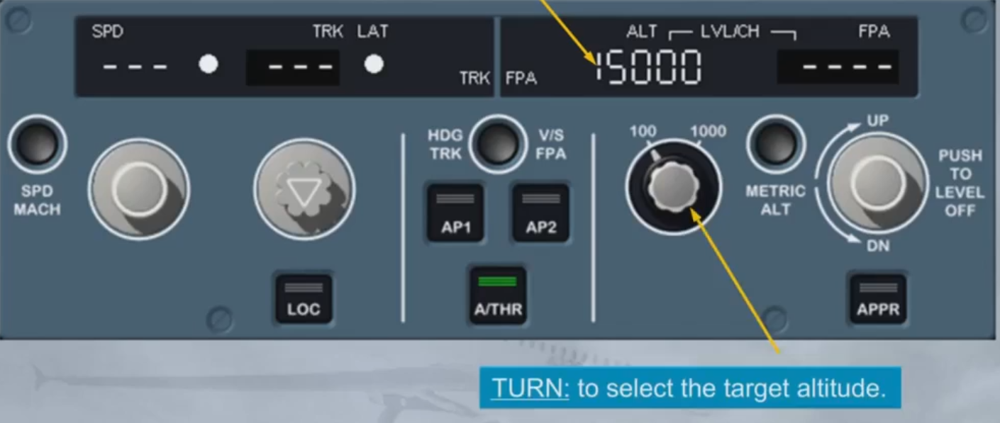

This knob can also be pulled or pushed:
- By pulling it, you engage a SELECTED VERTICAL MODE. It will guide the aircraft towards the FCU selected target altitude while disregarding any altitude constraints of the vertical F-PLN
- By pushing it, you engage a MANAGED VERTICAL MODE. It will guide the aircraft towards the FCU selected target altitude matching all altitude constraints of the vertical F-PLN and along the precomputed descent path. The white LVL/CH light comes on.

Note: Managed vertical mode can be engaged if the lateral profile is already managed.

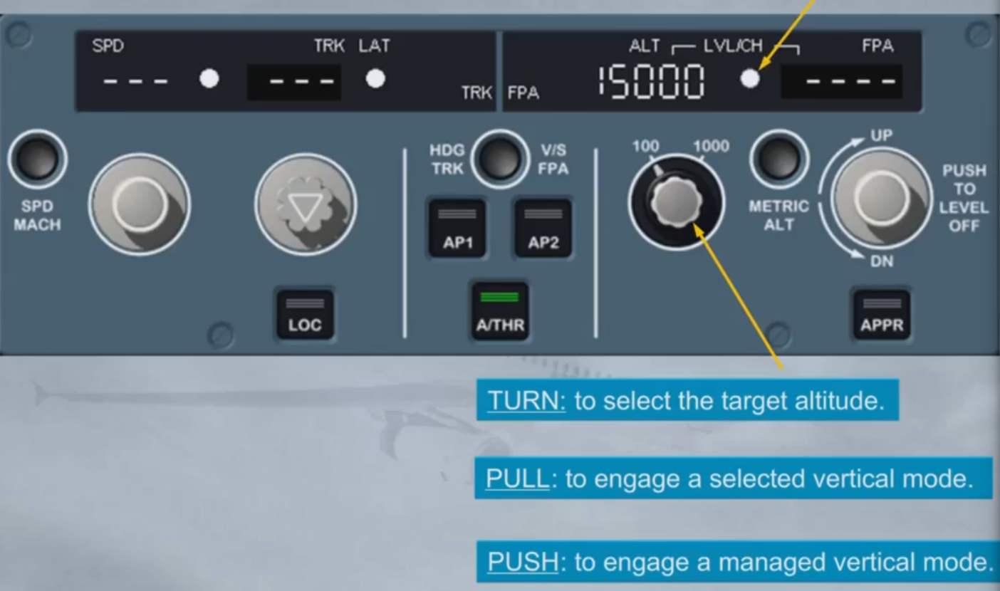

This knob is actually two different selectors.

The inner selector sets the altitude target in the window and an outer ring changes the altitude increments.

The increment/decrement of the altitude can have two settings: 100 ft or 1000 ft.

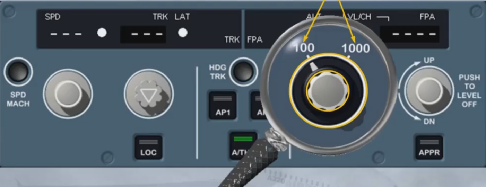

The METRIC ALT pb is also part of the altitude area. It has been already seen in the EIS chapter. We just remind you that this pb is used to display the selected altitude, written in meters, on the permanent data display area at the bottom of the ECAM System Display (SD).

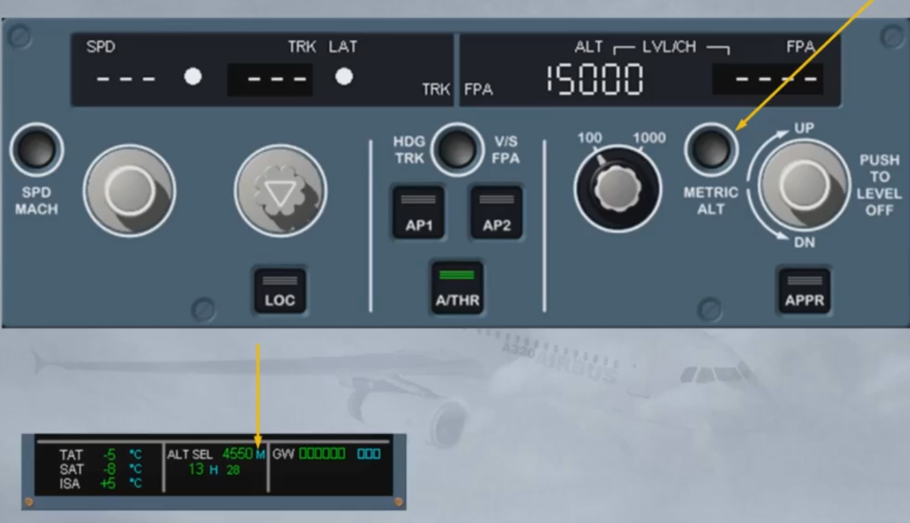

Let's now have a look at the V/S-FPA part. Here again, the V/S-FPA selector knob has three functions. The first two are similar to what we've already seen:
- The "TURN" function enables you to select a target V/S or FPA
- The "PULL" function enables you to engage the selected V/S or FPA mode
- The third function, "PUSH"， differs from the other "PUSH" functions.

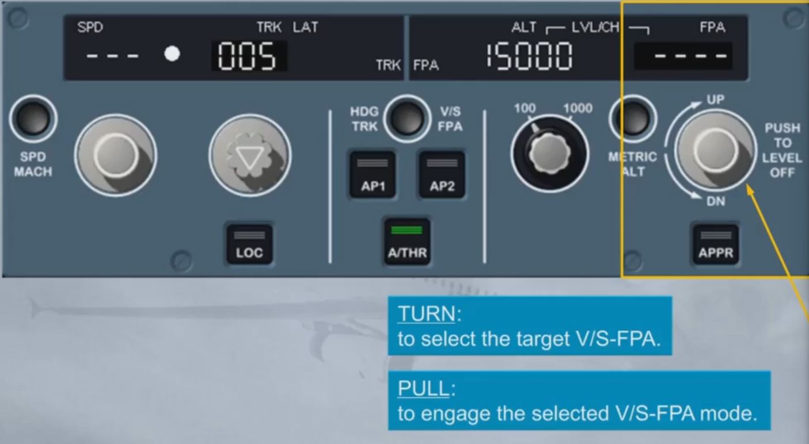

In fact, when you push the selector knob, the FM commands an immediate level off (V/S or FPA = 0). The value zero is then displayed in the window as well as on the FMA.

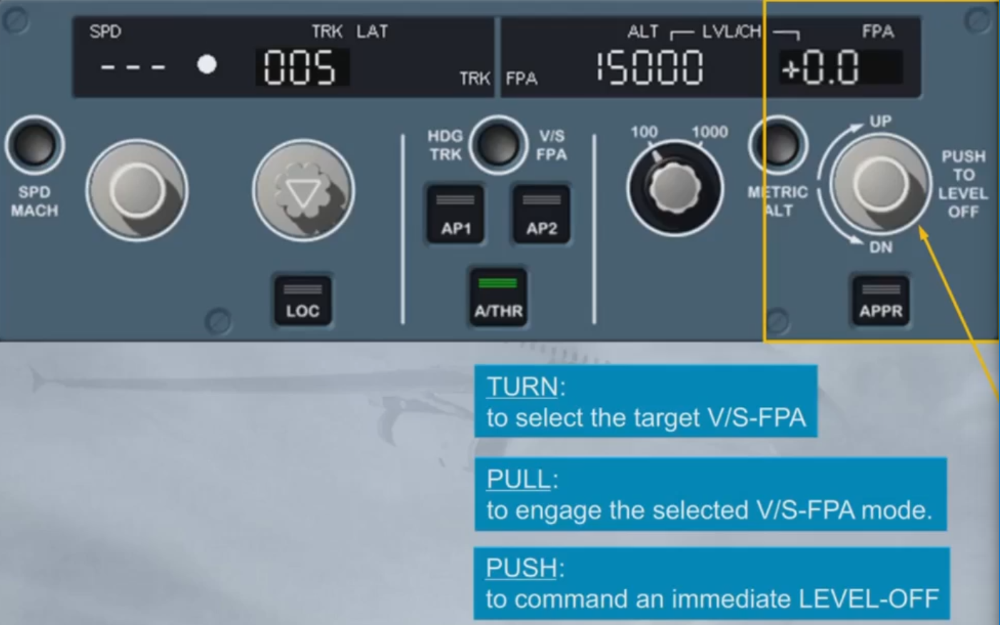

To set a value, let's first turn the V/S-FPA selector knob.

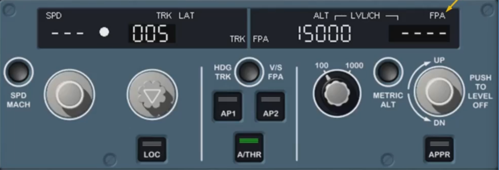

As soon as the V/S-FPA selector knob is tumned, the V/S-FPA window indicates the current FPA (or V/S). In this case, a flight path angle value is displayed. Notice how the degrees are displayed. The minus sign indicates a descent. A climb would be indicated by a plus sign.

To engage the AP/FD FPA selected mode, we have pulled the selector knob for you.

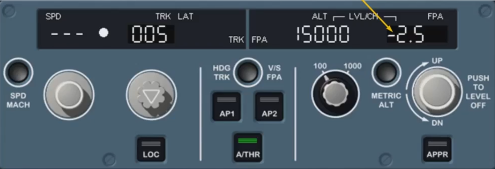

For training purposes, we wish to change the flight reference, and thus select the BIRD off, changing the basic AP/FD guidance references from FPA to V/S.

Switch back to HDG-V/S.

The V/S window is now showing a V/S target, -800 ft/mn, synchronized with the current V/S. Notice how the vertical speed is displayed and the change of labels from FPA to V/S.

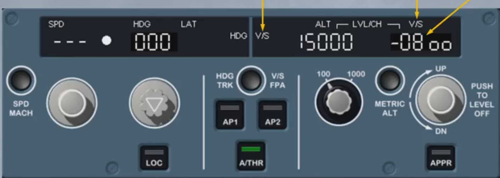

The V/S-FPA window can also display dashes if a vertical managed mode is engaged. This case will be seen and explained later in the course. Let's now take a brief look at the other pushbuttons located on the FCU.

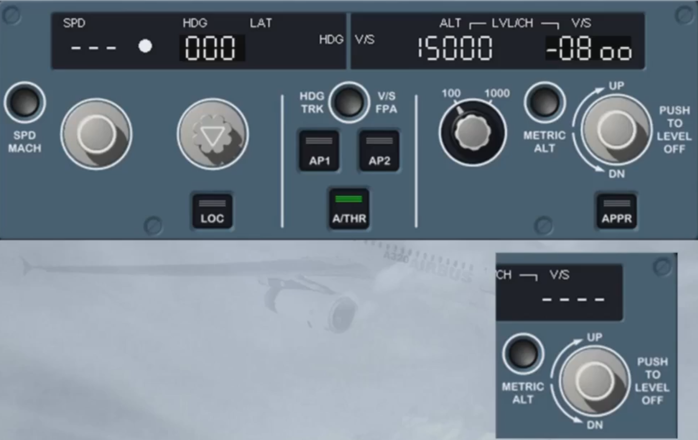

The LOC pb arms/engages the LOC mode, in case the aircraft is cleared to intercept the localizer only, or in case of localizer only approach.

When LOC mode is armed/engaged, the green lights on the pb are illuminated. You will see this function in more detail during your free play and simulator sessions.

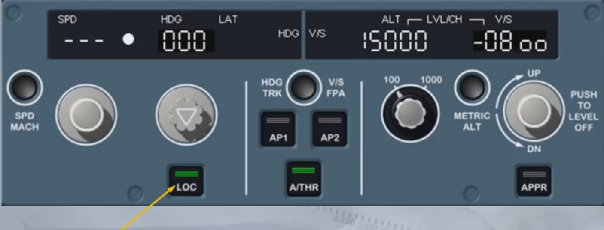

The pilot uses the APPR pb to arm/engage the approach modes, depending upon the approach type selected in the FM's F-PLN. When engaged, green lights come on, on the pb.

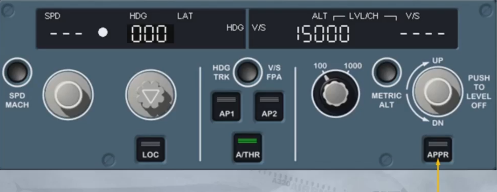

If installed, the EXPED pb allows you to temporarily expedite the climb or descent towards the altitude selected on the FCU. The target speed is then automatically set to the best climb or descent speed inorder to achieve that goal. When selected, green lights come on, on the pb.

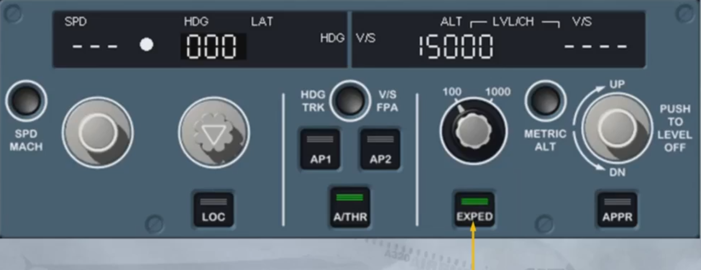

AP 1/AP 2 pushbuttons set AP 1 and/or AP 2 to ON.

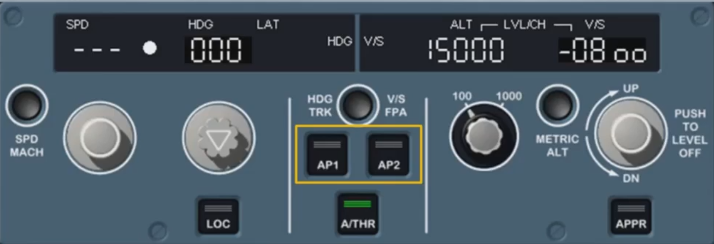

A/THR pb sets A/THR to ON. The pb illuminates green when A/THR is ON or when it is armed (see A/THR logic: e.g. as soon as take off power is applied).

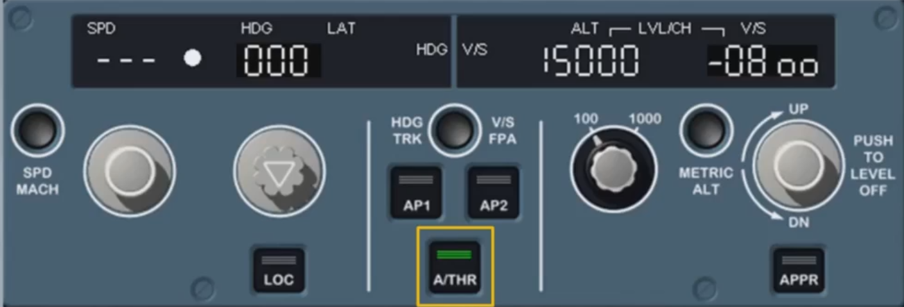

We will come back to these controls in a later module.

Note: These pushbuttons may also be used for APs and/or ATHR setting to OFF, but in normal operation this is not the recommended disconnection procedure.

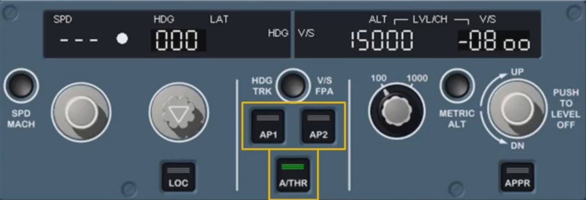

You have now seen an overview of the FCU: the FCU is basically a sel panel with various functions.

Remember that one of our "GOLDEN RULES" is: "know your FMA at all times" which means that any new selection made on the FCU should be confirmed on the FMA located on the PFD.

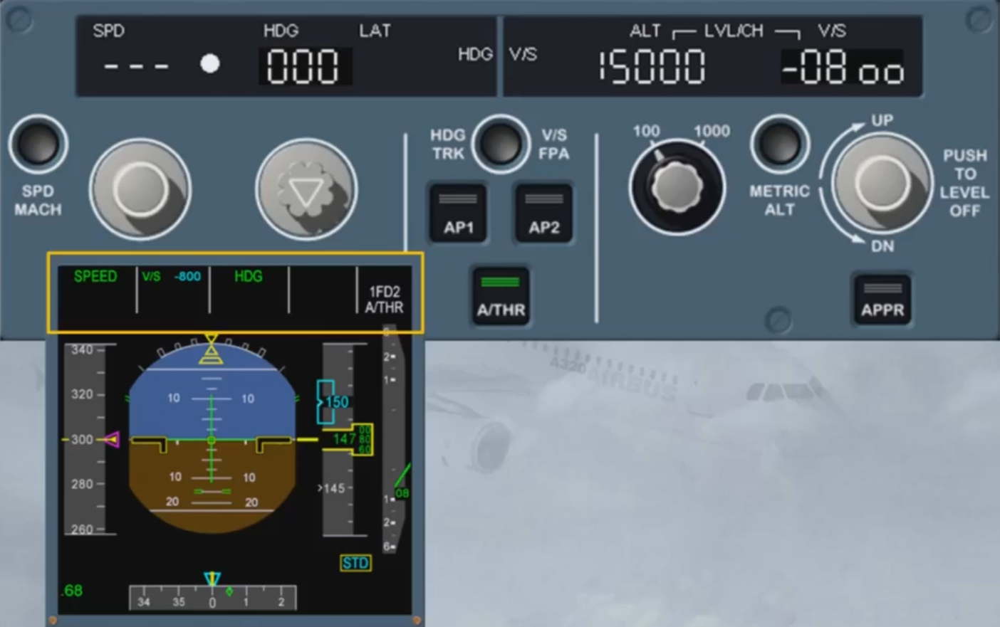

***Module completed***

## Video study

- Watch the video available on [YouTube](https://www.youtube.com/watch?v=cUNj9yMqAKs&list=PLKEybvo562LtwmnZOjo8jN7J75vXGqMzq&index=9)