In this module we will review how to turn the APs and/or the FDs ON.

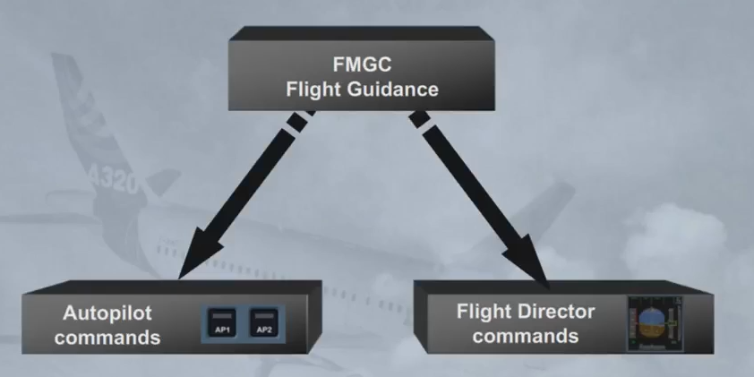

First, let us review how to engage the AP (AP ON).

You are the Captain, and PF...

The AP is an assistance to the pilot to fly the aircraft. The AP works within the aircraft normal flight envelope. Therefore the pilot can turn it ON, whenever the aircraft is within this flight envelope.

Here, we are just airborne, above 100 ft from the ground.

Engage AP1.

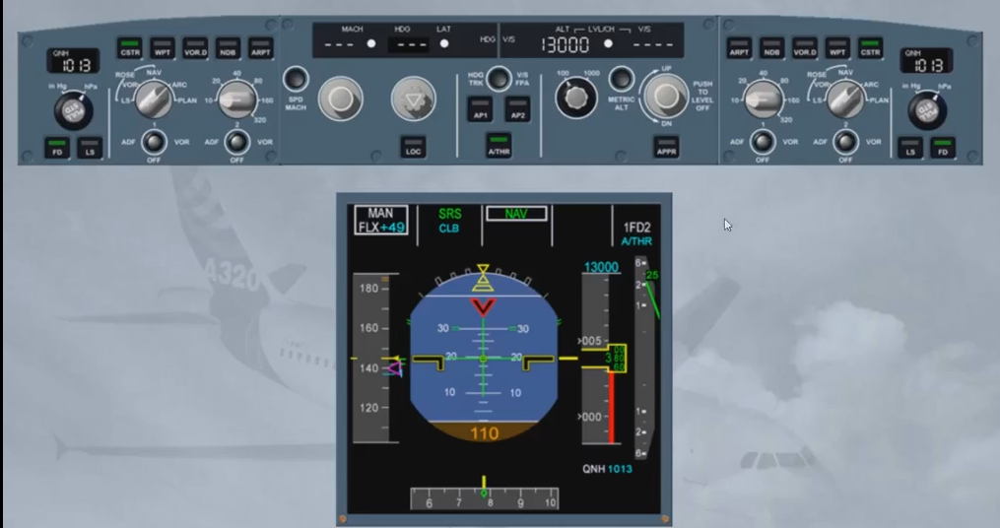

The FMA confirms the engagement of AP1.

As a general rule when the Captain is PF, AP1 is used. When the First Officer is PF, AP2 is used. This ensures that each AP will be alternatively operated. The AP can be used just after lift off from say 100 ft until the end of the landing roll-out.

In most cases, only one AP can be engaged at a time.

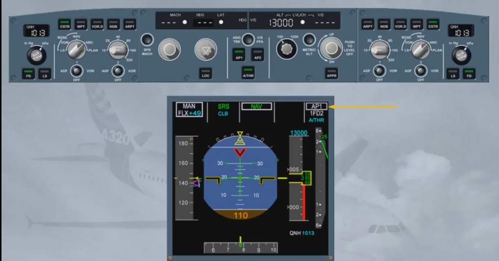

However, in case of an ILS automatic approach, both APs may be turned ON at the same time. This ensures the best level of redundancy required to safely achieve autolands, auto-rollouts or low altitude go-arounds.

As a consequence, once cleared for an ILS approach, the pilot presses the APPR pb to arm LOC and G/S modes; the second AP may then be turned ON.

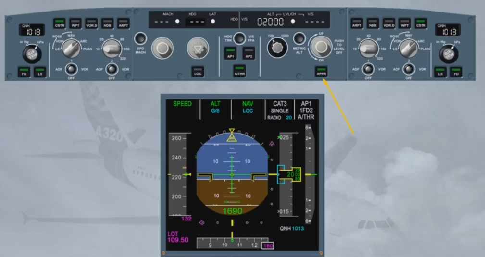

AP2 pb has been pressed to on.

The FMA confirms the engagement status of both APs as well as the resulting level of redundancy achieved (DUAL). This will dictate the minimum possible DH. You will see this in more detail in the "guidance mode" modules. Now, let us review how to disconnect or turn the AP OFF.

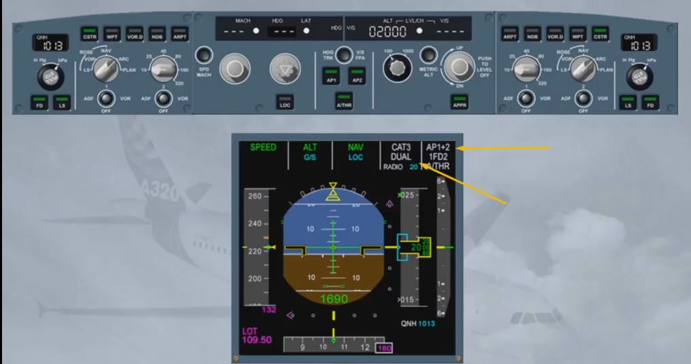

You are now flying an automatic approach. When in sight of the runway, you decide to take over manually.

To turn the AP OFF, you press the red AP disconnect pb also known as take over pb, located on either side stick.

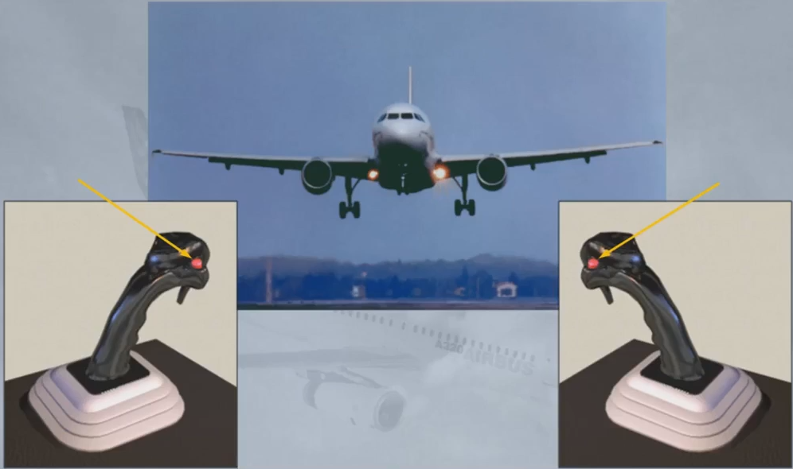

The weather is fine, you are number one for approach. Disconnect the autopilot.

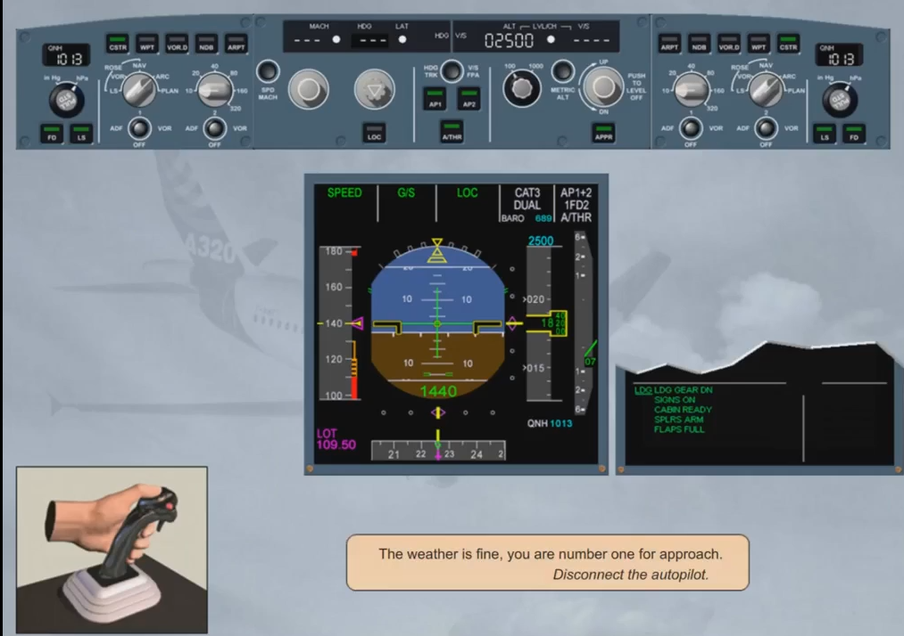

Turning an AP OFF, via the take over pb, triggers the following temporary warnings:
- A cavalry charge aural warning, for around 1 second
- The MASTER WARNING flashing several seconds
- An "AP OFF" red message on the right column of the E/WD, several seconds.

By pressing the take over pb again, you will cancel all these warnings immediately.

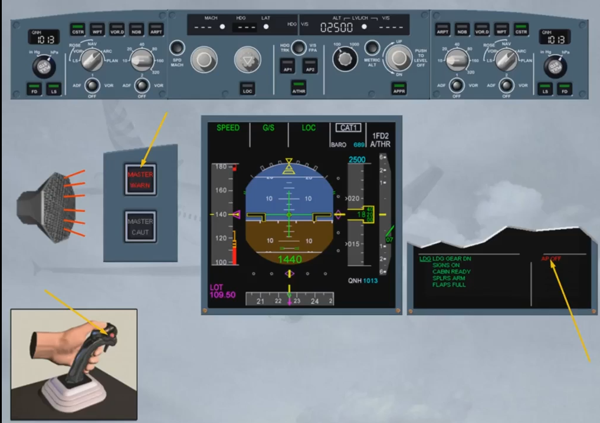

Notice that:
- On the FCU, the APs lights are extinguished
- On the FMA, AP 1 + 2 is no longer displayed
- The approach capability is downgraded to CAT1, and
- On the ECAM system, all warnings are now off.

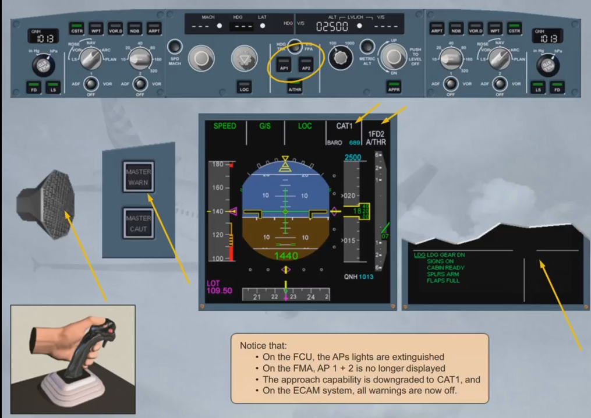

The recommended technique to set APs OFF is to press the AP disconnect pb on a side stick.

They can also be set to off by:
- Acting on the side stick or rudder pedals with a force beyond a given threshold, or
- Pressing an AP pb on the FCU when the corresponding AP is ON.

These last two actions lead to a repetitive cavalry charge, a permanent activation of the MASTER WARNING and a permanent red AP OFF warming on the left column of the EWD. This is considered by the FG as an involuntary AP disconnection.

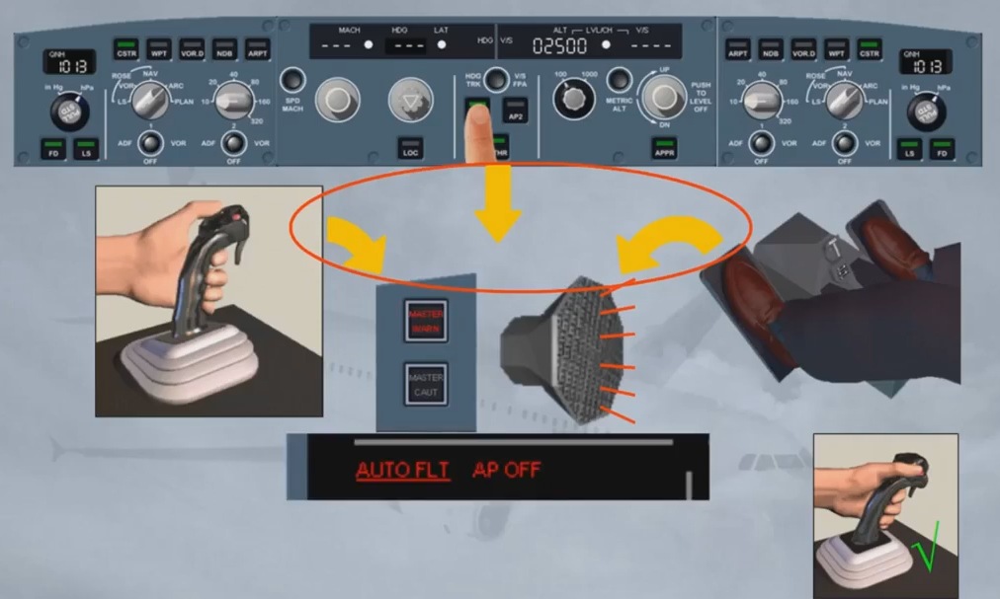

---

The FG also drives the Flight Director (FD) symbols displayed on either PFD.

The FD is an assistance provided to the pilots to accurately hand-fly the A/C along a given segment of a trajectory.

The FD provides guidance orders to the pilots, as a function of the guidance modes and targets selected on the FCU. These orders are materialized by specific symbols (e.g. crossbars).

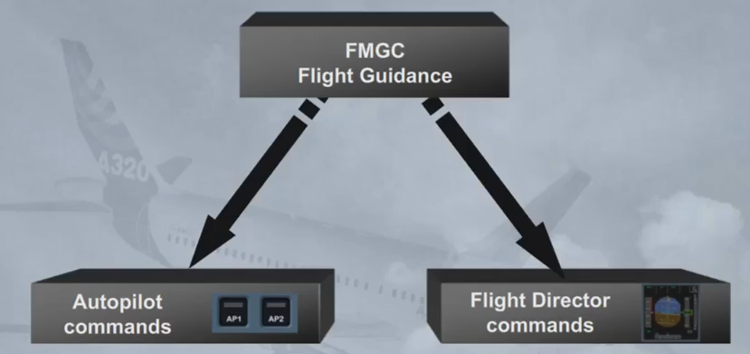

The FD symbols are displayed on either PFD. The symbols on PFD1 are driven by FG1, those on PFD2 are driven by FG2.

The engagement status of the FD is indicated on the FMA.

Here, the FD symbols are called crossbars and are referenced to the aircraft attitude symbol.

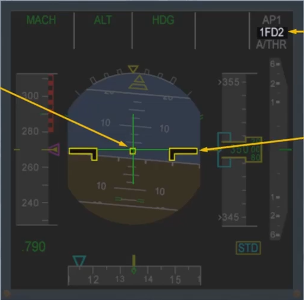

To turn the FD ON or OFF, use the FD pb located on either EFIS control panel. When a FD is ON, the green bars of the corresponding pb are illuminated.

Here both FDs are ON; let's turn them OFF.

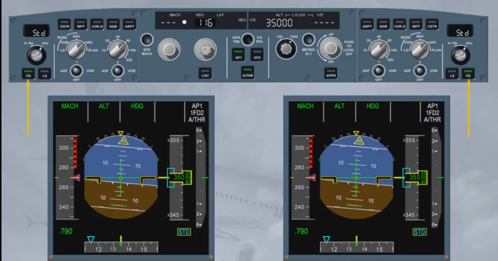

Each pilot presses on his FD pb:
- FD bars are removed from the PFD
- FD engagement status is cleared on the FMA
- FD pb green lights are extinguished.

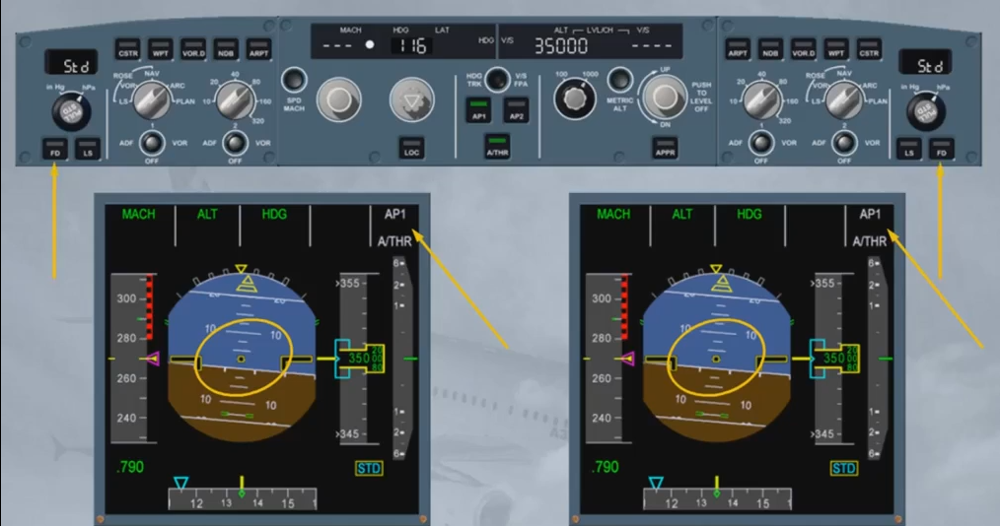

Note that we have switched the AP1 OFF for you.

When both APs and FDs are OFF, note that all mode fields, except the one of the A/THR (here MACH) are blank on the FMA. It is important to notice that if both FDs are set to OFF while APs are OFF, A/THR (if active) is automatically in SPEED mode or MACH mode.

Let's now turn the FDs back ON. Suppose that the Captain presses his FD pb first, and then the F/O.

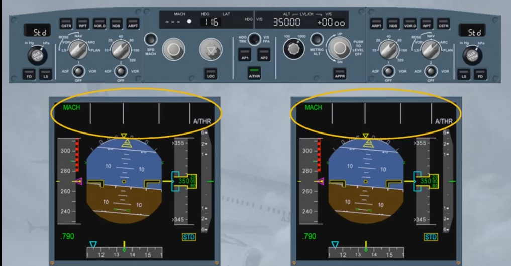

FD1 is ON. The crossbars are displayed on PFD1; the FMA on both PFD indicates:
- "1FD-" as FD engagement status, meaning that only FD1 is ON
- The FD1 associated modes

Notice that FD1 pb illuminates in green on the EFIS control panel.

Note: When both APs and FDs are OFF and you turn one of them back ON again, it comes up in "basic" modes: V/S-HDG or FPA-TRK.

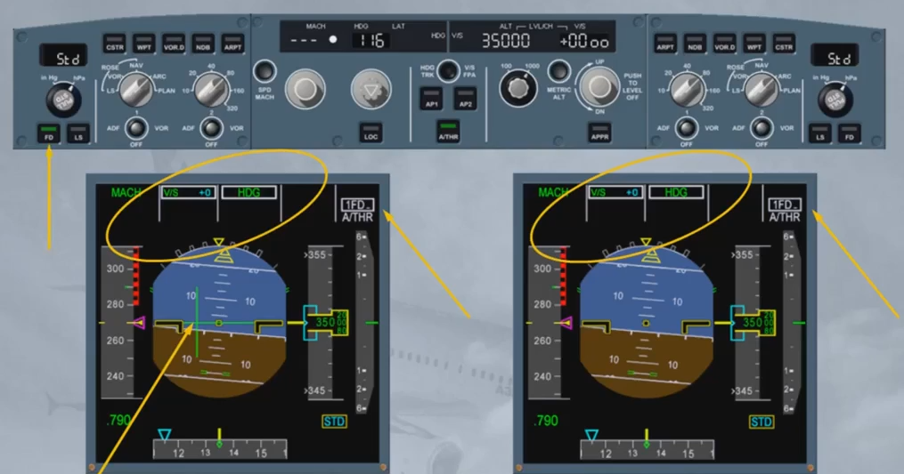

Let us now turn the F/O's FD back ON.

Both FDs are now ON; the crossbars are displayed on PFD2. Both FMAs indicate:
- "1FD2" as FD engagement status, meaning that both FDs are ON
- The on-side FD guidance modes.

Note that FD2 pb illuminates in green on the EFIS control panel.

As a general rule: it is strongly recommended to set both FDs ON or OFF at the same time.

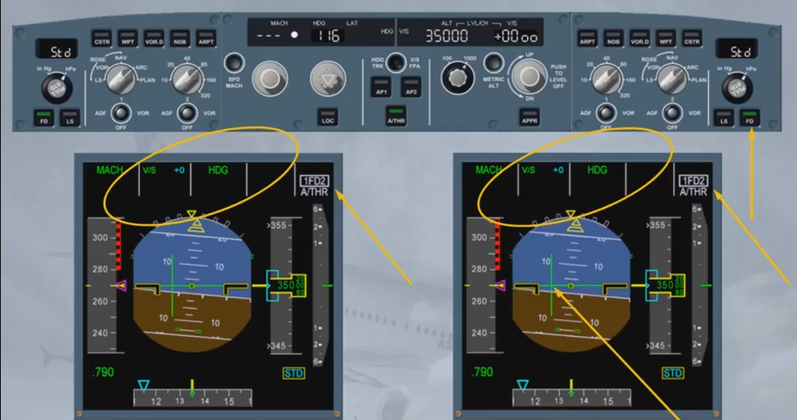

Let's review the FD symbols. The FD crossbars are two independent bars referring to the aircraft attitude symbol:
- A horizontal bar indicating the pitch command
- A vertical bar indicating the roll command

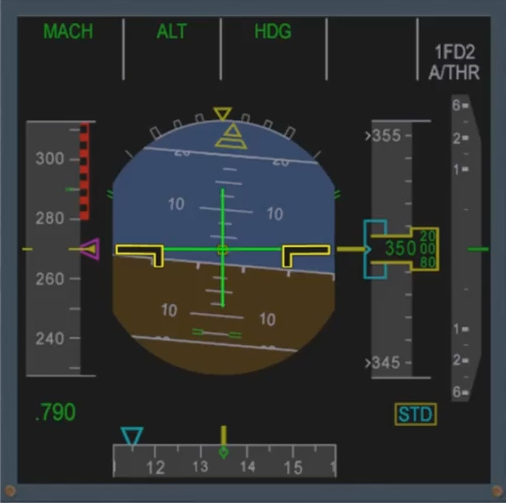

The roll bar is replaced by a yaw bar index for takeoff and landing roll out functions from an ILS equipped runway. The yaw bar helps the pilot to properly track the localizer on ground while in low visibility condition.

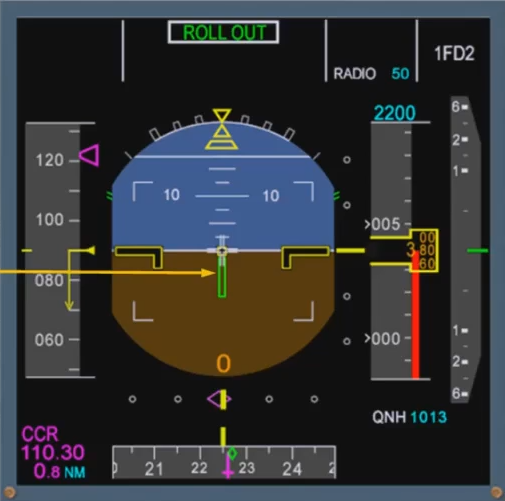

The principle of the FD crossbars has been reviewed in the EFIS module. Let's review an other flight director symbology.

We have seen the Flight Director crossbar symbology referring to the aircraft attitude symbol. The other FD symbology refers to the Flight Path Vector (FPV) or bird. The bird can be displayed ON/OFF on the PFD by pressing the HDG-V/S/TRK-FPA pb on the FCU.

Notice that, on the PFD, the bird is now displayed. On the FCU, the indications have been modified to reflect the change to TRK-FPA.

Let's have a closer look at the PFD.

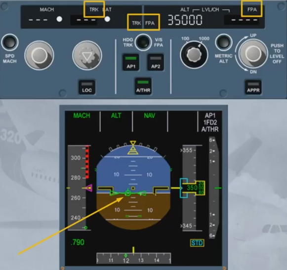

The Flight Path Vector (FPV) is displayed. The crossbars are removed and replaced by the Flight Path Director (FPD), referenced to the FPV.

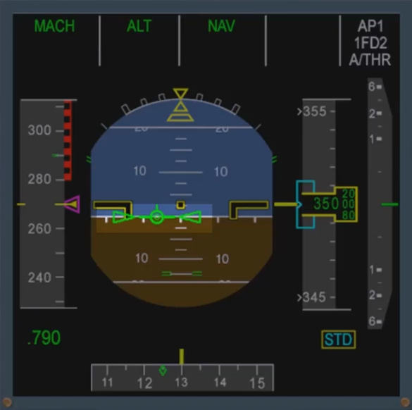

In case FD bars are displayed and the guidance modes are V/S and/or HDG, these modes are automatically changed to TRK/FPA if you select the bird ON. Have a look while we do this for you.

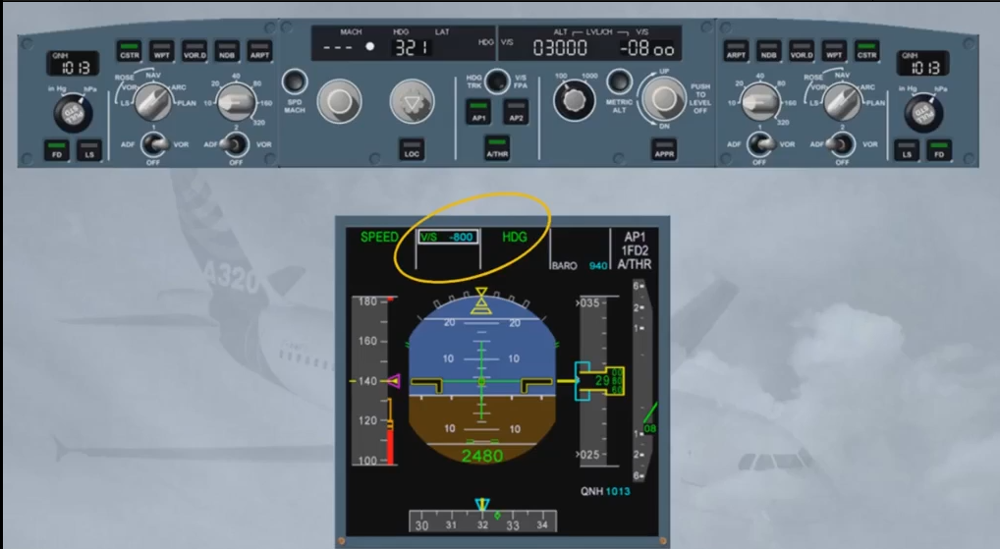

First, check that FPV is displayed. You can see that the mode changes are outlined on the FMA with white boxes.

Notice also that the HDG target has been changed to a properly synchronized TRK target.

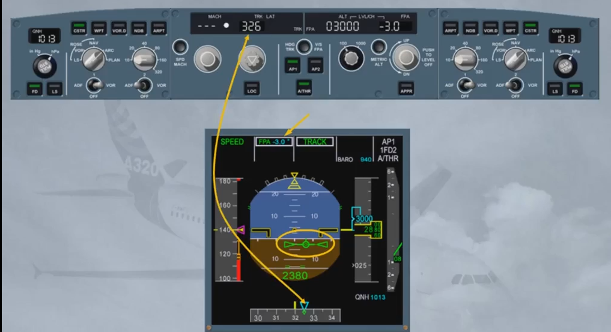

Let's see an example of a manual track change. We will concentrate on the PFD. When flying manually, the objective is to center and align the FPV on the FPD.

We will turn onto a track of 140.

The FPD commands a roll to turn on to the selected track. The aircraft is rolled until the FPV and FPD are aligned. 

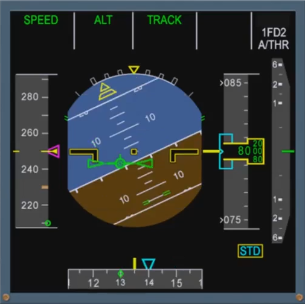

Approaching TRK 140, the FPD demands a roll to level the wings.

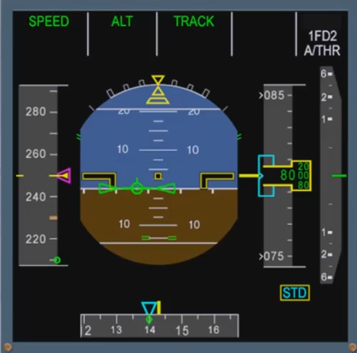

When in TRK/FPA, the FPD reverts to FD bars in case of go around. 

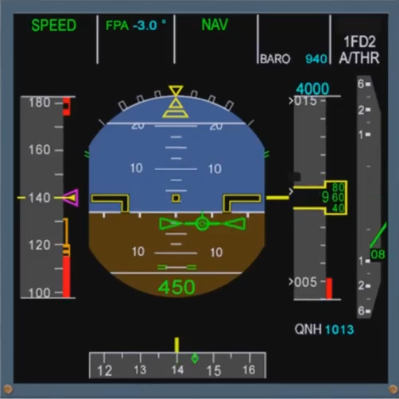

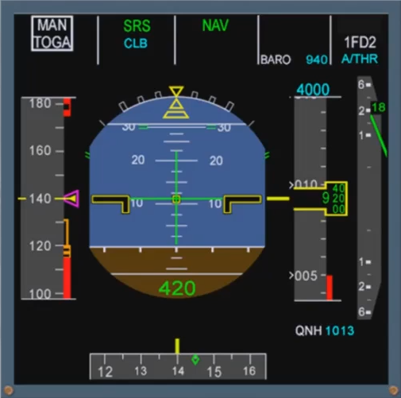

You will practice the use of the FPV and the FPD in the simulator.

***Module completed***

## Video study

- Watch the video available on [YouTube](https://www.youtube.com/watch?v=cUNj9yMqAKs&list=PLKEybvo562LtwmnZOjo8jN7J75vXGqMzq&index=11)