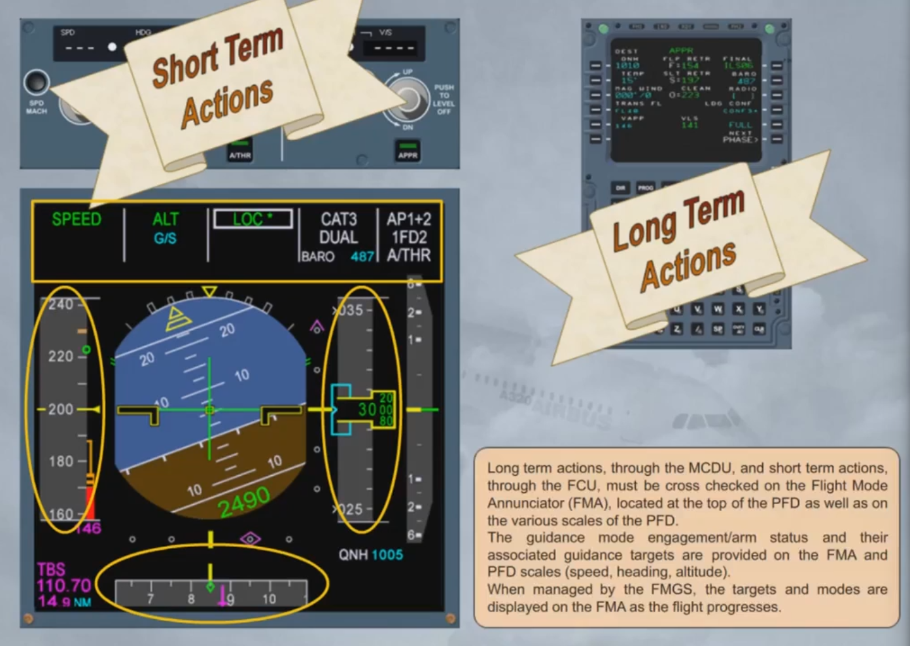
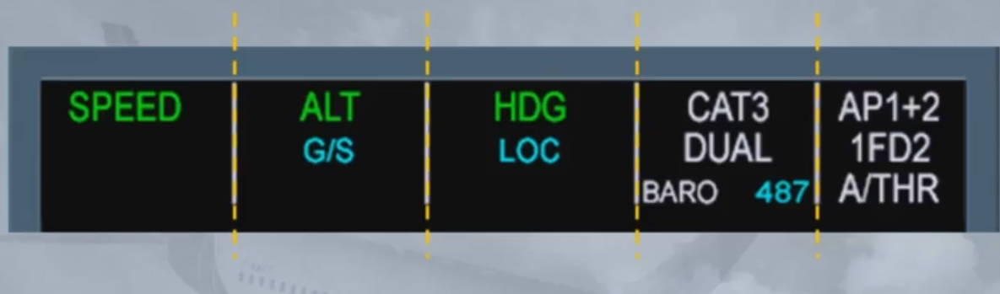
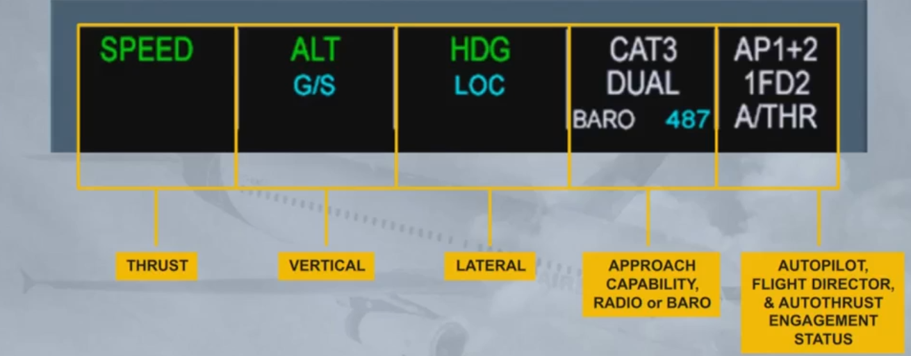
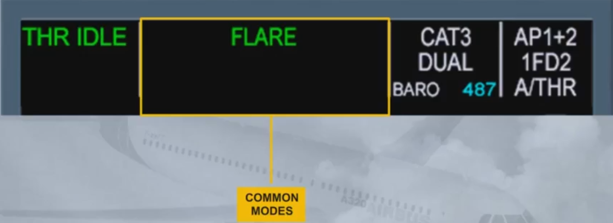
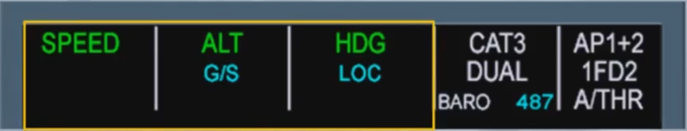
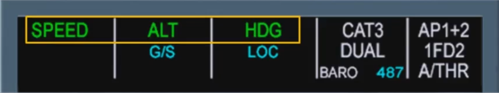
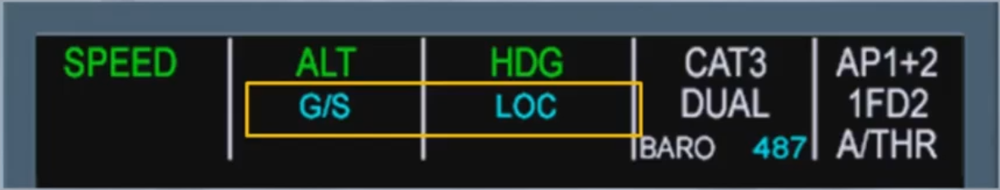
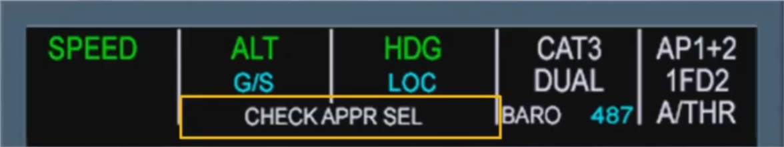
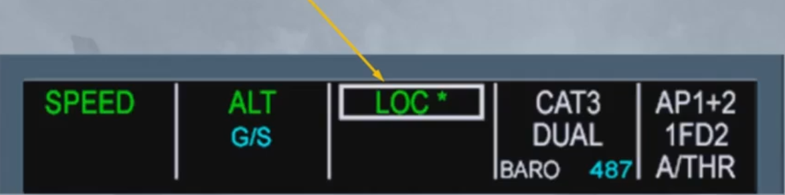
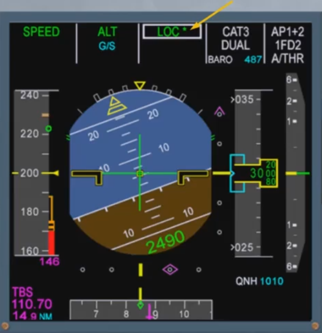

Long term actions, through the MCDU, and short term actions, through the FCU, must be cross checked on the Flight Mode Annunciator (FMA), located at the top of the PFD as well as on the various scales of the PFD.

The guidance mode engagement/arm status and their associated guidance targets are provided on the FMA and PFD scales (speed, heading, altitude).

When managed by the FMGS, the targets and modes are displayed on the FMA as the flight progresses.

Let's discuss the FMA in more detail.

As you can see, the FMA is divided into 5 columns.

- The first column is dedicated to thrust. This is where the autothrust modes appear
- The second one displays the vertical modes of the autopilot and flight directors
- The third one, the lateral modes of the autopilot and flight directors
- The fourth one gives the approach capability of the autoflight system and the RADIO or BARO with the related value, as entered on the MCDU PERF page
- The last column displays the engagement status of the autopilots, flight directors and autothrust systems

In certain cases, the second and third columns are combined to display a single autopilot/FD mode which is common laterally and vertically.

These modes are common modes for approach, which means that they are closely linked together.

You will study all the modes in later modules.

The FMA can display three lines in each column. Let's look at the first three columns.

The first line shows the engaged modes to the flight guidance system:
- In our example, the SPEED mode is engaged for the autothrust. This means that the autothrust will manage the thrust to track the target speed
- The altitude (ALT) mode is engaged for the vertical mode. This means the AP/FDs will provide guidance to maintain altitude
- The heading (HDG) mode is engaged for the lateral mode. This means the AP/FDs will provide guidance to the selected heading

Note: The color coding will be explained later when the concept of managed guidance and selected guidance will be discussed.

The second line shows armed modes for the flight guidance system (column 2 and column 3). In the example shown, G/S and LOC in blue indicate that glide slope and localizer capture modes are armed.

The third line shows reminders or messages and can be spread over one column or two columns. In our example, the column 2 and the column 3 are used for a special message which advises us to check the consistency of selected approach.

Note: For more details, refer to your FCOM.

When any mode changes on the FMA, it is boxed for a few seconds to draw the pilot's attention to this new status.

 In our example the aircraft is intercepting the localizer. The star, after the LOC indication, means that the aircraft is in the capture phase. Once established on the localizer, the indication becomes LOC. 
 
 Notice that the glide slope is still armed.
 
 We will be learning more and more about the FMA in the following modules as we are constantly using it during all autoflight operations.

***Module completed***

## Video study

- Watch the video available on [YouTube](https://www.youtube.com/watch?v=cUNj9yMqAKs&list=PLKEybvo562LtwmnZOjo8jN7J75vXGqMzq&index=10)