Rules regarding FM navigation and flight planning.

Rule 1: crosscheck the FM navigation accuracy.

The FM position accuracy is essential for the proper functioning and validity of all FMS functions. Thus:
- Crosscheck FM position accuracy periodically except when GPS is primary
- Crosscheck it whenever GPS PRIMARY LOST or NAV ACCUR DOWNGRAD messages come up on ND
- Crosscheck it whenever a doubt rises on the validity of the FM position.

Principle: compare the BRG/DIST computed by the FM to a beacon with the BRG/DIST provided by raw data.

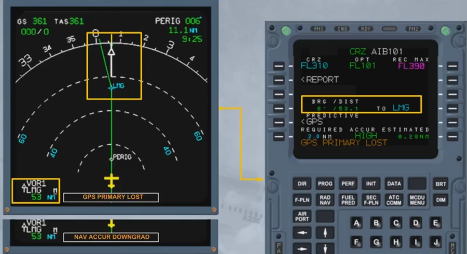

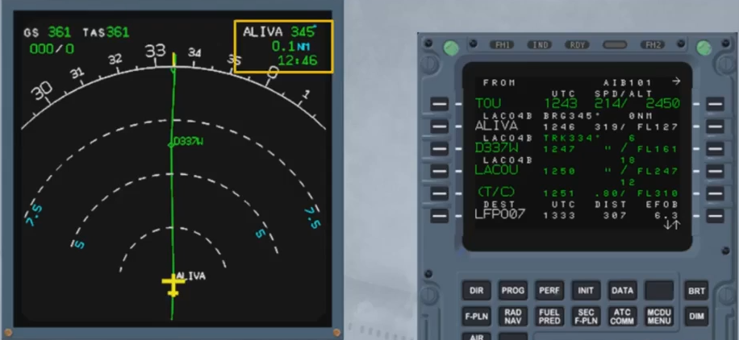

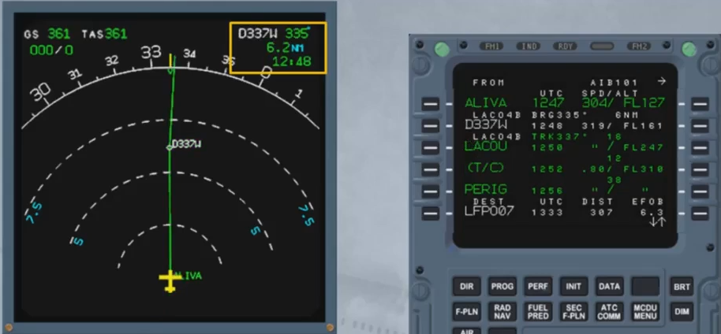

Rule 2: ensure proper sequencing of the F-PLN, thus monitor the TO wpt.

In NAV mode, a TO wpt is sequenced when it is overflown.

In HDG mode, if the cross-track is large, the F-PLN sequencing does not occur which ruins the FM predictions.

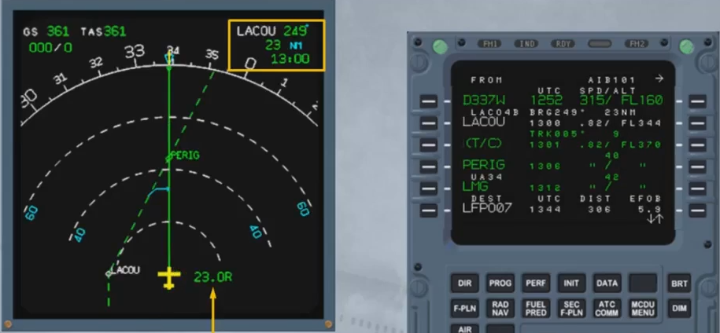

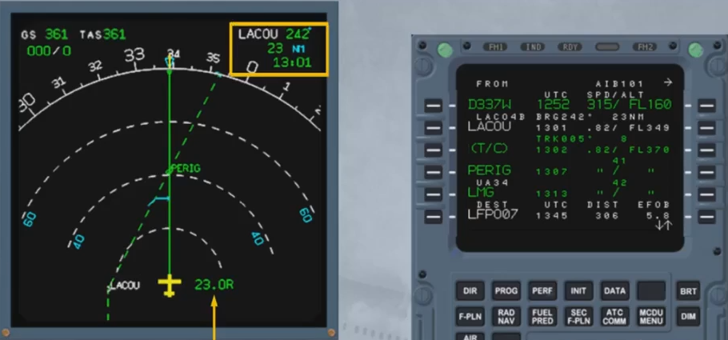

Principle: more specifically in HDG mode, monitor the TO wpt and CLR the undesired TO waypoints (here, LACOU).

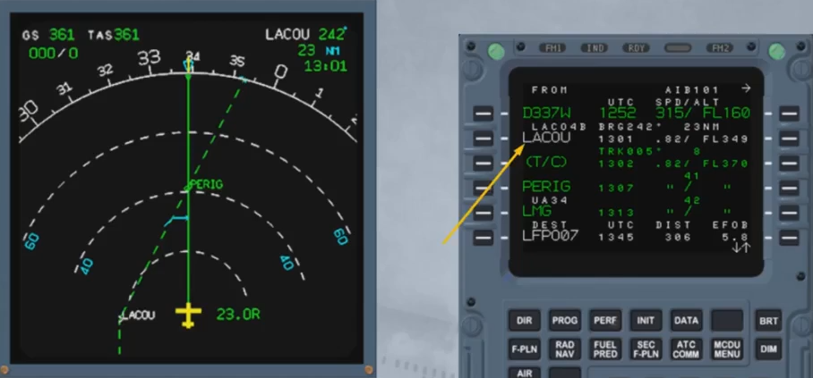

Rule 3: keep a F-PLN discontinuity only when desired, for example when a radar vectoring is expected.

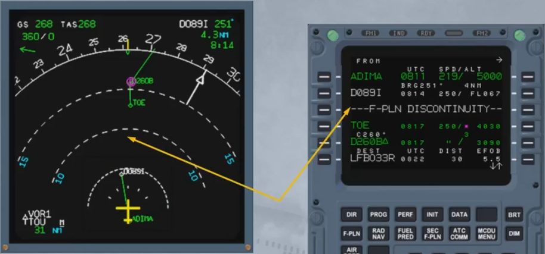

Rule 4: anticipate your actions on the MCDU.

Fly ahead of the aircraft. Whenever useful information is known (ATIS on ground, an alternative clearance is expected or a circling is planned ... ) insert it in the MCDU as soon as time allows it.

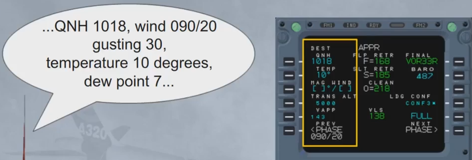

---

Rules regarding predictions.

Rule 1: for predictions on time, speed, altitude and fuel, the FMS assumes that the aircraft flies along the F-PLN in managed NAV, and managed CLB or DES modes.

If selected HDG/TRK, OPEN CLB or V/S modes are used, the FMS assumes an immediate return toward the F-PLN according a realistic trajectory.

Note: V/DEV on the PROG page follows the same assumption.

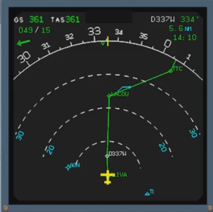

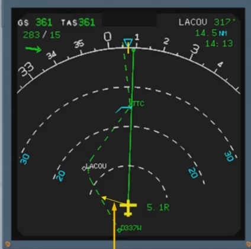

Rule 2: use of vertical deviation.

The vertical deviation is provided in descent as a round symbol (yoyo) and along a V/DEV scale in approach (brick) where 1 dot represents 100 ft.

It represents the vertical deviation between the current altitude and the computed descent or approach path.

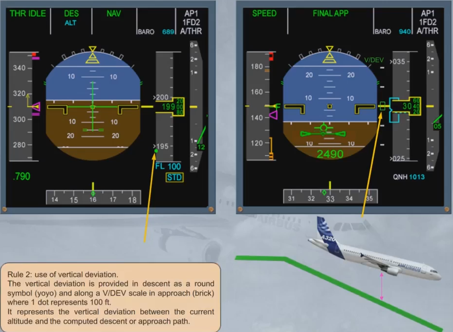

---

Rules regarding the guidance.

Rule 1: managed modes availability.

The managed modes of the FG guide the aircraft along the FMS lateral and vertical F-PLN. The speed target may be either managed (computed by the FMS) or selected by the pilot on the FCU.

CLB and DES modes correspond to a managed trajectory and can not be engaged in HDG or TRK mode.

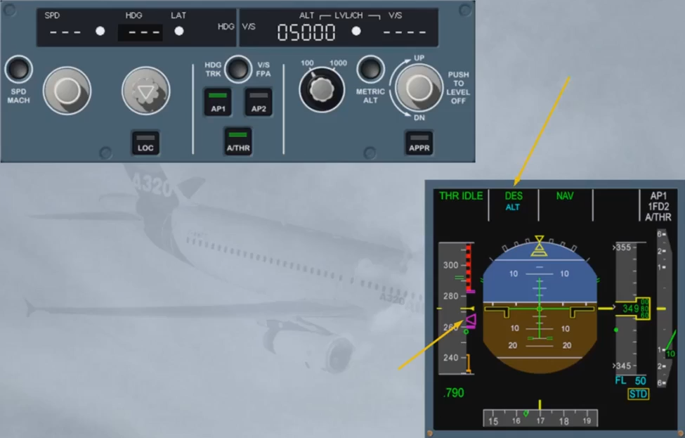

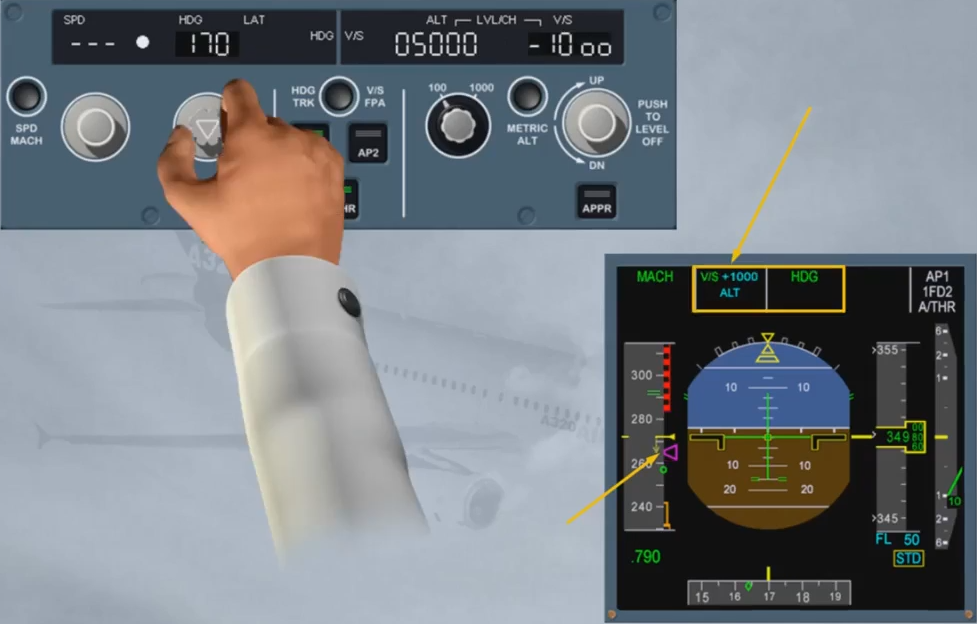

Rule 2: re-engagement of NAV mode.

NAV mode may be armed at anytime when HDG or TRK mode is used for F-PLN interception. The interception can occur only if the track crosses the active leg before the TO waypoint.

Note: NAV mode engages as soon as the aircraft is less than 1 nm from the interception point.

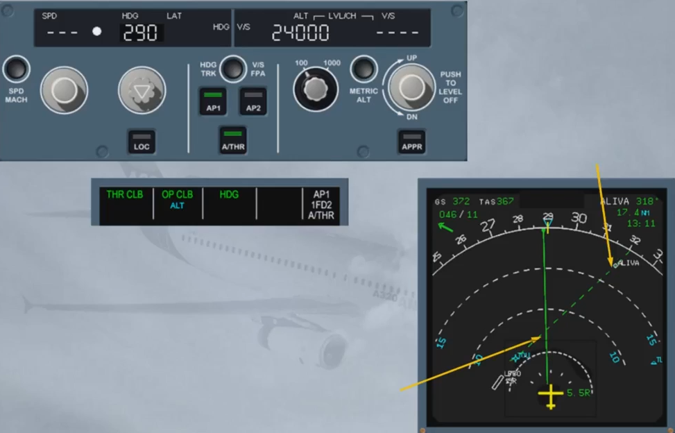

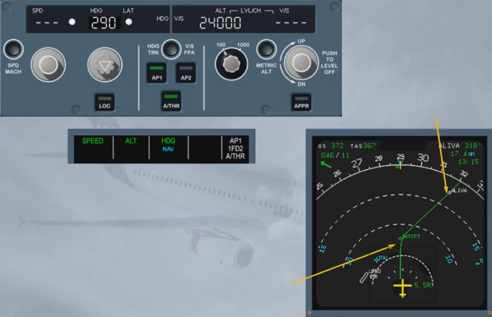

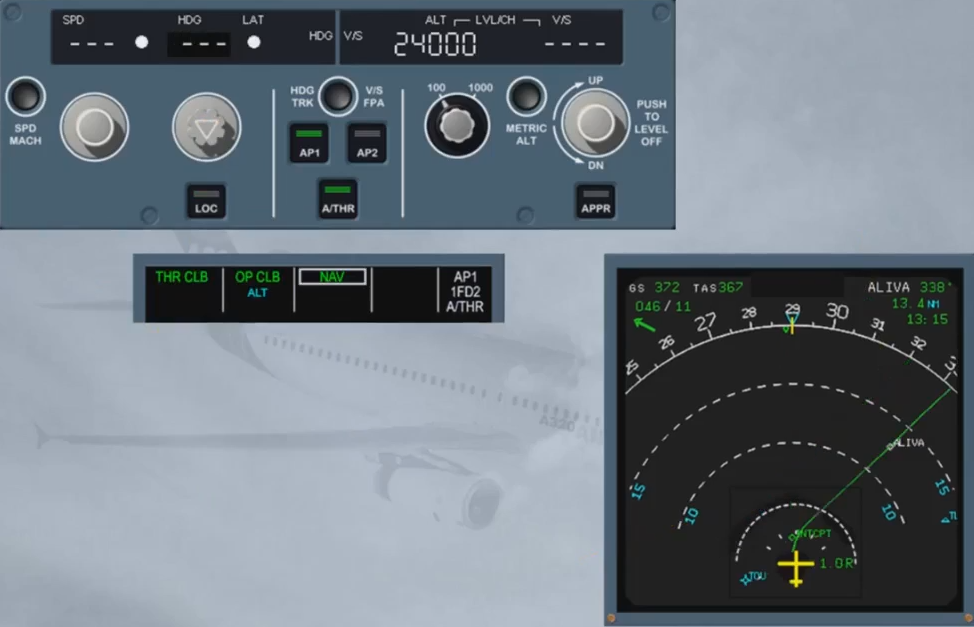

When the track line does not cross the active leg, the interception will not occur.

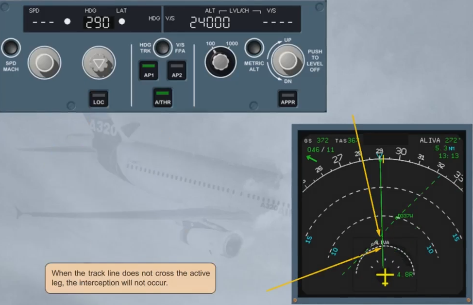

Rules regarding the displays.

Rule 1: ND display mode selection.

The ND ARC and ROSE NAV modes may be used without any restriction if GPS is primary or FM navigation accuracy check is positive.

If the FM accuracy check is negative, raw data has to be displayed on the ND.

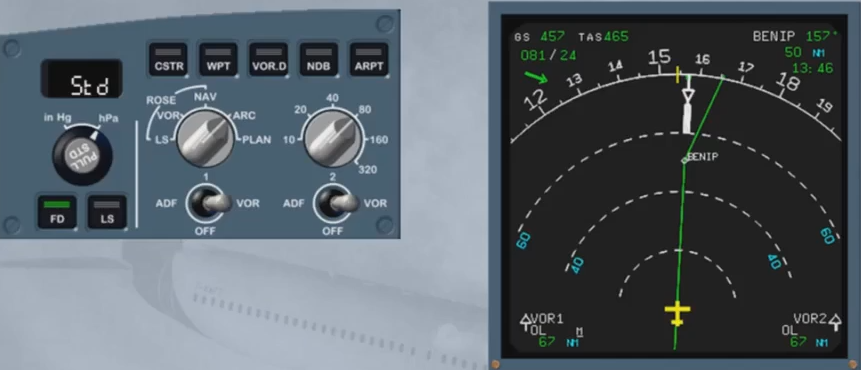

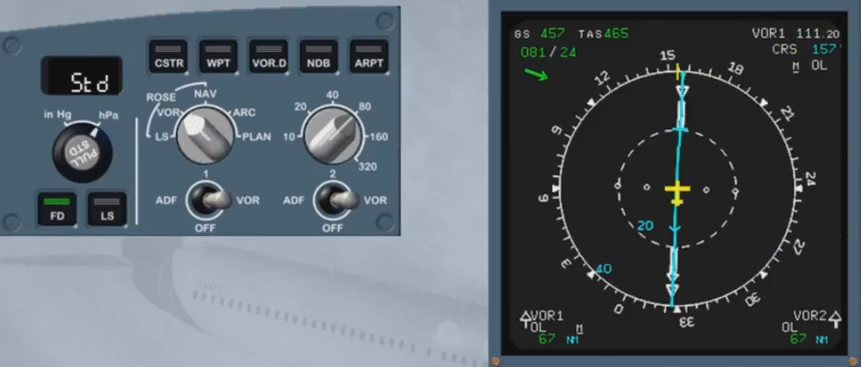

Rule 2: FMS monitoring in managed modes.

When NAV mode is used:
- Monitor PFD FMA for mode status (armed or engaged), and
- Monitor ND for the expected trajectory and crosstrack.

When CLB or DES modes are used:
- Monitor target altitude and target speed
- Monitor VDEV in descent and location of pseudo waypoints on ND.

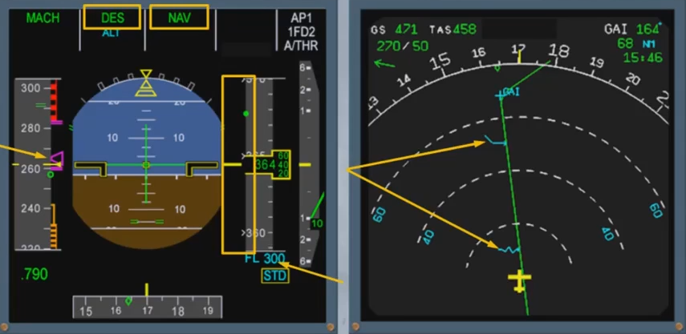

***Module completed***

## Video study

- Watch the video available on [YouTube](https://www.youtube.com/watch?v=cUNj9yMqAKs&list=PLKEybvo562LtwmnZOjo8jN7J75vXGqMzq&index=14)