As soon as the aircraft is electrically powered, the CVR runs automatically for five minutes, then shuts off until first engine start.

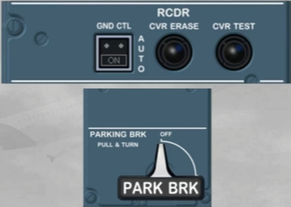

As part of the preflight check, the CVR test is done as follows:
- To make sure the CVR is powered, switch the GND CTL pb to ON
- Make sure that the parking brake is set to ON
- Test the CVR by pressing and holding the CVR TEST pb
- Once a tone is heard, the CVR TEST pb can be released.

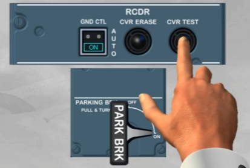

As soon as the first engine runs, the CVR reverts to the AUTO mode.

In this mode, it will operate continuously for the remainder of the flight and will stop five minutes after the last engine shutdown.

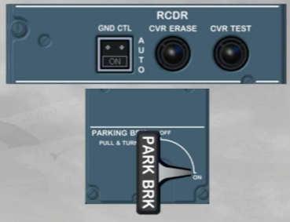

Note: As the version of the installed ACP has no impact on its operation, so we will now use this ACP.

To make a passenger address announcement, two methods are available:
- First, you can press and hold the PA transmission key while speaking into the boomset

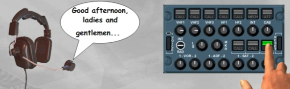

- The second method is to use the cockpit PA handset. Press and hold its PTT switch while speaking into its integral microphone.

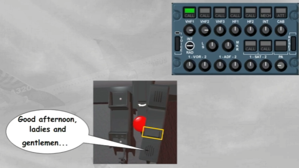

Let's use the RMPs, we will assume that you are the First Officer.

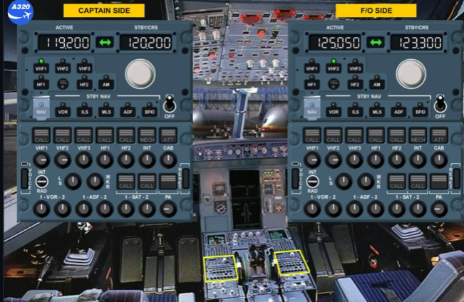

To communicate with ATC, you can tune the VHF 1 radio from the Captain side, but also from the First Officer side.

You can easily do so by selecting VHF 1 on RMP 2.

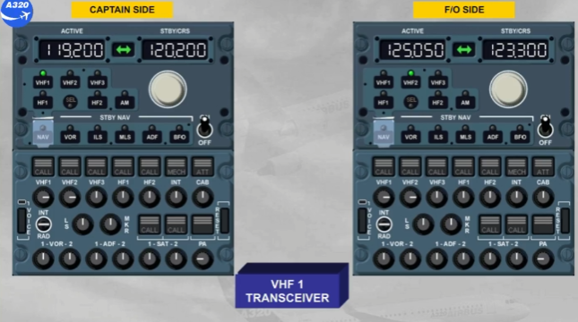

The SEL light comes on, on both RMPs. On RMP 1 to indicate that VHF 1 is selected on another RMP, and on RMP 2 because VHF 1 is not its dedicated radio.

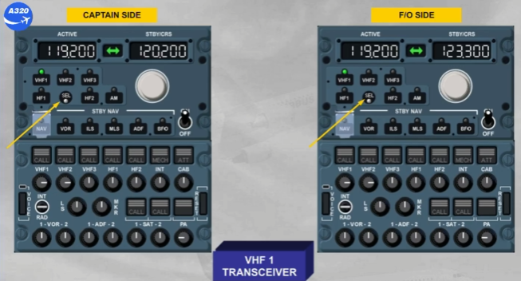

Note: Depending on the version of the installed RMP, the SEL light can be WHITE, or as now AMBER.

Now, you can tune the desired frequency in the standby window on RMP 2.

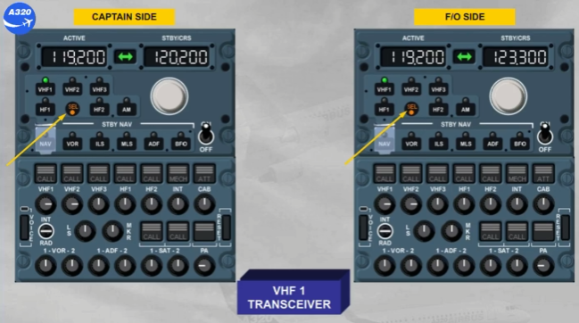

Select the standby frequency 126.00

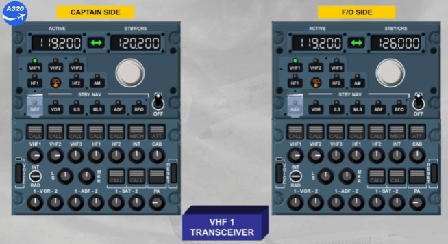

Transfer the standby frequency to the active window.

Observe that the active frequency changed on both RMPs.

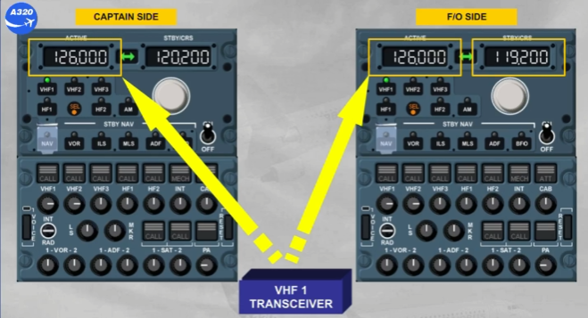

However the standby frequency on RMP 1 is unchanged, but the previous active frequency is displayed in the standby window of RMP 2.

This enables either pilot:
- To change the active frequency on any radio
- Not change the standby frequency of the other pilot.

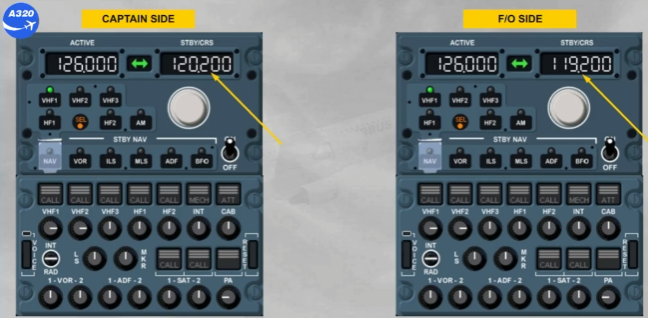

Extinguish the SEL light.

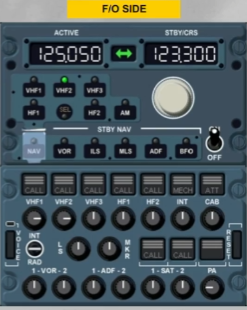

Now, let's use the ACP to establish the communication:
- The VHF 1 reception pb is released, and comes on white
- The volume is adjusted
- VHF1 transmission key is selected.

You are now ready for transmission and reception on VHF 1.

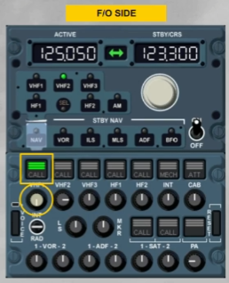

To transmit on VHF 1, you can use:
- The INT/RAD switch held in RAD position, or
- The side-stick PTT switch, or
- The hand mike PTT.

You can now continue with the cockpit preparation.

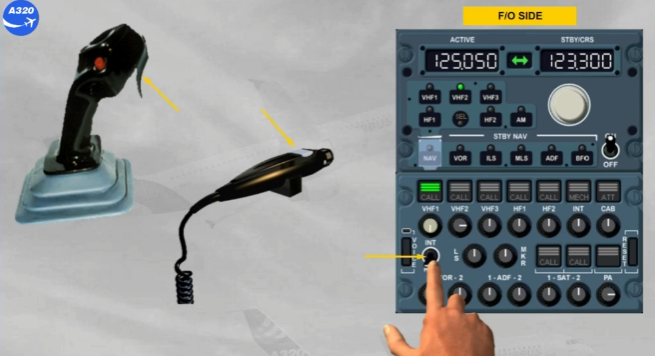

So that the intercom is always available, the interphone reception knob should be released out and volume adjusted.

We have done this for you.

Let's now look at a call indication from the ground crew mechanic.

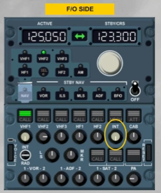

You hear a buzzer and notice the amber MECH light flashing on all the ACPs.

The MECH light is automatically cancelled after 60 seconds or when the RESET pb is pressed, on any ACP.

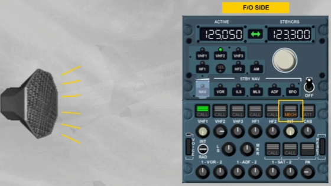

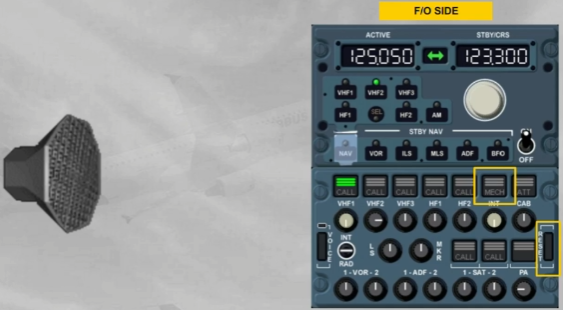

To talk with the ground mechanic, you have two possibilities:
- Select the INT position on the INT/RAD switch, or

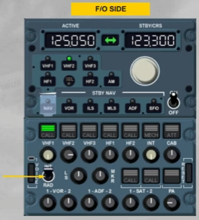

- Press the INT transmission key, then talk using a PTT sw.

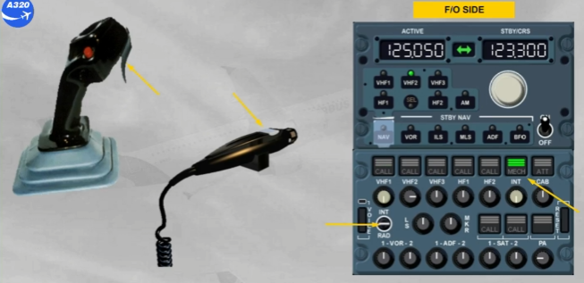

The INT position gives a hot mike to talk to the other pilot and to the ground mechanic. Communication is made via the boomset without any other selection.

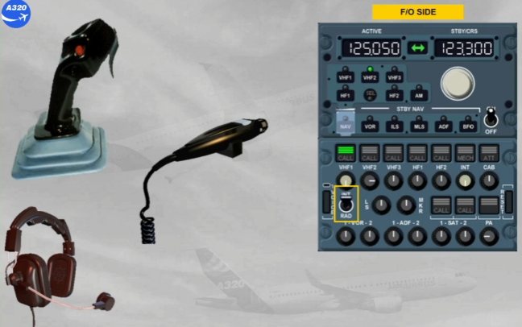

Although we have not left the ground yet, the operations in flight are identical.

You have completed the operation module.

***Module completed***