The communications system enables the crew to talk to other stations through VHF and HF radios.

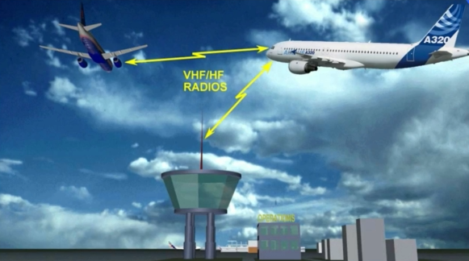

It also enables communication with a ground mechanic.

There are two communication systems from the cockpit to the cabin:
- The Passenger Address (PA) system for passenger announcements
- The cabin interphone system to talk to a cabin attendant.

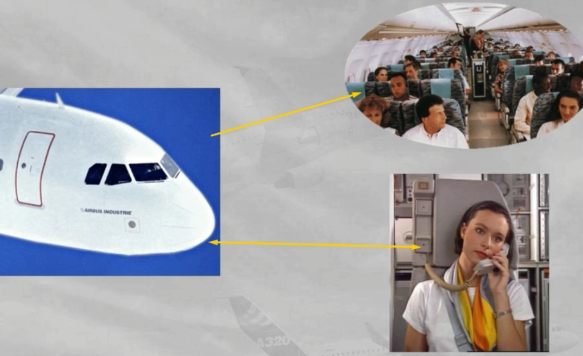

In addition, there is a call system which enables:
- The cockpit to call the ground mechanic and the cabin crew
- The ground mechanic or the cabin crew to call the cockpit.

The Cockpit Voice Recorder (CVR) is also included in the communications system.

Note: The evacuation command system, which is also part of the communication system, will be discussed in the cabin presentation.

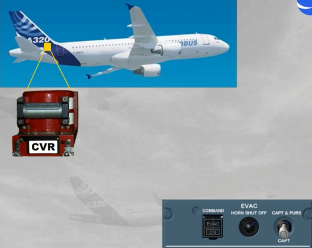

Control of all radio communications is achieved through Radio Management Panels (RMPs) and Audio Control Panels (ACPs).

Let's start with the RMPs.

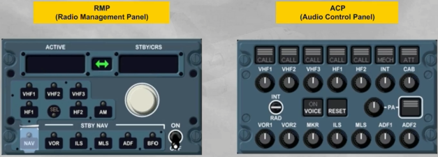

There are two RMPs located on the center pedestal and an optional third one on the overhead panel.

They are used to tune all radios.

Note: RMP 1 and 2 can also be used as backup for nav aid tuning, in case of failure of both FMGCs (see ATA 34 navigation chapter).

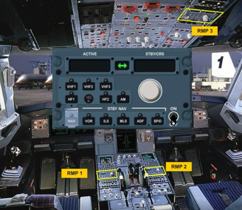

We will now look at the different controls and indications of the RMP:
- The ON/OFF switch controls the power supply
- The radio selection keys enable the pilot to select a communication radio ...

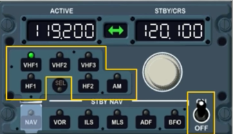

- The ACTIVE window displays the active frequency of the selected radio
- The standby (STBY) window displays the standby frequency ...

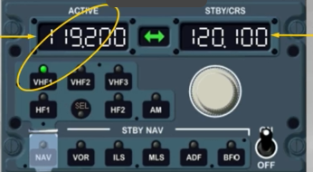

- The dual rotary knob enables the pilot to change the STBY frequency:
    - The outer knob for the megahertz
    - The inner knob for the decimals.
- The transfer key exchanges the STBY and ACTIVE frequencies.

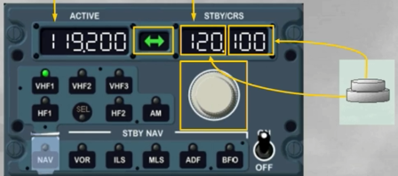

The standby navigation (STBY NAV) keys provide backup navigation tuning in the event of dual FMGS failure.

These keys will be discussed in the navigation chapter.

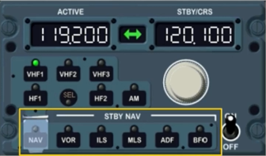

On the A320, any RMP can tune any communication radio but each one is normally dedicated to a particular radio:
- RMP 1 to VHF 1
- RMP 2 to VHF 2
- RMP 3 to VHF 3 or HF 1 or HF 2.

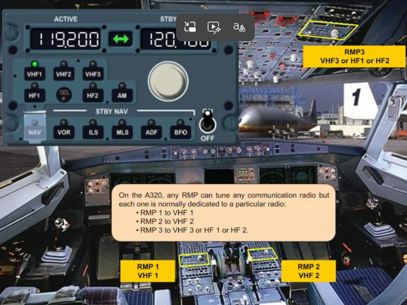

The SEL light comes on when a pilot selects a radio on an RMP which is not dedicated to that RMP.

Note: The SEL light comes on also on the radio dedicated RMP to confirm that the related radio is selected on another RMP.

This will be explained in more detail in the operation module.

Note: Also, depending on the version of the installed RMP, the SEL light can be WHITE, or as now AMBER.

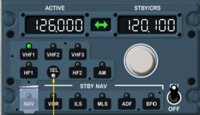

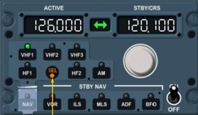

Depending on the RMP version, a LOAD key can be added as an option.

This will be explained in more detail in the FANS course.

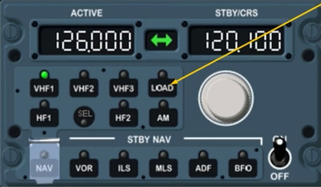

Depending on the version, two ATC MSG lights and two Data Communication Display Units (DCDU) can be installed to ease the flight crew in ATC data link communications.

This will be explained in more detail in the FANS course.

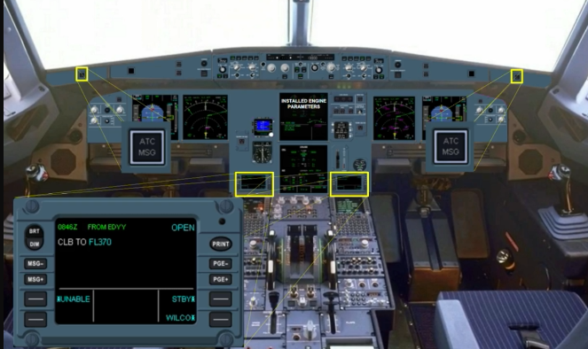

As we have seen, the RMPs tune the desired radio frequencies.

Let's now look at the ACPs which provide control of radio transmission and reception.

There are three ACPs, each located next to an RMP:
- Two on the center pedestal
- A third one on the overhead panel.

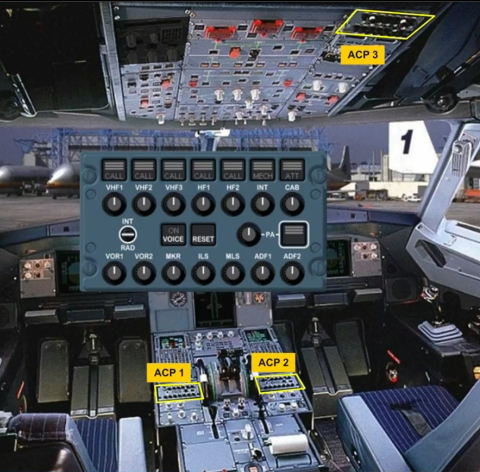

Let's look at the different controls of the ACP, that can differ, depending on the version of the installed ACP.

The transmission keys enable you to select any radio or interphone system.

A green light is on, on the selected key.

Only one transmission key can be selected at a time.

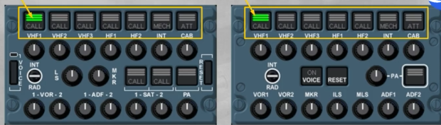

The CALL light flashes amber with a buzzer when the SELCAL system detects a call on the applicable VHF or HF.

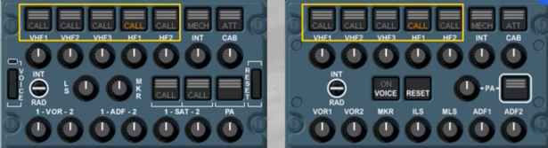

The MECH light flashes amber with a buzzer when a call is initiated by the ground mechanic.

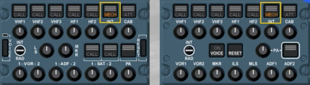

The ATT light flashes amber with a buzzer when a call is initiated from any flight attendant station through the cabin interphone system.

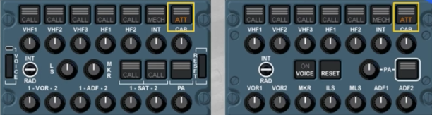

The RESET key stops any buzzer and extinguishes the flashing amber light related to any of these calls.

 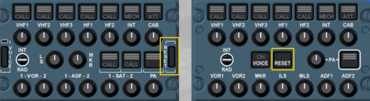

Only on this associated installed ACP, the SAT CALL light flashes amber, when the SATCOM system detects a call. The three green lines will flash during the establishment of air to ground calls or when SATCOM calls are on hold. After call establishment, the three green lines remain steady.

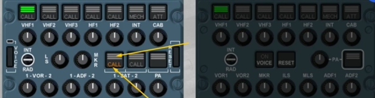

The reception knobs enable the pilot to select and adjust the volume of the following systems:
- Communication radios
- Navigation aids
- The interphone
- The PA.

When released out, the respective radio or interphone is selected, the knob illuminates white and by rotating it, you can adjust the volume.

Any number of selections can be made simultaneously.

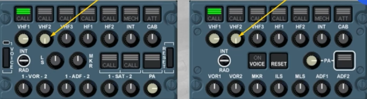

Any selected radio and/or interphone can be heard through loudspeakers.

Each loudspeaker has its own separate volume control.

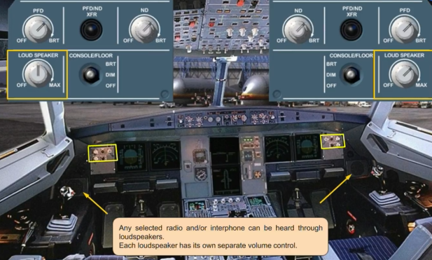

The INTerphone/RADio (INT/RAD) switch is a three position switch. When in the INT position, the switch operates as a hot mike on either the boomsets or the oxygen masks. This position enables communication between cockpit crew members, or between cockpit and a ground mechanic without PTT key action.

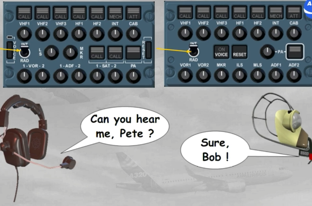

When the switch is held in the RAD position, it operates as a Press To Talk (PTT) on the selected transmission channel using the boomset or oxygen mask.

The side stick PTT switch has the same function as the RAD position on the INT/RAD switch.

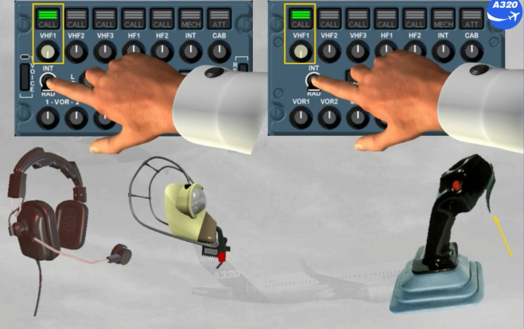

The VOICE key suppresses a navaid ident signal to get clearer the reception of voice messages.

For example, ATIS transmission on a VOR frequency.

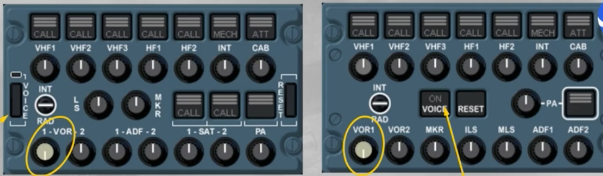

The Passenger Address transmission key (PA), when pressed and held, enables cabin announcements to be made from the cockpit through the boomset, the oxygen mask or the hand mike.

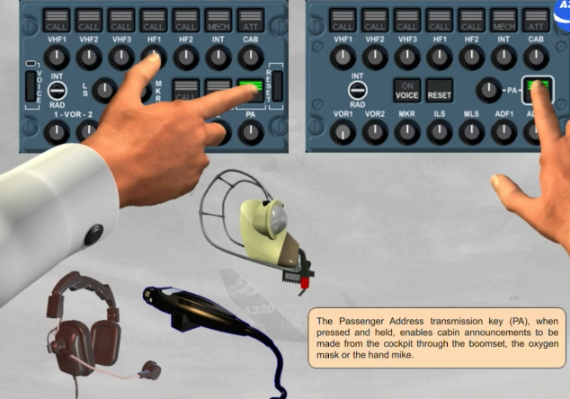

PA announcements may also be made using the cockpit handset.

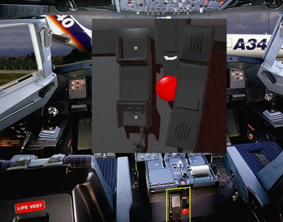

The CALLS panel enables the cockpit crew to call a ground mechanic or the cabin crew.

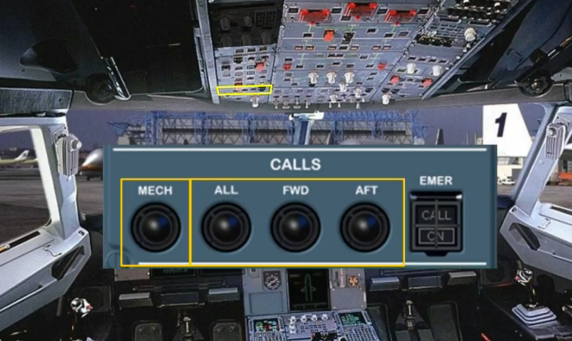

The Cockpit Voice Recorder (CVR) is used to record all the communications and aural warnings in the cockpit. Only the last two hours of the recording are retained.

The CVR is controlled through the RCDR panel.

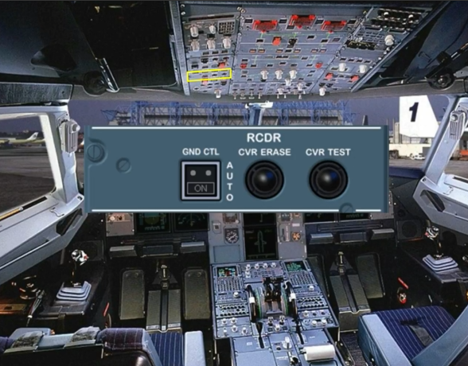

Let's now review some failure cases.

On an RMP switched on, a blank display with no lights on indicate an RMP failure. There is no ECAM caution for this abnormal operation.

You have to switch off this RMP and tune the radios with other RMPs.

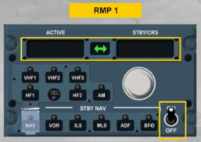

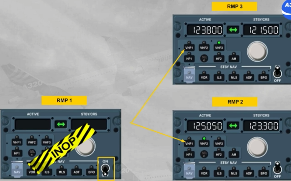

Let's study an example of an ACP failure.

Note: As the version of the installed ACP has no impact, so we will use this ACP for all next examples.

In case of an ACP inoperative, you can recover audio control through the ACP 3.

To do this, you have to select the CAPT 3 position, if ACP 1 has failed or the F/O 3 position if ACP 2 has failed, by using the AUDIO SWITCHING selector located on the overhead panel.

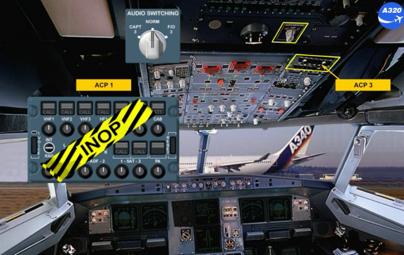

This selection allows the captain to use his acoustic equipment with the selection that he will do on the ACP3.

Note: AUDIO 3 XFRD memo appears to indicate that an audio switching selection has been made.

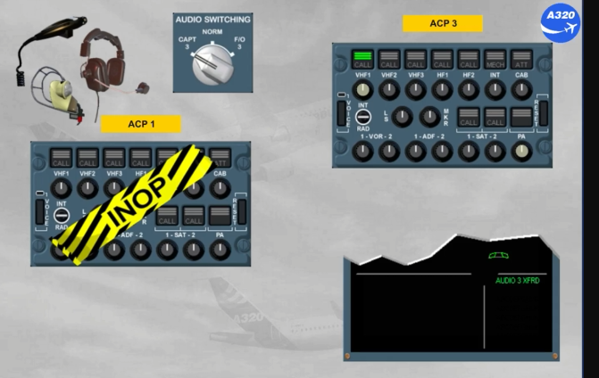

***Module completed***