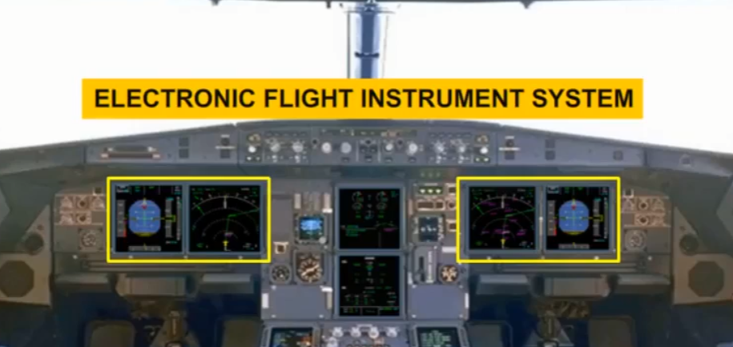
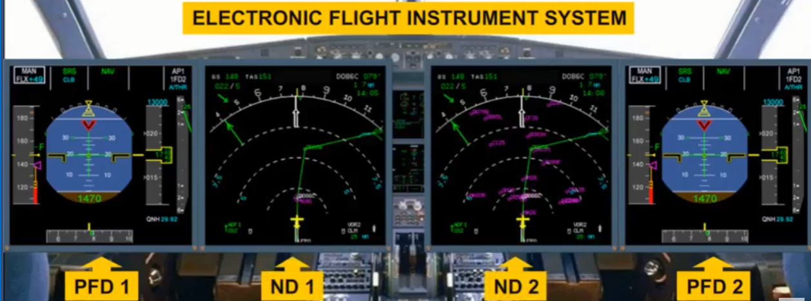
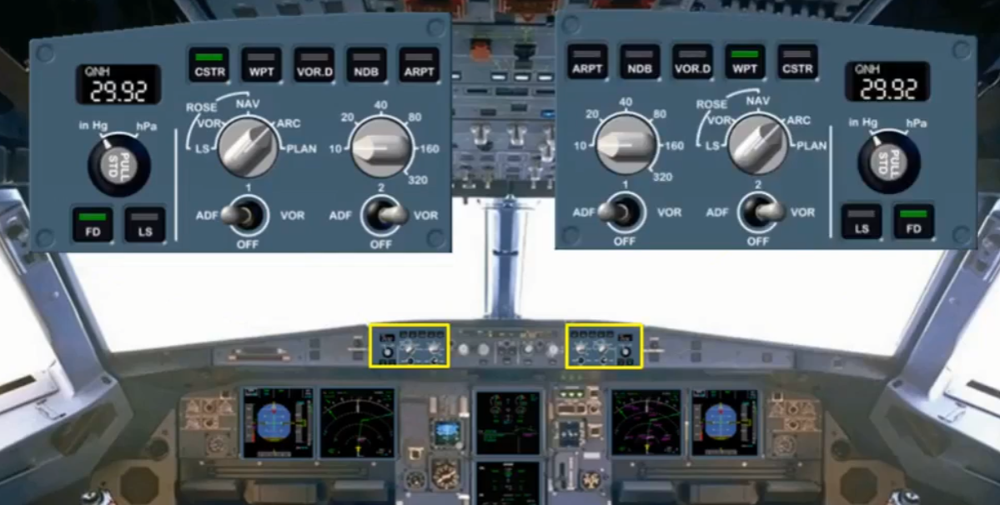
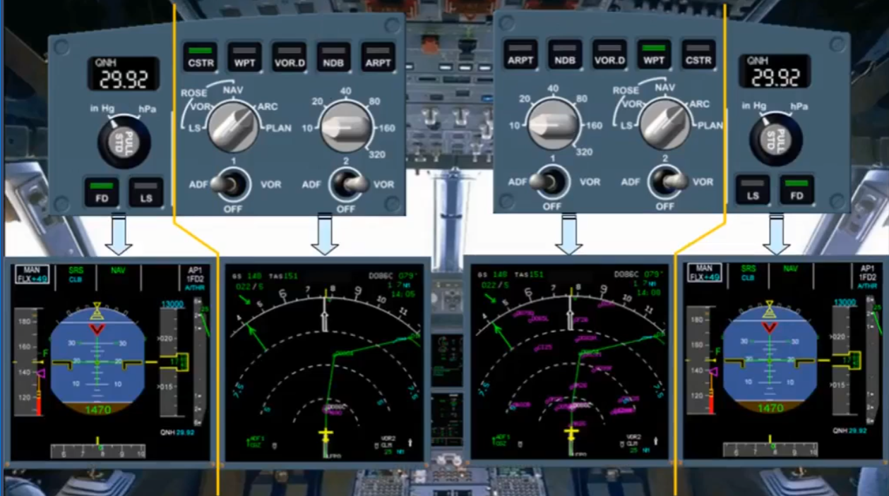
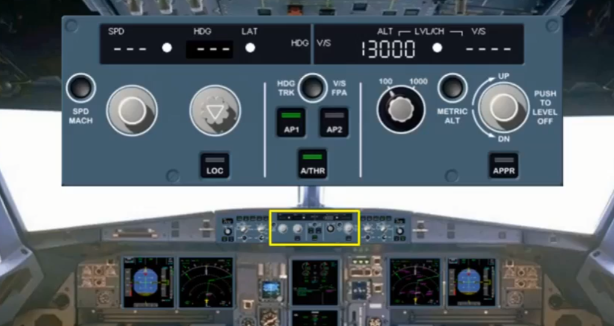
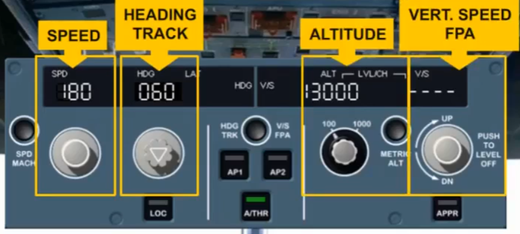
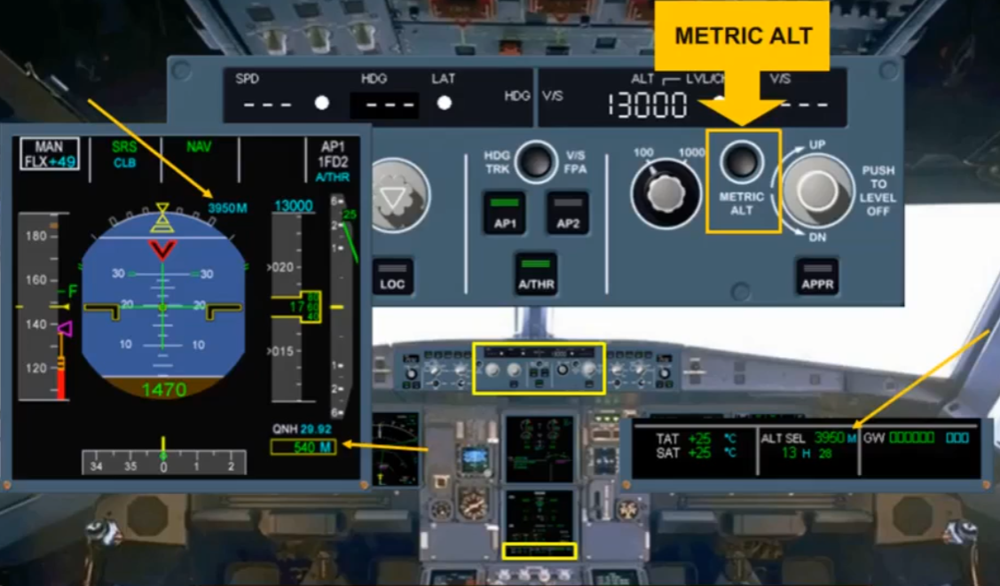
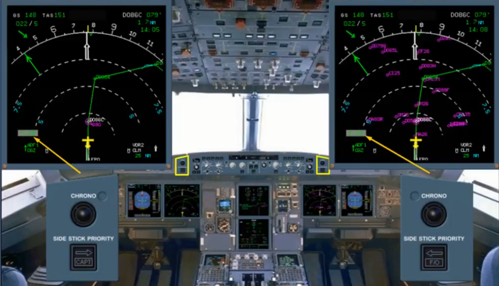

The four Electronic Flight Instruments System (EFIS) displays provide the pilots with flight data to help them operate the aircraft in a safe and efficient way.

Flight parameters are displayed on Primary Flight Displays (PFD) while navigation data is displayed on Navigation Displays (ND).

Each pilot has an EFIS control panel to select what is displayed on the EFIS screens.

The EFIS control panels are divided into two sections, one section associated with the PFD andthe other with the ND.

The Flight Control Unit (FCU) is located in the middle of the glareshield. The FCU is one of the interface units between the pilots and the autoflight system.

The full use of the FCU will be covered in the autoflight modules.

There are selectors on the FCU which will affect the indications seen on the PFD and ND, and it is only these selectors that will be discussed in the EFIS modules.

The selectors, with associated indications, are provided for:
- Speed
- Heading/track
- Altitude
- Vertical speed / flight path angle (FPA).

The METRIC ALT pb is also part of the altitude area.
This pb is used to display:
- The selected altitude, in meters, on the permanent data part of the SD
- As an option, the selected and actual altitudes, in meters, on the PFDs

You will see how all these selectors affect the EFIS displays in the modules that follow.

The two CHRONO pushbuttons located on the glareshield, control the associated chronometer display on the NDs.

The pushbuttons operate like a normal stopwatch.

In this module, we have introduced you to the Electronic Flight Instrument System. In the next modules, we will look at the PFD and the ND in greater detail.

***Module completed***

## Video study

- Watch the video available on [YouTube](https://www.youtube.com/watch?v=Orb9j5fFp18&list=PLKEybvo562LtwmnZOjo8jN7J75vXGqMzq&index=2)