The ECAM shows normal and abnormal system information to the pilots, thanks to the Upper Display Unit normally dedicated to the Engine/Warning Display (E/WD) and the Lower Display Unit normally dedicated to the System Display (SD).

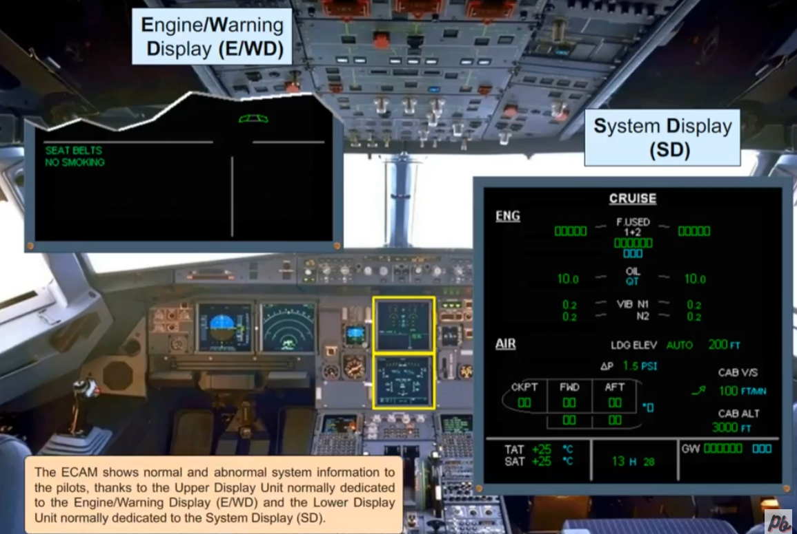

---
## ECAM Color Coding

Color coding is used on the ECAM screens for clarity and to help to identify of abnormal parameters. 

The main colors used are:
- White
- Blue
- Green
- Amber
- Red.

During the course, you will become familiar with the use of this
color coding.

Let's start with the last 3, green, amber, and red, which are the
most important.

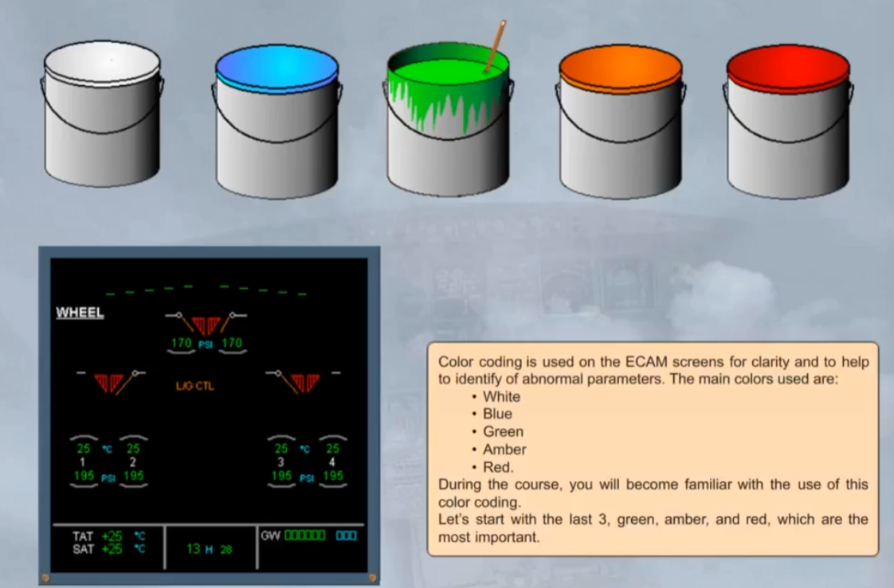

Green color coding is used to indicate a normal condition. Notice that on the E/WD and the SD shown, all indications are normal.

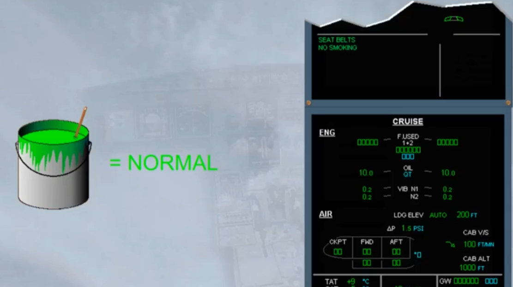

Amber color coding is used for abnormal indications that require crew awareness, but not immediate crew action. Notice on the E/WD, the amber failure message with a blue action line and on the SD the amber indications.

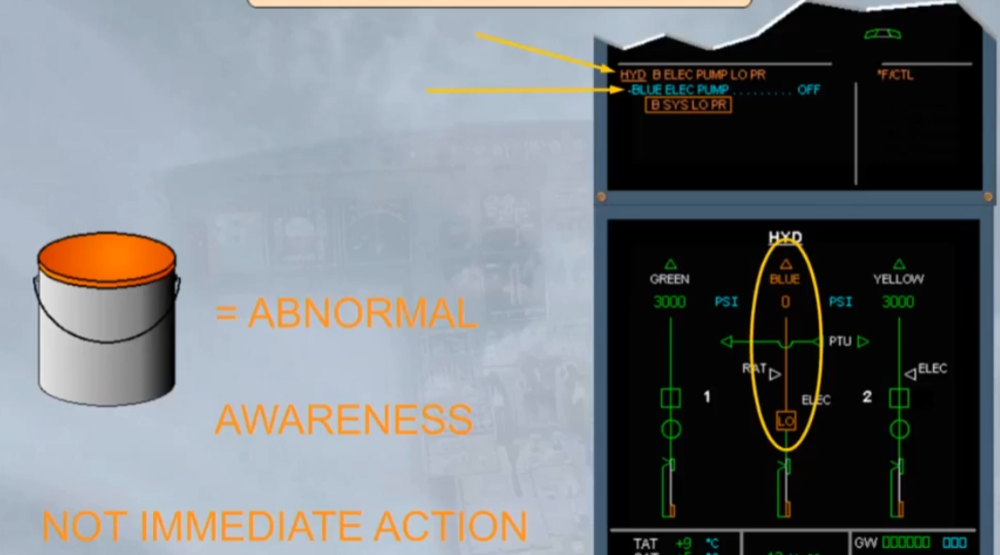

Red color coding is used for serious parameter exceedance and warnings that require immediate crew action. Notice the red warning message on the E/WD.

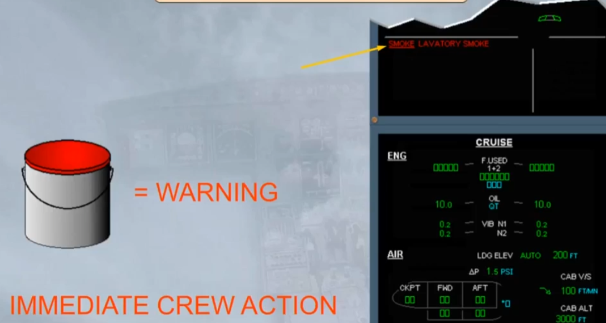

Let's now look at the two ECAM displays in a little more detail.

---
## E/WD

The E/WD is divided into two main parts:
- The upper area
- The lower area.

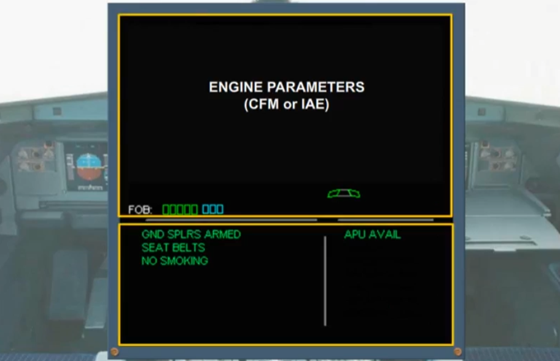

The upper area is used for the main engine parameters, Fuel On Board (FOB), and slat/flap position indications. They will be discussed in the appropriate system modules.

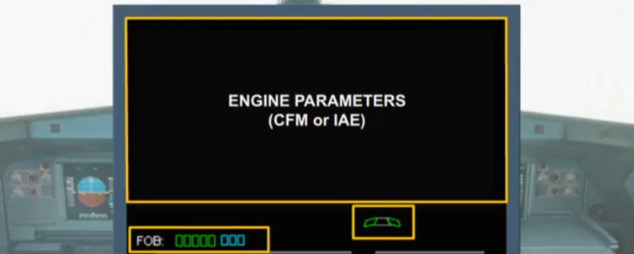

Under normal conditions, the lower part of the E/WD is used to display memos. There are two columns, the left for long memos and the right for short memos. In the example shown the memos indicate that the Ground Spoilers lever is in the ARM position, the seat belt and no smoking signs are switched ON and the APU is available for use.

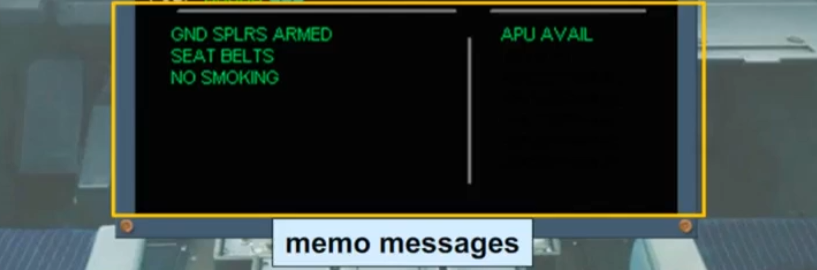

If failures occur, warning/caution messages are displayed in place of the left memos. In the example shown there is an amber caution message with a series of blue action items. These action items are your electronic procedure to follow in order to respond to the particular abnormal situation.

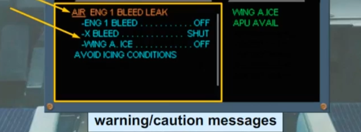

---

## SD

The SD is used to display particular system information. In the example shown the cruise page is displayed. This is the page normally seen most of the time when the aircraft is airborne. The useful Information from several systems is displayed, during the flight.

The individual indications will be covered in the appropriate system modules.

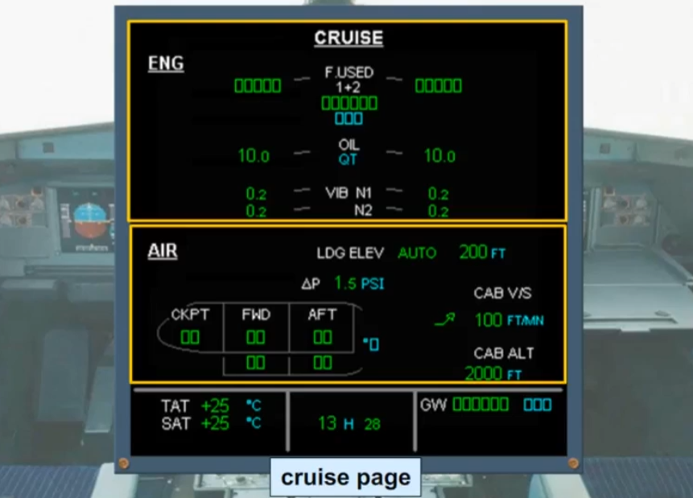

The SD can also be used to display synoptic diagrams of the aircraft systems. In the
example shown the hydraulics system page has been called.

You will see later how these system pages are called either manually or automatically.

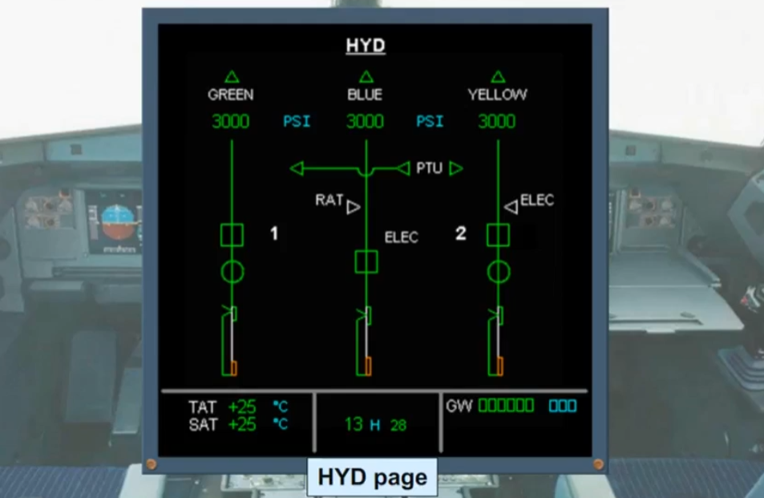

An aircraft STATUS page may be displayed on the SD to check the state ofthe aircraft. A NORMAL message is displayed to indicate that the aircraft state is normal and that there are no inoperative systems.

Let's see what the STATUS page looks like when things are not normal, for example, following a system failure.

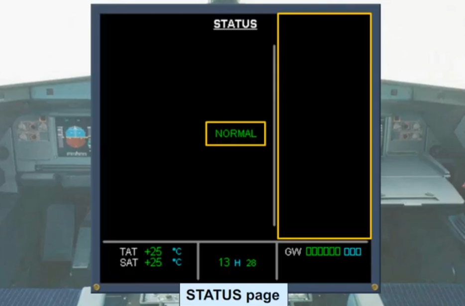

The information displayed on the STATUS page will vary depending on the failure. For example, it can include:
- Limitations Information
- Approach procedures and deferred procedures
- Inoperative systems.

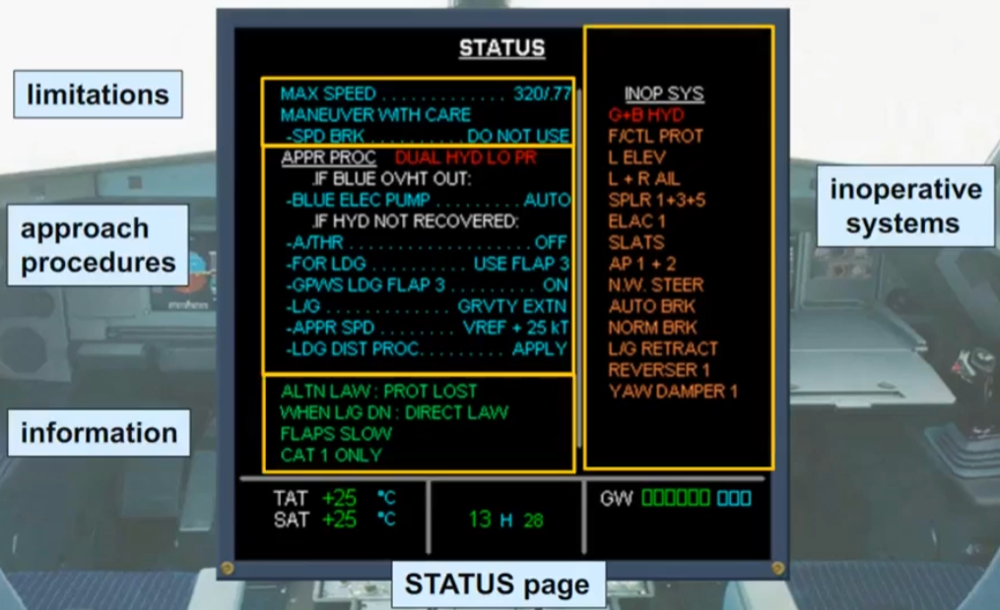

The area at the bottom of any SD contains permanent data:
- Total Air Temperature (TAT)
- Static Air Temperature (SAT)
- Delta ISA (displayed only in flight, in STD baro reference mode)
- Time and
- Gross Weight (GW).

Note: A G LOAD factor indication wil be displayed above the time indication if t has exceeded a G limit after engine take off application.

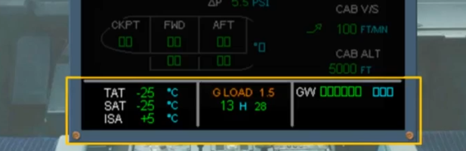

Under normal conditions the ECAM system provides the pilots with the information that they "need to know" for the particular phase of flight, no more no less. As an example during approach, when the landing gear is extended, the ECAM WHEEL system page is automatically displayed.

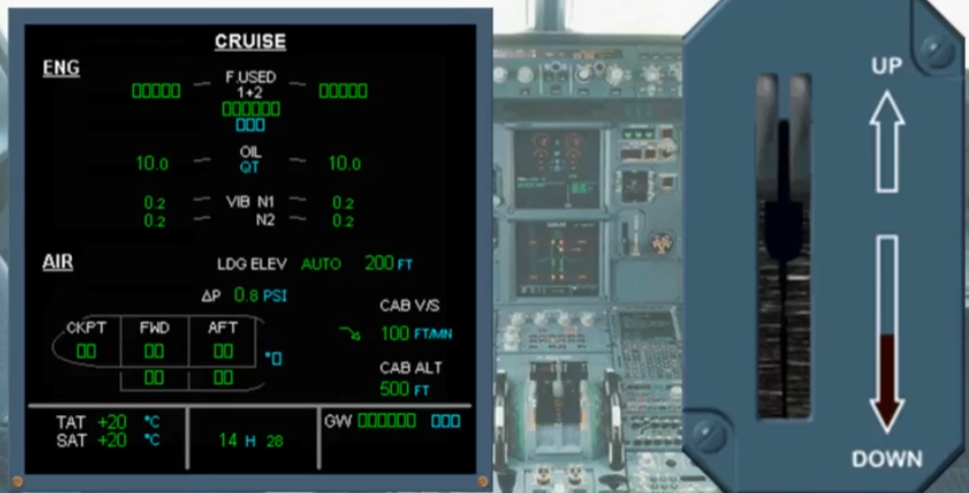

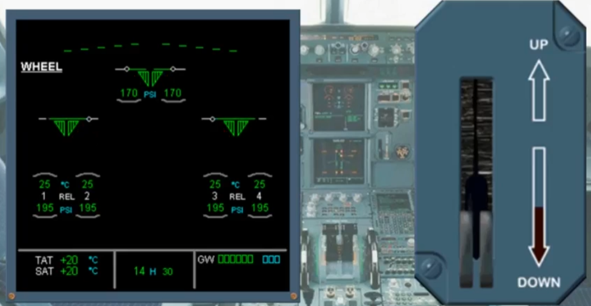

The ECAM system divides the various stages of a flight into phases, from initial electrical power up until after engine shutdown. The ECAM system will avoid alerting the pilots unnecessarily during the critical flight phases of take off and landing. So, the cautions, that can be delayed until a less critical phase of flight, will be inhibited.

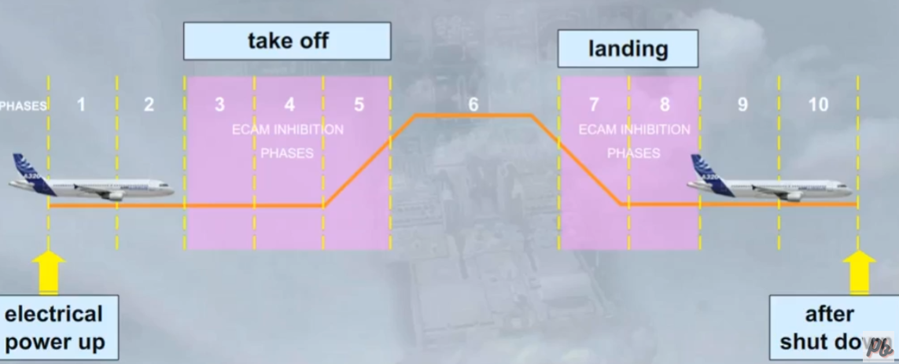

We will now look at the different ways that the ECAM system advises you when things are not going exactly right. We will startwith a minor advice indication and work up to a major fault,concentrating on the two ECAM screens.

If a system parameter, for example an engine vibration level,approaches a limit, the ECAM system will advise you of this by displaying, automatically, the relevant system page on the SD. On this system page the affected parameter will pulse. Notice that at this stage, the parameter is still shown in green since it is still within normal limits. This is known as an ECAM advisory and you should refer to the QRH in order to find the related recommended action to do. Now let's look at what happens when ECAM detects a minor system failure.
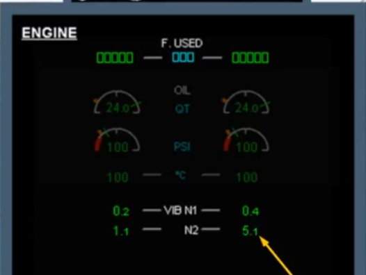

When a failure occurs, leading to a loss of redundancy or loss of a system that does not affect the safety of the flight, for example DFDR FAULT, the ECAM system will inform you by displaying an amber caution message on the E/WD. This type of failure is
classified "LEVEL 1".
At the same time the two clear keys on the ECAM Control Panel (ECP) will come on.

Note: On the SD, the CRUISE page is still displayed because there is no system page related to this caution message.

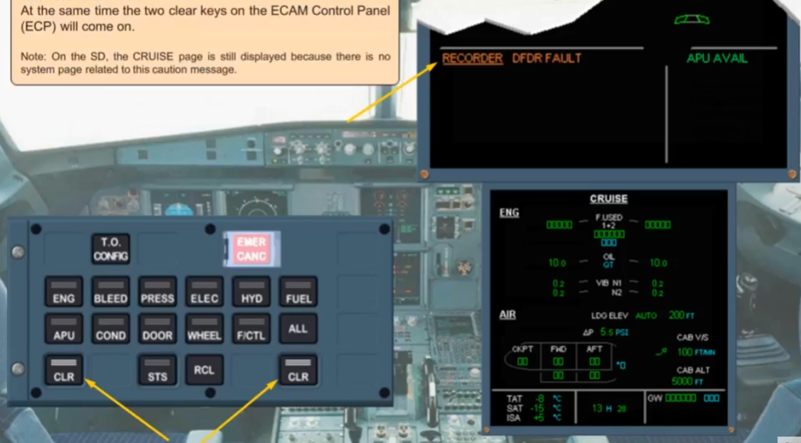

In this case, there are no actions required. So, only after confirmation from the PF, this caution message can be cleared by pressing one of the clear keys on the ECP. So, as PNF you will ask for "CLEAR RECORDER?" but you will do it only if the PF says "CLEAR RECORDER.'

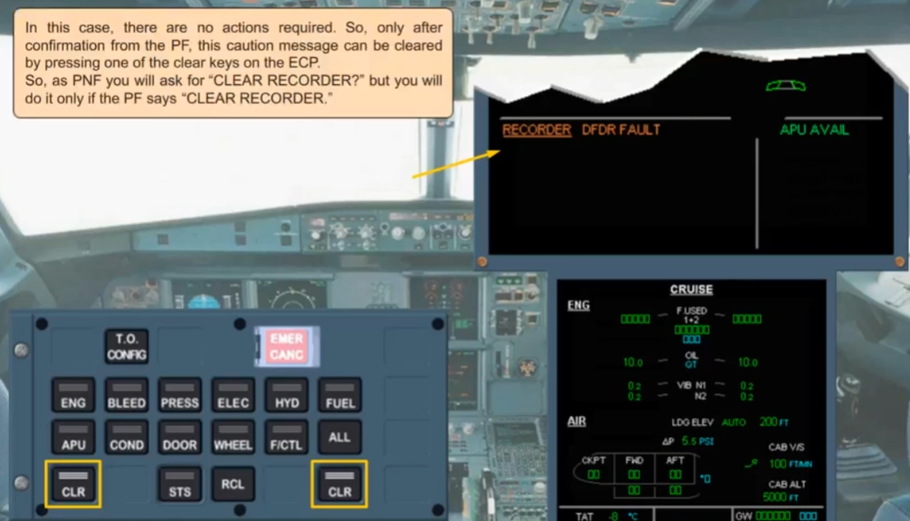

As a result of pressing either CLR key, the caution message has been cleared from the E/WD and the STS page is displayed automatically on the SD.

In this example you can see that the inoperative system is the DFDR.

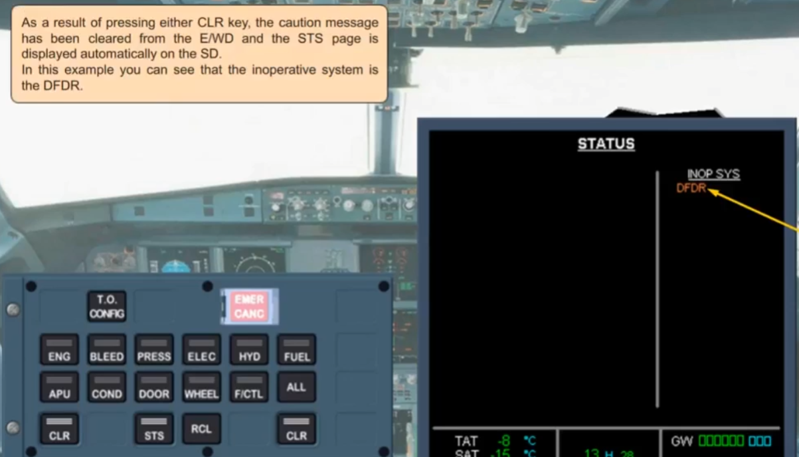

On the ECP, the STS key comes on along with the two CLR keys. When safe to do so, the STATUS page is reviewed by both pilots. After confirmation from the PF the STATUS page can be removed by pressing either of the STS key or one of the CLR keys.

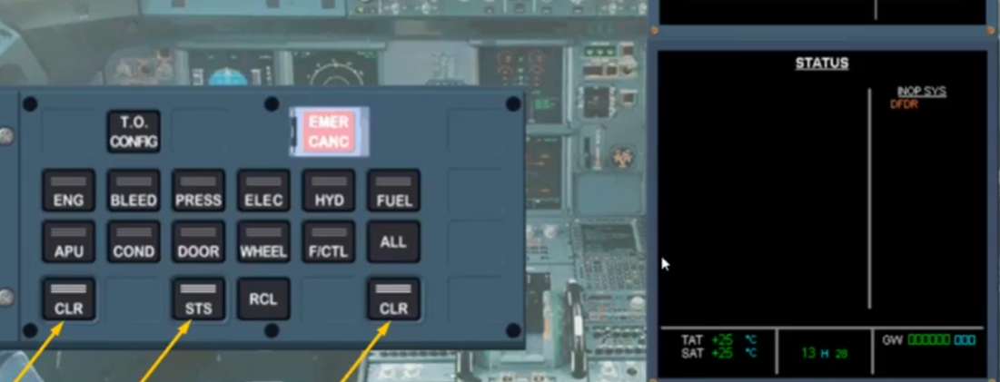

The STS page has been removed.

Notice that:
- On the E/WD, there is a boxed STS caption to tell you that there is information on the STATUS page
- On the ECP, there are no lighted keys.

The ECAM actions for the DFDR fault are complete. So as PNF, you should announce: ECAM ACTIONS COMPLETE.

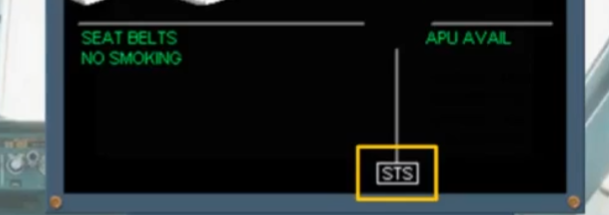

---

We will now look at what happens when the ECAM detects a slightly more serious fault, a reservoir overheat of the blue
hydraulic system.

We will concentrate on the use of the ECAM system, how it alerts you, and how it helps you to deal with the fault.

As the hydraulic indications themselves will be covered in the appropriate modules.

When a serious fault occurs, the ECAM system alerts the crew aurally and visually. In the studied fault, a single chime will sound,and the master caution lights will come on. To cancel the master caution lights, and reset the alerting system, one of the MASTER
CAUT pushbuttons must be pressed

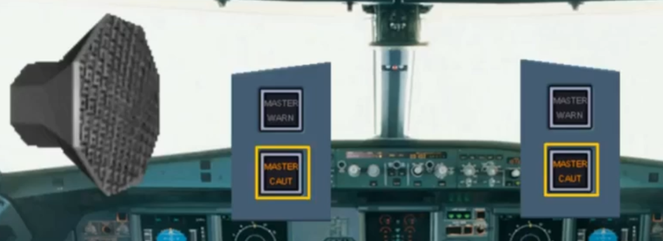

The master caution lights are off, and the alert system is reset.

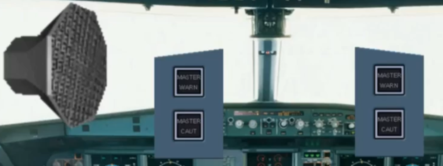

After reading the fault title, the first priority is always to ensure the safe fight path of the aircraft before dealing with the fault. The MASTER CAUT and the SC (Single Chime) mean that the abnormal situation needs crew awareness but no immediate action.
This failure, which has no direct consequences on flight safety, is classified "LEVEL 2"

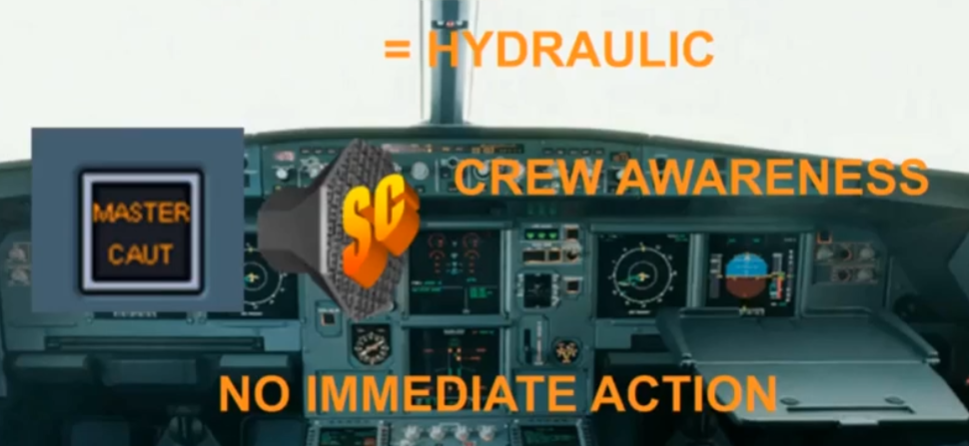

For crew awareness, the indications are:
- A failure message on the E/WD
- A system synoptic, if any, related to the fault, and automatically displayed on the SD
- The lighted CLR keys, on the ECP

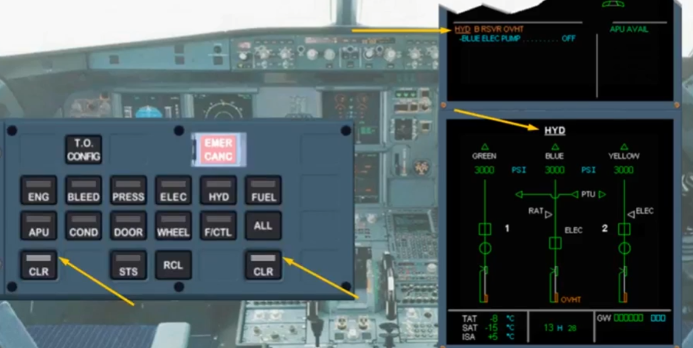

Let's study the details on the E/WD first. The system title is underlined, in our case HYDraulic and the fault is shown alongside it: "Blue ReSerVoiR OVerHeaT".

Notice the type of abbreviations used.

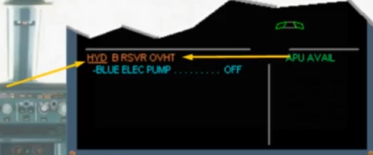

Notice the amber OVHT message on the SD. This abnormal indication is displayed where the failure has occurred on the synoptic system.

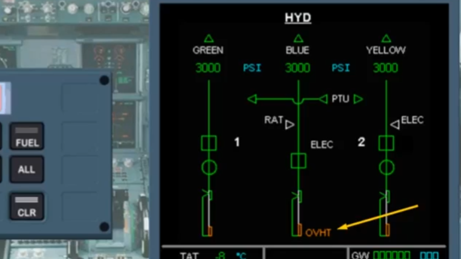

When the PF is ready, he will ask you to perform the ECAM actions. In this example there is a blue action line on the E/WD telling you to switch off the blue electrical pump. 

Now, let's check the overhead panel.

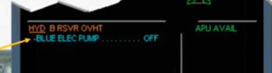

On the overhead panel, an amber fault light is on, on the hydraulic control panel.

This amber FAULT light on the HYD panel, helps you to locate the switch to be operated. We will carry out the action for you.

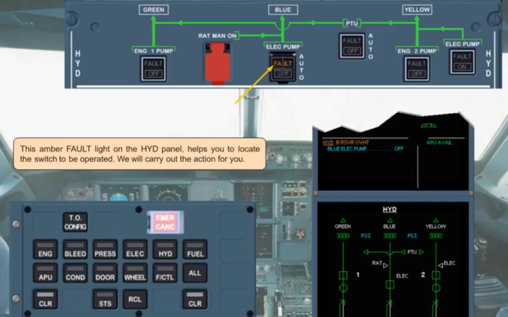

When the pump is switched off, the action line is removed. So,the blue hydraulic system depressurizes, as shown on the HYD page by
the amber indications.

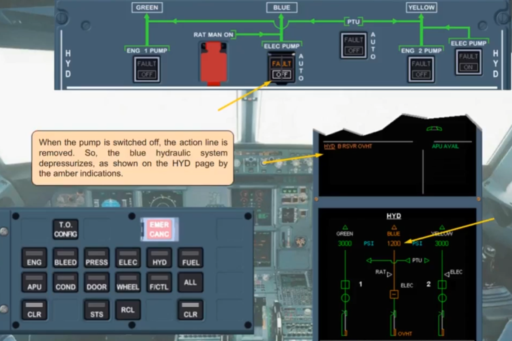

The ECAM system detects the drop in pressure and generates a further alert.

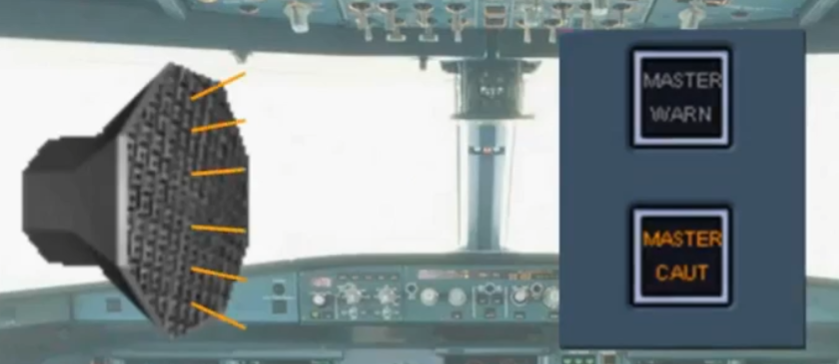

There is now a new abnormal message on the E/WD, B SYS LO PR. The message is boxed to indicate that the loss of the blue hydraulic system is classed as aprimary failure that will affect other systems.

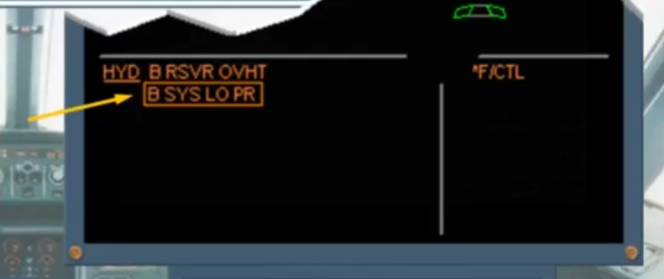

Depending on the importance of the primary failure, secondary failure messages can be displayed before or after the primary boxed failure message. If the primary failure affects systems without secondary failure message the affected system title will be shown with a star, in place of the right memos.

In this example, F/CTL system page is affected by the primary failure.

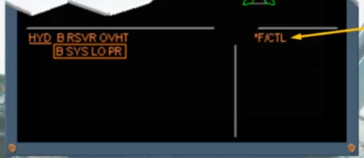

After review and confirmation from the PF, you have to clear HYD. We will do it for you.

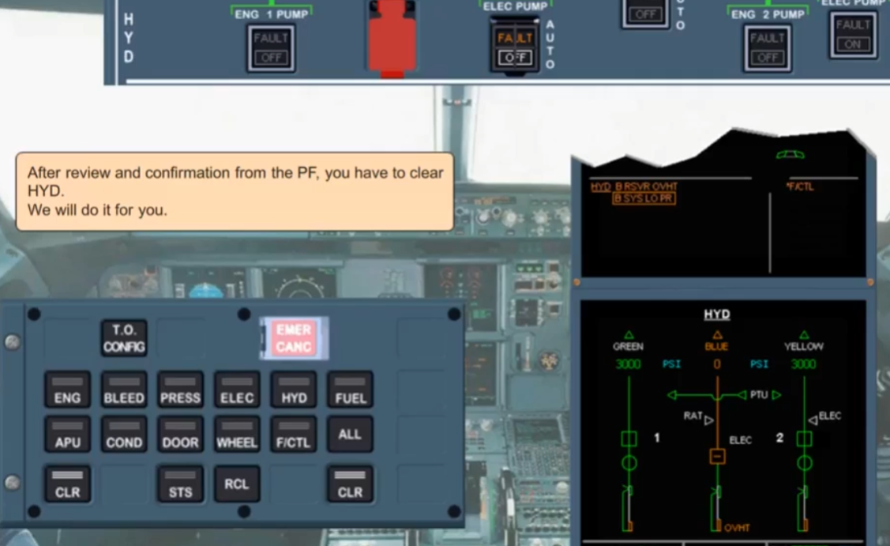

We have cleared the amber messages. Notice that normal memos are back on the left hand side of the E/WD. The ECAM F/CTL system page is displayed on the SD which agrees with the item shown by a star, on the right side of the E/WD.

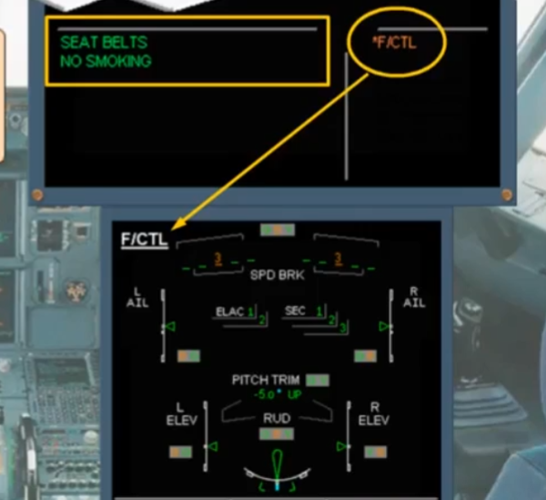

On the ECAM F/CTL page, notice that the controls affected by the loss of the blue hydraulic system have amber indications. These indications will be discussed in the hydraulic and flight control modules.

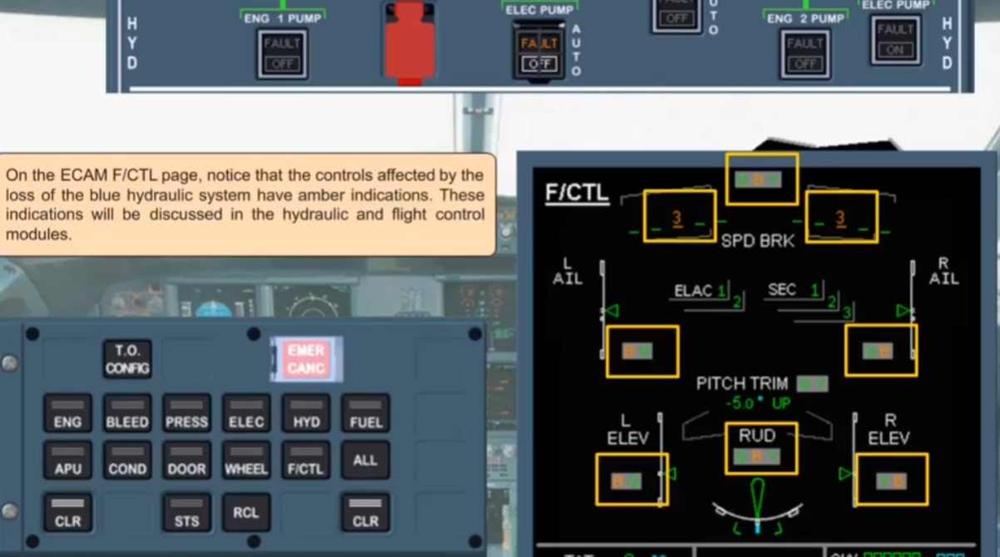

After review and confirmation from the PF, you have to clear F/CTL. We will do it for you.

Notice that normal right memos are back on the right side of the E/WD. On the SD, the STATUS page is now displayed containing several pieces of information.

The first area gives procedures to apply for landing, and other information.

The second area gives information about inoperative systems following the blue hydraulic failure.

You will study the procedures in the appropriate system lessons.

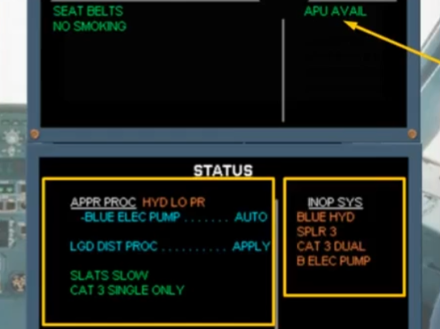

The STS page has been removed. The ECAM actions for a blue hydraulic reservoir overheat are complete.

So as PNF, you should announce: ECAM ACTIONS COMPLETE.

Notice that the STS reminder is displayed at the bottom of the E/WD, reminding you that there is information on the STATUS page. This is important when approach procedures have to be applied.

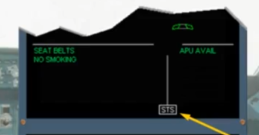

During the approach phase when the flaps lever is moved to flap 1 position, the ECAM system automatically recalls the STATUS page, unless it is empty.
You can see that, in the example shown, there is a landing distance procedure to apply. You will see how these approach procedures are applied later in the training.

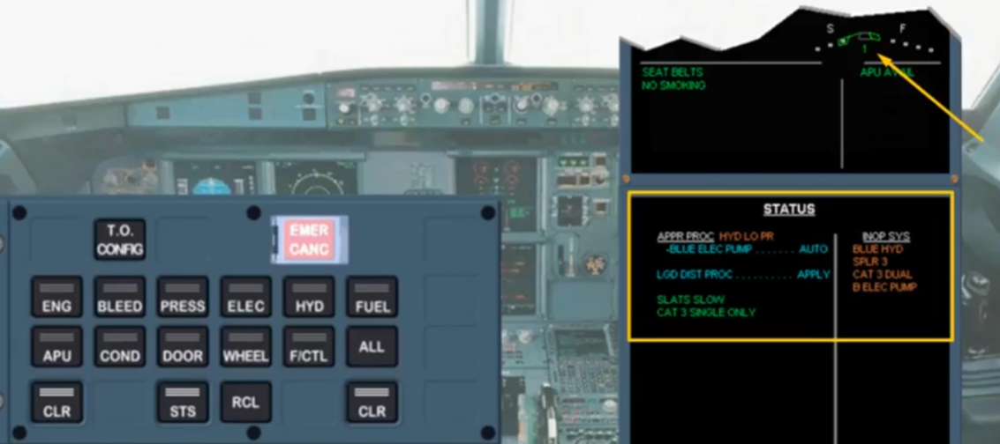

The STATUS page has been removed for you, and the CRUISE page is displayed.

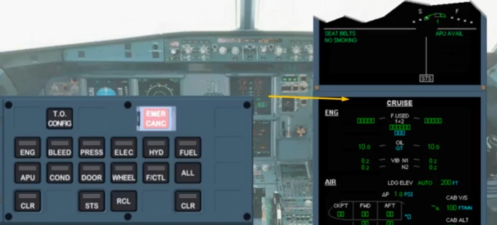

At any moment, you may recall manually the STATUS page by pressing the STS key. So, we will do it for you.

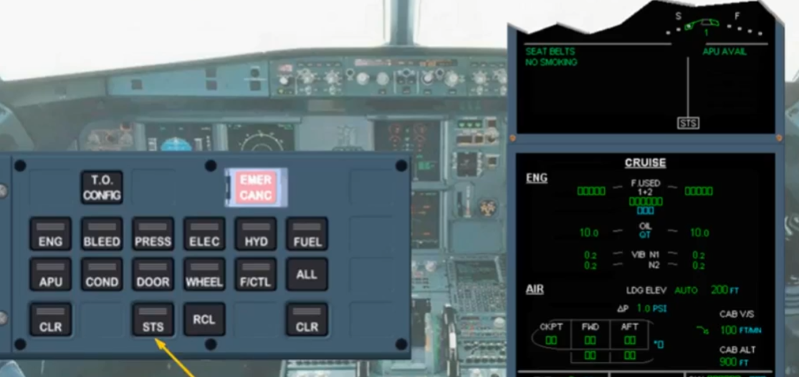

To remove, now, the STATUS page, you may press on the STS key or on any of the CLR keys. So, we will do it for you.

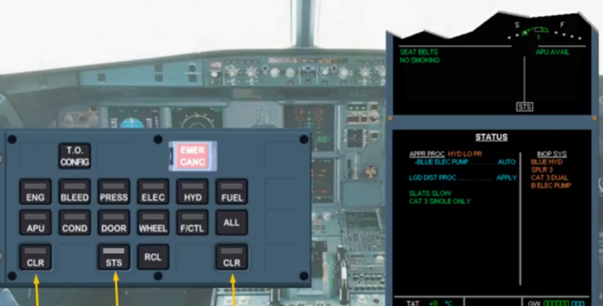

---

So far we have looked at how the ECAM system advises you of minor failures. We will now look at what happens when there is a serious failure that requires immediate action. To demonstrate this we will use an engine fire. As before we will not concentrate on the system failure but on ECAM indications and procedures.

This kind of failure is classified "LEVEL 3".

Be ready to cancel the warning by pressing a MASTER WARN pb-sw.

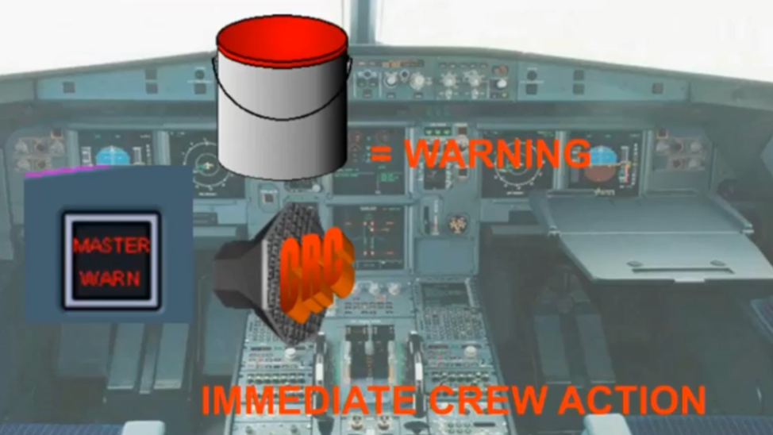

When the fault occurs the ECAM system alerts the crew aurally and visually. A continuous repetitive chime sounds and the master warninglights flash. They stop, as soon as you press on either MASTER WARN light.

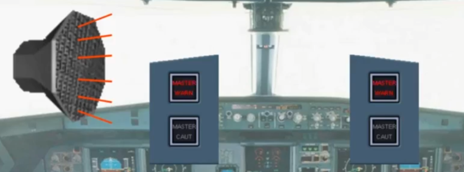

On the E/WD the red message ENG 1 FIRE and the related procedure are displayed.

The red pb on the FIRE control panel and the red indication on the ENG panel provide confirmation and identification of the affected
engine.

The ENGINE page has automatically been called on the SD, and in this example the nacelle temperature is pulsing.

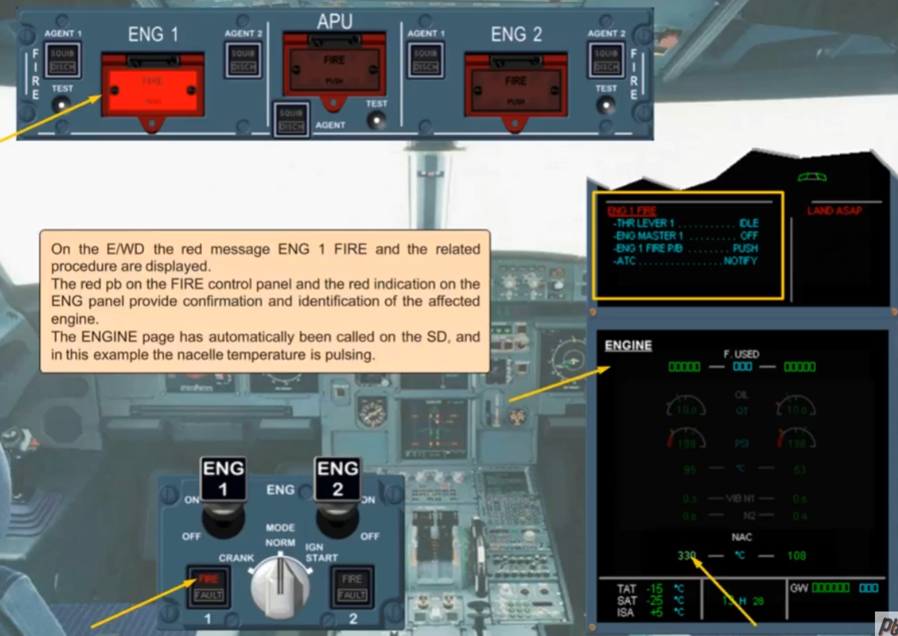

Notice that there is a red message "LAND ASAP" on the E/WD. This means that the fault detected is serious. The Pilot Flying should land at the nearest suitable airport.
As it is a level 3 warning and only if the airplane is under safe control, the PF will ask you to do ECAM actions, without delay.

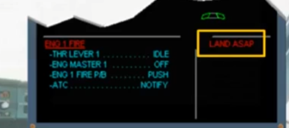

When the ENG MASTER 1 switch is set to OFF, the ENG 1 SHUTDOWN caution is shown on the E/WD.

Notice that the amber caution procedure has appeared below the red one. This happens because the red (LEVEL 3) warning message has priority over this amber (LEVEL 2) caution message, which in turn will have priority over an amber (LEVEL 1) caution message.

Note: if several messages belong to the same LEVEL, the more critical message will be onthe top of the list.

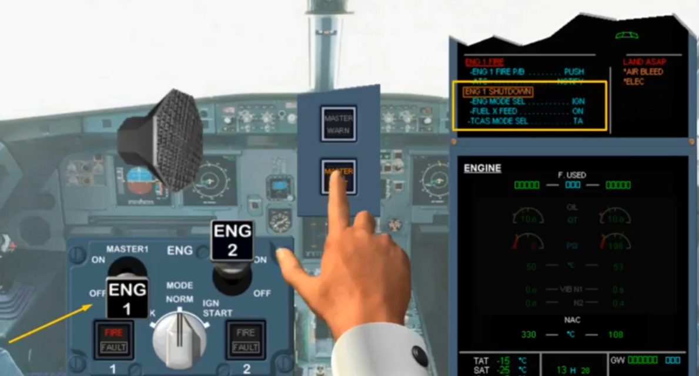

Notice that on right hand side of the E/WD, a list of affected systems (titles shown with a star) is displayed.

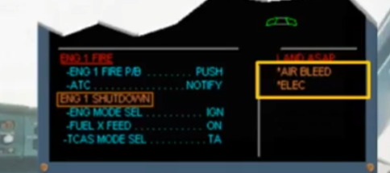

For the next action, as the control to use is guarded, the PNF must receive a confirmation from the PF, before lifting up the
guard. Then, the related action can be done.

Here the ENG 1 FIRE pb must be PUSHed. We will do this for you.


Notice that there is a white line in the abnormal procedure. Inorder to let the engine spool to slow down, there is a countdown before the next action. After this countdown, the white line is replaced by a blue action line.


Here the AGENT 1 pb must bepressed. We will do it for you.


Notice that the next blue action line will stay displayed even if the related action has been done, as the ECAM has no possibility to
know if ATC has been notified.

A new countdown has started, because the fire has not stopped. A green arrow is displayed to indicate an overflow, as on the leftside of the E/WD there are not enough lines to display the full procedure of ENG 1 SHUTDOWN.


Agent 1 extinguishes the fire. The countdown for agent 2 stopped immediately.

Notice that:
- The ENG FIRE procedure on the ECAM disappeared. This means the fire is out
- The local warnings on the FIRE control panel and the ENG MASTER panel are no longer on, confirming that the fire is out
- LAND ASAP has changed from red to amber which means that the ECAM has determined that the fault is less critical. The crew should consider the seriousness of the situation and, select a suitable airport
- Also at the bottom of the E/WD, the green arrow has disappeared, because there are enough lines to display the full ENG 1 SHUTDOWN procedure.


The remaining steps are similar to those seen for an ECAM CAUTION so we will stop here.

You have seen that the ECAM system has provided a smart andinteractive procedure to help you to deal with a major problem.

Note: As the nacelle temperature is back below the advisory threshold, so the engine page is replaced by the cruise page, because the caution message, displayed on top, is not linked to a system page on the SD.


The warning or caution message displayed on the top line of the leftside of the E/WD is always the more critical even if another problem is detected.
Notice that the FWS FAULT is more critical than the CAB PRFAULT, but less than the ENGINE problem.


When there are not enough lines on the left side of the E/WD, the title which cannot be displayed moves to the right side of the E/WD.


We do the actions for you. So, notice that, as soon as there are enough lines on the left side of the E/WD, the titles move from theright side to the left. 


When the last caution message has been displayed on the left side, the green arrow disappears.


After clearing the ENGINE caution message, the next caution moves up.

Note: On the SD, the system page, if displayed, is always linked to the cautionunderlined and displayed on top of the left side of the E/WD

After doing the related action, if any, this caution message will be cleared. For each caution message you have to wait for the PF confirmation in order to clear it.


After clearing the last caution message the normal memo messages are displayed on the left side of the E/WD.
On the SD the BLEED page is automatically shown because the first title with a star is AIR BLEED.


Each system page, shown with a star, must be analyzed, then after PF confirmation, it can be cleared. We will do it for you.


When the last system page, shown with a star, is cleared, the right side of the E/WD shows the related memo messages, if any.


On the STATUS page, like the proposed example, a green overflow arrow also indicates that there is further information to be seen on that page. By pressing any of the CLR keys, the next information can be displayed


The top part of the left side of the STATUS page has been removed and the next parts move up allowing the display of the remaining information. Notice that the list of inoperative systems has not changed and that there is still an overflow arrow.


We have pressed again the CLR key for you. The last items of INOP SYS column are displayed and the overflow arrow is removed.

If you want to display the beginning of the STATUS page again, the STS key can be pressed.


We are now back at the first STATUS page again.

You will have the opportunity to practice by shifting between STATUS pages in the simulator, so we will stop here.


ECAM ACTIONS COMPLETE.

Notice that, at any moment you can recall the warning and caution messages that they have been cleared during the flight, by pressing the RCL key. When pressed, the E/WD shows the list of previous messages following the priority logic, the more critical message being on top.


---

As an option, an OEB database lists the warnings and cautions relevant to an OEB. This database will be loaded into the FWCs via the MCDU.An OEB reminder function will provide the crew with an operational help, by clearly identifying any procedure or status messages which are affected by an OEB. So, the crew will be informed in real time, on the ECAM screens, if the related procedure or status is applicable or not.

Note: The crew has to refer to the QRH, where the full OEB information is provided.

An OEB reminder flag can be shown:
- Only on the ECAM procedure. In this case, the ECAM warning or caution title message is unchanged, but the related actions are replaced by a message "REFER TO QRH/OEB PROC" and the related STATUS page is unchanged or...


- On the ECAM procedure and on the STATUS page. In this case, the ECAM warning or caution title message is unchanged, but the related actions are replaced by a message, like previously. The related STATUS page has the additional message "REFER TO QRH/OEB PROC" or...


- Only on the STATUS page. In this case, the ECAM warning or caution title message and the related actions are unchanged. But there is an additional message, as shown. The related STATUS page has the additional message "REFER TOQRH/OEB PROC"


In this module we have discussed the ECAM system. You have seen the various failure levels and how the ECAM system alerts, indicates and helps you to deal with a failure.

Throughout the ground school course, and during your simulator sessions, you will have the opportunity to practice ECAM procedures.

*** Module completed ***

## Video study

- Watch the video available on [YouTube](https://www.youtube.com/watch?v=sL-SxPx2ANk&list=PLKEybvo562LtwmnZOjo8jN7J75vXGqMzq&index=21)