In comparison to old technology aircraft, the flight deck on the A320 is designed to be a comfortable non cluttered work environment. By using modern electronic display units, the presentation of information to the pilots has been improved.

The new Electronic Instrument System (EIS), has six identical full color Liquid Crystal Display (LCD) units.

The EIS is divided into two subsystems:
- The Electronic Flight Instrument System (EFIS), for which each pilot has two displays
- The Electronic Centralized Aircraft Monitoring system (ECAM), which uses the two displays in the center to provide information on the aircraft systems.

---

## EFIS

Let's look at the EFIS system first.
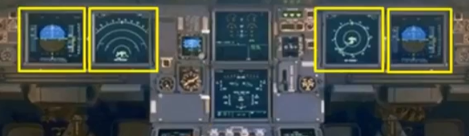

Flight parameters are displayed on Primary Flight Displays (PFDs) while navigation data is displayed on Navigation Displays (NDs).

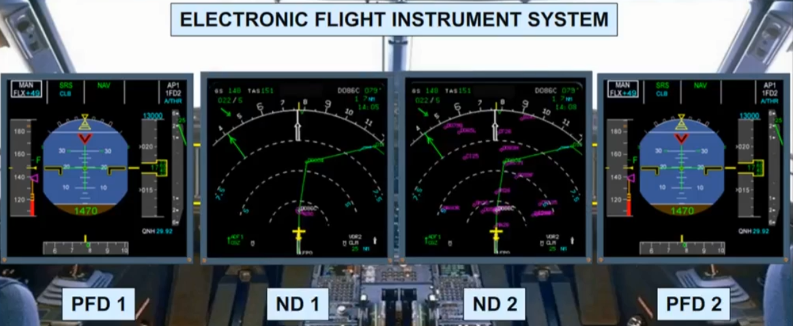

Outboard of the PFD, there are control knobs to adjust the brightness of the related PFD and ND, or to turn the display off.

There are also switches to swap displays between the PFD and the ND.

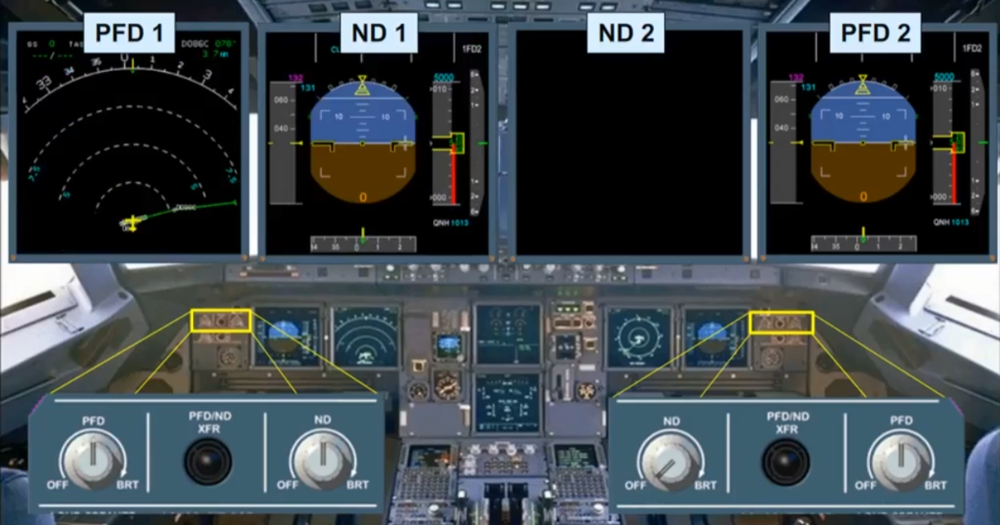

---

## ECAM

The two displays in the center are dedicated to the Electronic Centralized Aircraft Monitoring system (ECAM). At this stage we will simply introduce the ECAM displays and the related controls.

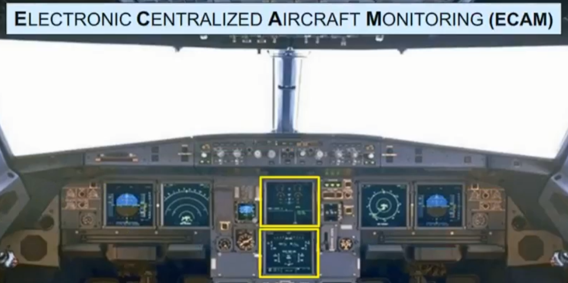

The upper ECAM display is called the Engine Warning Display (E/WD).

The lower ECAM display is called the System Display (SD).

Various aircraft system parameters can be viewed on these screens. As anexample, you can see a sequence of all SD pages (one after the other).

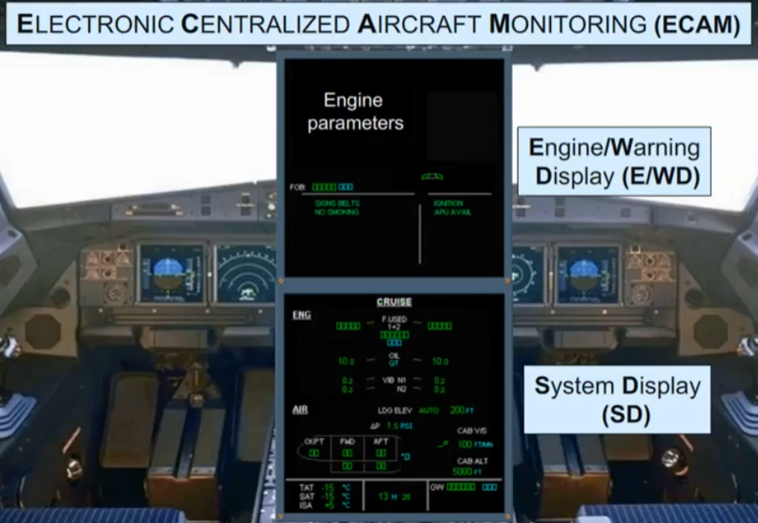

---
## Overhead panel

Another philosophy, used on the flight deck is the "lights out" configuration. If the aircraft is in its normal flight state, for example, just before take off, and you lookup at the overhead panel, there should be no white lights on, on any of the switches.
Let's look at some switches.

For the majority of the push button switches, installed on the overhead panel, a logic is applied:
- Normal configuration:
    - No light is ON, in the “lights out" position (IN or OUT)
- Abnormal condition:
    - Amber FAULT light (which helps to identify the switch related to an abnormal condition)
- White light:
    - When normally a system should be operating, but if it is deactivated, a white OFF light comes on
    - When normally a system should not be operating, but if it is activated, a white ON light comes on.

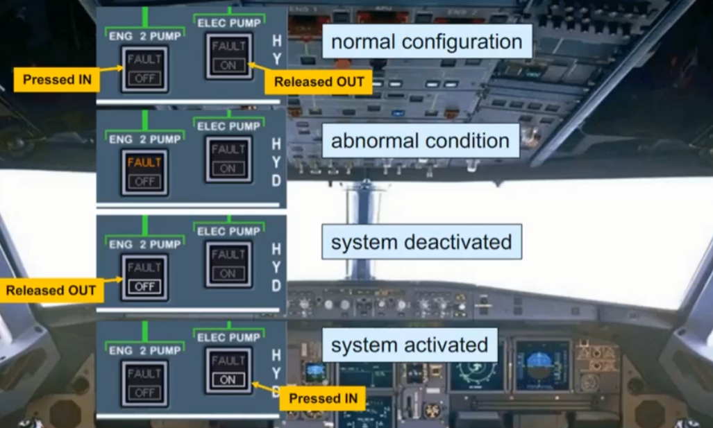

On the overhead panel, some push button switches are used on a temporary basis, or may have an indication of their state.

The logic is:
    - Temporary selection for operational reasons - blue ON light (e.g. anti-ice)
    - Applicable system status - green light (e.g. APU available).

You will see this philosophy demonstrated throughout the course.

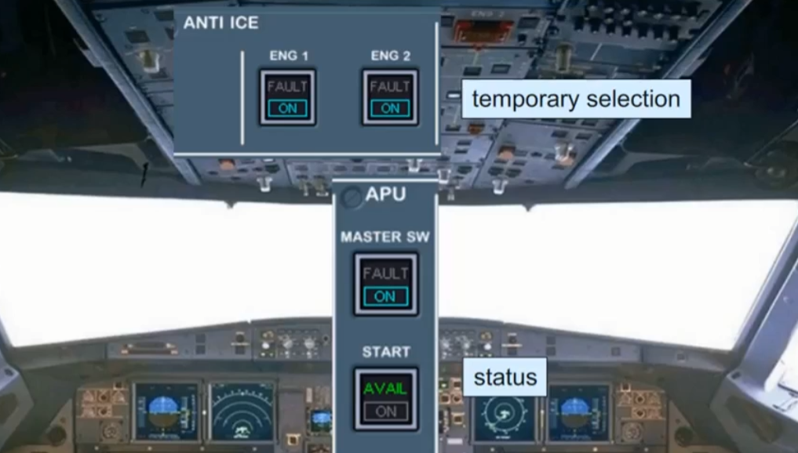

---
## ECP & More

The ECAM control panel is on the center pedestal, below the ECAM displays.
On the left hand side, two controls turn on/off, and adjust the brightness of the two ECAM screens.

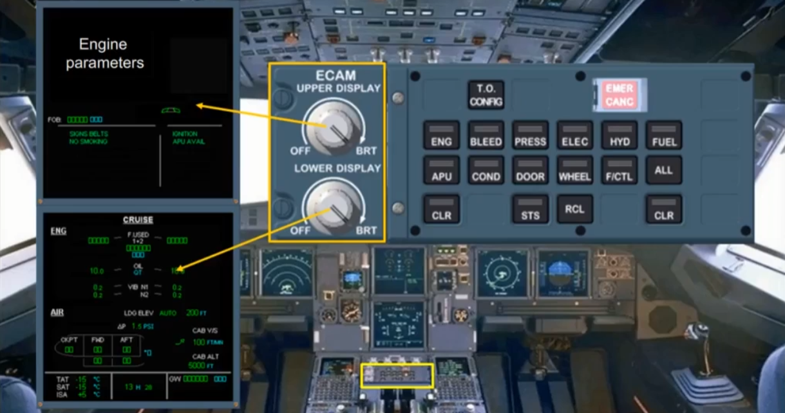

Just below the ECAM screens, on the pedestal, is a switching panel for use in abnormal situations to restore data to the EFIS and ECAM displays.

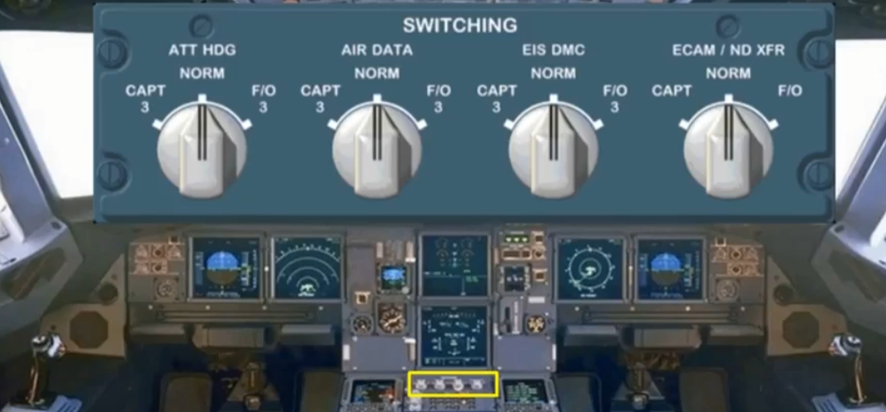

In front of each pilot there are two attention getters, a red master warning, and anamber master caution. As a further means of getting the pilots' attention, there is a loudspeaker on each side of the cockpit for aural alerts and voice messages.

Note: The loudspeakers can also be used to listen to ATC and the intercom.

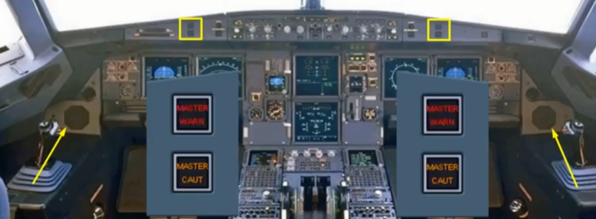

---
## EIS 

Now, let's go back to the EFIS system.

For the EFIS displays, data from the Air Data and Inertial Reference System (ADIRS) plus navigation data from the Flight Management and Guidance System (FMGS) supply directly the three Display Management Computers (DMCs).

The three identical DMCs process the data and generate the images to be displayed.

In normal operation:
- DMC 1 supplies EFIS information to the captains' PFD and ND
- DMC 2 supplies the First Officers' PFD and ND
- DMC 3 is available as a backup.

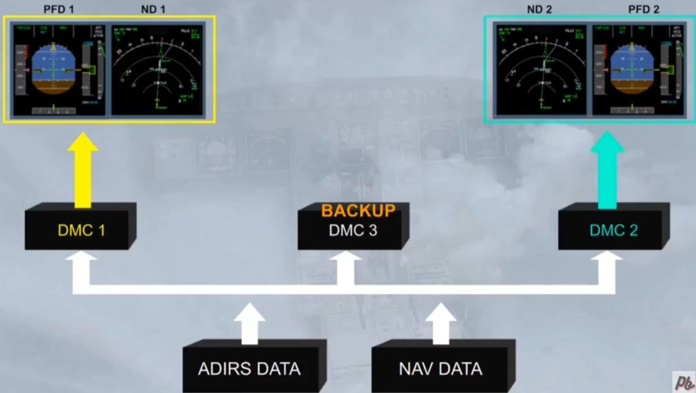

Now, let's look at the other EIS sub system, the ECAM, and how the ECAM displays get their data.

Sensors are installed throughout the aircraft to monitor the various systems, including system controls operated on the flight deck.

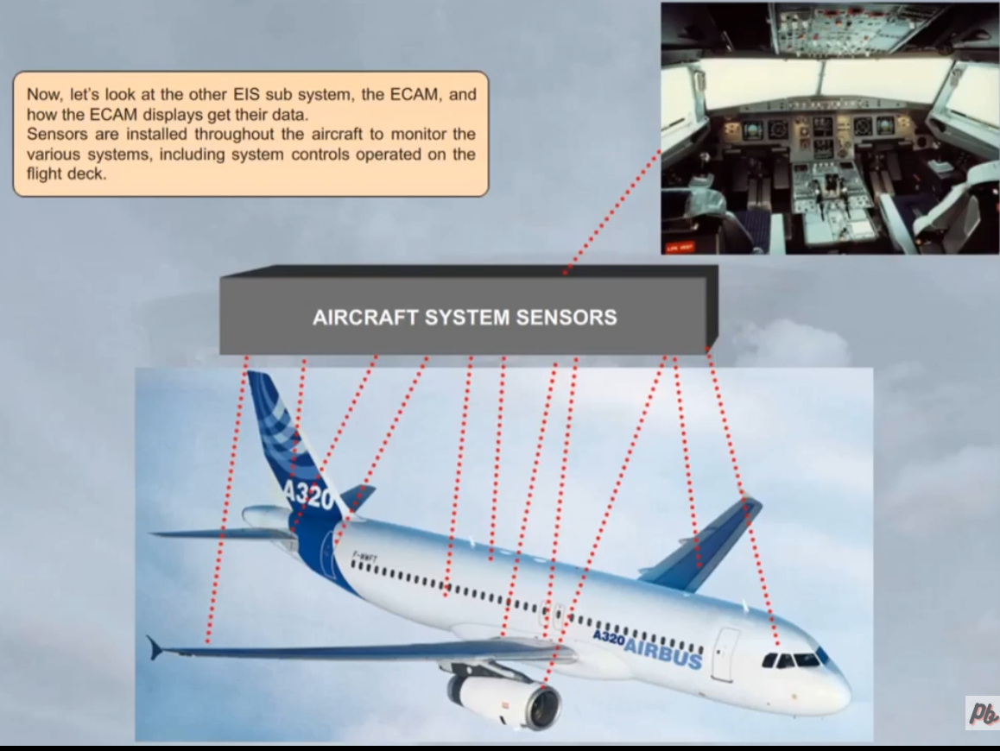

Some parameters, for example fuel quantity, are routed directly from the system sensors to the three DMCs.

Note: Each DMC has one channel which can provide simultaneously the management of the EFIS and the ECAM displays.

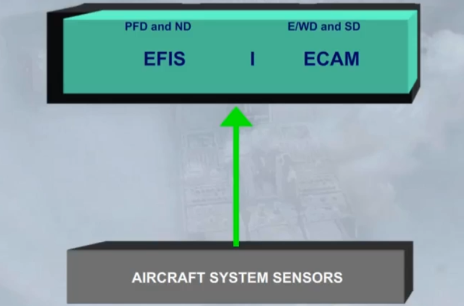

For the majority of the systems, the sensors supply data to two System Data Acquisition Concentrators (SDACs).

The SDACs acquire system data, process it, and send some of it as system page data to the three DMCs.

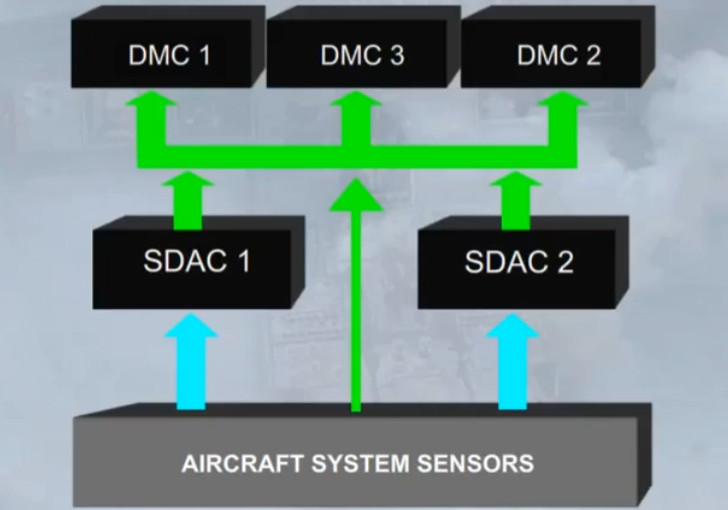

In normal operation:
- DMC 1 drives the CAPT PFD, CAPT ND and the ECAM Display Units
- DMC 2 drives the F/O PFD and F/O ND
- DMC 3 is in standby, ready to replace any failed DMC, as backup.

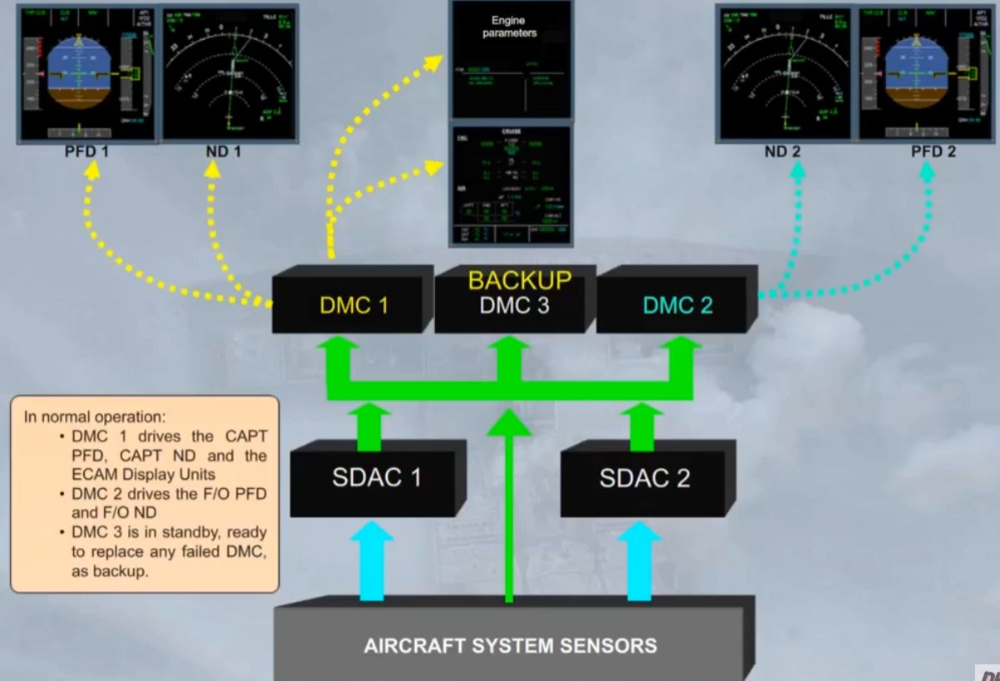

Two identical Flight Warning Computers (FWCs) receive data from:
- The SDACs to generate most of amber cautions
- The aircraft system sensors to generate red warnings, and remaining amber cautions.

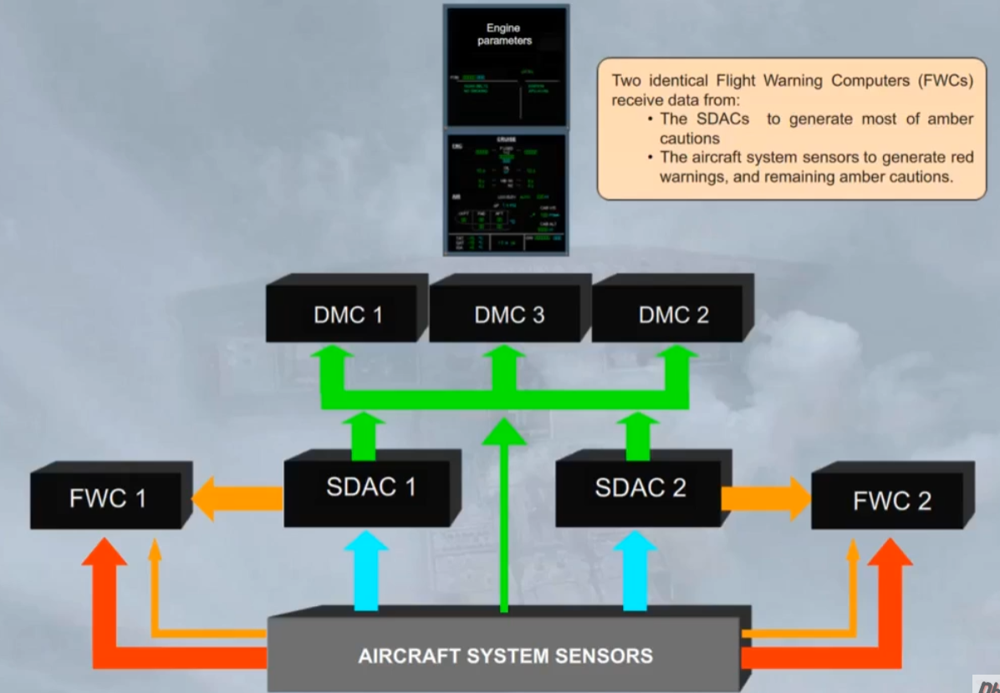

The FWCs then supply:
- The DMCs for the display of alert messages
- The attention getters
- The loudspeakers for aural alerts and synthetic voice messages.

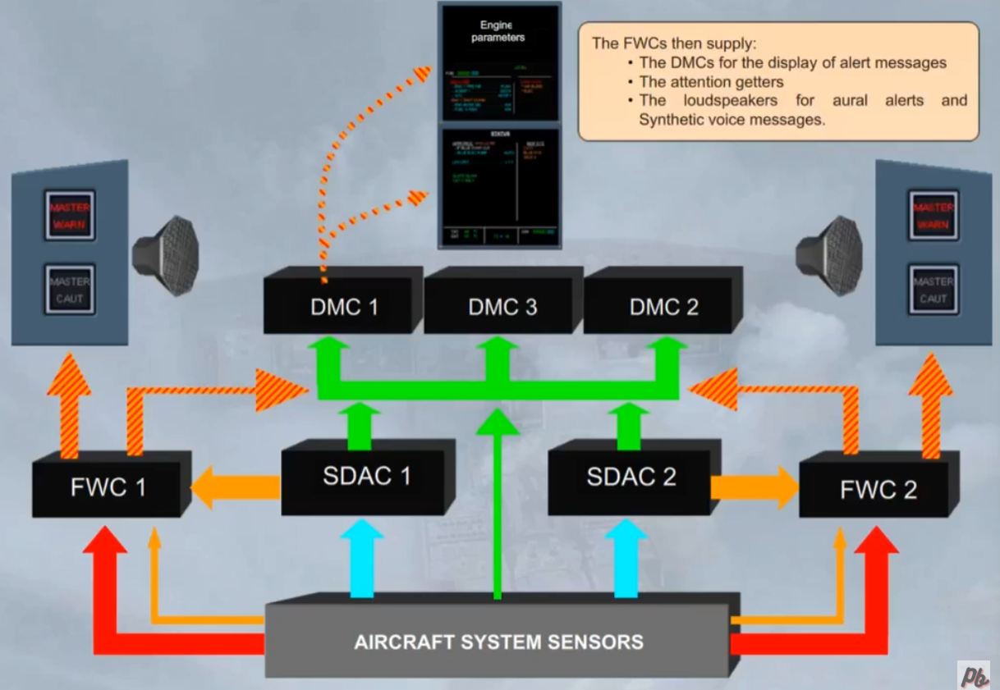

All the components shown can be collectively called the ECAM system.
We will study the use of the ECAM system in a separate module.

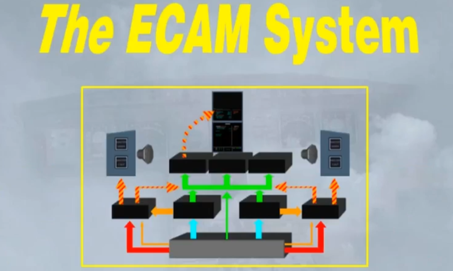

---
## CLOCK

In addition to EFIS and ECAM, time measurement devices are provided.

The master time reference for all aircraft systems is provided by a clock, located on the right side of the main panel. In this example the time is 13:28.

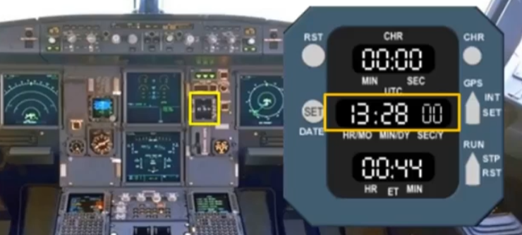

The time is also displayed at the bottom of the System Display.

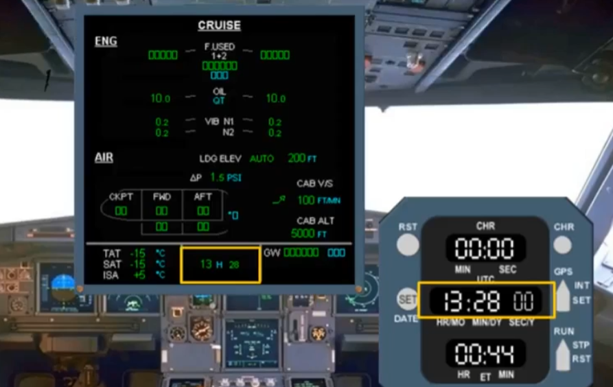

In this module we introduced you to the Electronic Instrument System, (withits two sub sections the EFIS and the ECAM), and to the CLOCK. In the next modules we will concentrate mainly on the ECAM system and then, later on in the course, we will look at the EFIS displays in greater detail.

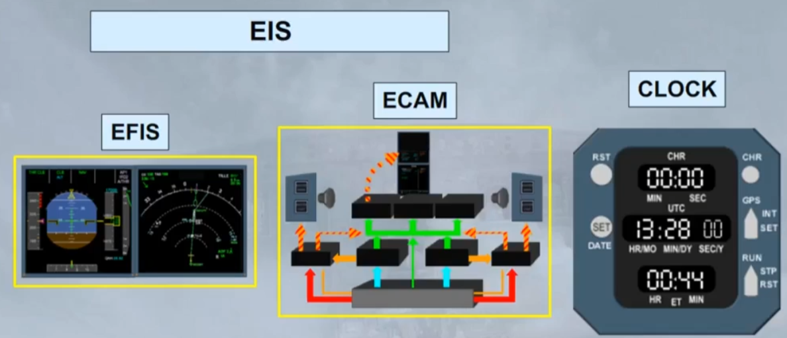

## Video study

- Watch the video available on [YouTube](https://www.youtube.com/watch?v=U9-auy71QaA&list=PLKEybvo562LtwmnZOjo8jN7J75vXGqMzq&index=20)
