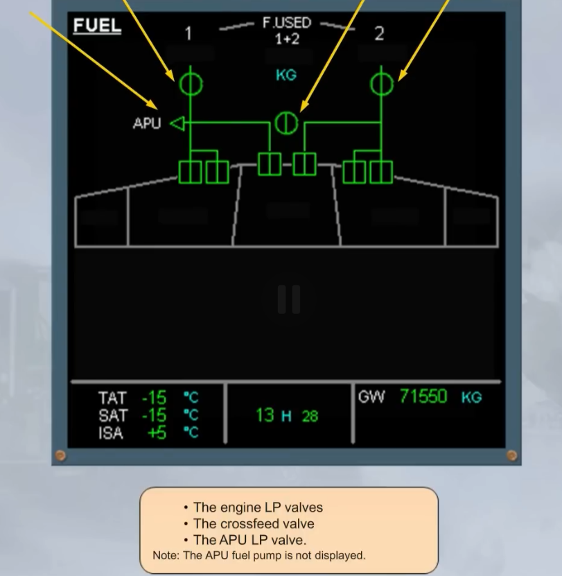

This section covers basic aerodynamics.

## Lift

Lift equation:

L = 1/2 ρ V² S CL

You can [link to another page](http://aviationnote.com).
You can highlight `inline code` with backticks.

:::note[Where to visit next]
You can visit [here](https://astro.build/).
:::

> *Some people say this is good.*

Where and when is the Andromeda constellation most visible?

The [Andromeda constellation](<https://en.wikipedia.org/wiki/Andromeda_(constellation)>) is most visible in the night sky during the month of November at latitudes between `+90°` and `−40°`.

Here is a footnote[^1] with some additional text after it.

[^1]: My reference.

