The A320 has:

- Fire detection and extinguishing systems for the engines and APU

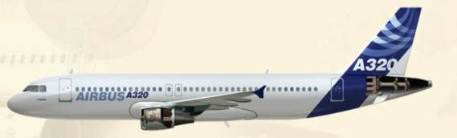

- Smoke detection in the avionics bay

- Smoke detection and fire extinguishing systems in the cargo compartments and lavatories

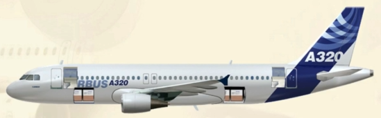

- Portable fire extinguishers for the flight compartment and the cabin.

 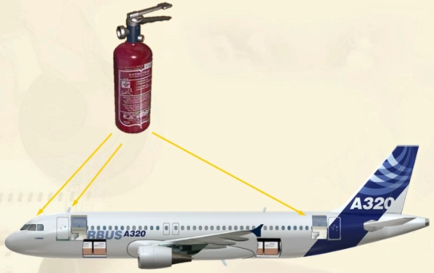

The engines and APU have a fire detection system. Each system has:
- Two identical detection loops (A and B) mounted in parallel. Each detection loop is connected:
  - On each engine, to three fire detectors:
    - One in the engine pylon nacelle
    - One in the engine core and
    - One in the engine fan section.
  - On the APU compartment, to one fire detector.
- A Fire Detection Unit (FDU), which generates fire warnings when:
  - A loop A detector and a loop B detector subject to heat or
  - One loop detects a fire with the second loop declared inoperative or
  - Both loops are declared inoperative within 5 seconds.

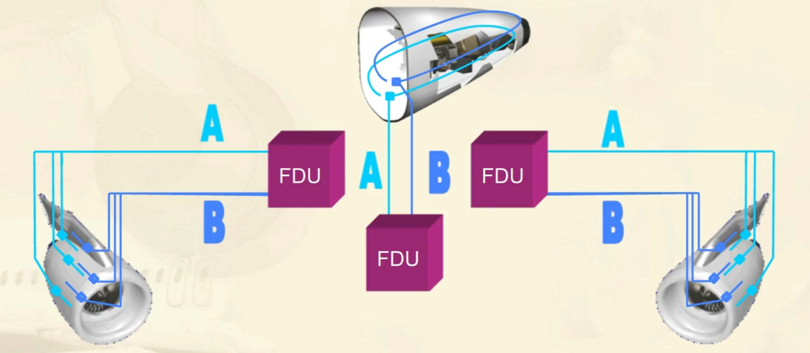

Each engine is equipped with two extinguisher bottles.

The discharge of the bottles is activated by a related AGENT pb. The pushbuttons are located on the FIRE panel on the overhead panel.

Note: The AGENT pbs are active only if their related FIRE PUSH button has been released out.

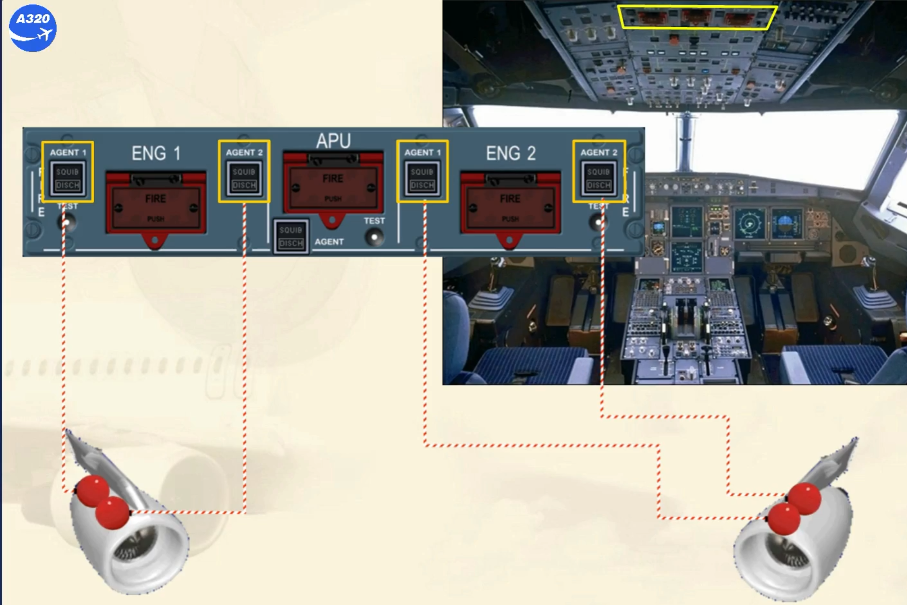

For the APU, there is one fire extinguisher bottle. Its discharge is activated either by an AGENT pb provided the APU FIRE PUSH button has been released out, or automatically if there is an APU fire when the aircraft is on the ground and provided the DC BAT
bus is still supplied.

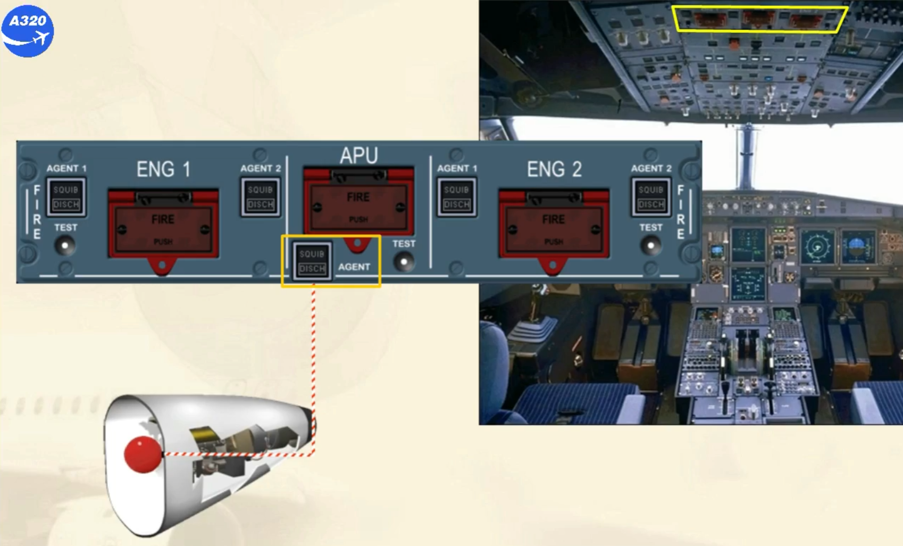

The guarded FIRE PUSH buttons give a fire indication and enable, when released out, the related system to be isolated and the AGENT pbs to be active.

Note: Each fire indication has two sets of four red bulbs. Each set is triggered by a fire detection loop.

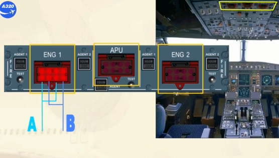

The TEST buttons are used to test the respective fire detection and extinguishing system operation.

When it is pressed and until it is released:
- The red FIRE PUSH light comes on
- The white SQUIB and the amber DISCH lights come on and
- The ECAM warnings are activated.

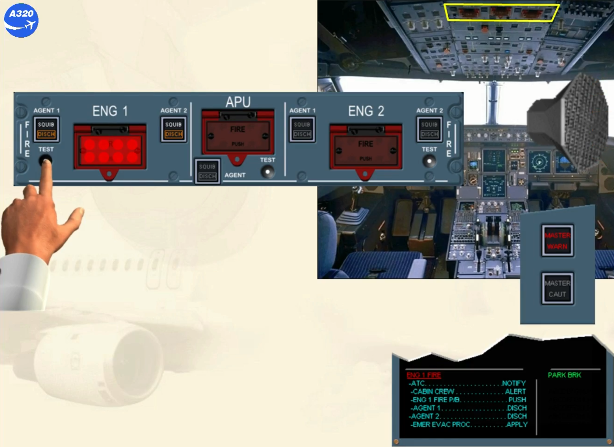

Note: If the fire test is performed on ground with only batteries supplying the electrical network, the white SQUIB and the amber DISCH lights come on and without ECAM warnings, the red FIRE PUSH light comes on, but partially, as one set of red bulbs is not electrically available.

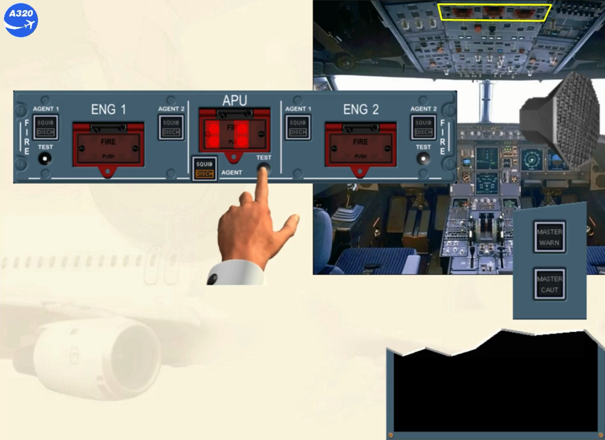

In addition to the indications of the engine FIRE panel, on the ENG panel, installed on the pedestal there is a FIRE light for each engine. These lights identify which engine is on fire.

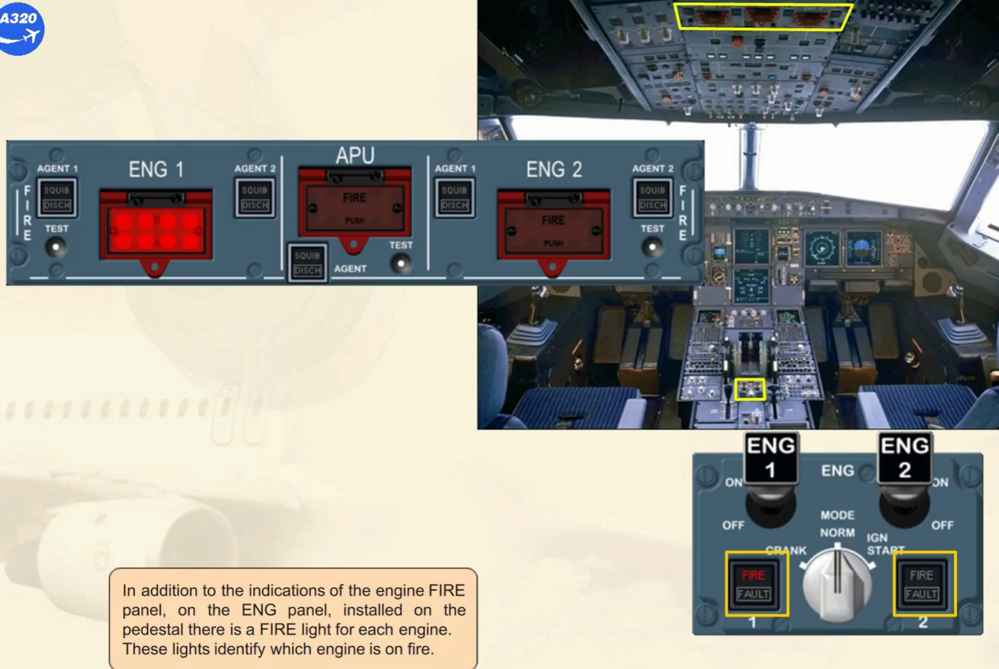

on the EXTERNAL POWER panel, for the APU there is an additional APU FIRE light and a guarded APU SHUT OFF pb. This pb allows the ground crew to shutdown the APU when in case of APU fire, the automatic shutdown did not work.

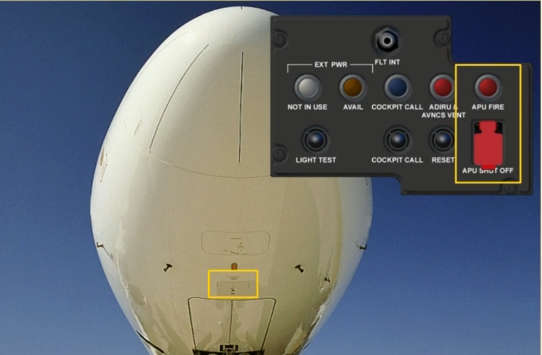

A smoke detection system is provided for the avionics. Its detector is located in the air extraction duct.

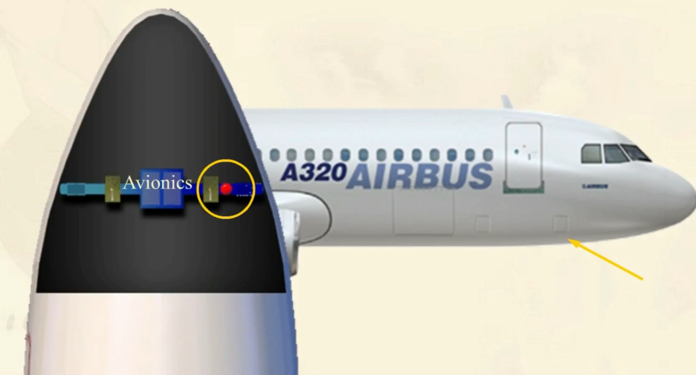

The indications for avionics smoke are located on two panels in the cockpit:
- The EMER ELEC PWR panel, in order to electrically isolate the faulty equipment (refer to the ELECTRICAL SYSTEM) and
- The VENTILATION panel, in order to evacuate the smoke (refer to the VENTILATION SYSTEM).

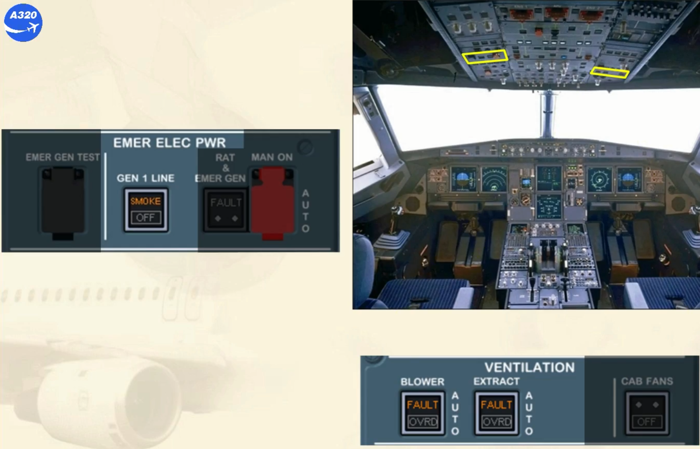

The lavatory smoke detection system consists of one smoke detector in each lavatory, linked to the Cabin Intercommunication Data System (CIDS).

The CIDS transmits the signals to the FWC, for warnings in the cockpit, and generates indication in the cabin.

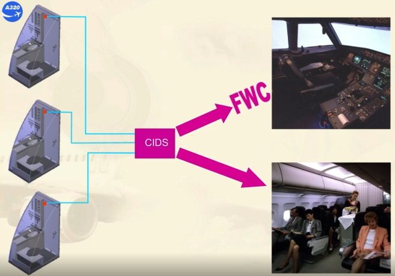

In addition, each lavatory waste bin has an automatic fire extinguishing system.

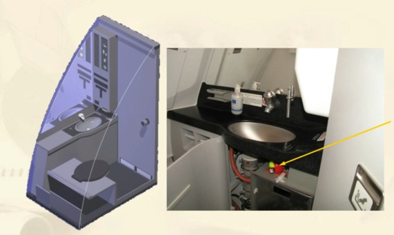

Cavities are installed in the cargo compartment ceiling panels.

There is one cavity in the forward compartment and two in the AFT compartment.

Each cavity has two smoke detectors.

Each smoke detector is linked to one of the two detection loops.

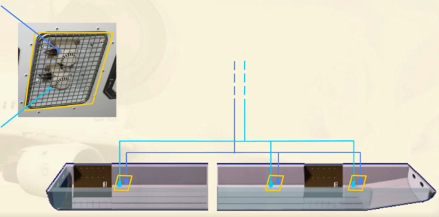

The CIDS receives signals from the detectors and sends them to the FWC for display in the cockpit.

Smoke warnings are activated if in one cavity:
- Both smoke detectors detect the smoke or
- One smoke detector detects the smoke with the other detector declared inoperative.

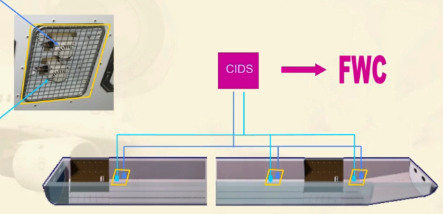

Related cargo smoke detection is indicated on a CARGO SMOKE panel installed on the overhead panel.

Depending on the version, the installed panel can be, as shown:
- For one bottle version or
- For two bottles version.

Refer to your documentation.

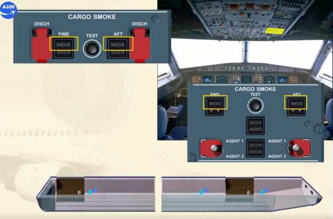

The CARGO SMOKE panel also has :
- For the one bottle version, two guarded DISCH pushbuttons.
  - Each pb allows the complete discharge of the fire extinguisher bottle into the related cargo compartment through a nozzle installed in each cavity. So, the FWD DISCH pb will draw the bottle contents into the FWD compartment via one nozzle or the
  AFT DISCH pb will draw the bottle contents into the AFT compartment via two nozzles.
  - Note: As the bottle contents have been completely discharged into a cargo compartment, both amber DISCH lights come on.

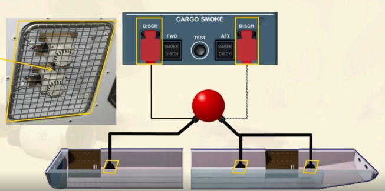

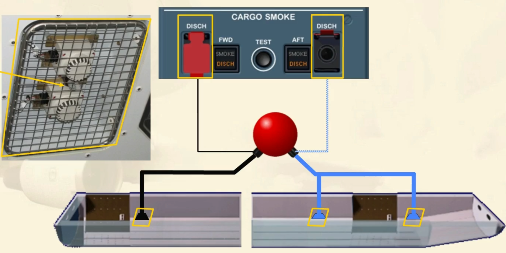

- For the two bottles version, two guarded DISCH toggle switches.
  - Each toggle switch allows the complete discharge of the fire extinguisher bottles into the related cargo compartment through
  a nozzle installed in each cavity. So, the FWD toggle switch will draw the bottle 1 contents and the bottle 2 contents into the FWD compartment via one nozzle or the AFT toggle switch will draw the bottle 1 contents and the bottle 2 contents into the AFT compartment via two nozzles.
  - Note: When the bottle contents have been completely discharged into a cargo compartment, the related amber DISCH light comes on. The bottle 1 will discharge within 60 seconds. The amber DISCH AGENT 2 light comes on 1 hour after the bottle 1 discharge and goes off when the AGENT 2 has been selected for discharge. Also, the bottle 2 discharges slowly, within around 90 minutes, ensuring sufficient agent concentration for 205 minutes,

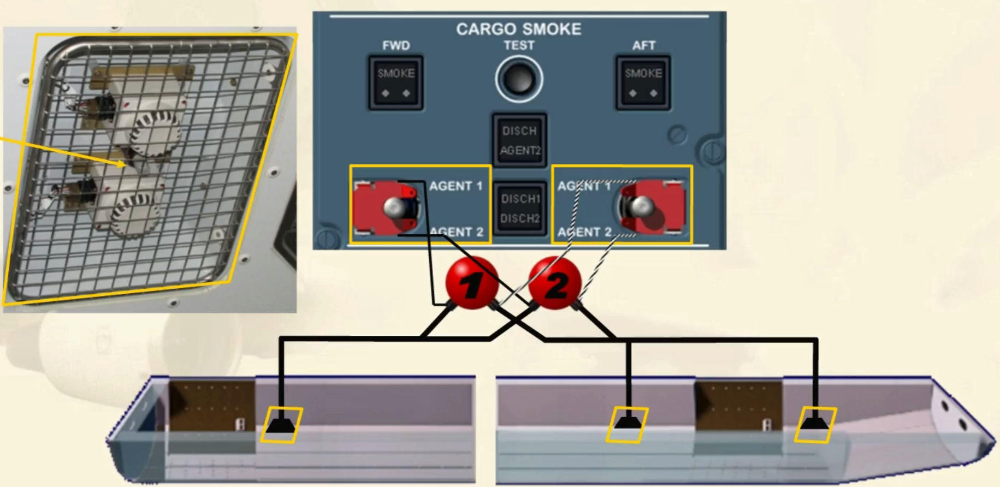

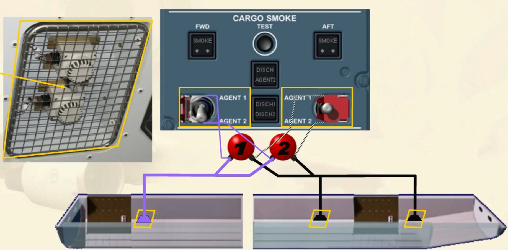

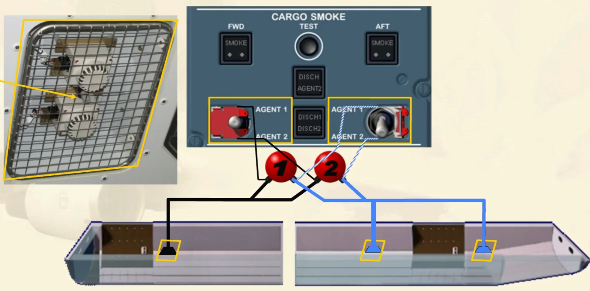

The cargo smoke panel has also a TEST pb.

When pressed and held for at least 3 seconds:
- It turns on the amber DISCH lights and tests the smoke detectors in sequence
- It turns on the red SMOKE lights and ECAM warnings twice and
- It closes the cargo ventilation isolation valves, if installed in the FWD and AFT cargo compartment (as shown on the ECAM
COND page). At the end of the test, they reopen automatically.

When the TEST pb is released, the amber DISCH lights go off.

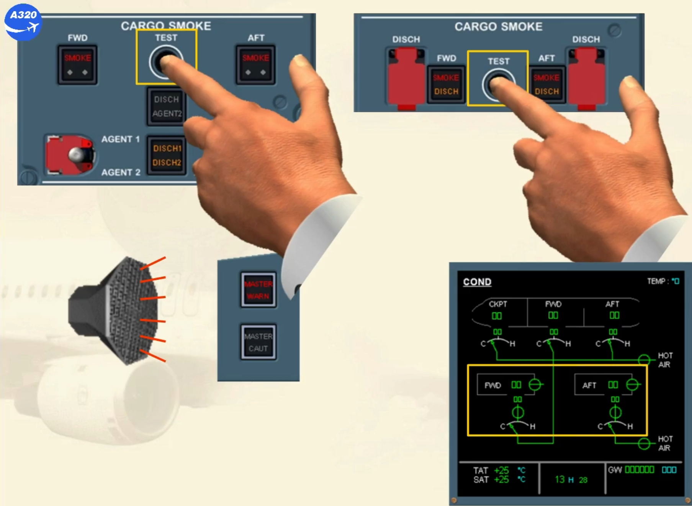

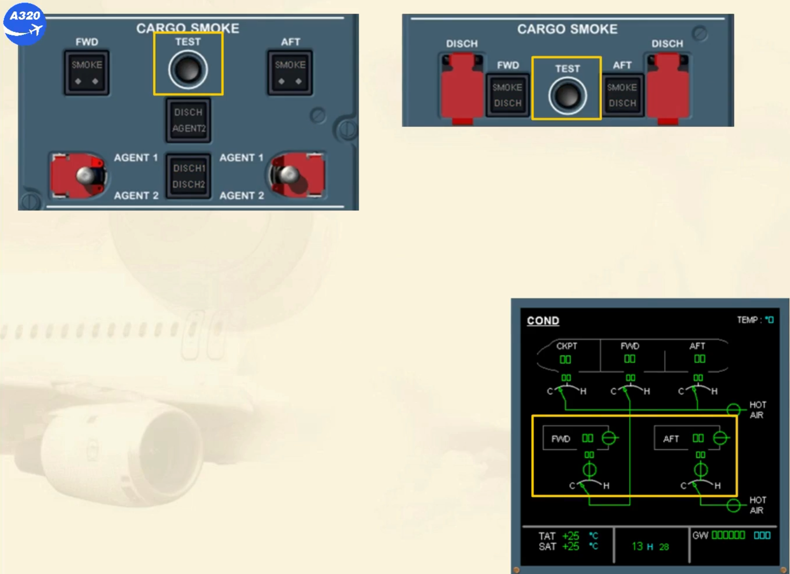

During the walk-around, you have to check that the APU Fire extinguisher overpressure indication (red disc), is in place. This is an indication that the fire bottle has not been discharged overboard due to bottle overpressure.

Note: there is no such indication for the engine fire bottles.

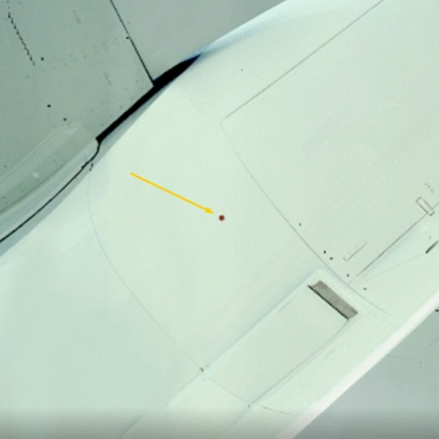

Finally, there are portable fire extinguishers in the cockpit and the cabin.

The number, type and locations depend on the different customer layouts.

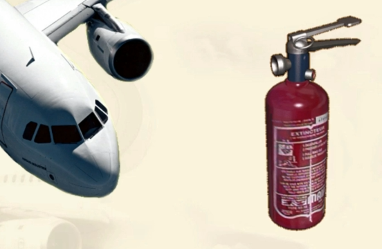

As an example, let's now study a cargo smoke procedure.

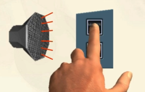

On the E/WD the message FWD CARGO SMOKE with the related procedure is displayed.

On the installed CARGO SMOKE panel, the related SMOKE light comes on and the ECAM COND page shows the automatic closure of the related cargo ventilation isolation valves.

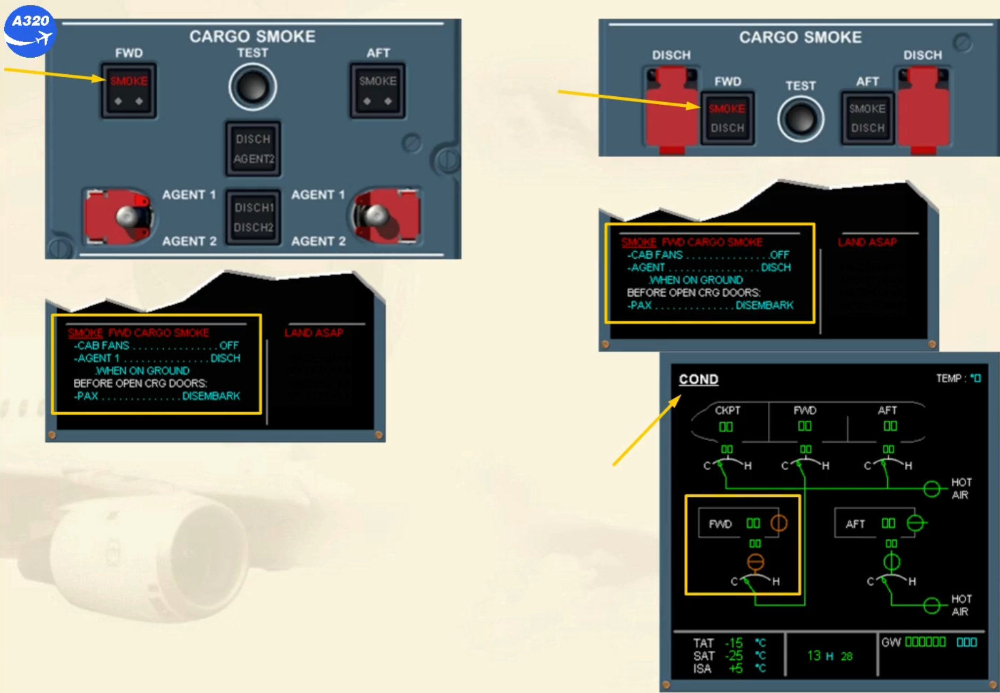

We did the first action for you. Then, we have also discharged the bottle (or the first bottle) into the related cargo compartment.

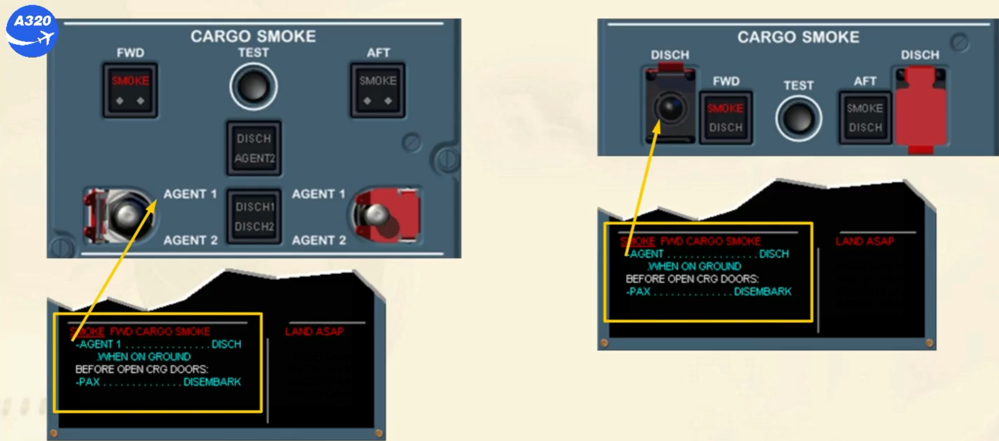

Note: The bottle (or the first bottle) will be discharged within around 60 seconds. This is confirmed by the related amber DISCH light.

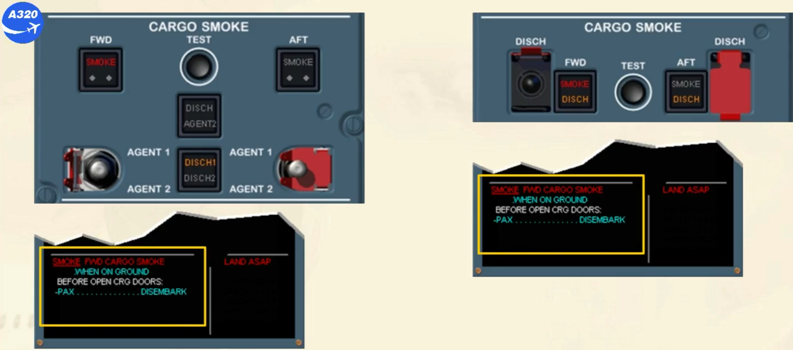

The ECAM has been cleared for you.

Expect the smoke warning to remain on, after the agent discharge and even if the smoke source has been extinguished. Because the gas from the smoke source are not evacuated and the smoke detectors are also sensitive to the extinguishing agent.

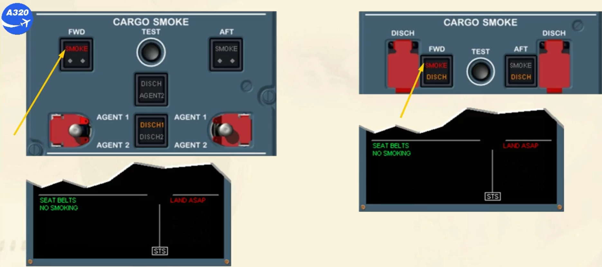

Only on the two bottles version, one hour later, a new caution is triggered, asking you to discharge the second bottle.

When the second bottle has been selected for discharge, the caution is cleared and due to the slow discharge the amber DISCH 2 light will come on only around 40 minutes after the AGENT 2 activation.

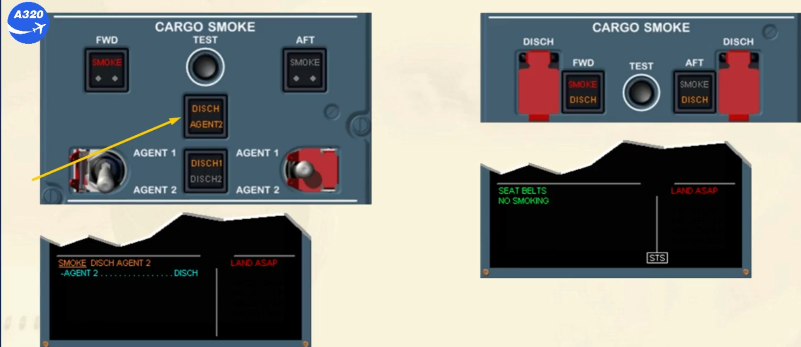

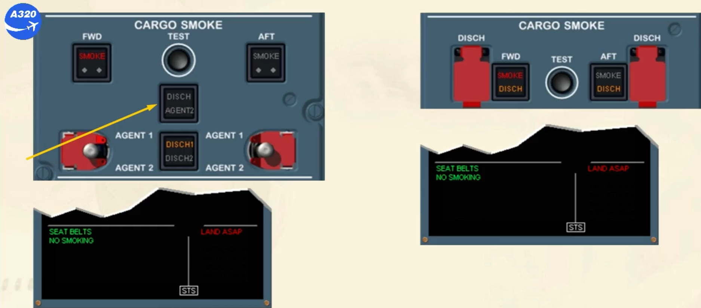

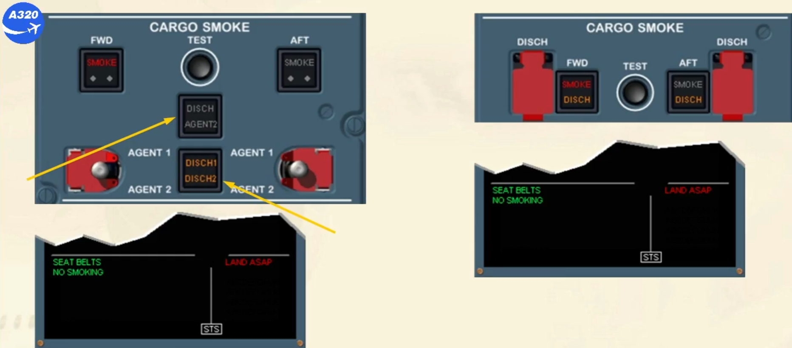

***Module completed***