In this module, we will be looking at how an A320 pilot and the aircraft computers interface to ensure safe and accurate flight with minimum workload for the crew.

For clarity in this module most references will be made to manual flight inputs.

However, the references apply equally to automatic flight unless stated otherwise.

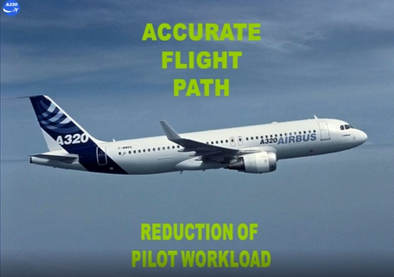

A side stick or an autopilot sends a message to the flight control computers asking for an aircraft maneuver.

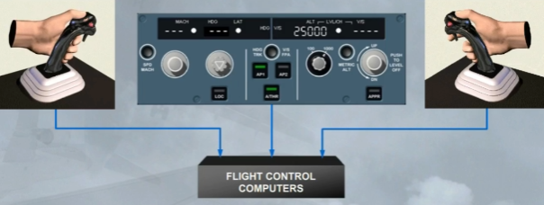

The flight control computers process the demand and send it to the control surfaces.

The processing uses pre-set limitations and instructions called LAWS.

The aircraft responds conventionally to the movement of control surfaces.

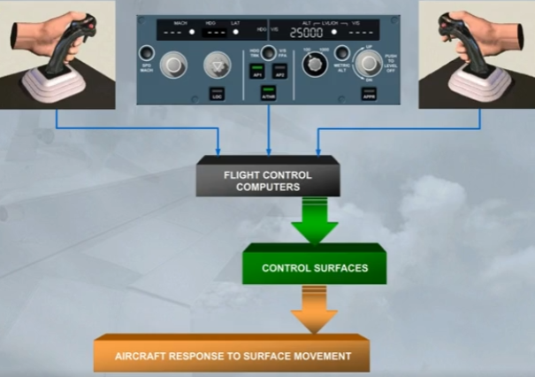

In normal law, pitch and lateral controls are modified depending on the phase of flight. They operate in 3 modes:
- Ground mode: on ground, when the aircraft is electrically and hydraulically powered, there is a direct relationship between sidestick deflection and surface deflection.
- Flight mode: after a gradual transition from ground mode just after lift off, it consists of a load factor demand with auto trim and protections throughout the flight envelope. This will be discussed later in this module
- Flare mode: modifies the flight mode to introduce a conventional "feel" to the landing phase, this has been discussed in the SYSTEM PRESENTATION module.

First, we will compare a conventional aircraft, an A310, with the fly by wire A320 in normal law flight mode.

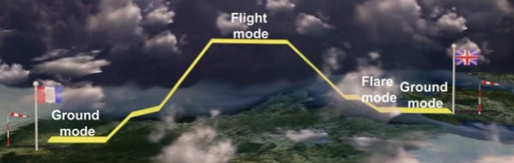

Control surface deflection is directly proportional to control yoke deflection.

The same yoke input produces a:
- Higher rate of pitch/roll at high speed
- Lower rate of pitch/roll at low speed.

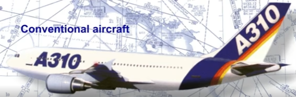

Control surface deflection is not directly proportional to side stick deflection. A side stick deflection gives a rate demand to the flight control computers. The flight control computers set control surface deflection to meet the rate demand.

For the same side stick input, the control surface deflections will be:
- Large at low speed
- Small at high speed.

A side stick input is a:
- Rate of roll demand in roll
- Load factor (g) demand in pitch.

Yaw control is conventional.

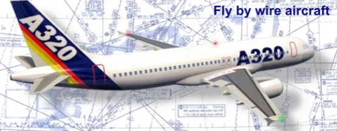

Remember, the A320 responds conventionally to the movement of control surfaces.

However, unconventionally, the response information is fed back to the flight control computers.

The computers process this feedback and adjust control surface deflection to ensure that the maneuver rate demand is executed accurately.

This means that control surface deflections may be altered with no change in side stick position.

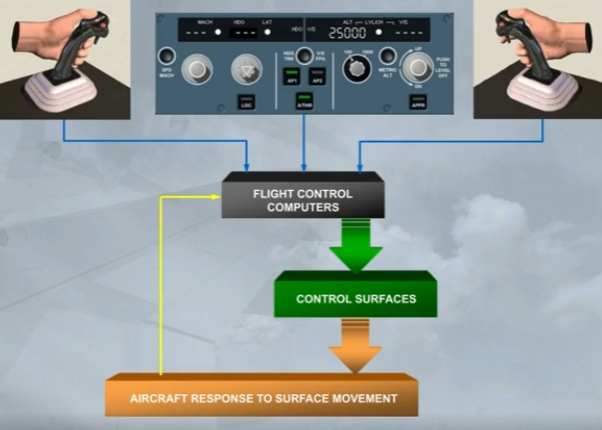

In flight mode, if you wish to execute, for example, a descending left turn, you set the required attitude and then return the side stick to neutral.

The neutral side stick position asks for zero rates of pitch and roll. The flight control computers will maintain the set attitude until you use the side stick to ask for an attitude change.

Throughout the maneuver, there are no pilot trim inputs.

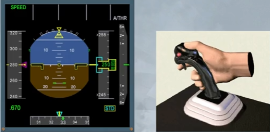

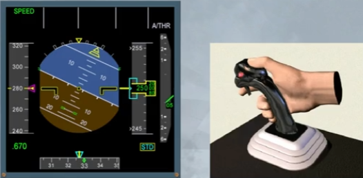

Turn co-ordination and "Dutch roll" damping are automatically provided in normal law.

Pilot inputs on the rudder pedals are not required.

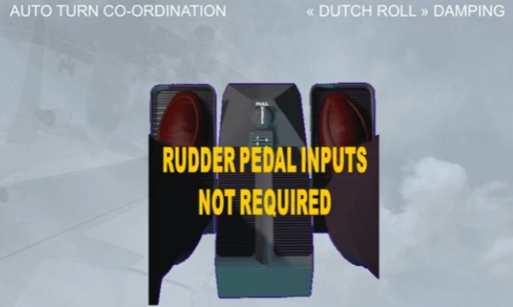

Normal law provides a number of airborne pitch protections. They are:
- Load factor limitation
- Pitch attitude protection
- High angle of attack protection
- High speed protection.

In lateral control, there is only one protection which is for bank angle. Let's take a closer look at these protections

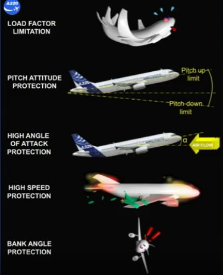

In a conventional aircraft, pilots must insure that structural limitations are not exceeded.

However, in the A320 family, load factor limitation is available in Normal law.

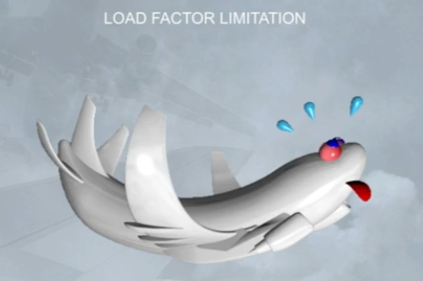

Load factor limitation prevents structural overstress by limiting control surface deflections through the flight control computers. Full side stick movement is always available.

The load factor is automatically limited to:
- + 2.5g to - 1 g in clean configuration,
- + 2 g to 0 g in other configurations.

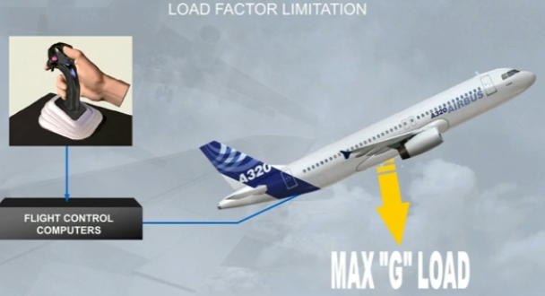

As with the load factor limitation, if the aircraft reaches the pitch attitude protection nose up limits, then the flight control computers will override pilot demands and keep the aircraft within the safe flight limits.

The pitch attitude protection limits are shown as small green dashes on the PFD.

Note that the pitch up values vary depending on the aircraft configuration and speed between 30 and 20 degrees up.

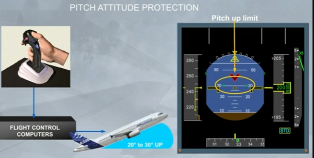

The nose down limit is at 15 degrees.

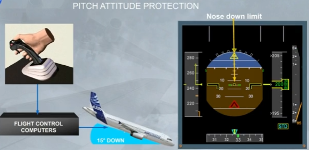

The high Angle Of Attack (AOA) protection is designed to prevent the aircraft from stalling and to ensure optimum performance in extreme maneuvers such as windshear or EGPWS warning recovery.

This protection takes priority over all others. This protection displays information on side of the PFD speed scale.

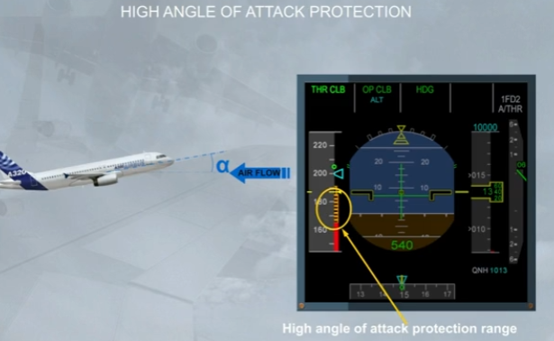

Let's begin with some definitions:
- VLS is the lowest selectable speed related to the stalling speed
- VαPROT is the speed related to the angle of attack at which the protection becomes active
- VαMAX is the speed related to the maximum angle of attack that may be reached in pitch normal law.

Under normal law, when the angle of attack becomes greater than αPROT, the system switches the elevator control from normal mode to a protection mode, in which the angle of attack is directly proportional to the side stick deflection.

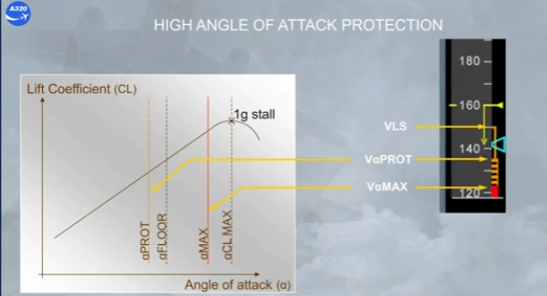

As speed decreases it stops at VLS, lowest selectable speed provided the autothrust is engaged.

Note: VLS is computed by the FAC and corresponds to:
- 1.13 VS during T.O or after a touch and go
- 1.23 VS after one step of flap retraction
- 1.28 VS in clean configuration.

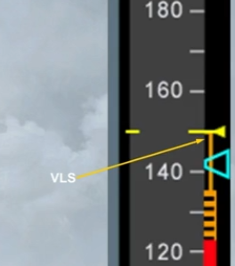

A low energy sound, repeated every 5 seconds, warns the pilot that the aircraft's energy level is going below a threshold.

Under this threshold, the pilot must increase the thrust to recover a positive flight path angle through pitch control.

The FAC computes an energy level taking into account the configuration, the horizontal deceleration rate and the flight path angle.

The low energy warning is available when following conditions are filled:
- In normal law and
- Above 100 ft RA up to 2,000 ft RA and
- In CONF 2, 3, or FULL and
- Not in TOGA.

Note: For more information, please refer to the AUTO FLIGHT system and the FCOM

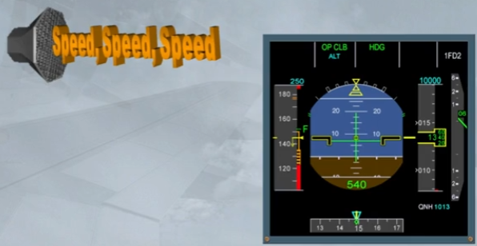

With autothrust inoperative or not engaged, the speed can reduce to the first level of the angle of attack (AOA) protection, VαPROT, which is shown at the top of the amber / black band (barber pole).

If engaged the autopilot will disconnect. Nose up pitch trim, is inhibited below VαPROT.

The flight control computers will maintain VαPROT as long as the side sticks are not used.

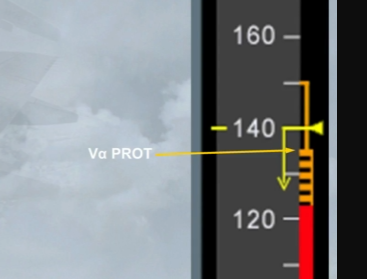

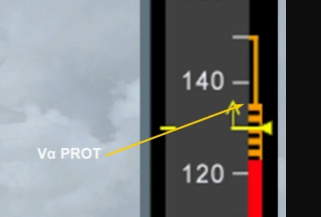

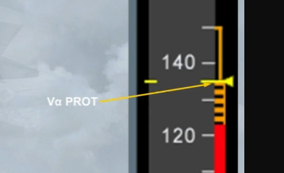

If the side stick is used by the pilot, the VαPROT can be overridden and the speed will reduce to VαMAX.

In normal law, the flight control computers will maintain VαMAX, even if the pilot holds his side stick fully aft.

In this protection range, the normal law demand is modified and the side stick input is an angle of attack demand, instead of a load factor demand.

Note: VαPROT and VαMAX vary according to the weight and the configuration.

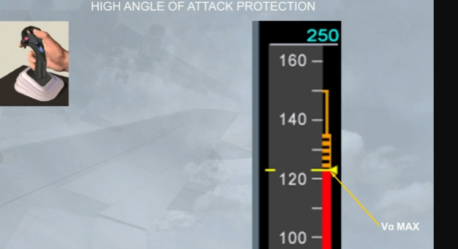

If the pilot releases the side stick at VαMAX, the flight control computers will return the speed to VαPROT, and will maintain it.

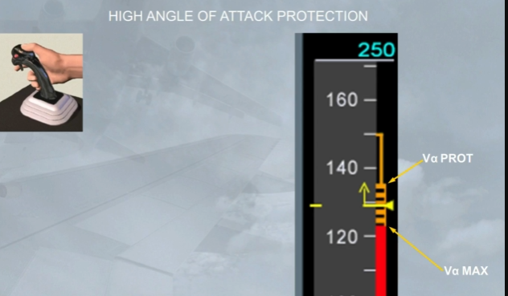

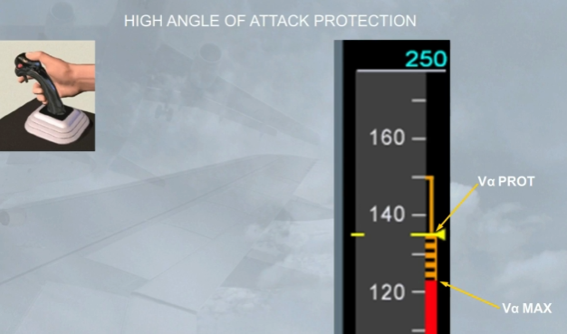

Independently of the VαPROT and VαMAX protections, as soon as the angle of attack is above a pre-determined threshold, which depends on the configuration, A/THR is automatically activated and commands TOGA thrust.

This is indicated by an "A FLOOR" indication on the FMA and also on the EWD.

Note: The a floor protection is usually available from lift-off to 100 ft RA on approach.

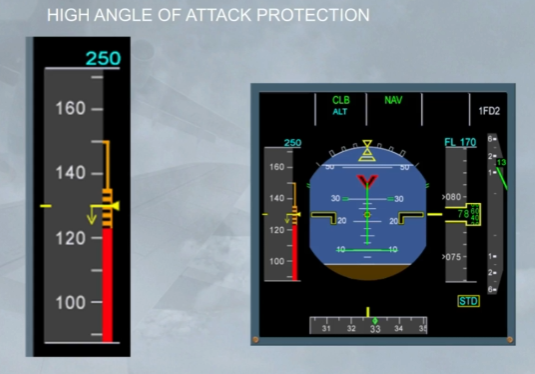

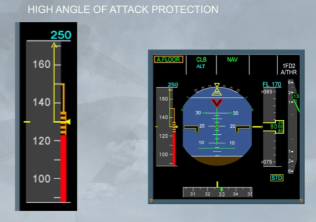

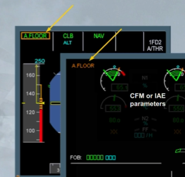

The protection we will look at now is the high speed protection. It is designed to prevent the aircraft from exceeding maximum speed.

These protection limits are displayed on the PFD speed scale.

VMO/MMO is shown as the bottom of the red/black barber pole.

Green dashes indicate the speed at which the protection is activated.

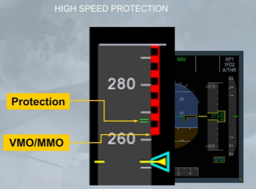

When the airspeed/Mach increases above VMO/MMO, just before reaching the green dashes, an ECAM warning is triggered, as shown.

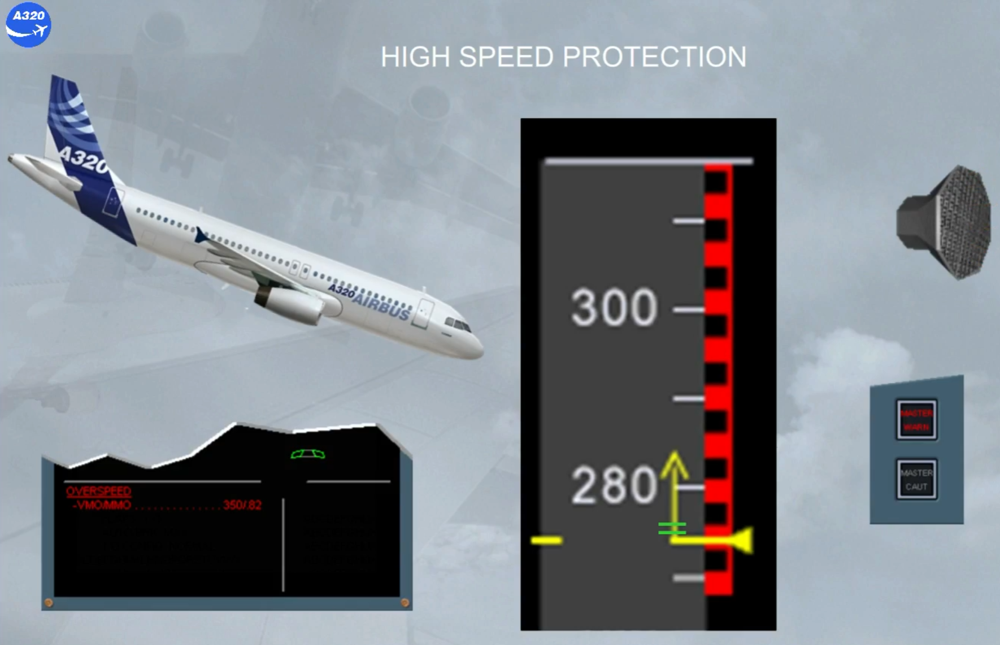

When the high speed protection is activated:
- The autopilot (if engaged) disconnects
- The side stick nose down authority is progressively reduced to prevent further acceleration
- The flight control computers apply a permanent pitch up order to help recovery to normal fight conditions.

As soon as the speed is below VMO/MMO, the usual normal control laws are recovered.

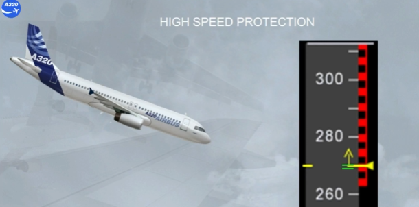

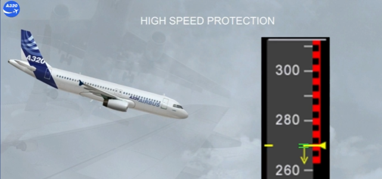

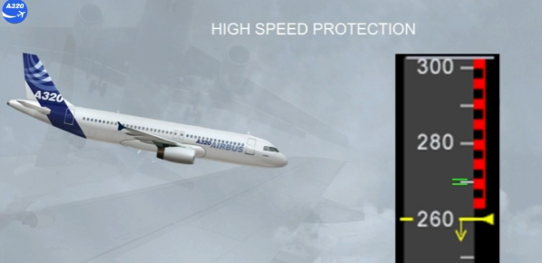

---

Under normal law, bank angle protection limits the angle of bank to 67 degrees, shown by green dashes on the PFD.

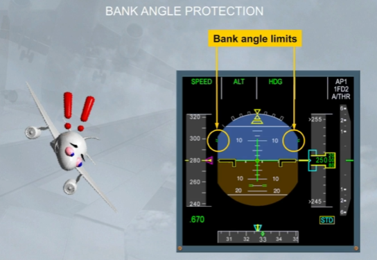

If the pilot holds a full lateral side stick deflection, the angle of bank starts to increase and when:
- Above 33 degrees, a positive spiral static stability is maintained, and the auto trim is inoperative
- Above 45 degrees, on the PFD the flight director indications are removed
- Reaching the green dashes, the bank stops and no further.

Note: if an abnormal bank occurs with an auto pilot engaged, it will disconnect when above 45 degrees.

:::note[My Note]

Spiral Stability Concept

If the directional stability is dominant (large fin) and the lateral stability not so strong, then if the
pilot banks the aeroplane with the ailerons, but does not touch the rudder, a sideslip towards the
lower wing occurs. The directional stability yaws the aeroplane's nose into the sideslip and the turn
will be nearly balanced, even without the pilot touching the rudder. This yaw will cause further
roll and so the aircraft will then roll further into the turn. This tendency to steepen the turn, com-
mon to most aircraft, is spiral instability or spiral mode. The designer has the task of balancing the
Dutch roll characteristics against the spiral mode.

:::

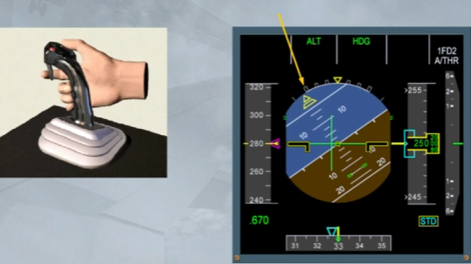

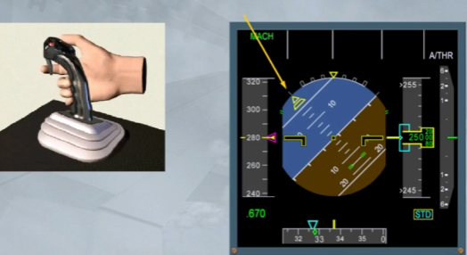

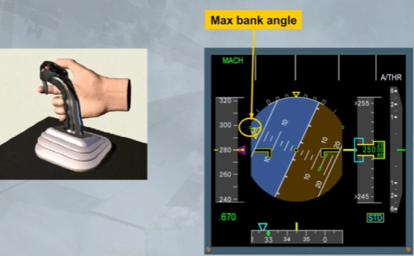

Each time the bank angle is above 33 degrees, if the pilot releases the side stick:
- The bank angle automatically reduces to 33 degrees and will maintain it. Also, the auto trim is again operative.

Note: With a bank above 45 degrees, the flight director indications are removed, but they will be displayed again as soon as the bank is below 40 degrees.

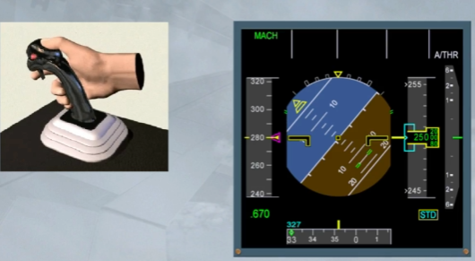

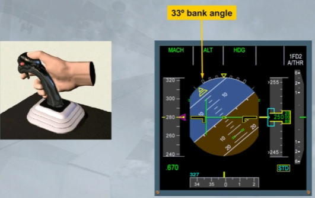

Below 33 degrees, when the pilot releases the side stick, the roll attitude is maintained constant.

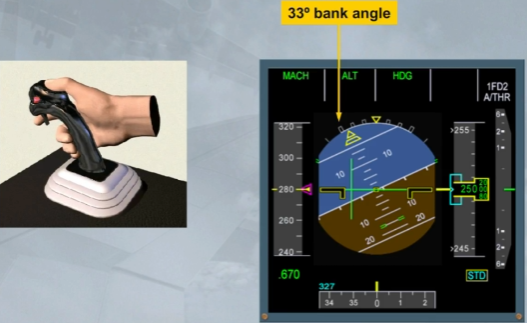

With the angle of attack protection active:
- The bank angle is limited to 45 degrees and no further.

With the high speed protection active:
- The system maintains a positive spiral stability to 0 degree bank angle, so that if the side stick is released the aircraft returns to wings level. The bank angle limit is also reduced from 67 to 40 degrees.

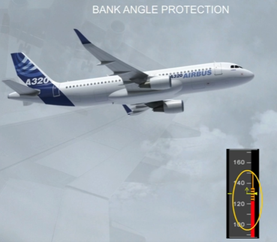

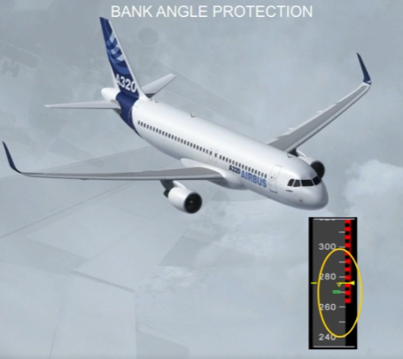

In manual flight, if one engine fails, the FAC modifies the sideslip indication displayed on the PFD in order to show the pilot how much the rudder has to be used to obtain the best climb performance with ailerons at neutral and spoilers retracted.

The sideslip target will change to blue if the engine fails during takeoff or go around.

Note: When it is blue it is called β target. (For more information, refer to your FCOM -ATA 31 or DSC-31).

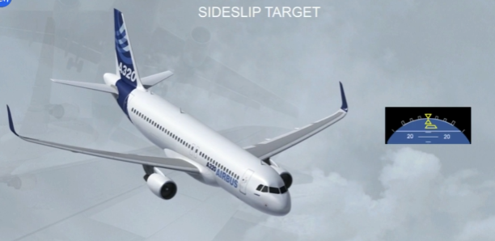

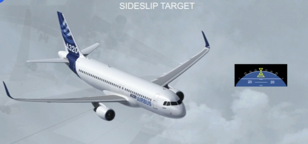

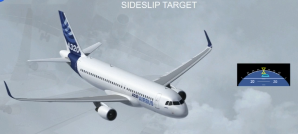

***Module Completed***