A single failure cannot result in the loss of normal law.

However, multiple failures of flight controls, hydraulic, or electrical systems may result in a degradation of the flight control normal law. The level of degradation will depend on the severity of the failures.

Degradation of the flight control normal law leads to the reconfiguration control laws. There are three levels of reconfiguration:
- Alternate law
- Direct law
- Mechanical.

We will study these reconfiguration control laws by order of severity.

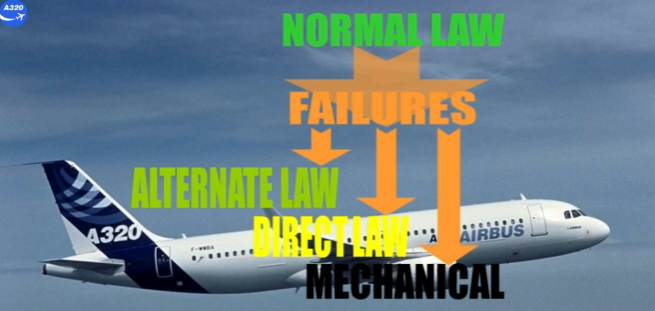

---

Let's start by the alternate law, which has two levels of degradation:
- Alternate law with reduced protections
- Alternate law without reduced protections.

In alternate law with reduced protections, pitch and lateral controls are modified depending on the phase of flight, and they operate in 3 modes:
- Ground mode, is like in normal law.
- Flight mode:
    - In pitch control:
        - Load factor demand is like in normal law
        - There are no pitch attitude protections.
    - In roll control:
        - Roll control is conventional, as surface deflection is directly proportional to side stick deflection. Surfaces used for the roll control will be the ailerons and spoilers 4 and 5
        - Note: If the spoiler 4 is inoperative the spoiler 3 will take over and if the ailerons are inoperative all roll spoilers will be active
        - Roll rate depends on configuration.
    - In yaw control:
        - Turn coordination is lost
        - Damping is available with limited authority of the rudder.
- Flare mode is activated when landing gear is selected down:
    - It is a direct stick-to-elevator relationship, as in direct law (discussed later).

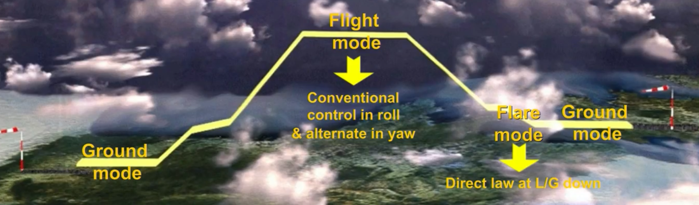

Degradation to alternate law is indicated by the ECAM caution F/CTL ALTN LAW (PROT LOST). A limited speed is indicated due to the loss of high speed protection.

Note: If the degradation to alternate law is due to a loss of two hydraulic systems, the limited speed will be as shown.

Under alternate law, most of the normal law protections are lost. But some of them are replaced by stabilities. We will continue by studying these stability protections.

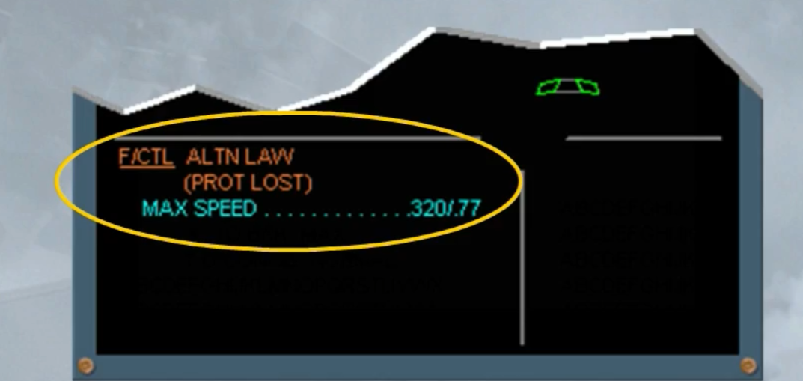

Pitch attitude protection is lost and the flight control computers will not limit the nose up or nose down pitch attitude.

On the PFD, the green dashes, which mark the protection limits in normal law, are replaced by amber crosses.

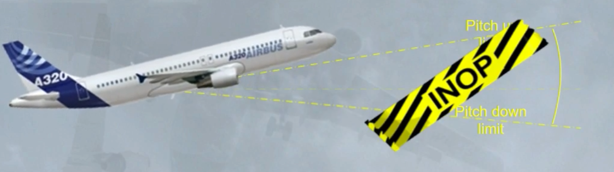

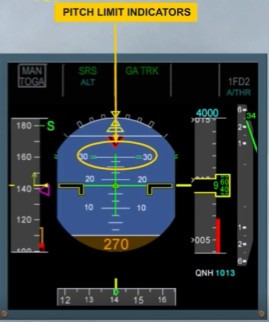

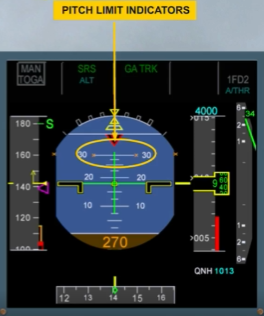

Bank angle protection is lost.

On the PFD, the green dashes are replaced by amber crosses.

Note: if an abnormal bank occurs with an auto pilot engaged, it will disconnect when above 45 degrees.

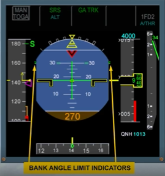

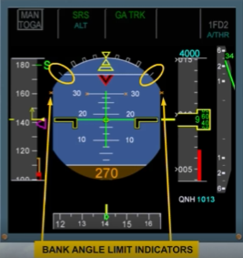

The load factor limitation is similar to that in normal law.

So we will go straight to the differences between the low and high speed protections of normal law and the low and high speed stability protections of alternate law.

The normal angle of attack protection is replaced, in alternate law, by an artificial low speed stability which is available for all configurations

Note: The α FLOOR protection is inoperative.

On the PFD, Vα PROT and Vα MAX are replaced by a stall warning speed (VSW), indicated by a red and black barber pole.

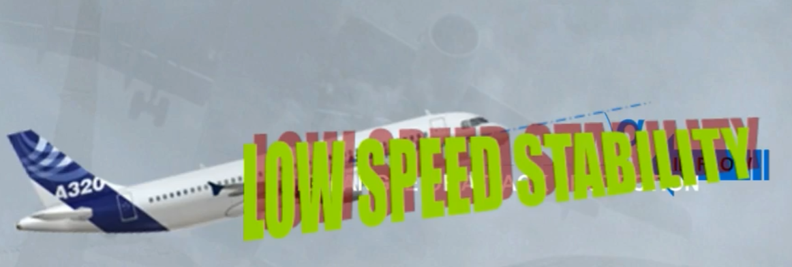

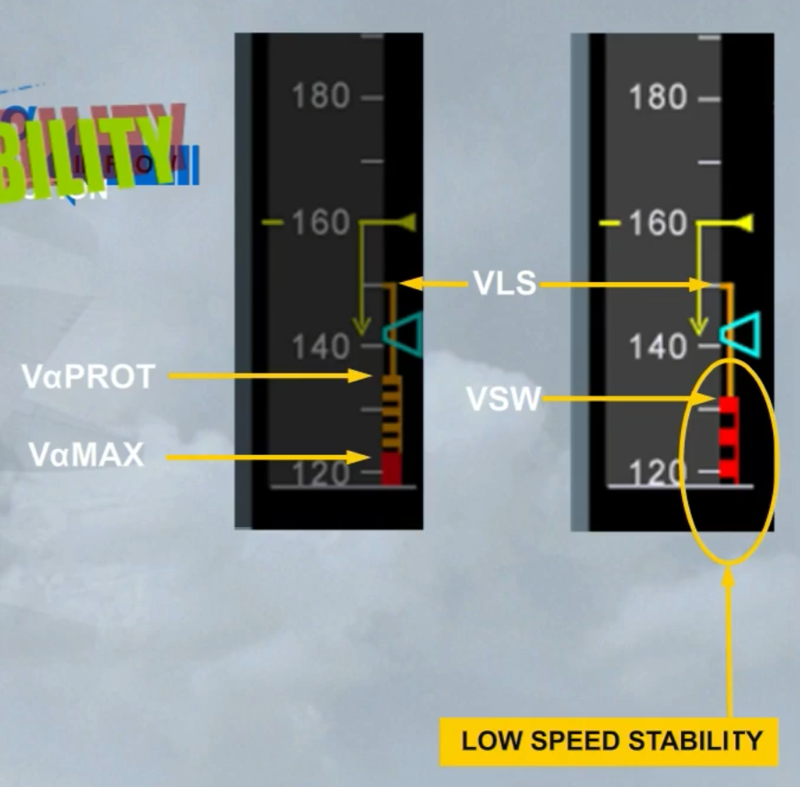

If the speed approaches VSW, the low speed stability activates and a gentle progressive nose down input is introduced which tends to keep the speed from falling below VSW.

Note: The pilot can override the pitch down input with a side stick input.

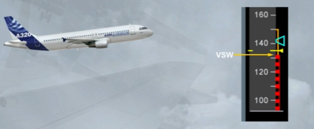

At an appropriate margin from the stall condition, an aural stall alert is activated because the aircraft will stall if this alert is ignored.

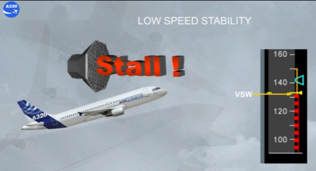

The normal high speed protection is replaced, in alternate law, by a high speed stability.

On the PFD, the green dashes are removed.

Above VMO/MMO, a nose-up demand is introduced to prevent further speed increase. The pilot can override the nose up input with a side stick input.

Note: If the speed exceeds VMO/MMO, the auto pilot, if engaged, will disconnect and in addition the ECAM "OVERSPEED" waring is triggered, like in normal law.

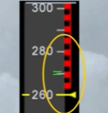

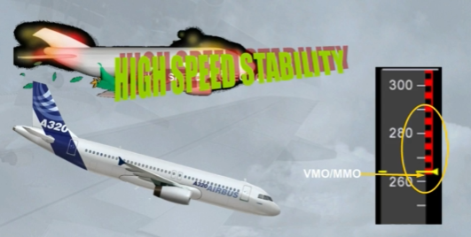

---

Remember that, depending on the failures, the reconfiguration to alternate law can be without reduced protections. So, only the load factor limitation remains available and is similar to that in normal law.

Also, stall aural alerts and ECAM "OVERSPEED" warning are still operative.

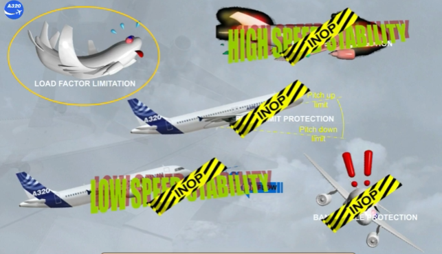

---

Direct law is the lowest level of computer flight control. Pilot inputs are now sent to the control surfaces unmodified.

Because of the large number of failures required to degrade to direct law, it is unlikely to occur during normal flight.

It is most likely to be encountered when the landing gear is lowered after an in-flight degradation to alternate law.

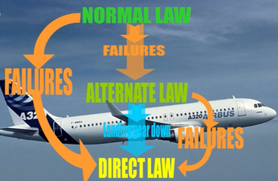

Under alternate law, when the landing gear is extended, the control law will degrade to direct law.

You will get an ECAM caution as shown, and additional messages on the PFD. We will study them later on.

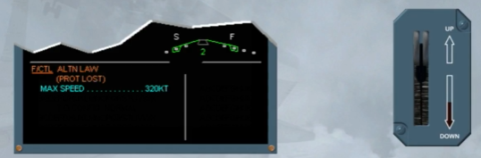

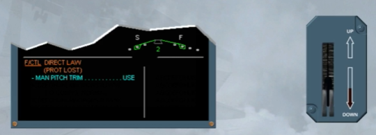

Note: If the control law is degraded to direct law before landing gear extension, additional information is shown on the E/WD. This additional information is cleared after the landing gear extension.

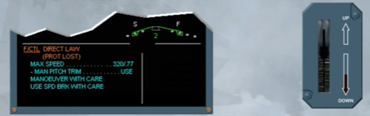

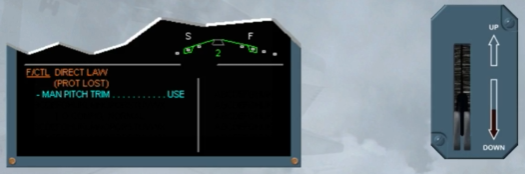

Direct law, as the name implies, gives a direct relationship between side stick movement and the deflections of all surfaces.

The A320 behaves like a conventional aircraft.

In direct law, the roll control is similar to that of the alternate law.

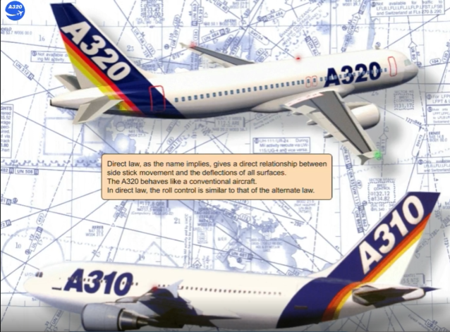

Under direct law, there are no protections available. But, stall aural alerts and ECAM "OVERSPEED" warning are still operative.

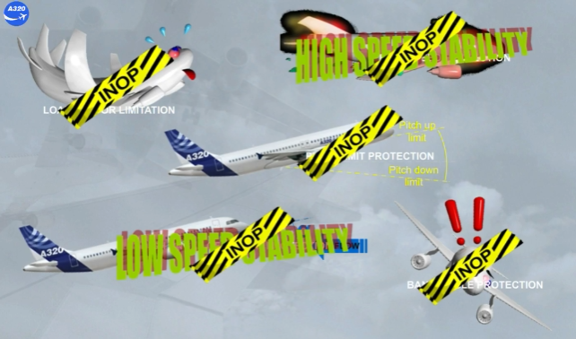

As the auto-trim is not available, the pilot must trim the aircraft manually. An amber message "USE MAN PITCH TRIM" is indicated on the FMA.

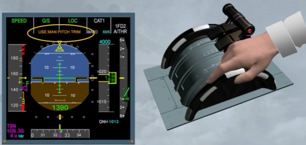

Auto turn co-ordination and "Dutch roll" damping are also lost. All yaw control in direct law is through the rudder pedals.

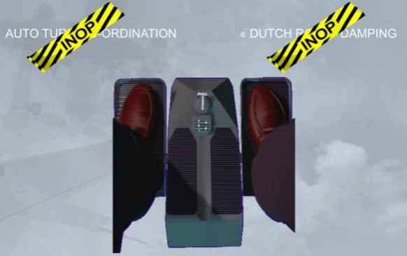

In the worst case of failures, such as complete loss of flight control computer power supply, the aircraft will revert to mechanical back-up mode.

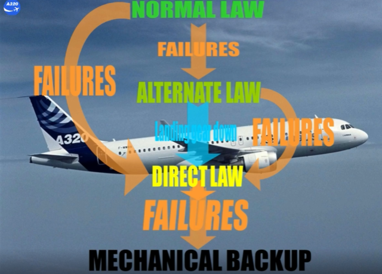

In this temporary mode, the only method for pitch control is manual adjustment of the THS using the pitch trim wheel, provided either green or yellow hydraulic system is available.

A red message "MAN PITCH TRIM ONLY" is displayed on the FMA.

Also, in this temporary mode, the lateral control is achieved by using the rudder pedals and their mechanical linkage to the rudder, provided at least one hydraulic system is available.

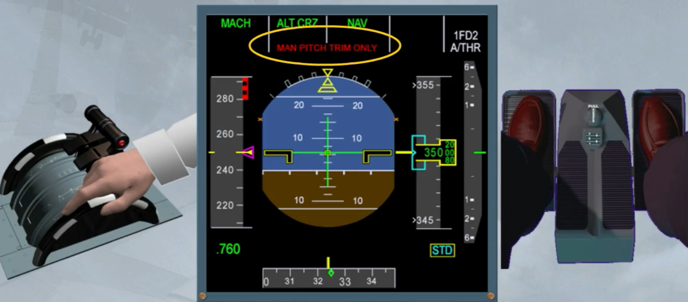

The mechanical backup is a temporary mode because in most cases (e.g. by resetting the flight control computer), you will be able to recover from mechanical backup to either alternate or direct law depending on the type of failure.

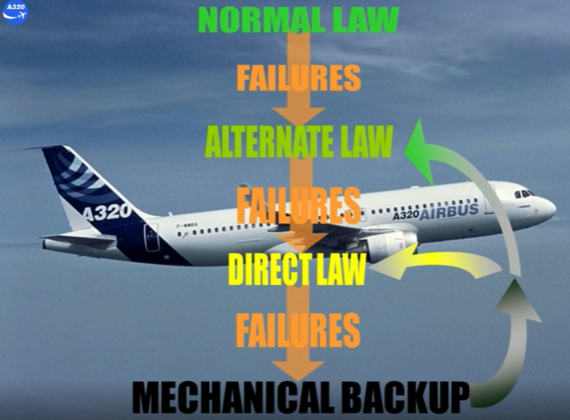

---

We will now see a brief summary of the different laws and their associated protections.

Under normal law, all the protections are operational.

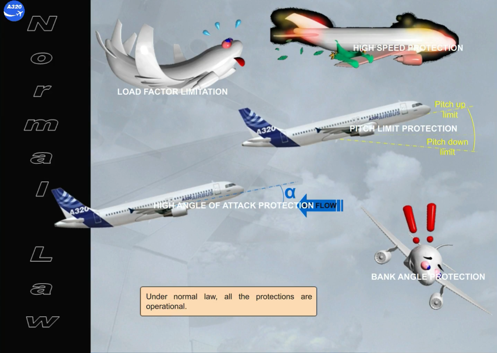

Under alternate law, the pitch limit protection and the bank angle protection are lost.

Load factor limitation is kept. High and low speed stabilities are introduced as reduced protections.

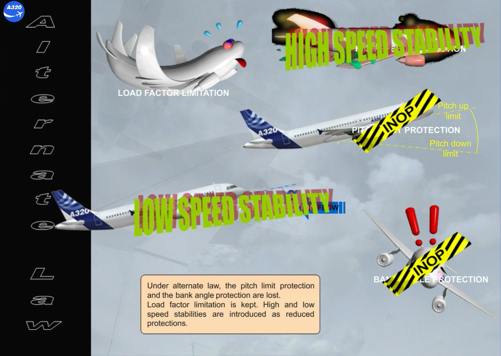

Under alternate law without reduced protections, the high speed and the low speed stabilities are also lost.

The only remaining protection is the load factor limitation.

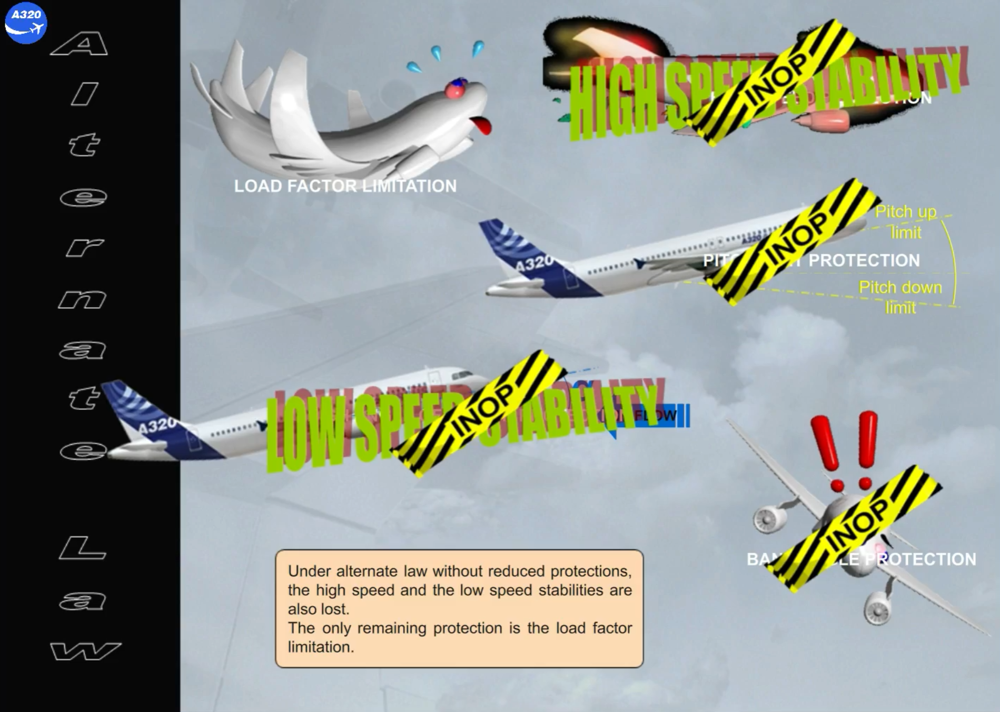

Under direct law, all the protections are lost and the aircraft handles as a conventional aircraft.

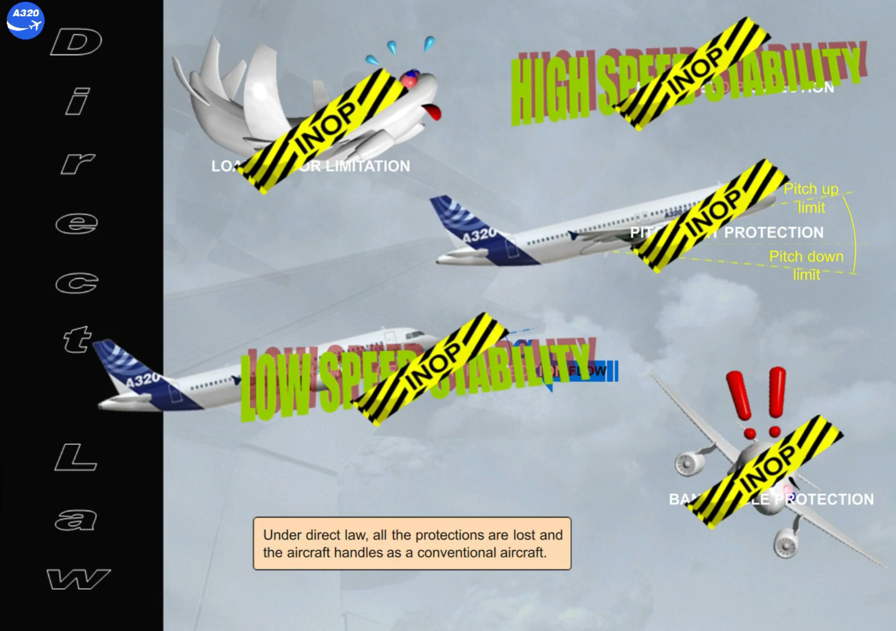

In mechanical backup, as no protection exists, the pitch control is only done via the pitch trim wheel and the lateral control is only through the rudder pedals thanks to their mechanical linkages, provided the appropriate hydraulic systems are available.

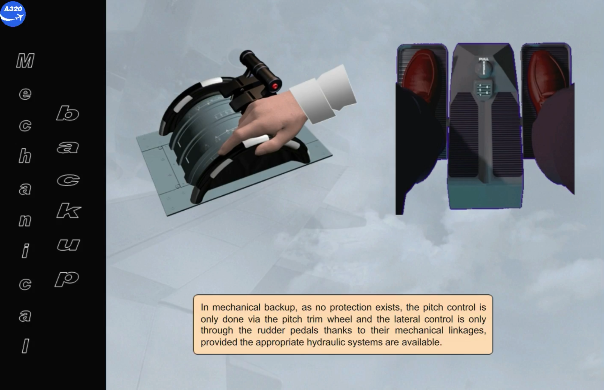

---

You have seen all the different laws and protections.

May be you wonder how to recover if extreme conditions cause the aircraft to leave the protected envelope? (e.g. You have been flipped over by a very severe turbulence)

Here is the answer. If the limits of normal laws are exceeded, abnormal attitude laws become active. This is a safety feature to ensure that the flight control computers will never prevent the pilots recovering from an abnormal in-flight
attitude.

The flight control laws operate in alternate law without protections and stabilities except for load factor protection.

After recovery, controls remain in alternate law without protections but with auto trim. There is no reversion to direct law when the gear is extended.

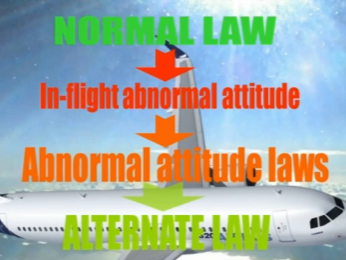