In the A320 family, manual roll and pitch are controlled by the side sticks.

They are spring-loaded to neutral and receive no feedback from the flight controls.

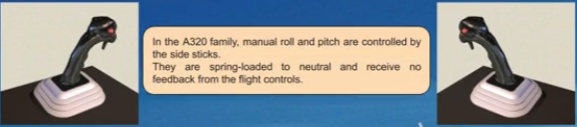

The side stick has an ergonomic design. It has on its top a hollow for the thumb rest.

The normal use is to grasp the stick, rest the thumb in the hollow, being ready to press the takeover push button when needed (explained later in this lesson).

The index is used to press the trigger to talk (Refer to ATA 23-Communications chapter).

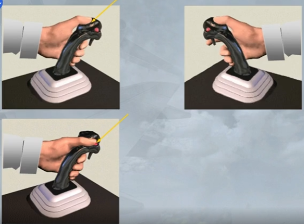

Movement of one side stick will not cause movement of the other.

In this case, as the left side stick is moved, the right remains in the neutral position

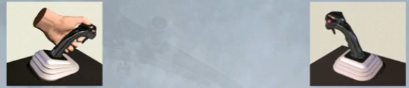

All side stick commands are processed through the flight control computers before being sent to the control surfaces.

You can see that, as one side stick is pushed forward, the elevators move down in response.

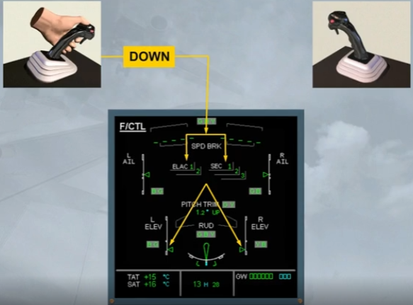

If both side sticks are operated at the same time, their deflections are algebraically added together.

In this example, as the side sticks are moved in opposite directions, the elevators remain in the neutral position.

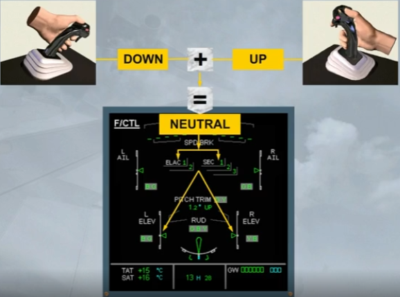

When both side sticks are moved in the same way, the total demand is never more than full deflection on only one side stick.

Here, as both side sticks are moved forward, the elevators achieve normal full down deflection but no more.

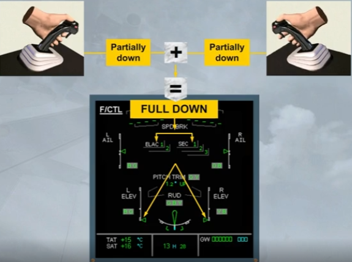

When either autopilot is engaged, both side sticks lock into their neutral position.

Notice that if a pilot applies sufficient force in pitch or in roll, the side sticks become free and the autopilot disengages with audio and visual warnings.

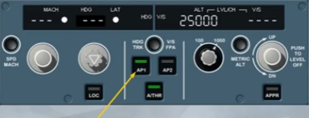

The autopilot has disengaged.

The associated audio and visual warnings will continue until cancelled by the crew, by pressing on the AP disconnect pb, or by pressing on either master warning light. This will not clear the ECAM warning message, because this disconnection is not a normal procedure.

As you will perform this many times in your simulator sessions, we will now continue with the AP disconnect and takeover pb.

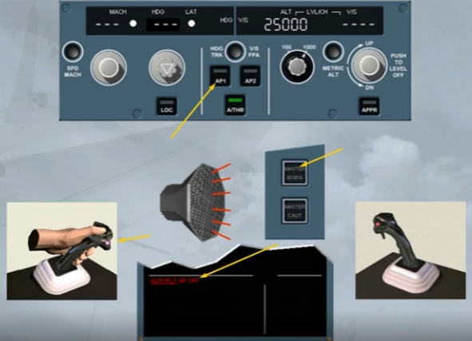

The autopilot has been re-engaged for you.

Each side stick is fitted with a red autopilot disconnect and side stick takeover pb.

By pressing it, a pilot disconnects the autopilot.

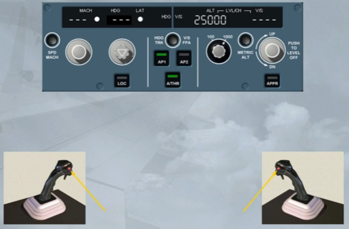

Notice that, on the FCU, the autopilot has disconnected, and the audio and visual warnings are triggered. Also a red AP OFF memo message is displayed on the E/WD.

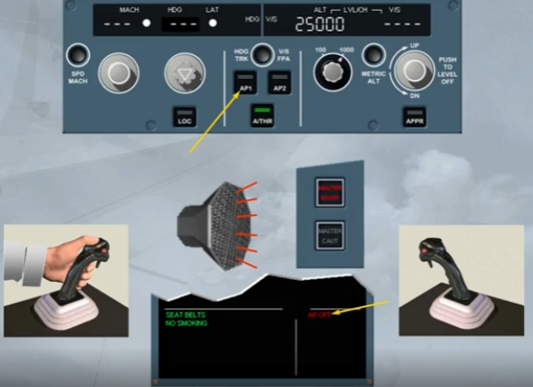

The related audio and visual warnings can be cancelled:
- By pressing immediately the autopilot disconnect pb a second time or
- Automatically after a few seconds, if no pilot action has been taken.

Because this is the normal procedure to disconnect the auto pilot.

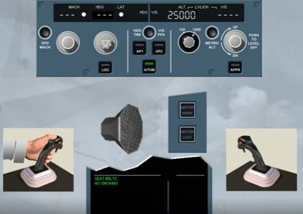

A side stick priority logic has been defined to avoid unwanted overcontrol, when both side sticks are used simultaneously, as their inputs are algebraically added. Let's study it in more detail.

By pressing and holding a takeover pb, a pilot can deactivate the opposite side stick.

Audio and visual indications are provided to identify which pilot has control of the aircraft.

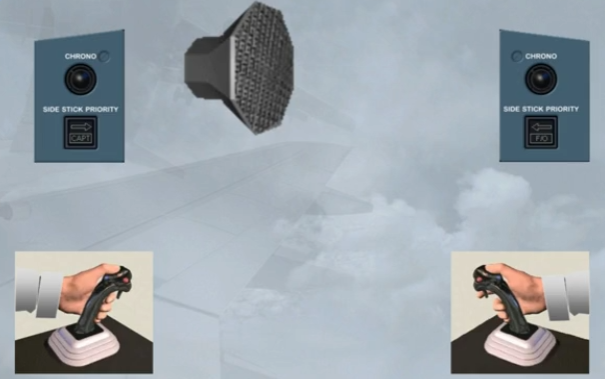

You heard the audio warning, notice there is also a red SIDE STICK PRIORITY arrow in front of the F/O indicating that his side stick is inoperative.

The arrow points left showing that the Captain has control.

If the First Officer had taken over, the message would have been "Priority right" and the red arrow in front of the Captain would have illuminated.

To see what happens when the deactivated side stick is moved ....

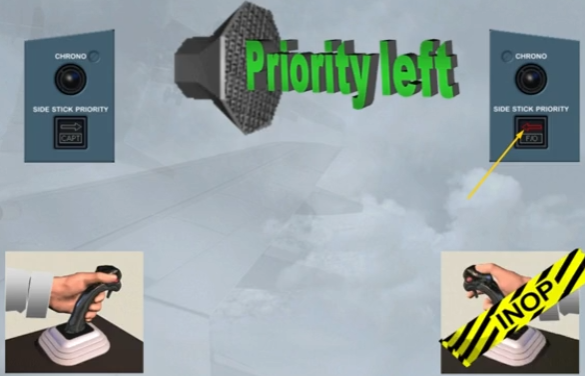

... A green light comes on in front of the pilot who is in control of the aircraft, here the CAPT.

Also, it indicates to the pilot in control of the aircraft, if he releases his take-over pb both side stick inputs will be again added. So, it is recommended that the take-over pb is kept pressed for more than 40 seconds. This allows the pilot to release his take-over pb without losing his priority, as the other side stick is now permanently deactivated.

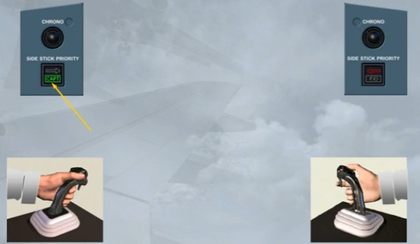

The green light goes off when the other pilot has returned his side stick to neutral position.

However, a pilot can reactivate the deactivated side stick by momentarily pressing on either take-over pb.

If both pilots press their takeover pbs, the pilot that presses last gets priority.

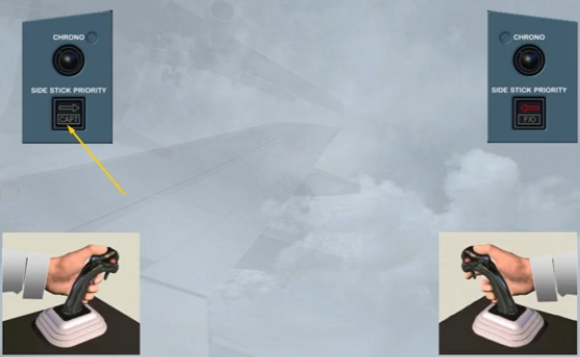

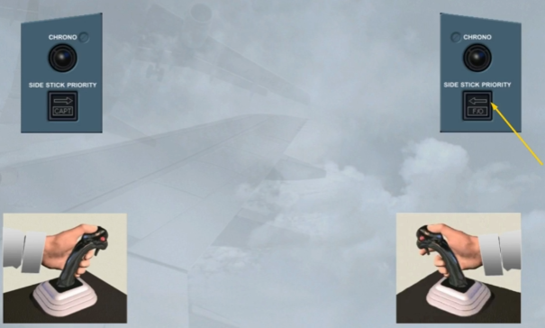

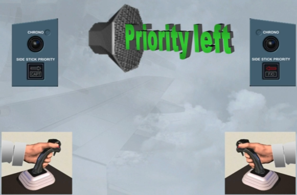

If you heard the audio warning and saw both green lights flashing, they indicate a simultaneous control inputs, when no priority has been yet taken.

Simultaneous control inputs are never recommended. If a pilot must make a control input, he must press his takeover pb.

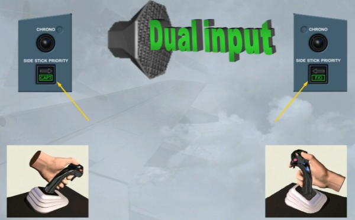

***Module completed***