We will begin this module by explaining the basic concept of the "Fly By Wire" system.

In conventional aircraft, the movement of the control column is transferred along cables and pulleys, until it reaches the
control surface to be moved.

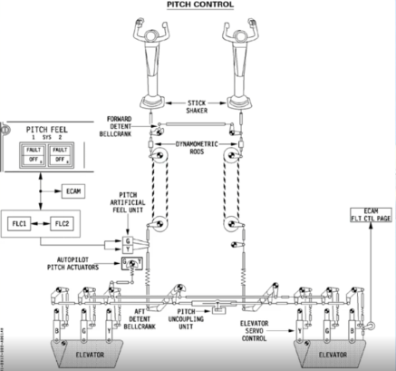

In the A320 family the cables and pulleys have been replaced by electrical wires.

This has the advantage of saving weight on the aircraft. However, there are, even greater advantages.

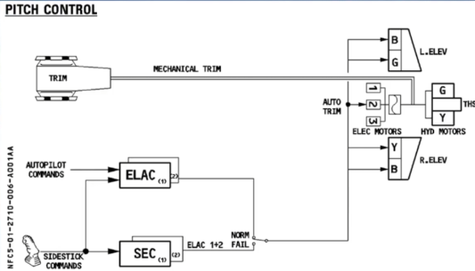

The electrical signals created by sidestick movement travel through flight control computers before being transmitted to the surface hydraulic actuators, also named servo controls.

These computers analyze the signal to check that it is a safe command and ensure the optimum flight control surface deflection for the demand.

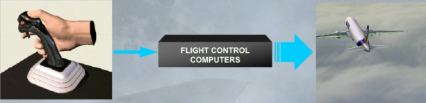

This has advantages over conventional systems. It:
- Makes the aircraft extremely stable
- Enhances safety
- Reduces the workload of the pilot.

Let's now look at the flight control surfaces themselves.

---

The flight control system includes:
- Ailerons
- Elevators
- A Trimmable Horizontal Stabilizer (THS) for pitch trim
- A rudder
- Spoilers for speed brake or ground spoiler function.

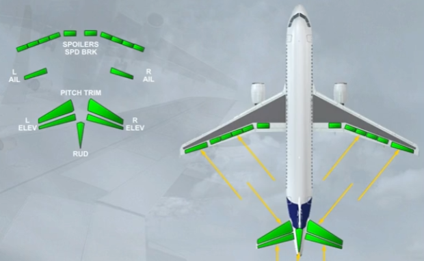

Now let's introduce the ECAM FCTL page. You can see thạt ail the flight control surtaces we have talked about are displayed. We wil now see them in more detail.

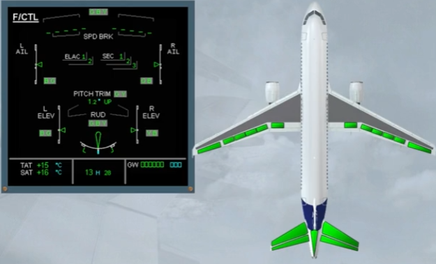

The movements of both ailerons and both elevators are symbolized by a green index moving in front of a white scale.

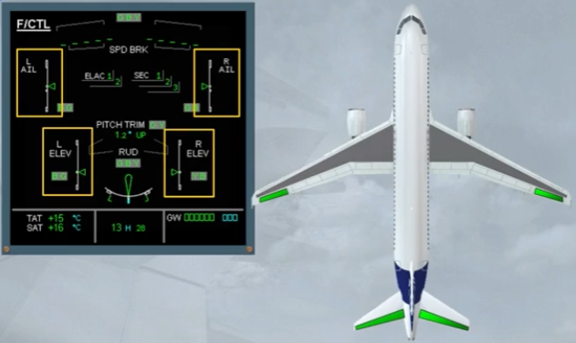

The green rudder symbol is used as an index to display the movements of the rudder on a white scale.

The rudder trim is indicated by a small blue line below the scale.

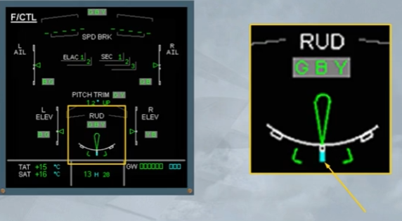

Note that the rudder and the pedal deflections are limited as a function of speed via a rudder travel limiter.

The travel limiter is indicated by two green brackets, which move, according to the speed, to a minimum deflection (HI SPEED) or to a
maximum deflection (LO SPEED).

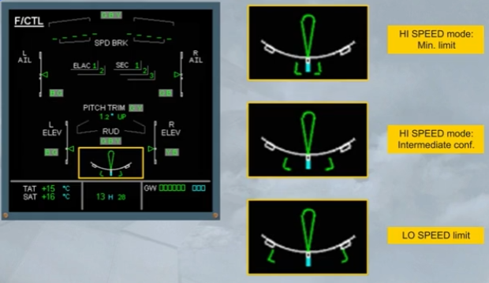

The PITCH TRIM position is indicated by THS deflection in degrees up or down.

Let's continue with the spoilers.

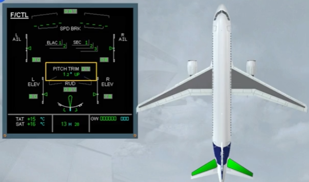

The five spoilers, installed on each wing, have several functions:
- Speed brake function, uses the 3 central surfaces
- Roll control function, uses the four outer surfaces
- Ground spoiler function, uses all surfaces.

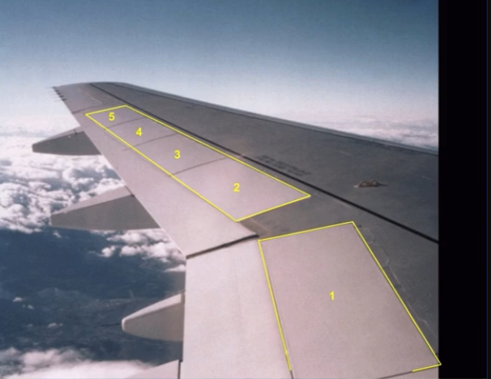

On the ECAM F/CTL page, the spoiler extended position is indicated by small arrows. This is the case of the speed brakes.

Now, we will look at the flight control computers.

 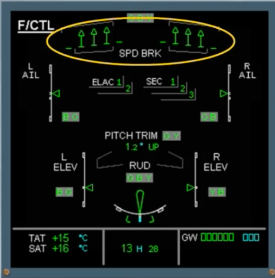

The movements of the flight control surfaces are managed by seven computers. These are:
- Two ELevator and Aileron Computers (ELAC)
- Three Spoiler and Elevator Computers (SEC)
- Two Flight Augmentation Computers (FAC).

Note: FAC computers belong to AFS computers, they do not appear on the ECAM F/CTL page.

 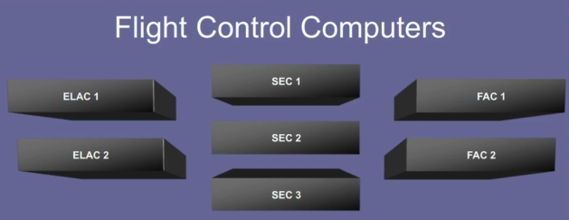

In addition, two Flight Control Data Concentrator computers (FCDC) are used to acquire data from the ELAC and SEC. Then, they send it to the EIS.

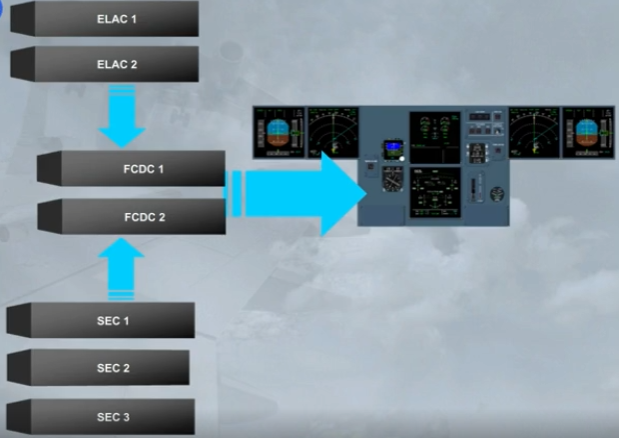

However, the data from both FACs is sent directly to the EIS.

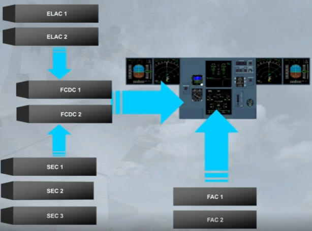

The status of ELAC and SEC is indicated on the ECAM F/CTL page. The other computers are not displayed.

These indications will be seen in more detail in the FAILURE CASES module.

Now, we will see the hydraulic aspect.

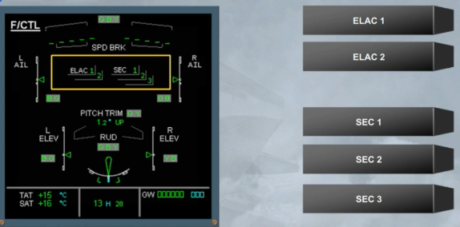

Three independent hydraulic systems are used to power all the flight control surfaces.

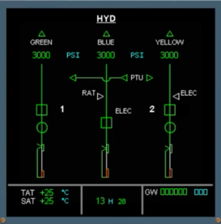

The hydraulic systems which actuate each control surface are indicated on the ECAM F/CTL page by the use of G, B and Y.

For example, the rudder is powered by the Green, Blue and Yellow hydraulic systems.

The ECAM F/CTL page is now complete.

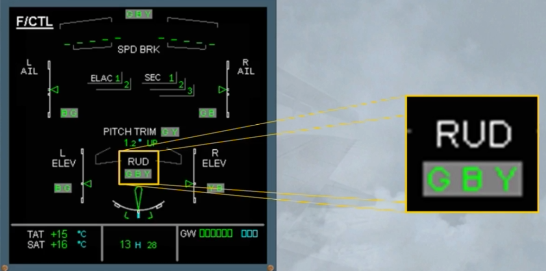

Pilots control pitch and roll through two side sticks.

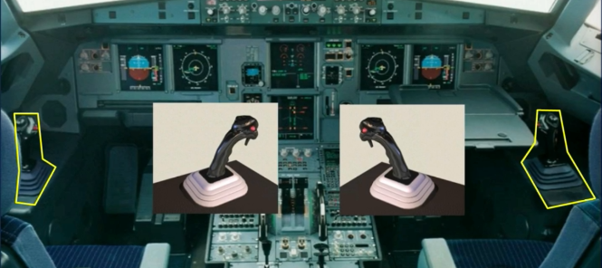

There are related side stick priority lights. Side sticks and priority lights will be explained in a separate module.

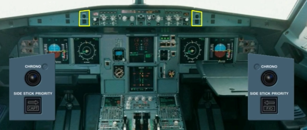

Pitch trim wheels are located on the center pedestal.

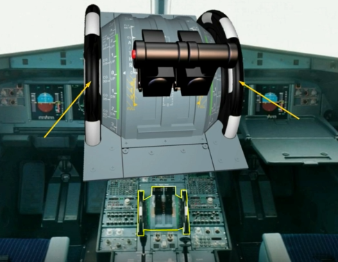

There are two sets of conventional and mechanically interconnected rudder pedals.

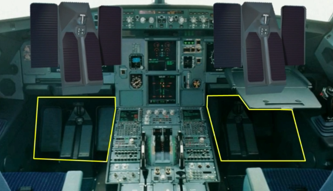

A RUD TRIM panel is located on the pedestal.

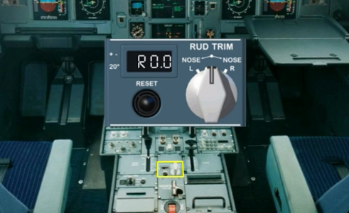

A speed brake lever is located on the left side of the pedestal.

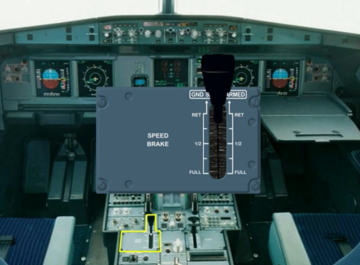

In addition, there are two panels, located on the overhead panel to control the flight control computers.

Now, we will introduce the lift augmentation devices.

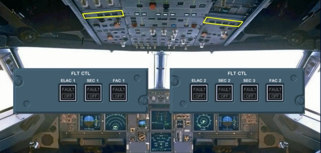

There are 5 slats on each leading edge...

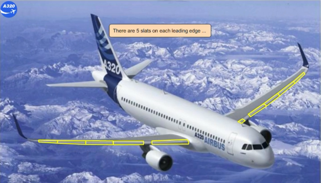

... and 2 flaps on each trailing edge.

The slats and flaps are hydraulically actuated like all the other surfaces. They are electrically controlled via two Slat Flap Control Computers (SFCC).

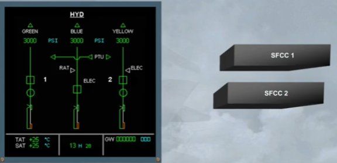

Each SFCC has two channels, one for the flaps and one for the slats. In normal condition, both FLAP channels or both SLAT channels operate simultaneously the related surfaces. If only one channel is available, it can drive its related surfaces, but slowly.

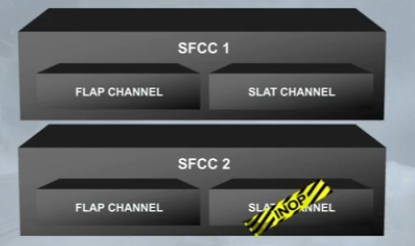

The FLAPS lever, located on the right side of the pedestal, operates the slats and flaps.

The FLAPS lever has the following positions: 0, 1, 2, 3 and FULL.

Also, the FLAPS lever can be set :
- From position FULL to only position 3
- From position 3 to position FULL, or to position 2, or directly to position 1
- From position 1 directly to position 3, or to position 2, or to position 0
- From position 0 to only position 1.

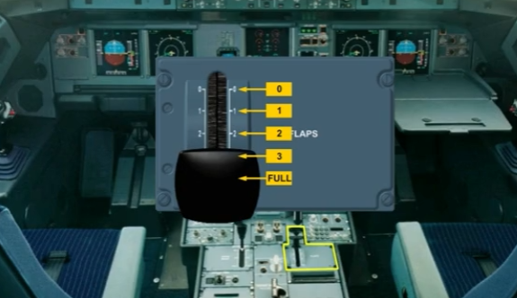

The flaps and slats information is shown on the E/WD.

The flap and slat positions are indicated by white dots.

Note: The FLAPS lever position 1 will correspond to two configurations, which depends on the speed:
- Configuration 1, or
- Configuration 1+F.

Here, the surfaces are extended to configuration 1 +F.

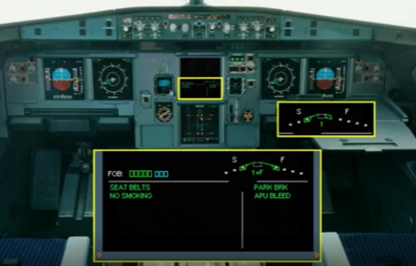

This is the flap 0 indication.

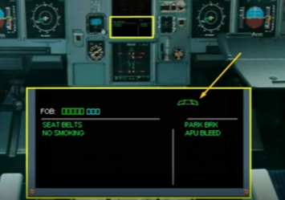

The slats and flaps have protection functions.

In particular the detection of surface asymmetry between left and right wing, surface attachment failure, mechanism overspeed or uncommanded movement of the surfaces. All these protections will be studied later.

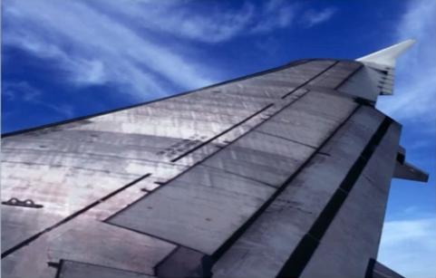

Let's review some operational indications.

The pitch trim values related to the takeoff CG values are indicated on the scales beside the trim wheels.

After engine start, the takeoff CG is manually set by rotating the trim wheels and must remain in the green band range.

Here, the takeoff CG is set at 26.5% which corresponds to a THS setting roughly at 0.5 nose up.

Note: This relationship between CG and THS shown on the trim wheel is only applicable for takeoff, and never used in flight.

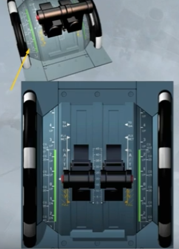

The pitch trim setting is shown on the ECAM F/CTL page. This can be checked during the flight control check when taxiing, if required.

Note: Never use this indication for the takeoff trim adjustment, prefer the scales beside the trim wheels and on the QRH. Because they refer to the takeoff CG position.

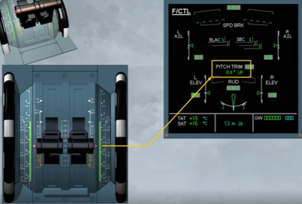

Notice that without hydraulic pressure, the bank angle limit indicators are displayed in amber on the PFD.

The side sticks are inoperative because there is no hydraulic power. Moving the side sticks will not affect the control surfaces. 

Note: When the side stick is not moved, it is springloaded to neutral.

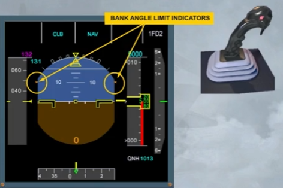

After first engine start, and as the hydraulic power is available:
- The bank angle limit indicators turn to green, indicating bank angle limits in normal law and
- The side sticks become operable.

On ground, the flight control surfaces respond in direct relationship to movements of the side sticks. This ground mode enables pilots to check the flight control surfaces, such as the ailerons, the roll spoilers and the elevators.

Note: A rudder PEDALS DISC button is provided on the nose wheel steering handle, to prevent any unwanted steering inputs during rudder pedals check.

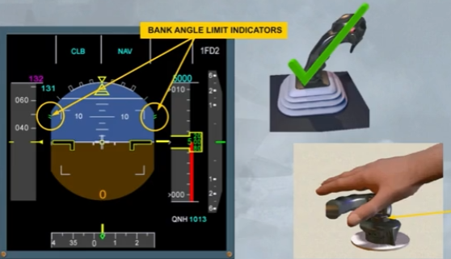

The takeoff memo is normally displayed 2 minutes after the engine start and checked only during taxiing. For training purposes, we check it now.

The FLAPS lever should be set to a takeoff position (1, 2 or 3). While the surfaces are moving, we will be looking at their indications on the E/WD.

To set the FLAPS lever to the related takeoff position, you need to lift up the lower part of the FLAPS lever, and then to position it to the appropriate setting.

Here, as an example, we will select the position 1.

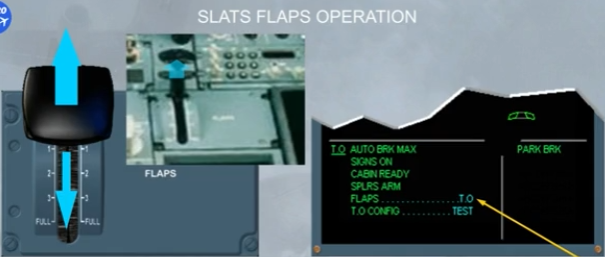

As soon as a FLAPS lever selection is made, the E/WD will
display the following changes:
- A blue number indicating which FLAPS lever position has been selected (here it is 1+F, because the speed is less than 100 kt)
- Blue markers showing the selected flap and slat positions
- The white labels "S" and "F" and
- The current slat position green marker will move, followed by the flap green marker.

When the flaps and slats have reached their selected positions:
- The blue markers disappear
- The FLAPS lever position number changes from blue to green
- The FLAPS T.O memo on the E/WD turns to green.

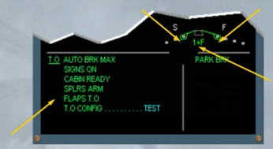

When the flaps are extended, the ailerons move to a new neutral position by about 5 degrees in order to be more efficient.

On the ECAM F/CTL page, the green aileron indexes are now pointing to a small white square which represents the new neutral position.

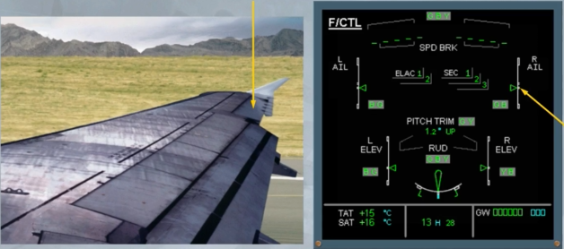

If we perform a takeoff in configuration 1 + F, FLAPS 0 would normally be selected when the airspeed is increasing through "S" speed, which is the minimum speed for slat retraction. To demonstrate the automatic flap retraction, we will delay this action.

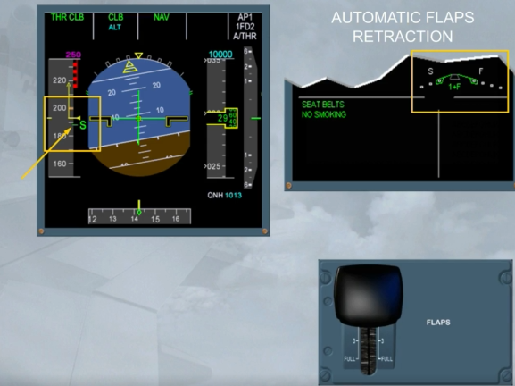

Before reaching the VFE relative to the CONF 1+F, the flaps will automatically retract to 0 at 210 kt.

Observe that the slats remain in the selected CONF 1, as there is no automatic slats retraction.

When the flaps are fully retracted, the blue number tums to green and the VFE relates to the CONF 1.

Note: If, in CONF 1, the speed drops below 100 kt, the flaps extend again to the CONF 1+F.

 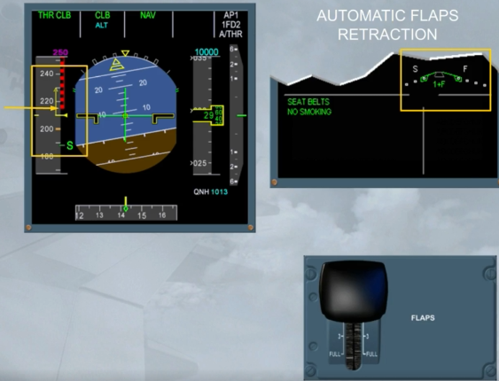

 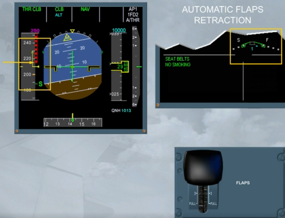

 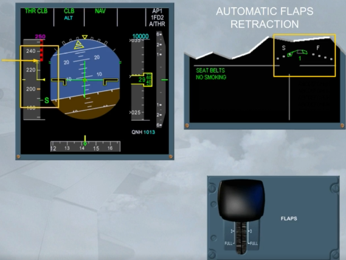

To set the speedbrake surfaces (spoilers 2, 3 and 4) to a required deflection, the SPEED BRAKE lever must be pushed and moved rearwards to a position, which depends on the required amount of drag.

Note: At the 1/2 position, there is a hard point.

If an autopilot is engaged, and:
- The SPEED BRAKE lever is moved fully back, the maximum surface deflection is limited to the deflection relative to the 1/2 position
- When flying at high speed, the speed brake retraction rate is reduced. So, retraction may take around 25 seconds.

 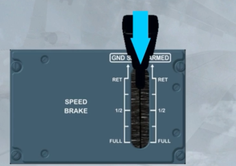

 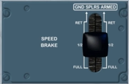

 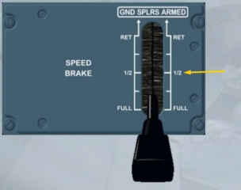

 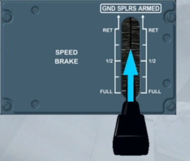

Each time the speedbrake surfaces are extended, a SPEED BRK memo is displayed:
- In green, when both engines are at idle thrust
- In flashing amber, when at least one engine is above idle thrust for more than 50 seconds.

Also, the speedbrakes are shown on the ECAM F/CTL page and on the WHEEL page if they have been selected.

 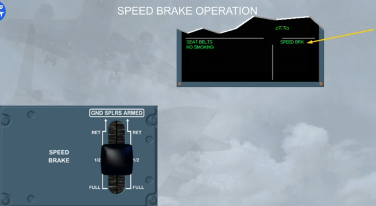

 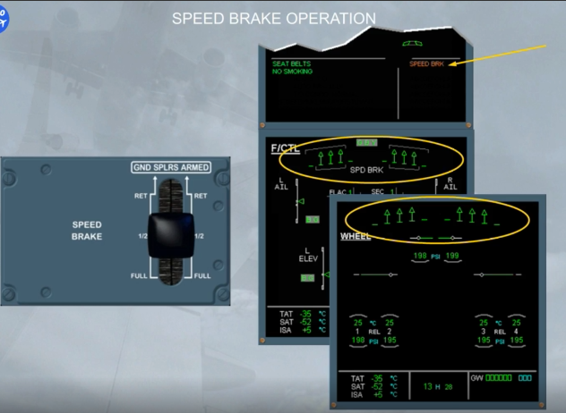

When the speedbrake surfaces are retracted, all speedbrake indications are removed.

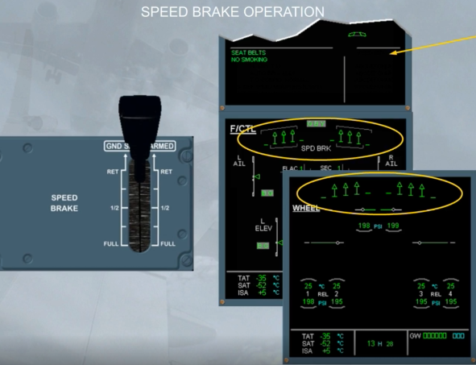

We have activated the approach, and the speed decreases to the magenta target, but it stops at green dot, due to the clean configuration.

Now, we may set the FLAPS lever to the position 1, because the current speed is below the amber dashes, which relate to the VFE for the next configuration.

Note: The amber dashes are called VFE NEXT.

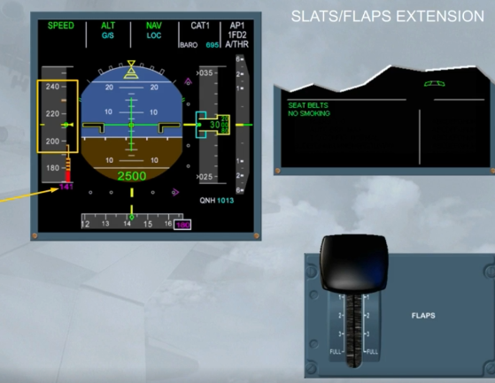

When the FLAPS lever is set to position 1, and as the speed is above 210 kt, only the slats extend to the CONF 1. Then, the speed continues to decrease towards the S symbol.

The FLAPS lever will set be to position 2 when the current speed is lower than the VFE NEXT relative to the next configuration.

Note: In this configuration, if suddenly the speed drops below 100 kt, the flaps will extend automatically to the CONF 1+F.

---

Let's go directly to the landing phase.

In normal law, when descending for landing, the pitch control in flight mode changes to flare mode when passing 50 ft RA. Also the system memorizes the aircraft attitude. And passing 30 ft RA, it progressively reduces the pitch attitude over a period of 8 seconds.

This means that the pilot has to take a gentle nose-up action to flare the aircraft as for a conventional aircraft.

When the ground spoilers are armed, a white band appears on the SPEED BRAKE lever and on the E/WD, a green memo is displayed,
as shown, or on the landing memo, if below 2000 ft.

Note: The SPEED BRAKE lever, when in ARMED position, cannot be moved.

The ground spoilers fully deploy only automatically when:
- In ARMED position, at touchdown, with both main landing gear compressed, and both thrust levers at idle, or
- Not in ARMED but in RET position, at touchdown, with both main landing gear compressed, both thrust levers at idle and at
least one reverse selected.

The ground spoiler (spoilers 1 to 5) extension can be monitored by the pilot non flying on the ECAM WHEEL page.

Note: If only one main landing gear is compressed, all ground spoilers will extend partially, thereby decreasing the lift and compressing both main landing gears. Ground spoilers will then fully deploy.

The ground spoilers retracts:
- When at least one engine thrust is no longer at idle, for example for go around, or
- After landing:
    - When the SPEED BRAKE lever is pushed, or
    - With the SPEED BRAKE lever not in ARMED, when the reverse is no longer selected.

***Module completed***