The ice and rain protection system enables operation in icing conditions and heavy rain.

For anti icing, critical areas of the aircraft are protected by hot air or electrical heating.

Potential icing conditions are defined as:
- Outside Air Temperature below 10° C
- Visible moisture in the air.

Note: During climb or cruise, the anti ice systems may also be switched off when the SAT is below -40° C, even if there is visible moisture.

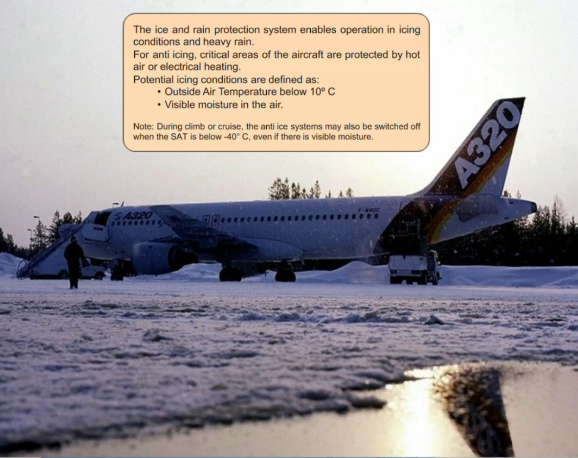

The pneumatic system provides hot air for the anti icing of the three outboard leading edge slats of each wing.

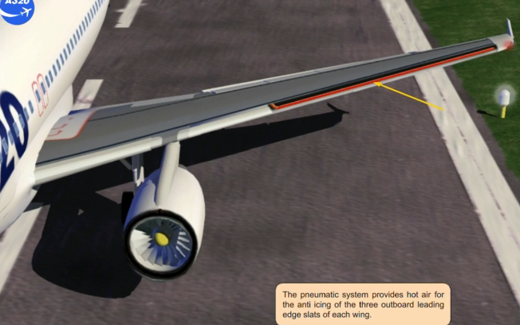

Each engine air intake is anti iced by an independent air bleed from the high pressure compressor.

The air is supplied through the engine anti ice valve.

Note: In the event of an electrical power supply failure, this valve will automatically open.

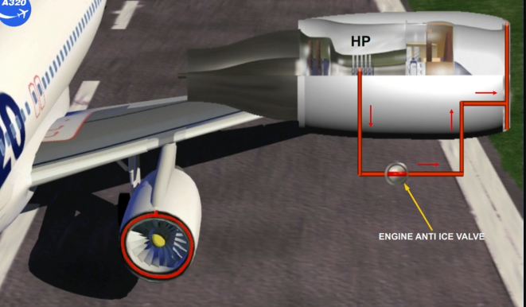

Electrical heating is provided for:
- Windshield anti icing and cockpit side window de-fogging ...

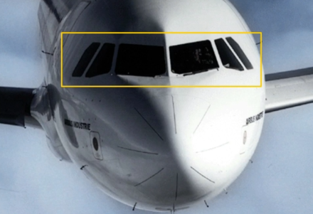

- The Angle Of Attack (AOA) probes ...

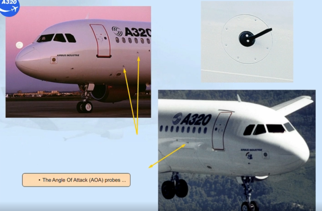

- The Total Air Temperature (TAT) probes ...

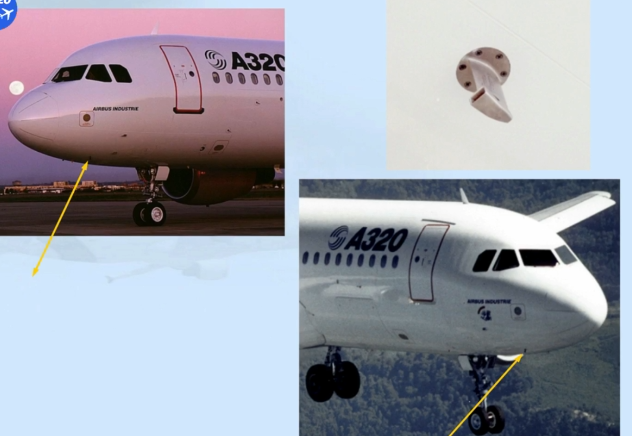

- The pitot probes...

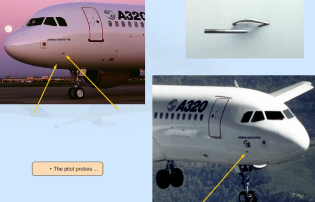

- And the static ports.

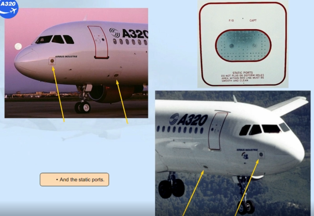

When the electrical system is powered, the water waste drain masts are also electrically heated.

Note: On the ground, the heat is reduced to prevent injury to ground personnel.

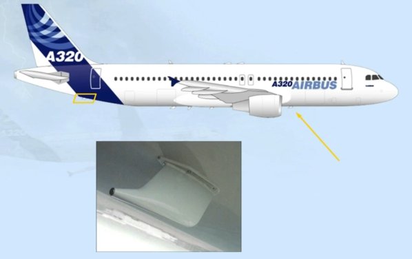

The ice detection system (if installed) has two separate ice detectors located on the forward lower section of the fuselage.

An external visual ice indicator with an integrated light is installed between the two windshields.

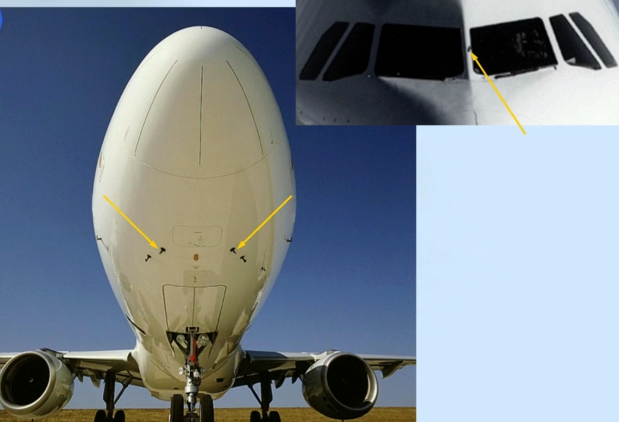

All the ice and rain protection controls are located on the overhead panel.

The crew manages:
- Wing and engine anti ice valves through the ANTI ICE control panel
- All the electrical heating system by the PROBE/WINDOW HEAT pb.

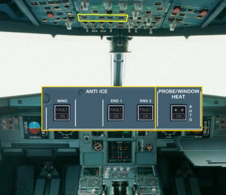

To improve visibility in rainy conditions, the flight crew can spray a rain repellent liquid.

Separate pushbuttons control the application of the rain repellent on each side of the windshield.

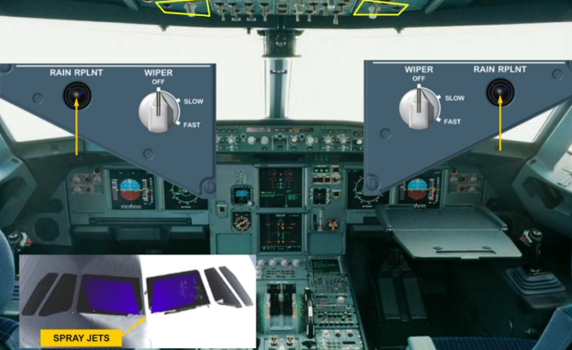

Electric wipers are provided for the windshields.

They are operated at slow or fast speed through the WIPER sel located on the WIPER panels.

The maximum speed with the wipers in use is 230 knots.

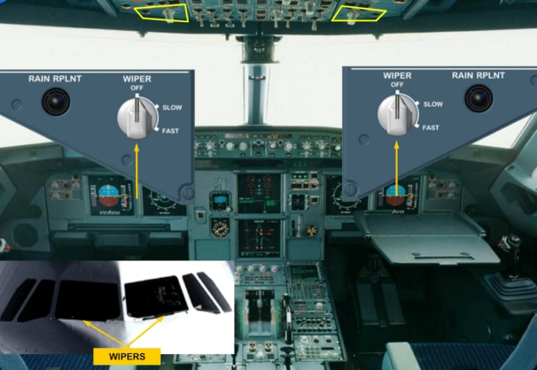

Memos related to anti ice operation are presented on the E/WD memo area.

According to icing conditions, ice detectors may trigger caution messages.

Let's now study the anti-ice system when in operation.

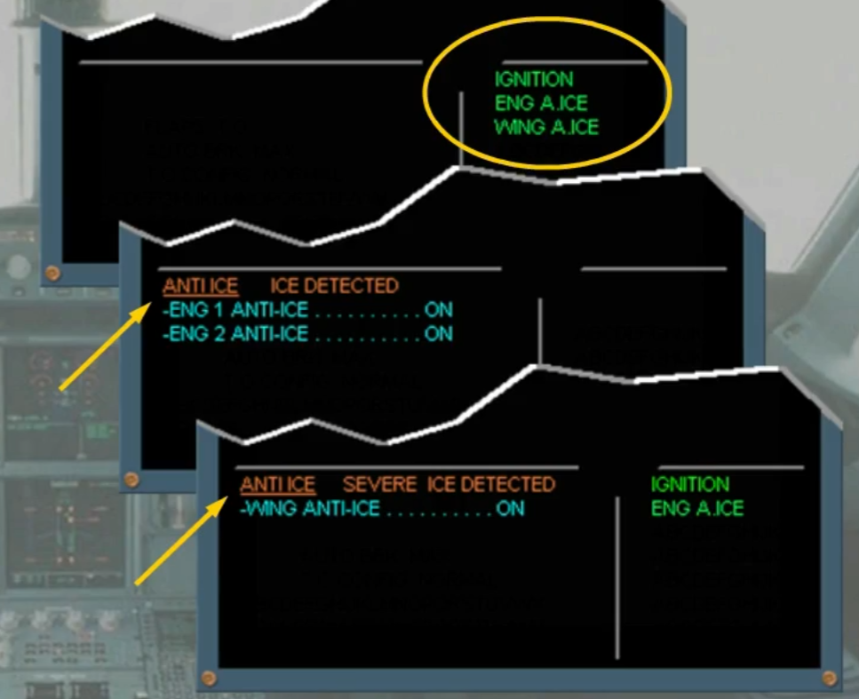

As part of the cockpit preparation phase, you should check that the wipers are off, and the PROBE/WINDOW HEAT pb is at AUTO.

Note: When in the AUTO position, the probes and windows are automatically heated after starting the first engine.

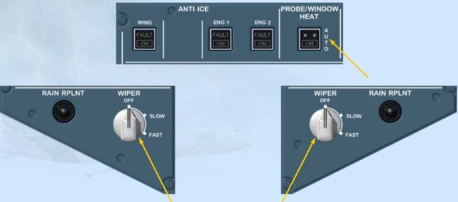

Today, your takeoff is in icing conditions, so let's see what you have to know.

Potential icing conditions are defined as:
- Outside Air Temperature below 10° C
- Visible moisture in the air.

Note: As with any anti ice system, you should turn the system on without waiting for a visible ice build-up.

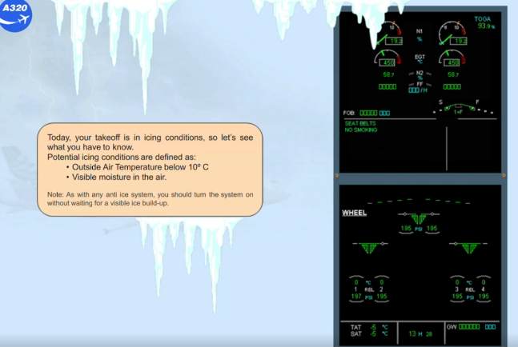

The engines are running. The automatic function of the PROBE/WINDOW HEAT system means that on the ground:
- The probes, (TAT excepted) and the cockpit side windows are heated
- The windshield heating operates at low power.

Note: You can also defog/de-ice the windows manually prior to engine start, by pushing the PROBE/WINDOW HEAT pb to the ON position.

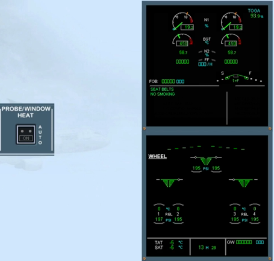

We have pressed the ENG 1 pb-sw.

Notice that the amber FAULT light in the ENG 1 ANTI ICE pb-sw comes on momentarily during the valve transit.

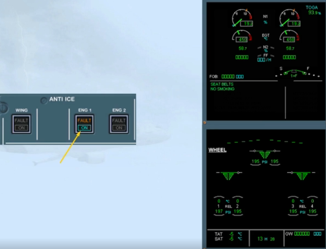

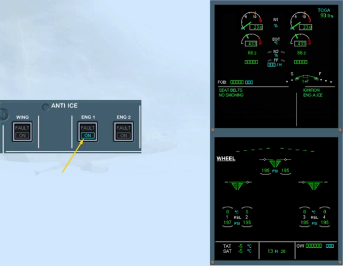

As soon as one ENG ANTI ICE pb-sw is set to ON:
- The "ENG A.ICE" memo appears in green on the E/WD
- The "IGNITION" memo appears in green, indicating that continuous ignition is automatically selected for the engines.

Note: On the CFM engine and depending on the installed FADEC version, the IGNITION memo may be not displayed when an ENG ANTI ICE pb-sw is set to ON (so, refer to your documentation).

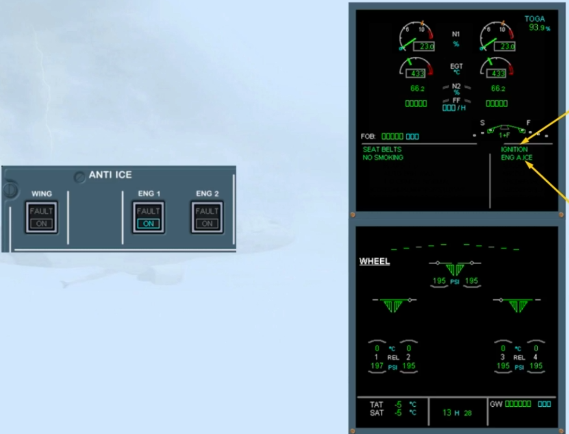

The idle N1 or idle EPR of both engines is automatically increased in order to provide the required pressure.

N1 limit or EPR limit (amber line) is automatically reduced because air from the engines is taken for anti icing.

We will press the ENG 2 anti ice pb-sw to ON for you.

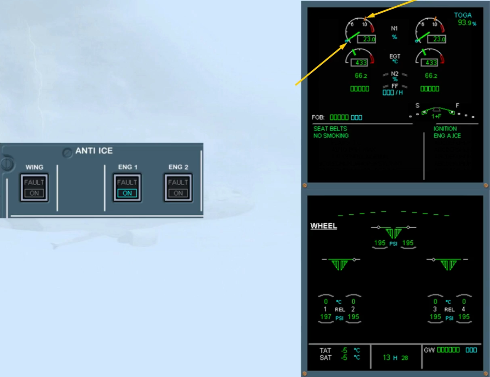

As an added precaution, we will use wing anti icing. 

The WING ANTI ICE pb-sw controls the wing anti ice system on both wings simultaneously.

Note: Use of APU bleed for wing anti icing is not permitted.

We will press the WING anti ice pb-sw to ON for you.

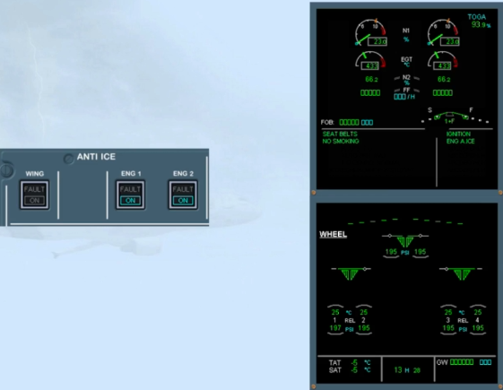

Notice that:
- The blue light comes on
- The FAULT light in the WING pb-sw comes on amber momentarily during the valve transit
- The "WING ANTI ICE" memo appears on the E/WD
- The N1 limit (or EPR limit), is automatically reduced
- The idle N1 (or idle EPR) is automatically increased.

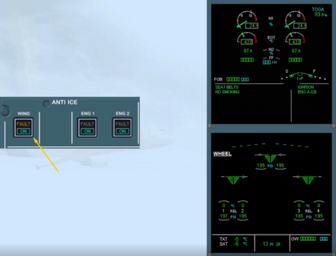

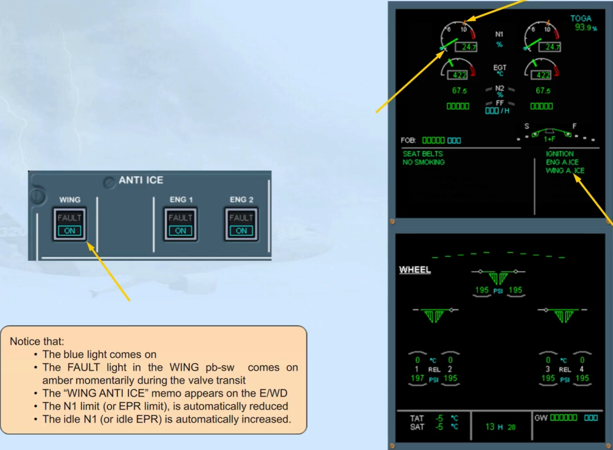

We have called the ECAM BLEED page for you.

Observe that:
- The "ANTI ICE" white indications are displayed, meaning that the ANTI ICE pb-sw has been set to ON
- The green triangles are displayed, indicating that the wing anti ice valves are open.

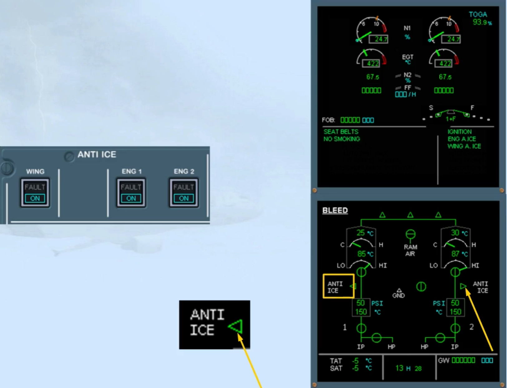

Observe that 30 seconds after the WING anti ice pb-sw has been set to ON, the wing anti ice valve indications disappear. This is because the wing anti ice valves close automatically, to prevent an overheat of the slats. This is the ground test sequence.

At lift-off, the valves will re-open automatically, and the slats will be heated again.

Note: Use caution when taxiing with engine anti icing on, because ground idle is increased.

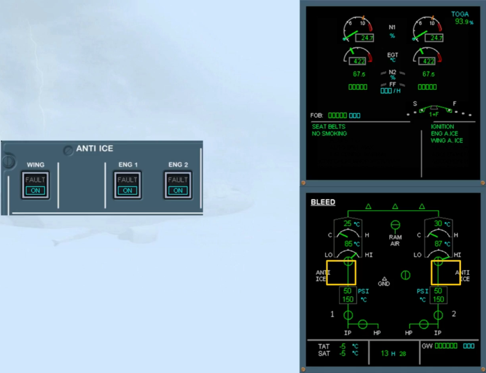

Let's now study a failure case.

You are in cruise, the entire anti ice system is operating, and you want to switch off the wing anti ice system.

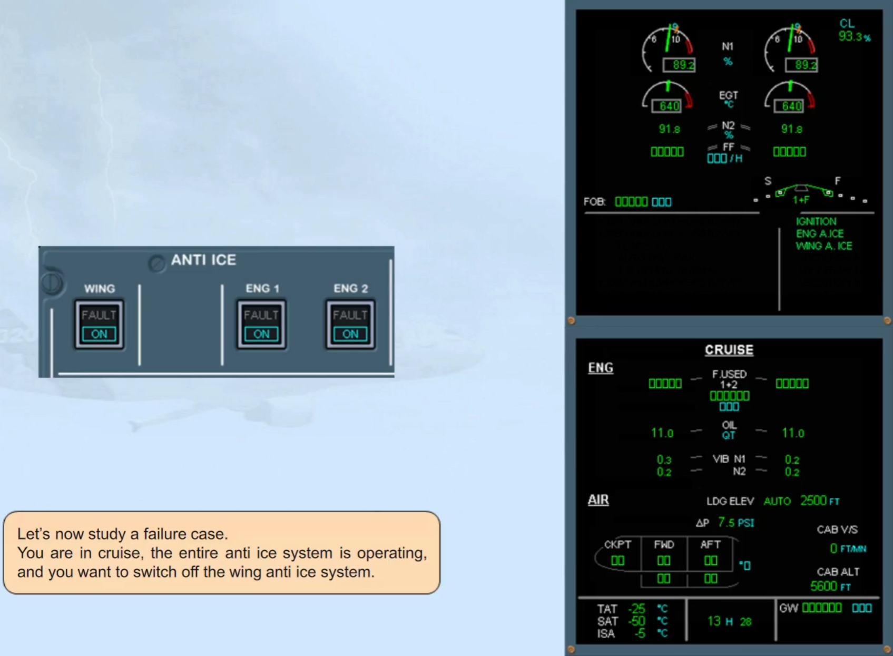

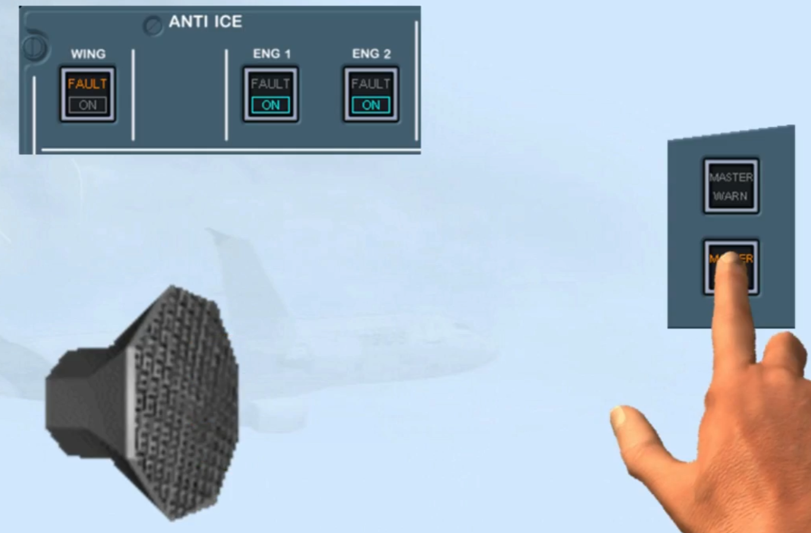

Observe that:
- On the E/WD, the ECAM caution "WING ANTI ICE LEFT VALVE OPEN" appears meaning that the valve is stuck open
- On the ECAM BLEED page, the green arrow is still displayed, indicating that the valve has remained open
- On the ANTI ICE panel, the amber FAULT light illuminates because there is a disagreement between the selected and actual position of the valve.

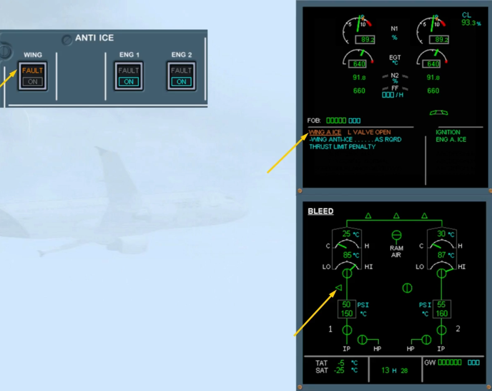

According to the indications:
- Wing anti icing can be selected ON for both wings, if required, but is continuously on, on the left side
- There is a thrust penalty, shown by the message on the EWD.

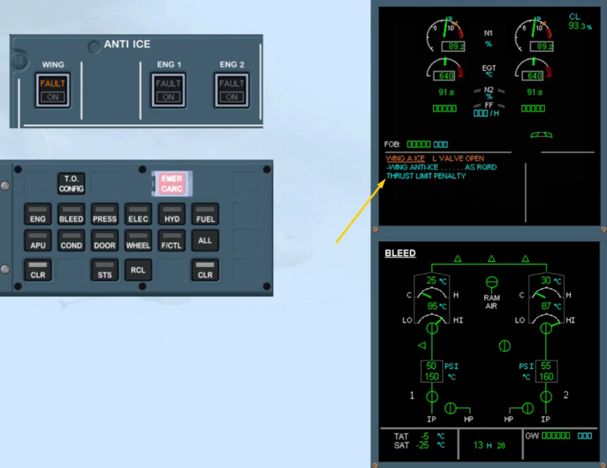

Let's see the effect of the fault after landing.

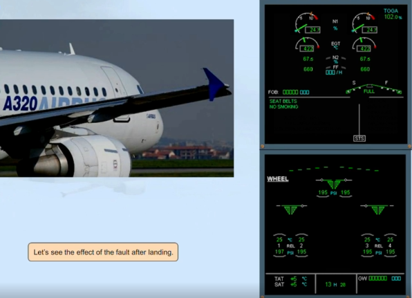

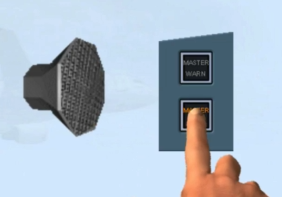

An automatic recall of the failure has occurred, with a new procedure because you are now on the ground.

The ECAM action is to switch off ENG 1 BLEED. This is to isolate the air supply from the wing anti ice system, in order to avoid over-heating of the left wing.

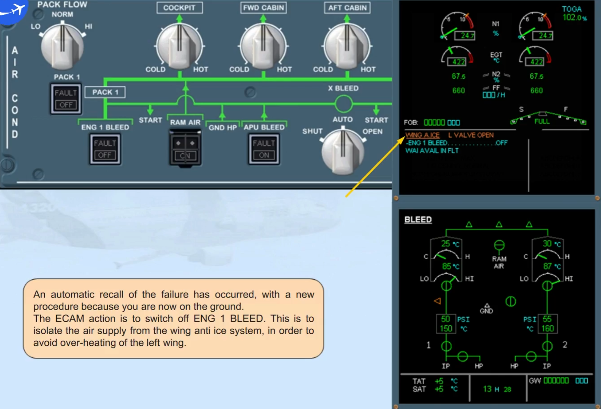

The engine 1 bleed valve is closed, as shown by the white OFF light illuminated on the related pb-sw, and the indications on the ECAM BLEED page.

Note: As the APU bleed is directly connected to the left wing bleed system, it should not be used.

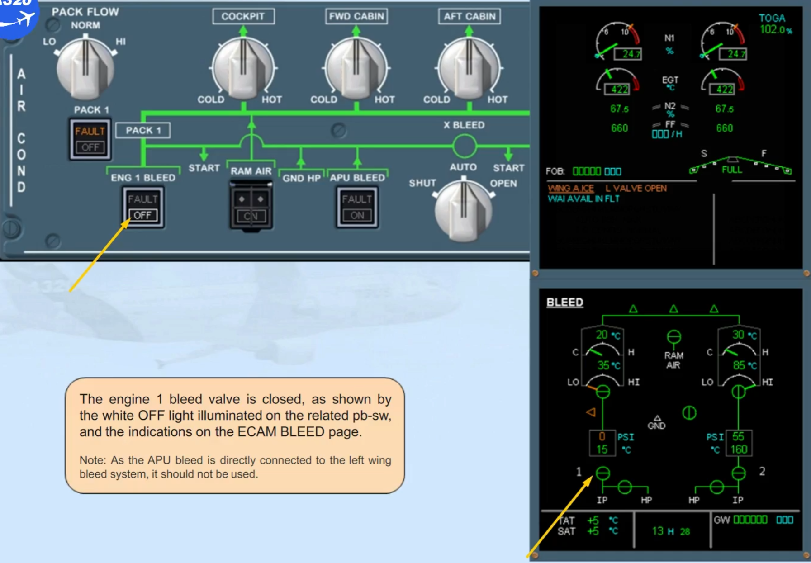

***Module completed***