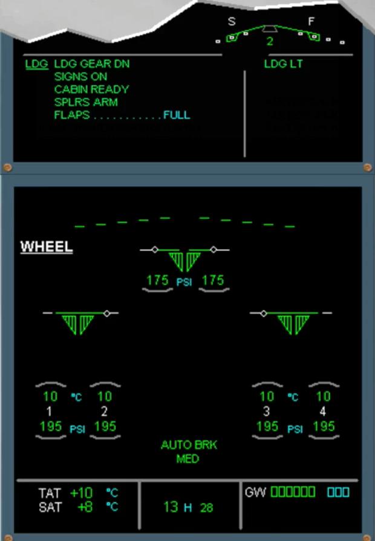
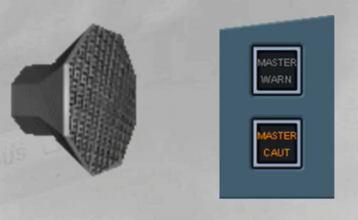
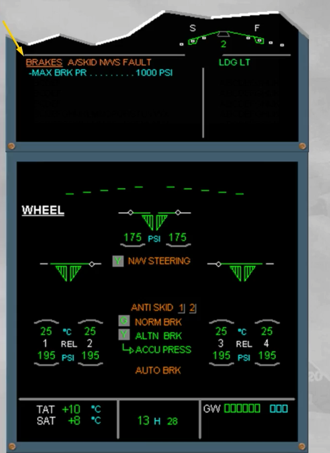
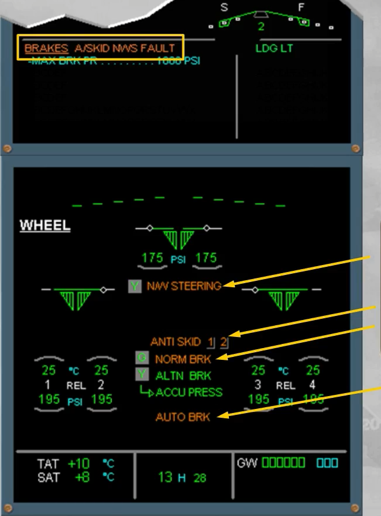
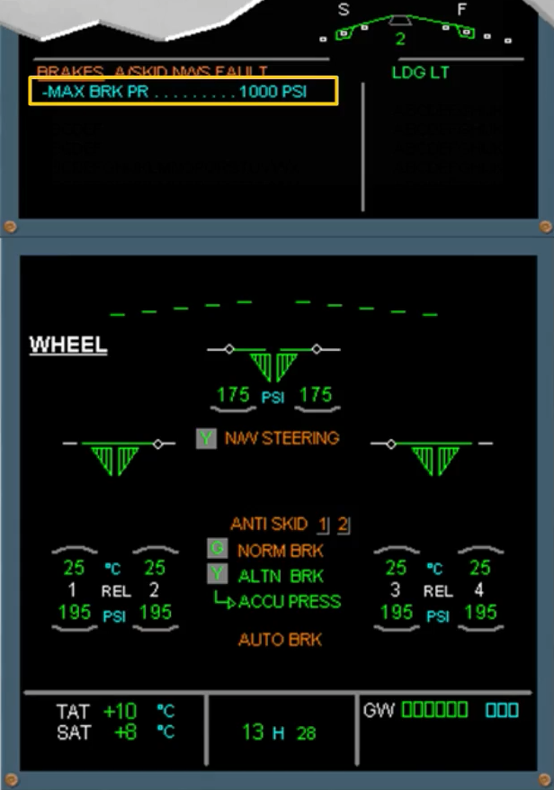
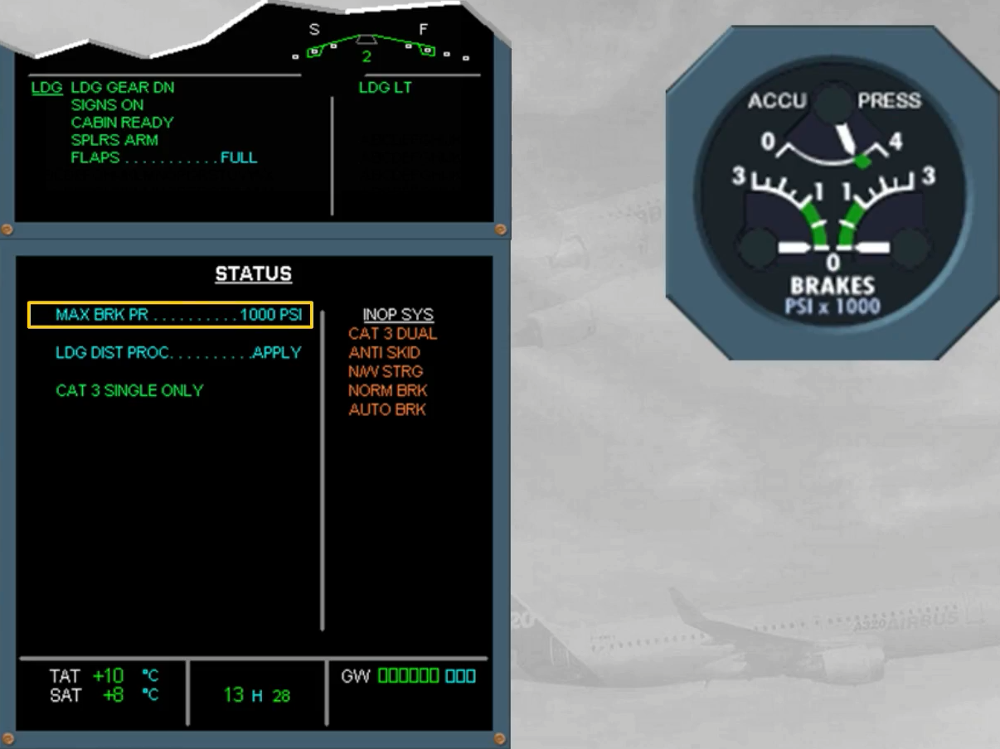
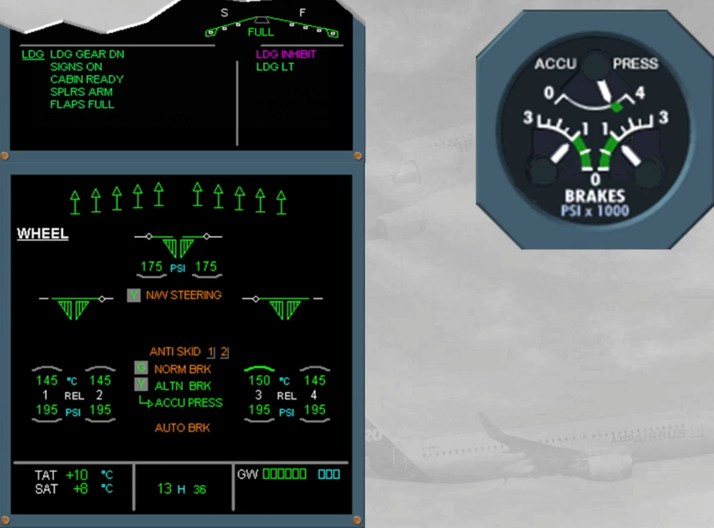
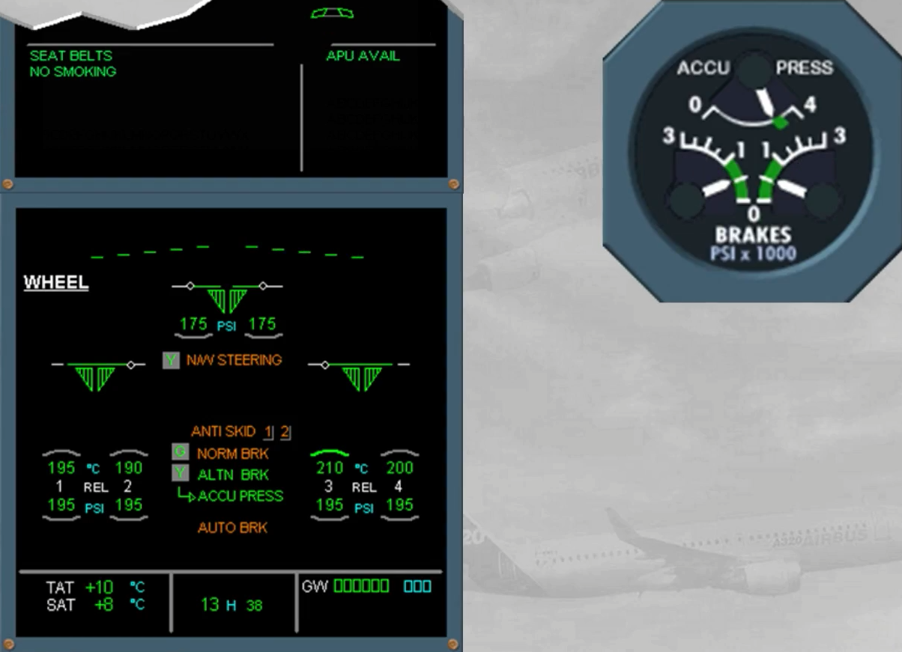

You are in approach and have extended the landing gear, and ...

On the E/WD, read the title of the failure.

An anti-skid failure has been detected and it can be caused by:
- A total BSCU failure or
- The loss of normal braking system associated with a yellow hydraulic low pressure.

On the ECAM WHEEL page, notice the amber message which confirms a total BSCU failure.

Notice also the other amber messages which are linked to the BSCU failure.

Notice that, even if the ABCU has automatically limited the braking pressure at 1000 PSI, the pilot should also limit the brake pedal deflections to not overshoot this maximum pressure, which is shown on the E/WD and after clearing the ECAM, on the STATUS page.

Note: The ACCU PRESS & BRAKES indicator will be used to monitor the related braking pressure.

You should avoid landing on an icy runway.

After touchdown, when braking is required, the PF will apply the brake pedals with care. He will keep the related pedal deflection stable when the PNF announces "1000 LEFT" and "1000 RIGHT".

While taxiing at low speed, the pilot in charge of the braking should adjust the brake pedals deflection as required.

***Module completed***