The lighting system includes:
- Cockpit lighting
- Exterior lights
- Cabin signs
- Emergency lighting.

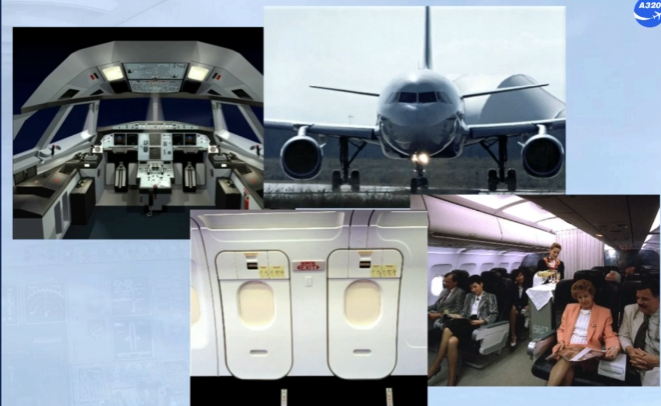

Cockpit lighting system can be divided into:
- Panel and instrument lighting
- General cockpit lighting
- Ambient lighting.

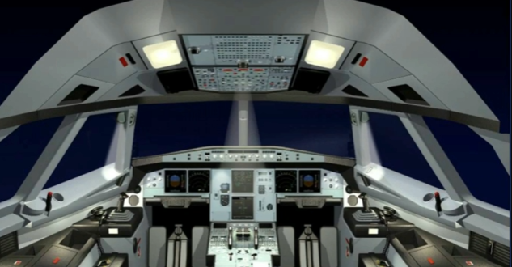

The panel and instrument lighting controls are installed on three different panels:
- On the overhead:
    - INT LT panel
- On the pedestal:
    - Right FLOOD LT panel
    - FLOOD LT and INTEG LT panel.

There are also two knobs underneath the glareshield, the left-hand knob for the brightness of the glareshield integral lighting and the right-hand knob for the brightness of the FCU display.

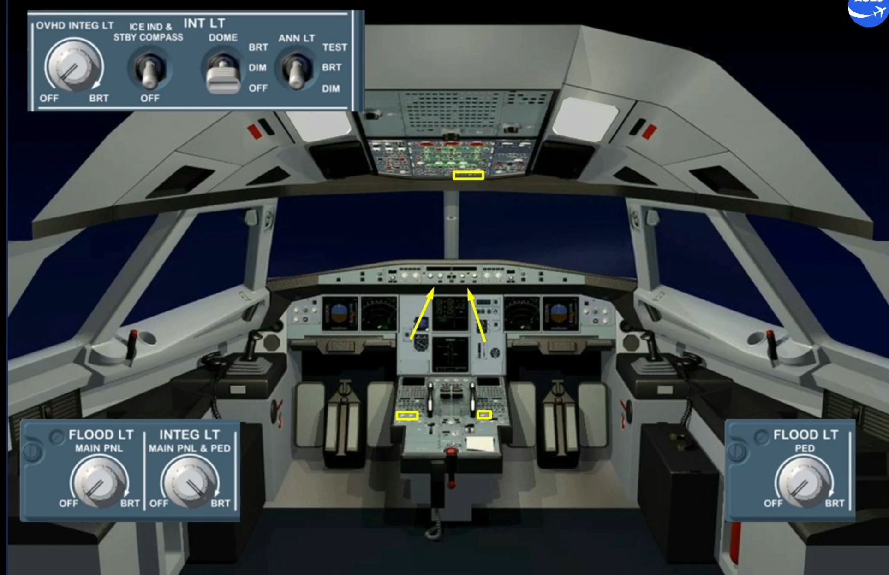

The panel integral lighting is controlled and adjusted by:
- An OVHD INTEG LT knob for the overhead panel
- An INTEG LT MAIN PNL & PED for the main panel and the pedestal.

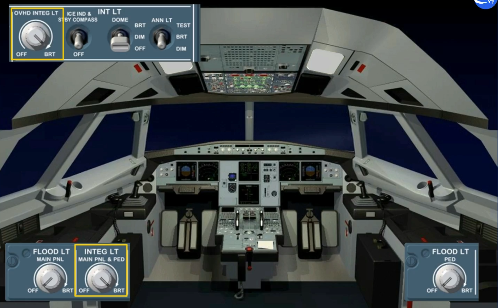

The panel flood lighting is controlled and adjusted by:
- A FLOOD LT MAIN PNL knob for the center instrument panel
- A FLOOD LT PED knob for the pedestal.

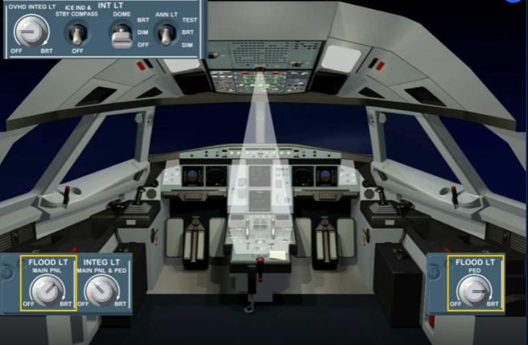

The ambient lighting, ensured by two dome lights, is controlled and adjusted by a DOME switch at DIM or BRT level.

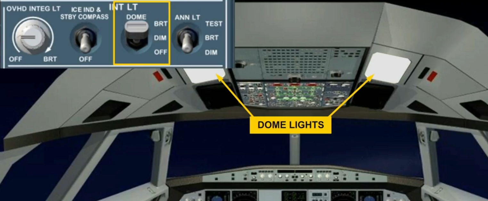

The brightness of all pushbutton lights and indicating lights, is adjusted by the ANN LT switch at DIM or BRT level.

Note: when held in TEST position, all pushbutton lights and indicating lights come on at full brightness and all LCDs display 8's.

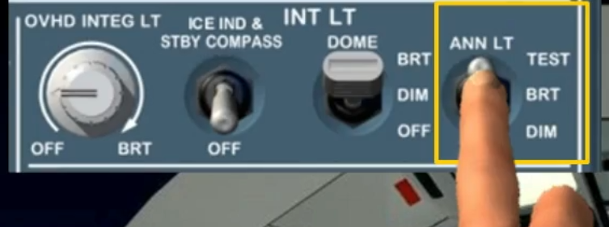

On the overhead panel, there are two reading light panels. Each reading light panel has a knob to control and adjust the brightness of the related reading light.

Note: The reading light can be oriented.

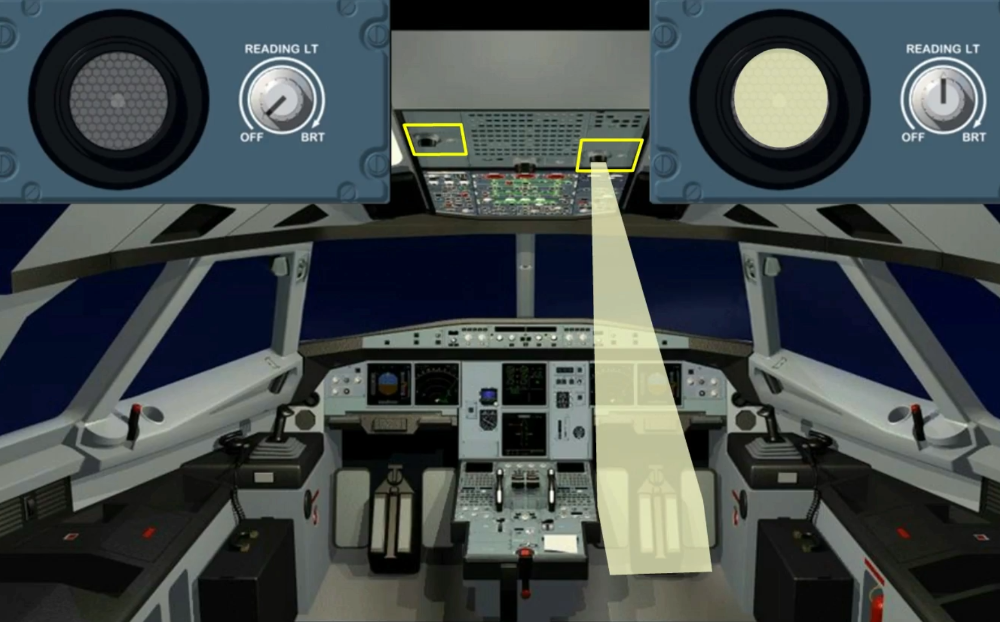

The lighting of each side console, briefcase area and the floor around the pilot seat, is controlled and adjusted by a related CONSOLE/FLOOR switch at DIM level or BRT level.

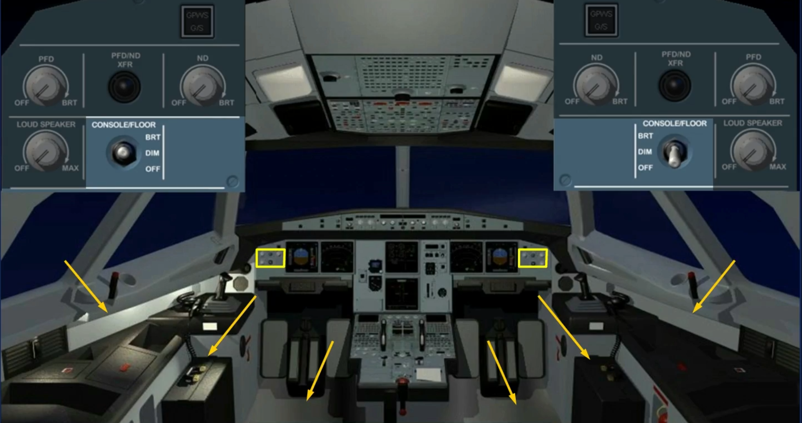

Each lateral window has a fixed reading light, controlled by a related switch and its brightness is adjusted by a related knob.

Note: Each sliding table is equipped with a map holder lighting adjusted by a related knob, installed underneath the glareshield.

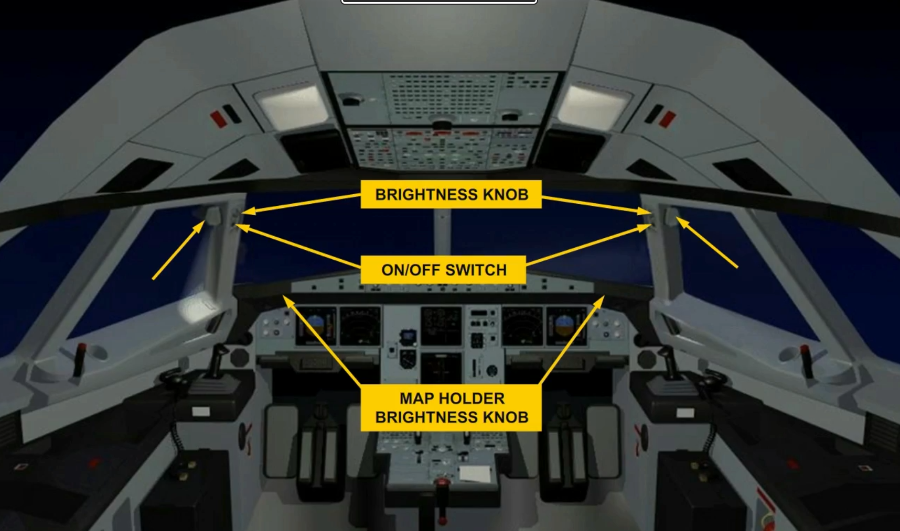

The exterior lighting system has:
- A taxi light and a T.O light
- The turn off lights
- The navigation lights
- The anti collision (strobe) lights
- The beacon lights
- The wing and engine scan lights
- The logo lights
- The landing lights.

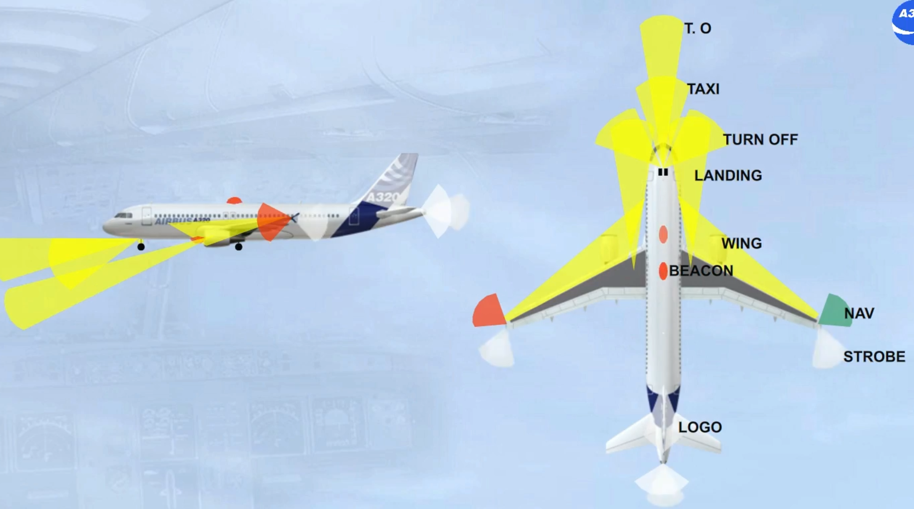

The controls for all these lights are on the EXT LT panel located on the overhead panel.

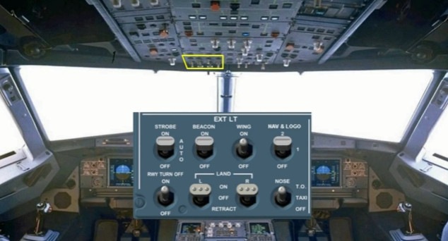

The next lighting system to be presented is the cabin signs.

They are used to give instructions to the passengers such as "NO SMOKING" and "SEAT BELTS".

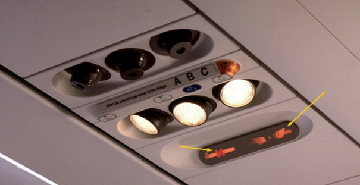

The controls of the cabin signs are on the left side of the SIGNS panel located on the overhead panel.

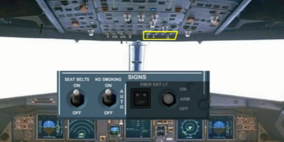

The emergency lighting system is designed to show the different ways for the passengers to exit the aircraft in an emergency situation.

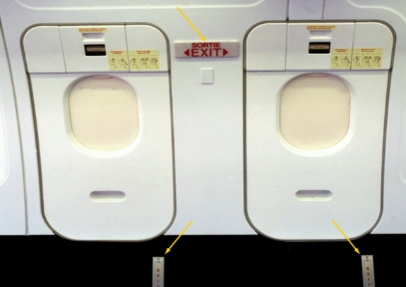

The emergency lighting control is on the right hand side of the SIGNS panel located on the overhead panel.

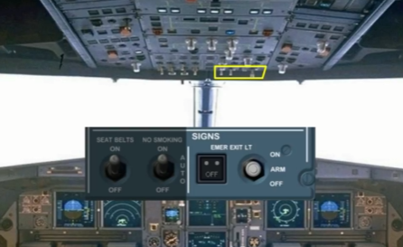

***Module completed***