The A320 family has 2 ATC transponders which transmit several parameters upon ground request, depending on the installed system ( refer to your documentation).

These parameters can be:
- Speed, Mach and barometric V/S data from the ADRs
- Heading, roll, ground speed, track and inertial V/S data from the IRs 
- Selected altitude and barometric reference settings from the FCUs.

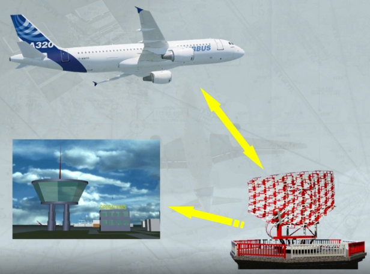

On the version studied here and in its normal operation, the different parameters are transmitted to:
- ATC 1 by ADR 1, IR 1 and FCU 1
- ATC 2 by ADR 2, IR 2 and FCU 2.

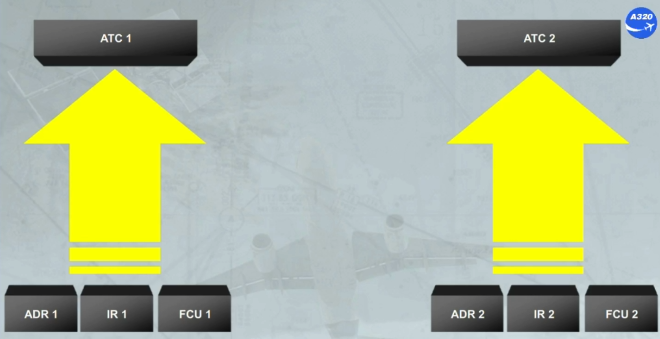

Note: In case of ADR (1 or 2) failure, the ADR 3 can be used through the AIR DATA SWITCHING selector, as shown.

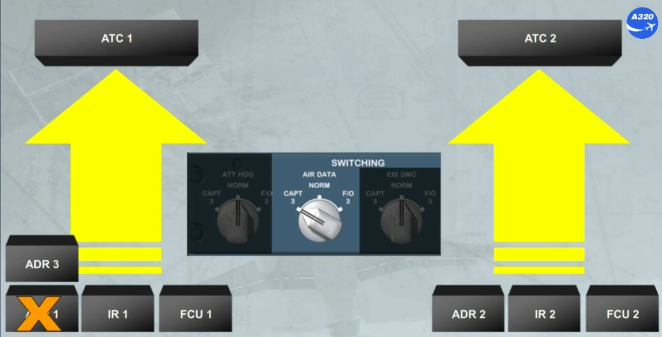

A control panel, located on the pedestal, allows the installed and the selected ATC transponder to operate. It allows also the crew to enter the code assigned by the ATC.

An ALT RPTG selector, allows the selected ATC transponder to send the barometric standard altitude data.

The mode selector allows, when it is:
- In STBY, to electrically supply both ATCs, but to keep them in standby
- In ON, the selected ATC operates in all modes
- In AUTO, if on ground the selected ATC operates only in mode S (selective aircraft interrogation mode). If in flight the selected ATC operates in all modes.

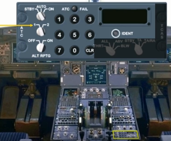

On the A320 family and independently of the ATC system, a Traffic alert and Collision Avoidance System (TCAS) is installed and allows:
- To detect any transponder equipped aircraft and flying in the vicinity (within a maximum range of 80 nm, and within a maximum altitude range of 9900 ft)
- To display potential and prediction of collision
- To issue vertical orders to avoid conflict.

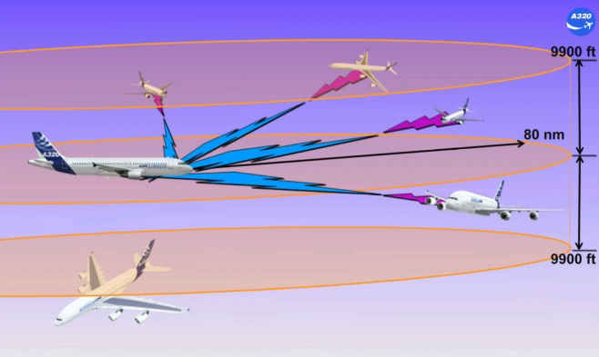

The ATC control panel, located on the pedestal, also allows the control of the TCAS system.

The TCAS part of this panel has:
- A Mode selector which allows the operation of the TCAS in STBY, or in TA when the aircraft performances are degraded (vertical order will be not generated), or in TA/RA which is the normal selection
- A TRAFFIC selector, which displays proximate and other intruders within an altitude range which depends on the selection. The normal selection is ALL.

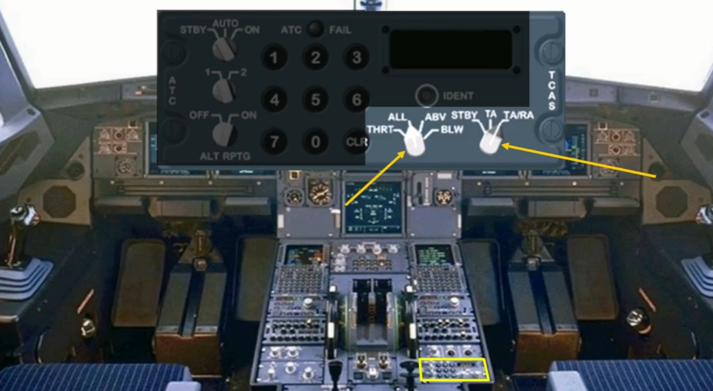

The A320 TCAS interrogates the transponder of the intruders and determines for each its relative bearing, its range and closure rate and its relative altitude (if equipped with ATC mode C or S).

Then the TCAS computes the intruder trajectory with the estimated time before reaching the closest point of approach. Each time the relative position of the intruder shows a collision threat, aural and visual advisories are triggered.

Visual advisories are displayed on both NDs. The aural alert and vertical orders ensure a sufficient trajectory separation and a minimal vertical speed variation taking into account all intruders.

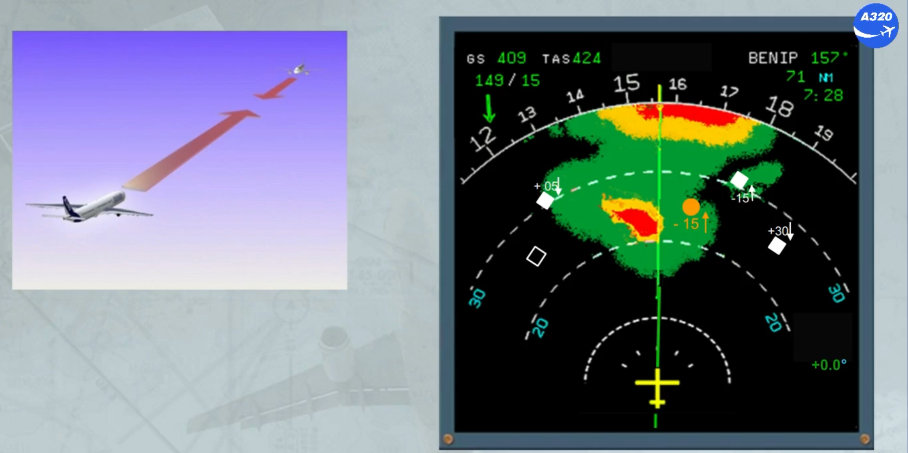

All the ND ROSE modes and ND ARC mode can be used to display only the 8 most threatening intruders.

The intruders are classified as shown:
- Proximate, no collision threat but this intruder is in the vicinity of the aircraft
- Traffic Advisory (TA), with a potential collision threat and associated to aural alert
- Resolution Advisory (RA), with a real collision threat and associated to aural alert. The vertical orders are displayed on the PFD to fly the green sector
- Other intruders, with no collision threat, but they are in the detection envelope and do not belong to any of the above intruders.

Note: On the ND, the arrow indicates the V/S and the number indicates the relative altitude.

On the PFD, the V/S scale is now rectangular, the V/S needle is now white and the color of the digits depends on the green or red area.

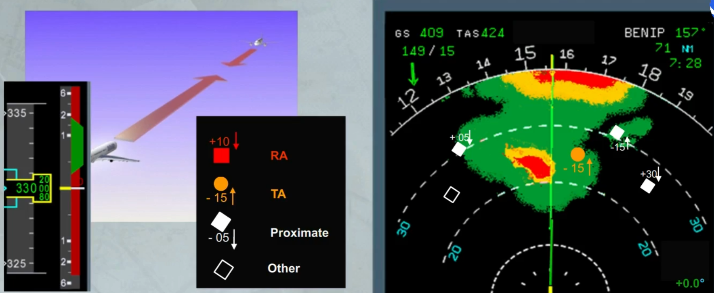

Traffic advisories or resolution advisories are associated to a related aural alert depending on the situation. They can be:
- "TAFFIC TRAFFIC", when only TA is detected
- "CLIMB CLIMB", when the current V/S is below the green area
- "CLIMB, CROSSING CLIMB" twice, as the previous alert and indicates that you will cross through the intruder altitude
- "INCREASE CLIMB" twice, if the climb V/S is not sufficient for a safe vertical separation
- "DESCEND DESCEND", when the current V/S is above the green area
- "DESCEND, CROSSING DESCEND" twice, as for the same climb alert
- "INCREASE DESCEND" twice, as for the same climb alert
- "ADJUST VERTICAL SPEED, ADJUST", in order to stay in the green area by reducing the climb or descent V/S
- "CLIMB CLIMB NOW" twice, when descending and the intruder trajectory has changed
- "DESCEND DESCEND NOW" twice, as for the same climb alert
- "MONITOR VERTICAL SPEED", to ensure that the V/S will not enter the red area
- "MAINTAIN VERTICAL SPEED, MAINTAIN", to keep the V/S in the green area
- "MAINTAIN VERTICAL SPEED, CROSSING MAINTAIN", as for the previous alert and indicates that you will cross through the intruder altitude
- "CLEAR OF CONFLICT" no more problems and you may return to the assigned clearance.

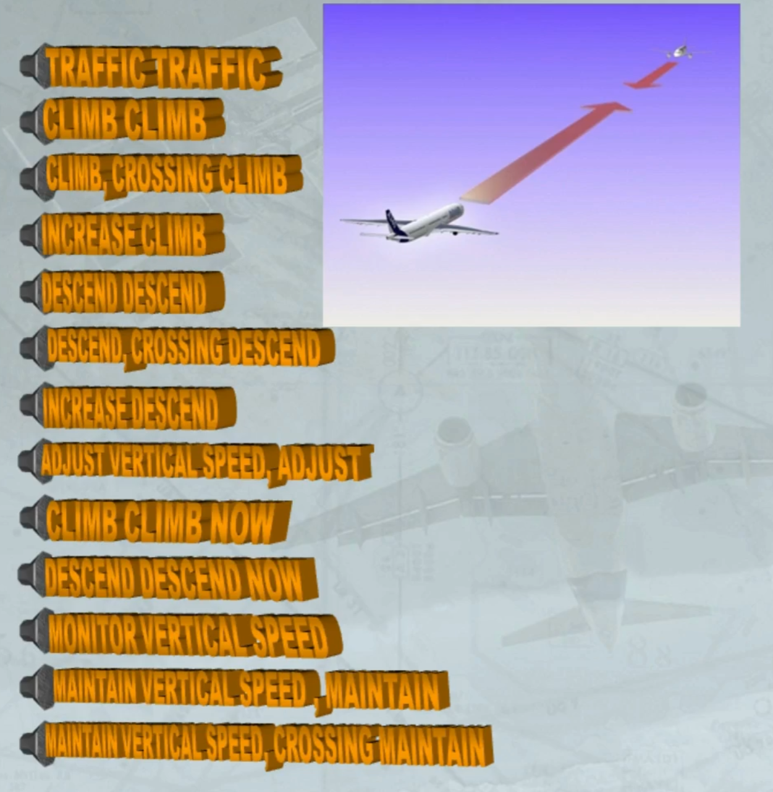

If the ND is in plan mode and a traffic advisory or a resolution advisory is detected a message is displayed on the ND to draw the pilot attention.

Note: Depending on the advisory level (TA or RA) the ND message will be in amber or in red.

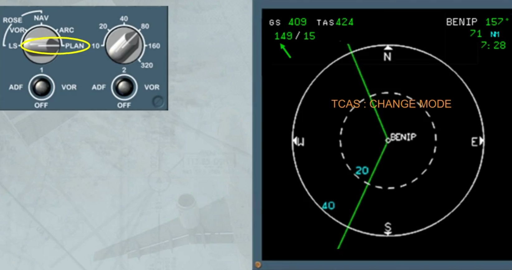

In ROSE or ARC mode and if a TA or RA is detected a message is also displayed when the ND range is above 40 nm, to draw the pilot to select an appropriate range.

Note: Depending on the advisory level (TA or RA) the ND message will be in amber or in red.

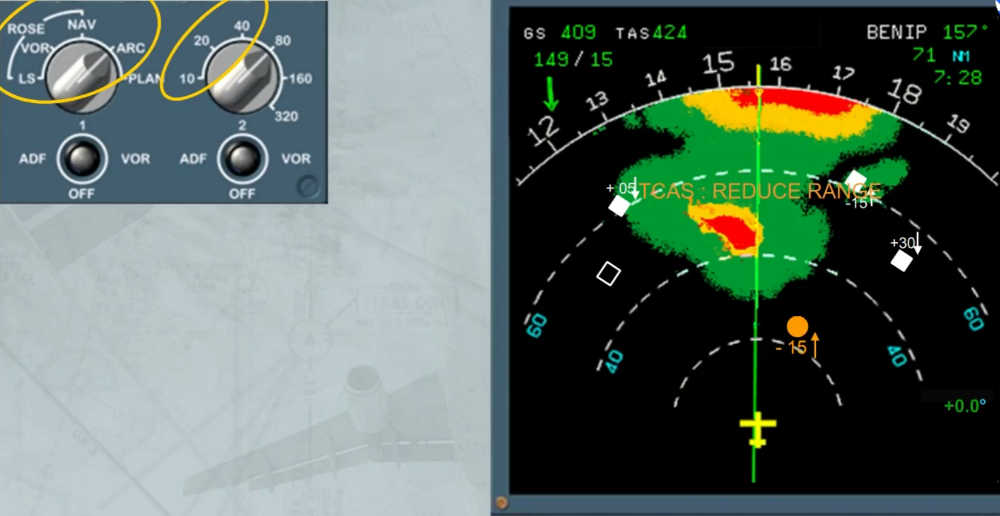

A green memo "TCAS STBY" is displayed:
- If the TCAS mode selector is on STBY position, or
- If the ATC mode selector is on STBY position, or
- If ALT RPTG selector is set to OFF, or
- If both ATC transponders or both radio altimeters have failed.

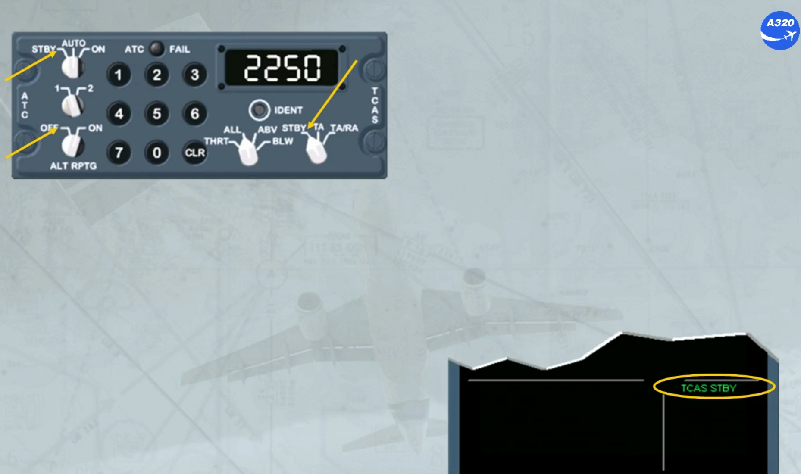

Note: Depending on the installed TCAS version and in flight, if TCAS STBY has been selected, the memo message will be in amber and an ECAM caution message will be triggered for crew awareness.

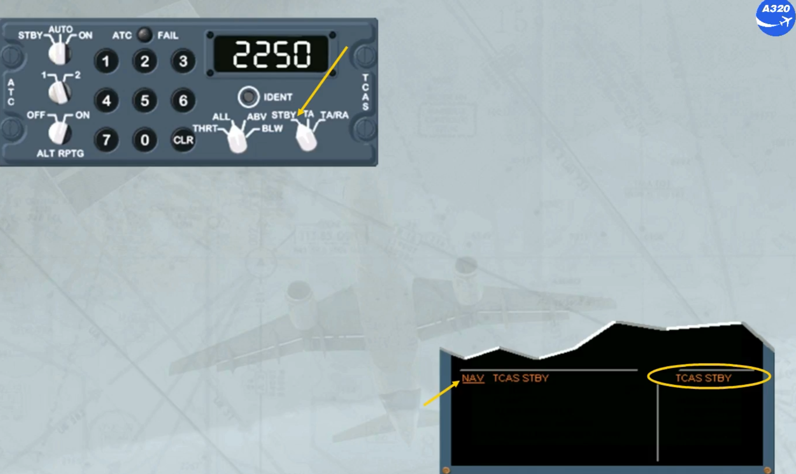

If TCAS system is faulty an amber indication is displayed on the PFDs and on the NDs associated to an ECAM caution message
for crew awareness.

Note: Depending on the installed TCAS version, on the PFD and ND, the TCAS message can be in red.

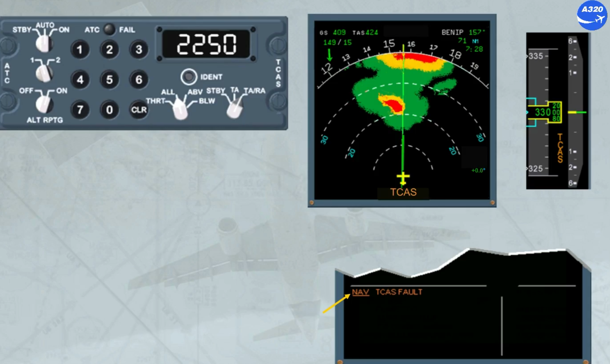

***Module completed***