The conventional standby instruments:
- The standby altimeter
- The standby horizon indicator
- The standby airspeed indicator

are now replaced by an Integrated Standby Instrument System, called ISIS.

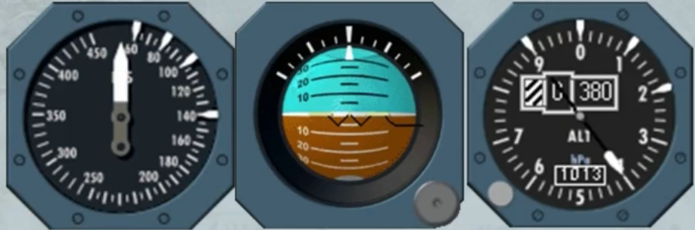

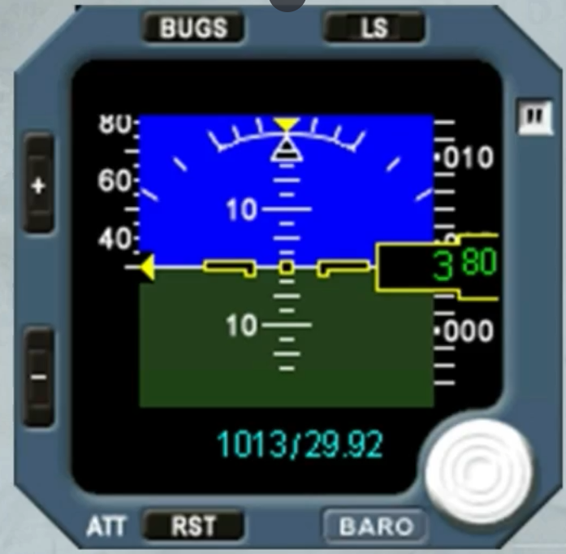

The ISIS is mounted in the center of the instrument panel, as shown. It looks like a small PFD but with no FMA and no heading scale.

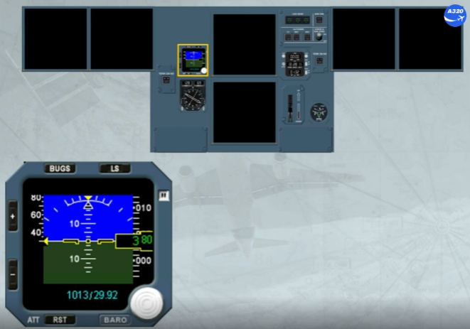

The ISIS receives information from:
- ILS 1 or MMR 1
- ADIRS 1 or ADIRS 3
- The STBY PITOT, located as shown
- The STBY STATIC ports, located as shown on the left and on the right.

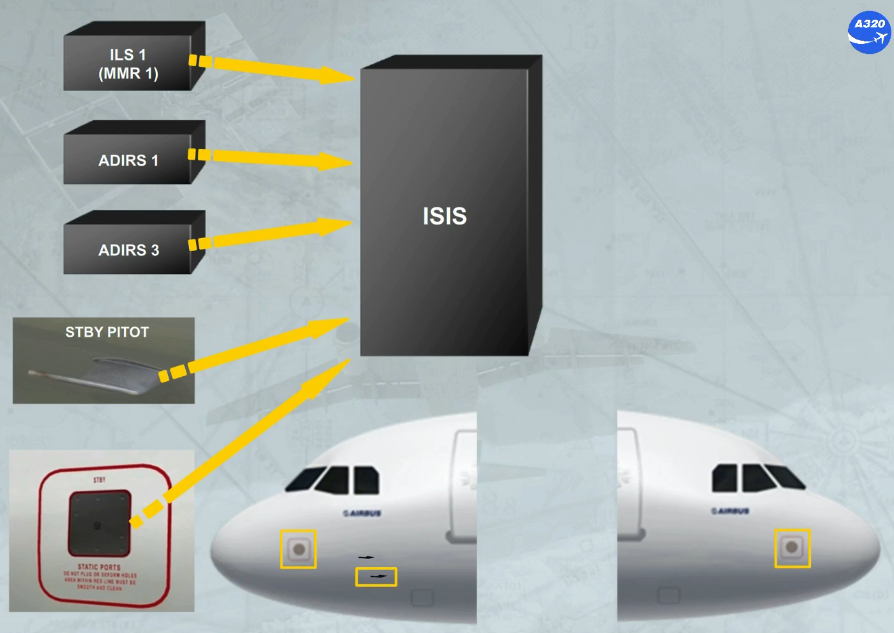

As soon as the ISIS is electrically energized, the display shows these flags for few seconds.

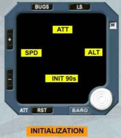

Then, the brightness of the screen is automatically adjusted by a photosensitive cell. But the crew can manually modify the level of the brightness by using the + or the - pb.

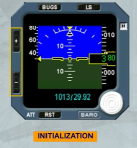

Like on a PFD, the ISIS system displays the following information:
- Attitude
- Airspeed
- Mach
- Altitude
- Barometric pressure
- LS function.

But the bugs function will replace the conventional marking white indexes.

Let's describe each information in detail.

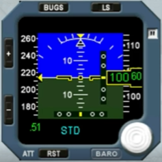

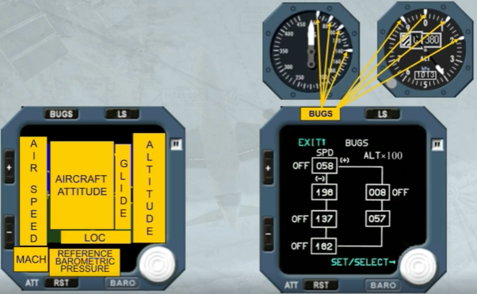

The airspeed scale moves in front of a fixed yellow triangle indicating the airspeed.

Note: The scale has a white mark every 5 kt when below 250 kt and every 10 kt when above 250 kt.

Like on the PFD, the Mach indication is displayed only if it is above M0.5.

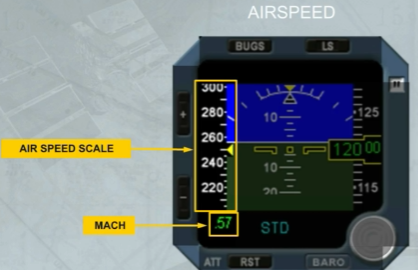

A black symbol and outlined in yellow, shows the aircraft.

Note: Depending on the version, the fixed aircraft symbol can be also as V Bar aircraft symbol.

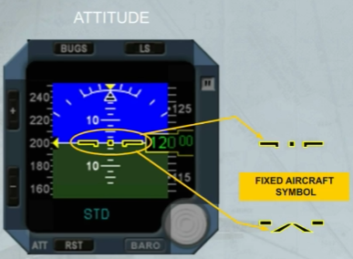

The fixed roll scale has:
- A yellow triangle at 0 degree of bank
- White marks at 10, 20, 30, 45, 60 degrees of bank.

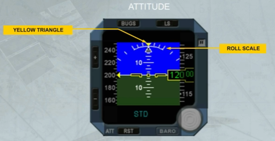

The bank angle is indicated by a black triangle, outlined in white.

The aircraft lateral acceleration is indicated by a trapezoidal index which moves beneath the roll index.

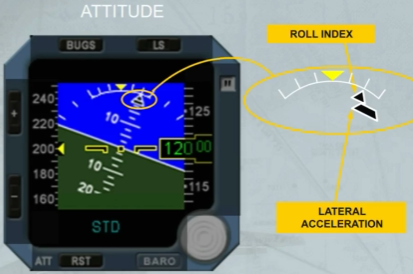

The pitch scale has white marks every 2.5 degrees. Beyond 30°, large red arrowheads (V-shaped) indicate that the attitude is excessive. Like on the PFD, they also indicate the direction to follow, to resume normal attitude.

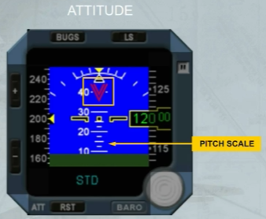

When an excessive aircraft movement is detected during the alignment phase or depending on the version after a long operation time, a YELLOW FLAG appears. In this case, the ATT RST pb has to be used to realign and to recover the attitude indication.

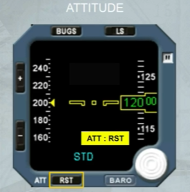

Each time the attitude indication needs to be reset or to be realigned, the ATT RST pb must be pressed, for at least 2 seconds. A yellow flag is displayed to indicate that the attitude reset function is in progress.

Note: During this procedure the aircraft must be kept level.

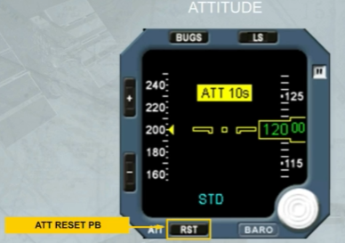

The altitude indication is given on a white moving scale and by a green digital readout on a black background.

A white "NEG" indication appears for negative altitudes.

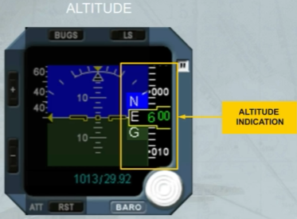

A barometric selection knob can be rotated to adjust the barometric pressure displayed in blue. Depending on the version, the displayed barometric pressure can be:
- Only in hectoPascal (hPa), or
- Only in inches of mercury (Hg), or
- In both hPa and Hg.

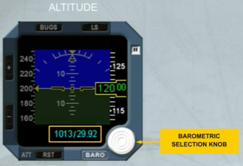

Pressing the barometric knob allows the standard pressure to be selected and "STD" is then displayed in place of the pressure value.

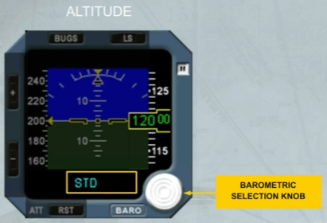

Pressing the knob again will display the selected barometric pressure.

As an option, the altitude can be displayed in meters, as shown.

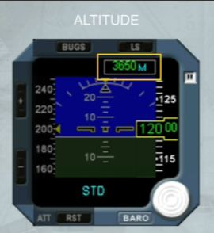

The deviation scales (glide slope and localizer) appear when the LS pb is pressed.

The related magenta indexes appear when the glide slope and localizer signals are valid and the deviation scales are displayed.

Note:
- For takeoff using the localizer of the opposite runway, or
- For a back course localizer approach

do not use the LS function, because the LOC deviations are given in the wrong sense.

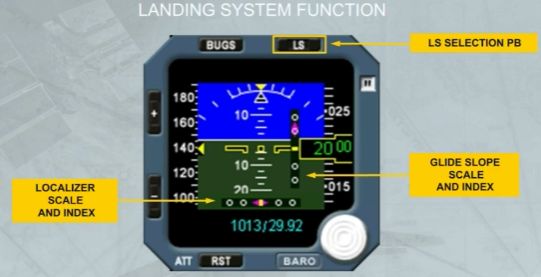

The BUGS pb is used to activate the bugs function and to display the values to be selected.

The BUGS page has two columns:

- The SPD BUG column where four speed values (in knots) can be selected by the crew
- The ALT BUG column where two altitude values (in feet) can be selected by the crew.

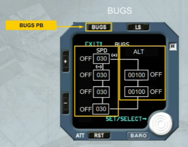

The active box flashes.

Access from one box to another is made by the "+ or -" pb:
- If the "-" pb is pressed the next box flashes, and so on
- If the "+" pb is pressed the previous box flashes, and so on.

The BUGS value selection knob allows:
- By rotating it to modify the value in the active box
- By pushing it to activate the bug value. So the related OFF label disappears
- If pushed again to deselect the bug value. So the related OFF label comes on next to the flashing box.

Note: The entered values are memorized by the system when exiting the screen by pressing the BUGS pb or after 15 s without any pilot action.

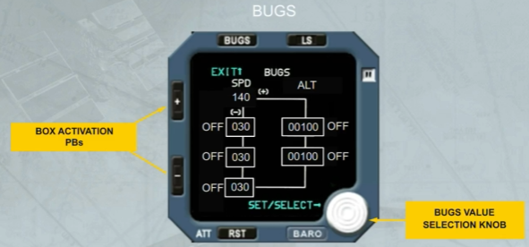

When a bug value is entered and active, the related blue dash appears on the speed scale and on the altitude scale, as shown.

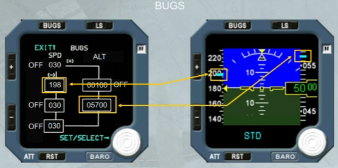

Note: On the altitude scale, the blue dash is transformed into a blue box when the dash covers a digital indication on the scale.

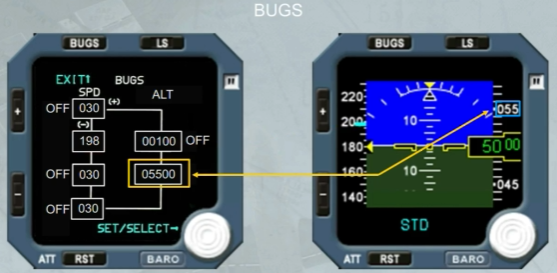

If the altitude bug value corresponds to the altitude reference, the yellow box changes to a blue box, as shown.

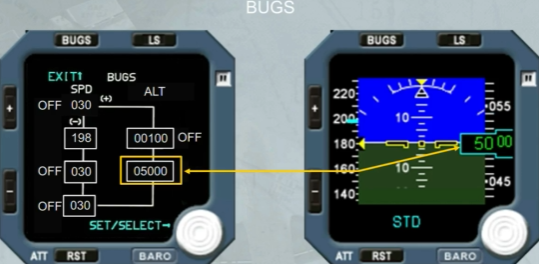

:::caution[CAUTION]

The Airbus SOPs do not recommend the use of the ISIS bugs function. Because, in the event that both PFDs are lost in flight, and the ISIS bugs were previously set for takeoff, then for approach the bugs would remain at the takeoff characteristic speed settings.

:::

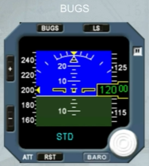

When a data information is lost, a red flag appears, as shown here for the glide slope and the localizer.

But according to the lost data the red flag can be:

- ATT for the attitude
- SPD for the airspeed
- M for mach
- ALT for the altitude.

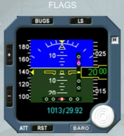

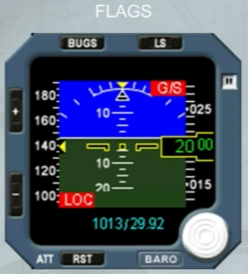

Additional flags can be displayed:
- MAINT in white, ISIS operation is not affected but service ISIS when necessary

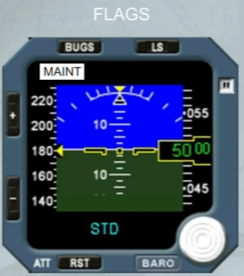

- OUT OF ORDER in white, for internal failure. This flag comes along with a fault code.

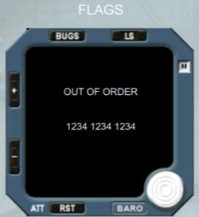

According to the version and in addition of the ATT:RST and the ATT 10s yellow flags, a WAIT ATT yellow flag can be displayed:
- Normal operation will be recovered if it is displayed for less than 10 seconds
- If it is displayed for more than 10 seconds, it is replaced by the ATT:RST yellow flag.

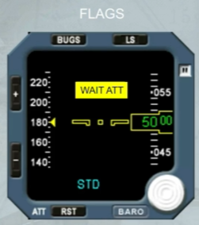

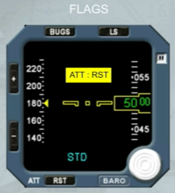

Moreover, there is a standby compass, located on top of the windshield center post, in a closed compartment.

It may be pulled down for use. A deviation card is located above the compass.

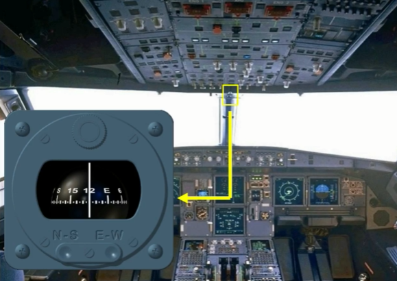

***Module completed***