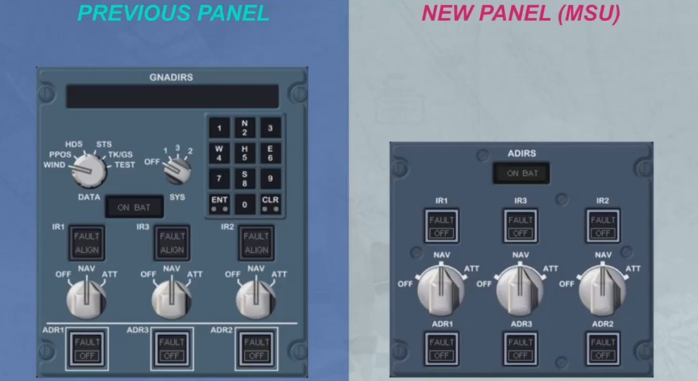
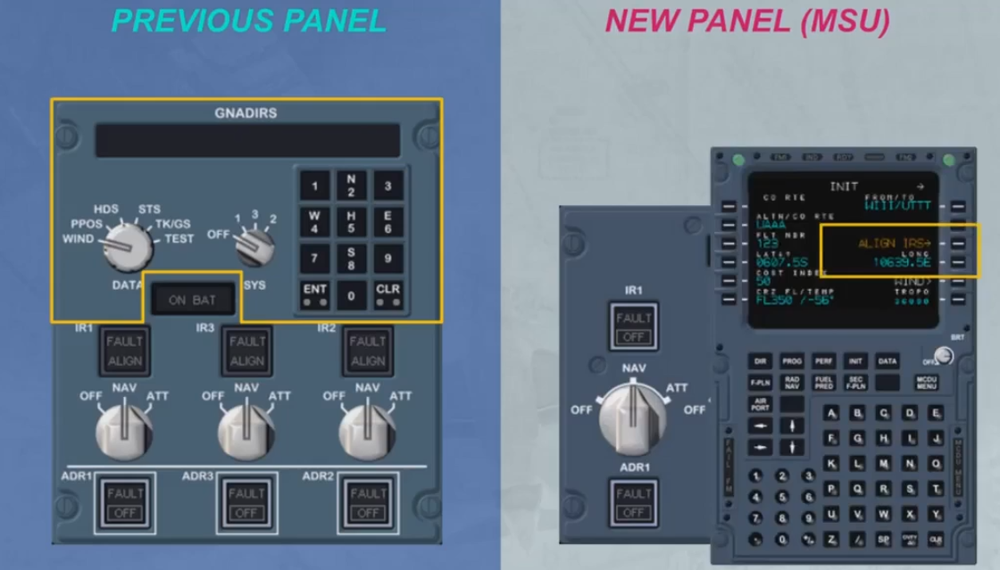
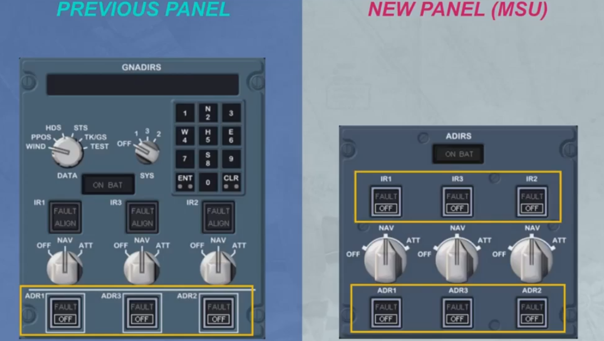
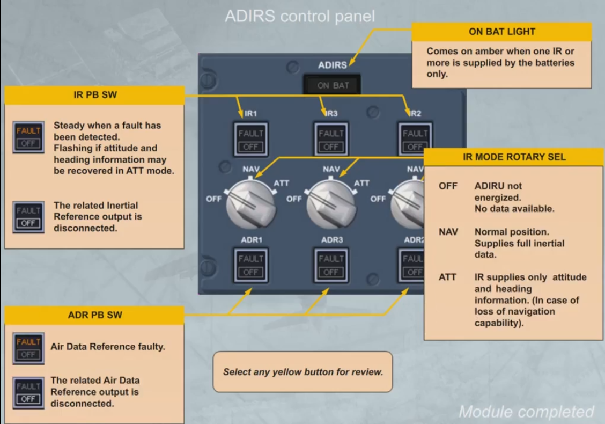

Here is the ADIRS panel that you already know, and here is the new one, called a Mode Selector Unit (MSU).

Let's compare these panels.

The most visible difference between these panels is the deletion of the keyboard and related display from the MSU. This means that, when using the MSU, IR system final alignment is only possible via the
MCDU (position insertion).

The other noteworthy difference concerns the ADIRS disconnections. 

As from the previous panel, the ADR outputs can also be disconnected from the MSU. But, from the MSU, you have the additional capability to independently disconnect the individual IR outputs.

***Module completed***

## Video study

- Watch the video available on [YouTube](https://www.youtube.com/watch?v=siiLO4qziAg&list=PLKEybvo562LtwmnZOjo8jN7J75vXGqMzq&index=52)