The A320 family is equipped with two radio altimeters. Their function is to determine the height of the aircraft above the terrain and also permits to measure the vertical distance between the aircraft and the nearest obstacle.

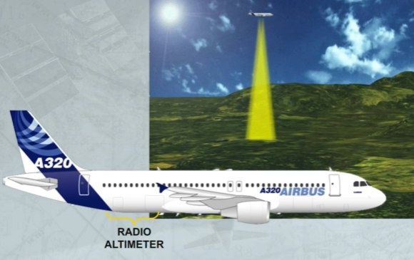

The time between the transmitted signal and the received signal, reflected by the ground, is proportional to the aircraft height. This time is converted in feet and corrected to correspond to the height between the ground and the bottom of the wheels.

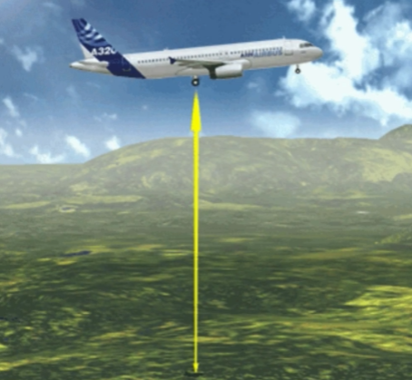

There are no radio altimeters controls in the cockpit. Both are automatically energized when the normal AC power is on.

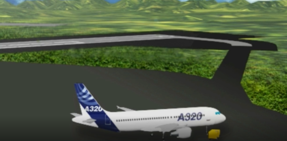

Radio Altimeter data is supplied to several different users.

The RA information is displayed on both PFDs only if below 2500 ft AGL.

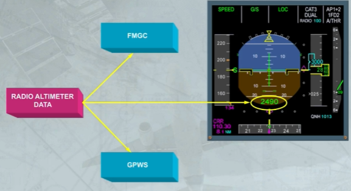

Normally, the RA 1 height is displayed on the CAPT's PFD and the RA 2 height on the F/O's PFD.

If either RA fails both PFDs display the height from the remaining RA.

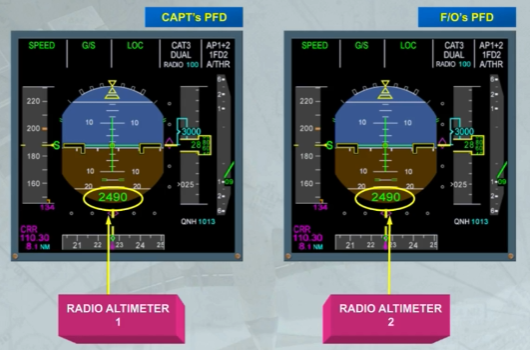

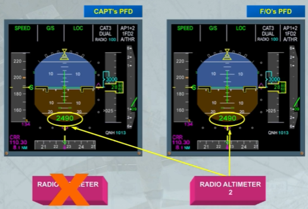

When RA height is displayed, it appears in green:
- Down to DH+100, if a RADIO altitude (DH) value has been entered on the MCDU

PERF APPR page for precision approach, or
- Down to 400, if no DH value has been entered or both FMGCs have failed.

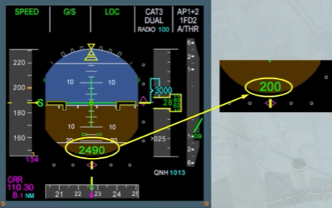

It turns to amber:
- Below DH+100, if a RADIO altitude (DH) value has been entered on the MCDU PERF APPR page, or below 100, if NO is entered in place of a DH value, or
- Below 400, if no DH value has been entered or both FMGCs have failed.

Note: The RA indication changes every 10 ft down to 50 ft, then every 5 ft down to 10 ft, then every foot.

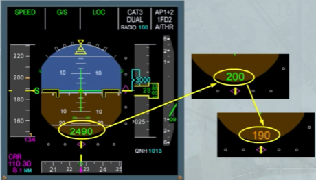

When it reaches the RADIO altitude entered on the MCDU PERF APPR page, the amber DH letters flash for nine seconds, then they stay steady above the radio height indication.

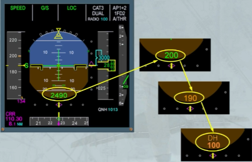

Also on the altitude scale a red ribbon is displayed when the RA height is below 570 ft.

It is driven by the RA signal and moves up as the RA height decreases.

Also, on the attitude sphere, a white line represents the ground reference.

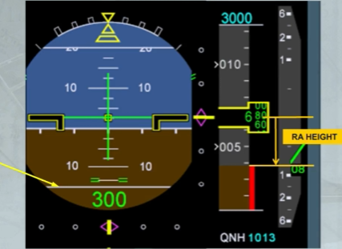

The red ribbon and the white line move up with the altitude as the aircraft descends.

When the aircraft has touched down, the white line is merged with the horizon and the top of red ribbon is at the middle of the altitude window, as shown.

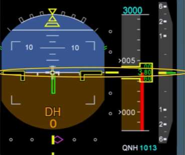

The ECAM FWC generates a synthetic voice for radio height announcement below 2500 ft.

Note: These announcements will be broadcast through the loud speakers even if they are turned off.

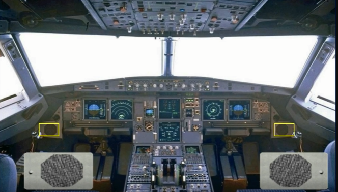

Auto call-out announcements are made at pre-determined radio-altimeter heights.

When no DH or no MDA or no MDH has been entered in the MCDU PERF APPR page they are ... as shown.

Some of them may differ depending on the version (refer to your documentation).

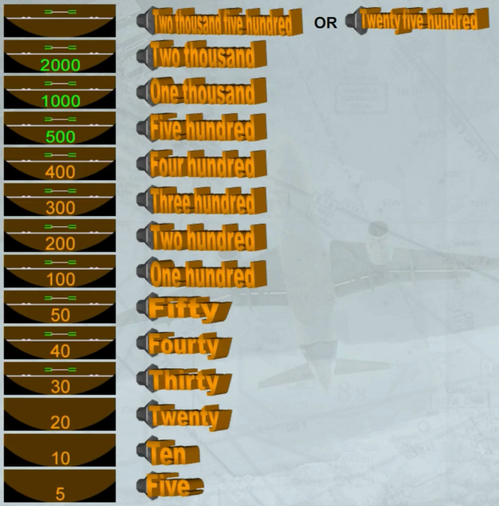

In addition, when a DH or a MDA or a MDH has been entered (as for example DH is 100), two new announcements will be broadcast:
- At DH (or MDA or MDH) + 100 and
- At DH (or MDA or MDH).

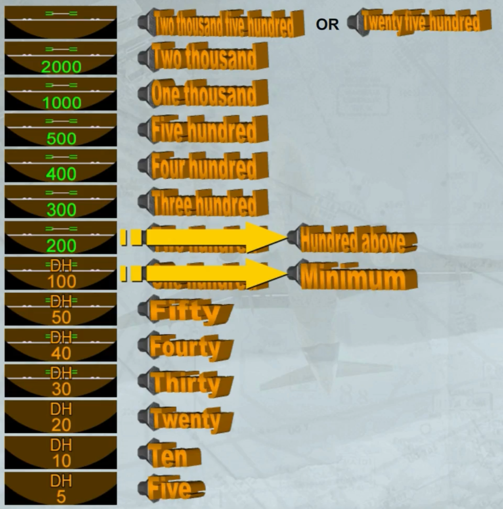

Regardless if DH/MDA/MDH has been entered or not, if in manual landing and at 20 ft, or if in automatic landing and at 10 ft, an additional announcement is triggered and repeated as long as the thrust levers are not moved to IDLE.

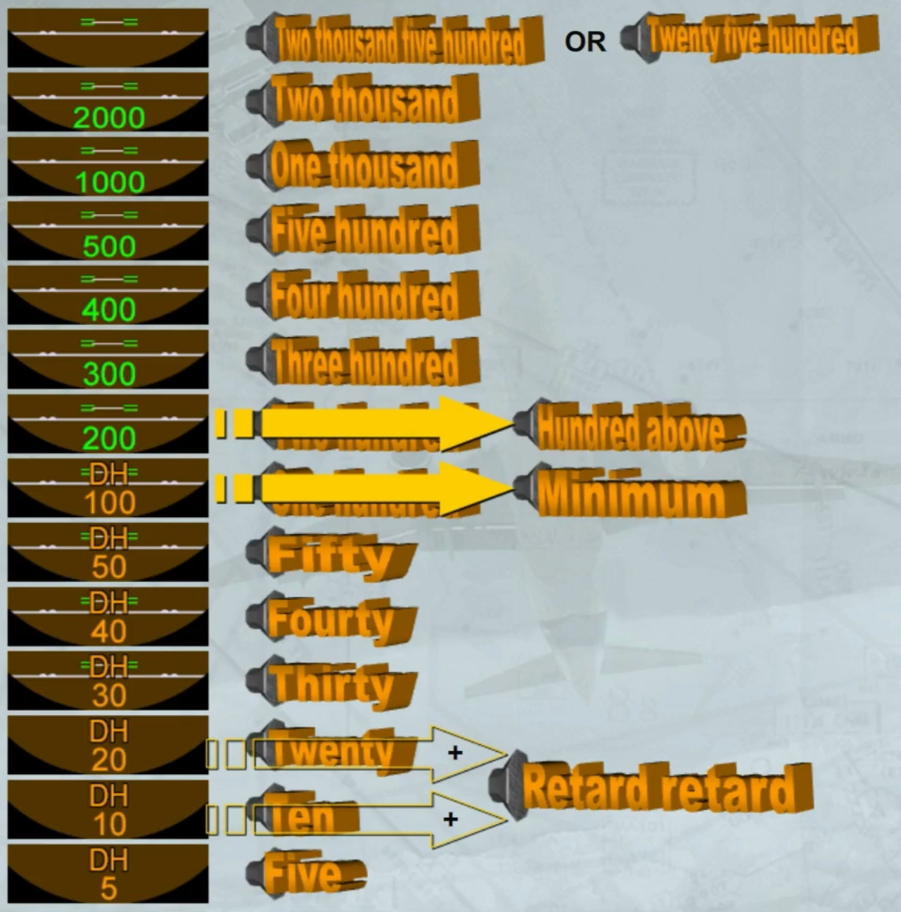

***Module completed***