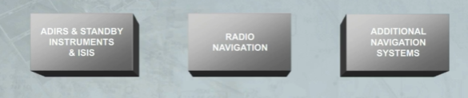
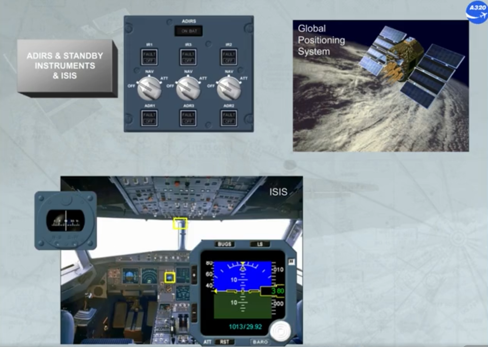
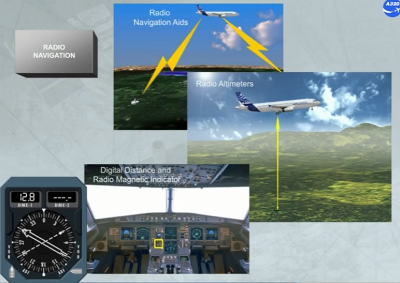
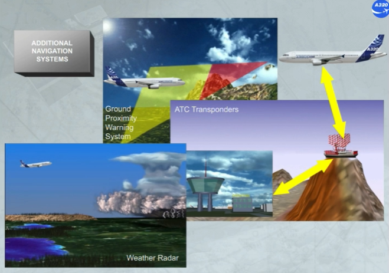
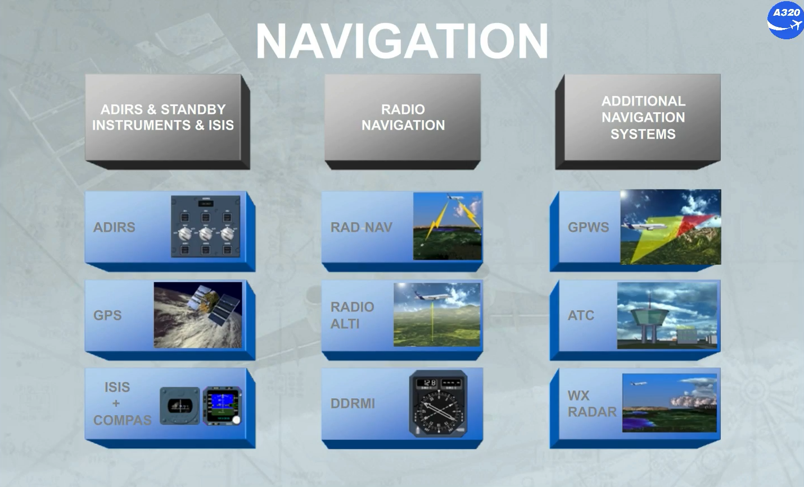

The navigation system is divided into three main groups:
- Air Data and Inertial Reference System (ADIRS) plus:
    - Standby instruments
    - Integrated Standby Instrument System (ISIS).
- Radio navigation
- Additional navigation systems.

There are several subsystems within each group.

The first group includes:
- Air Data Inertial Reference Units (ADIRU)
- Global Positioning System (GPS)
- Standby instruments (compass) and ISIS

The radio navigation group includes:
- Radio navigation aids
- Radio altimeters
- Digital Distance and Radio Magnetic Indicator(DDRMI).

The additional navigation systems include:
- Ground Proximity Warning System (GPWS)
- ATC transponders
- Weather radar

This completes the introduction to the subjects that will be covered in the following modules.

***Module completed***