Two weather radar systems can be installed, but only one works at a time. It is used to detect severe weather and is very useful as a
severe weather avoidance tool by displaying it on the ND, in any ND mode except PLAN.

Note: Each pilot may remove the weather radar image from its ND by setting the related brightness outer knob to minimum.

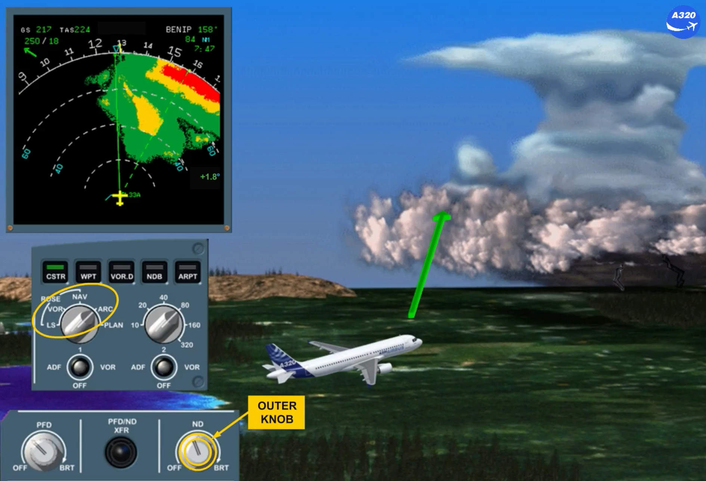

The WX RADAR control panel is located on the center pedestal. Depending on the version, the installed panel can be different (refer to your documentation).

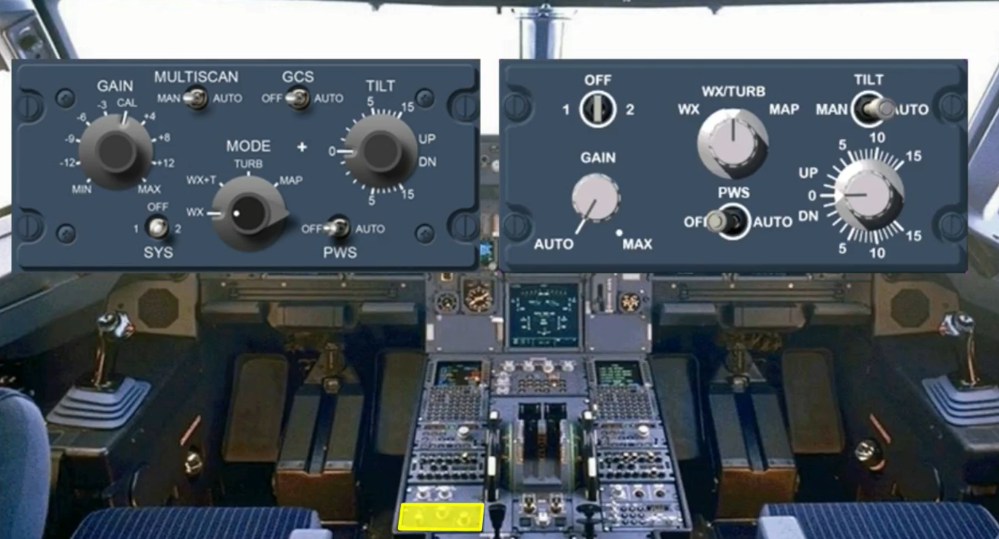

We will now look at the different controls and indications of the weather radar:

- The 1/OFF/2 sw selects one radar or turns off both radars. When switched on, the TILT angle indication appears on the ND.

Note : If there is only one radar installed on the aircraft, no weather image is displayed when system 2 is switched on. On the panel the 2 must be replaced by an INOP sticker.

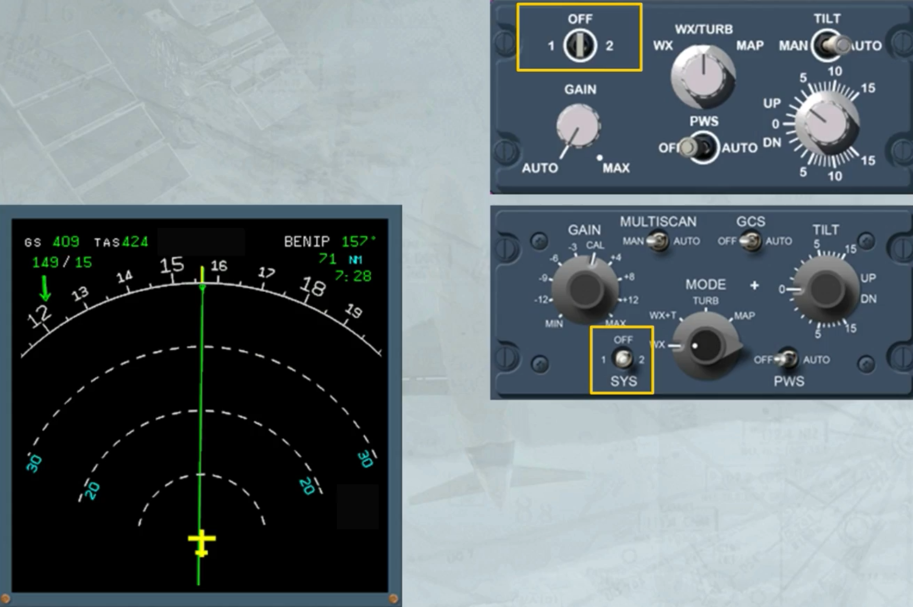

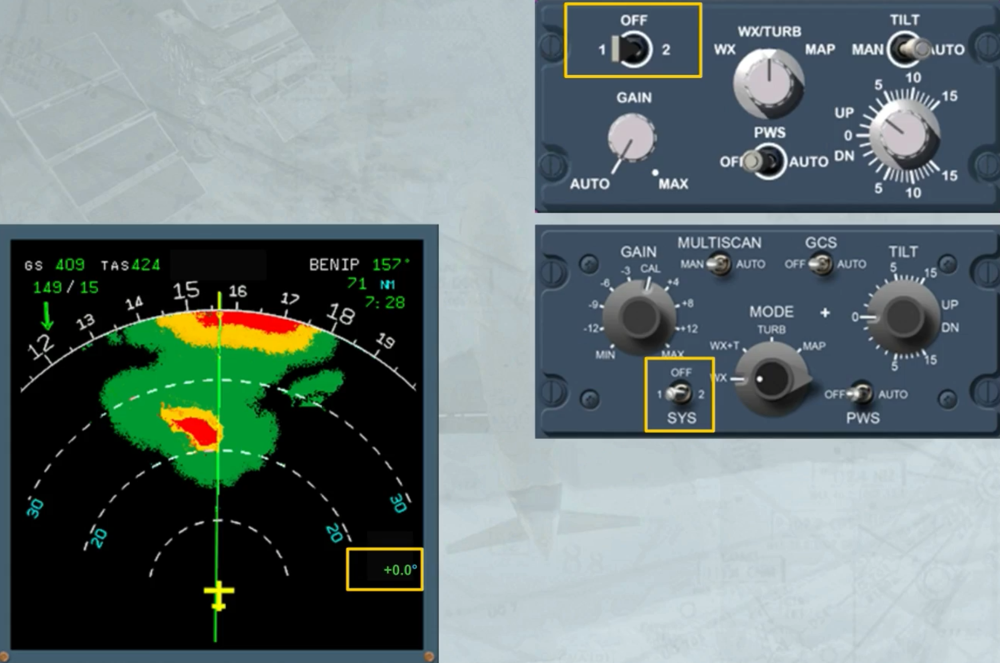

The installed TILT switch or MULTISCAN switch:
- When it is in AUTO, allows the ADIRS to automatically select an optimized tilt

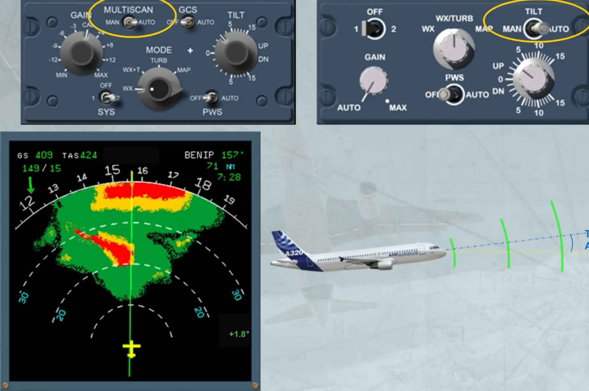

- When it is in MAN, allows the TILT knob to be used to adjust the radar antenna relative to the horizon seen by the ADIRS.

Note: Radar 1 is on ADIRS 1 and Radar 2 is on ADIRS 2.

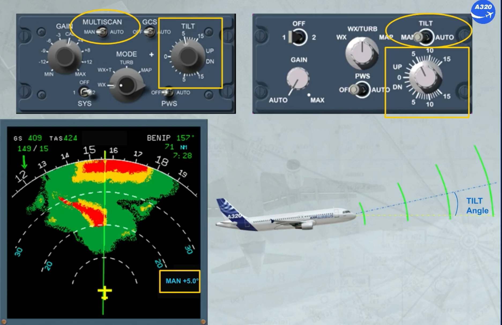

The GAIN knob is used to manually adjust the sensitivity of the receiver. In this case, the white MAN GAIN appears as shown. But on the version shown on the left hand side, the manual sensitivity adjustment is available only in WX MODE or in MAP MODE.

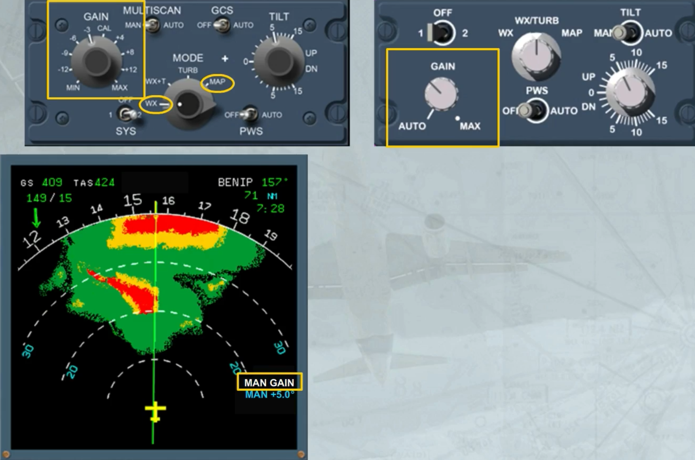

In the AUTO position or in the calibration (CAL) position, the radar adjusts automatically the gain to the optimum calibrated setting.

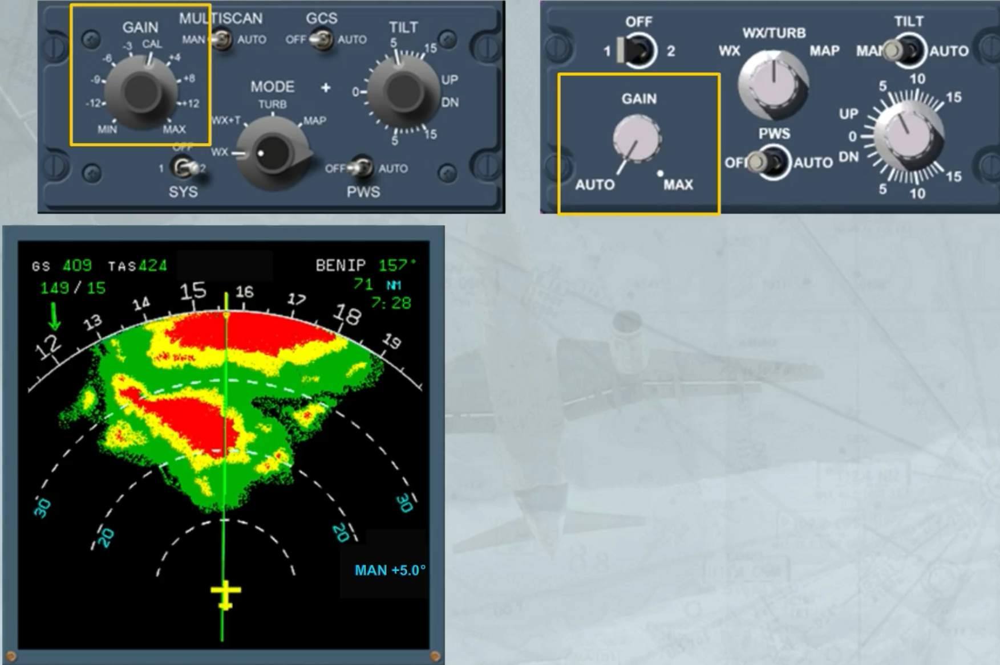

A ground clutter suppress (GCS) switch, only installed on the left hand side version, when:
- In AUTO, allows the suppression of the ground echo on the screen
- In OFF position, allows the normal use of the radar.

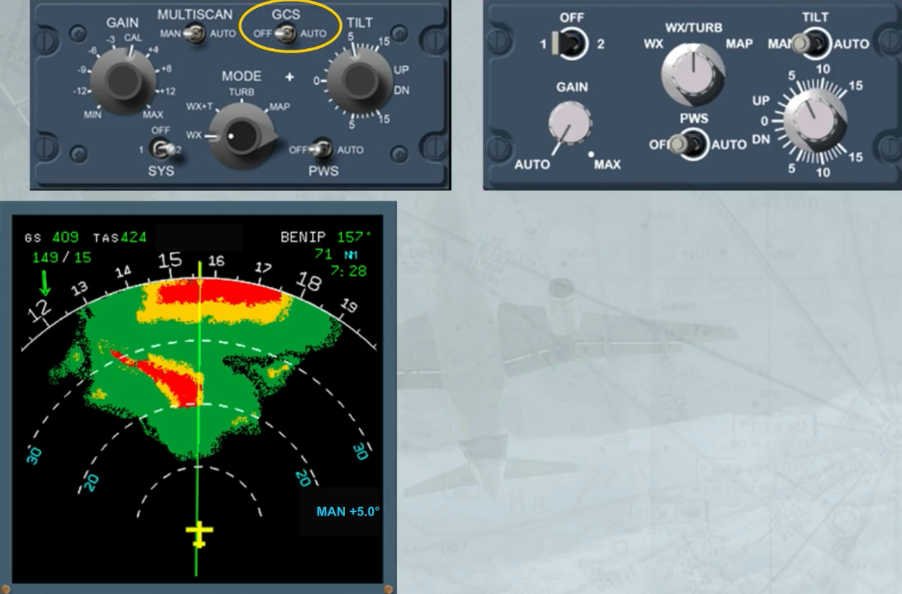

The MODE selector, when it is:
- In WX position: shows the intensity of precipitation

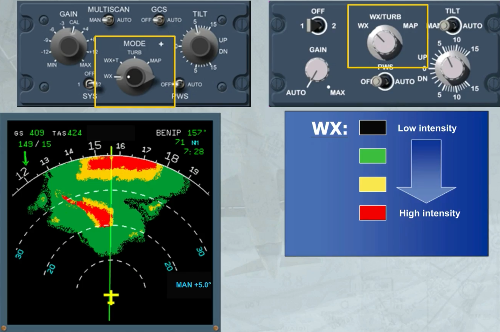

- In WX/TURB or WX +T position: shows the intensity of precipitation plus the turbulence areas in magenta

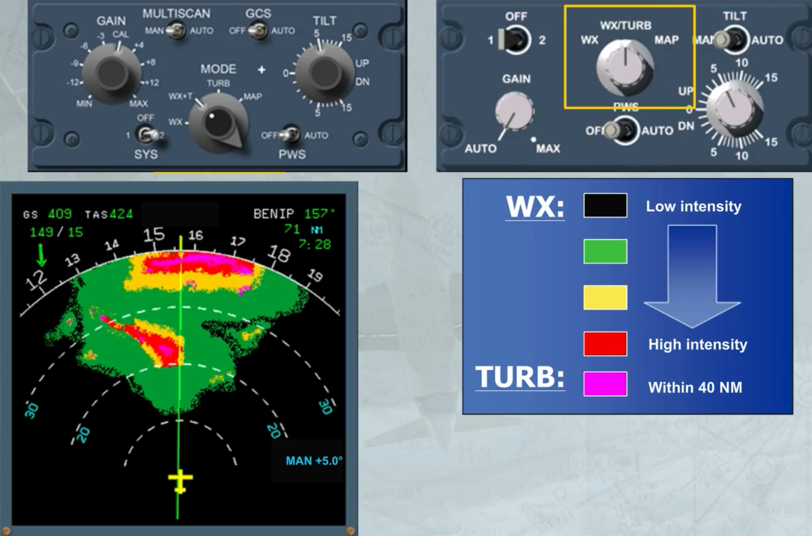

- In MAP position: the radar operates in ground mapping mode

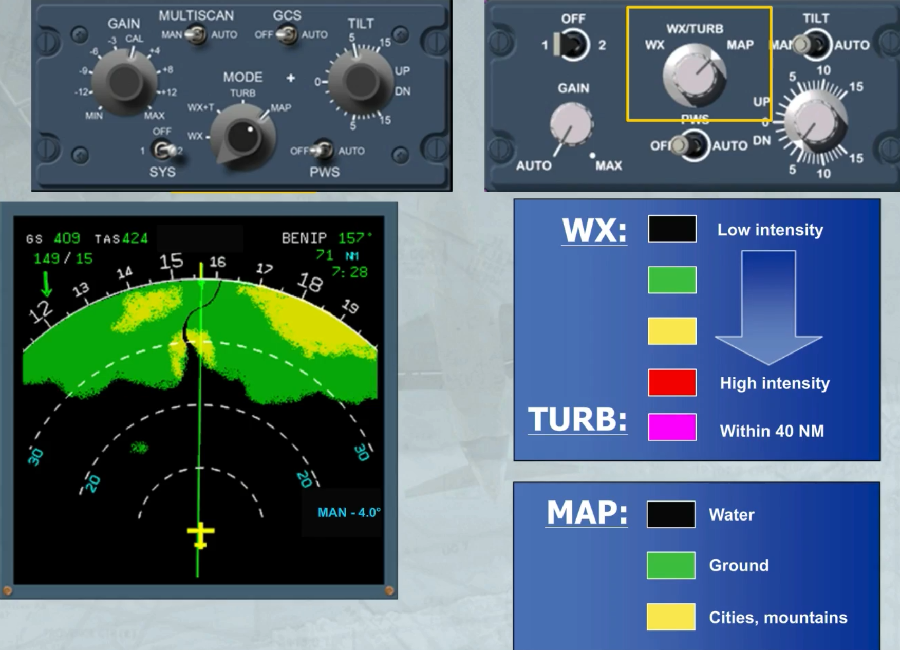

- On the version shown on the left hand side, a TURB position allows the display of only turbulence areas.

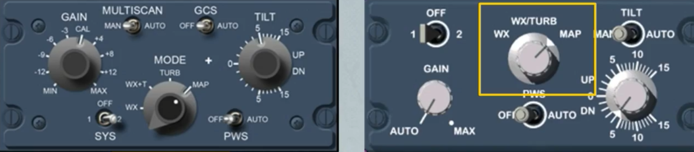

This is the normal setting.

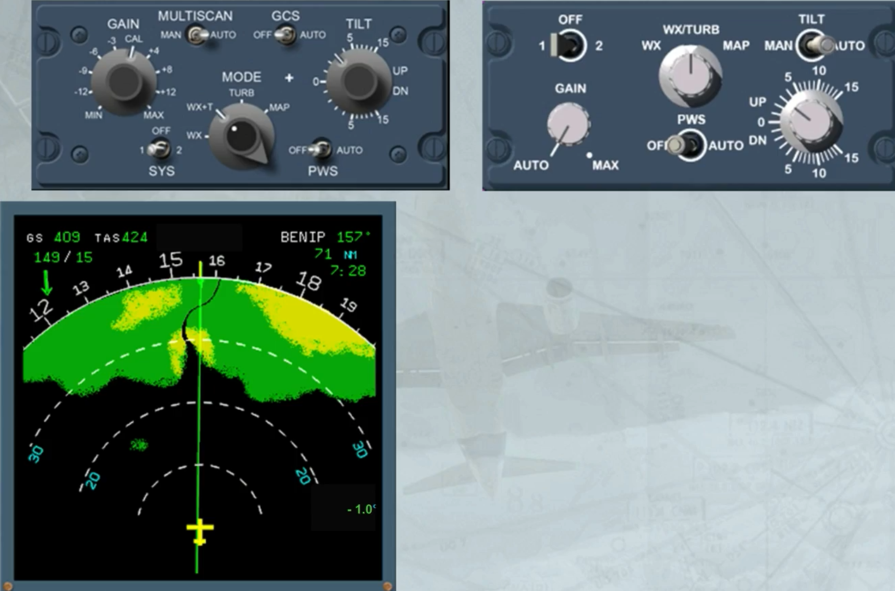

In addition, there is a PWS switch, when in AUTO, allows the predictive windshear system to generate appropriate visual and aural alerts.

When PWS is active the TILT angle indication is replaced by PWS SCAN on the ND.

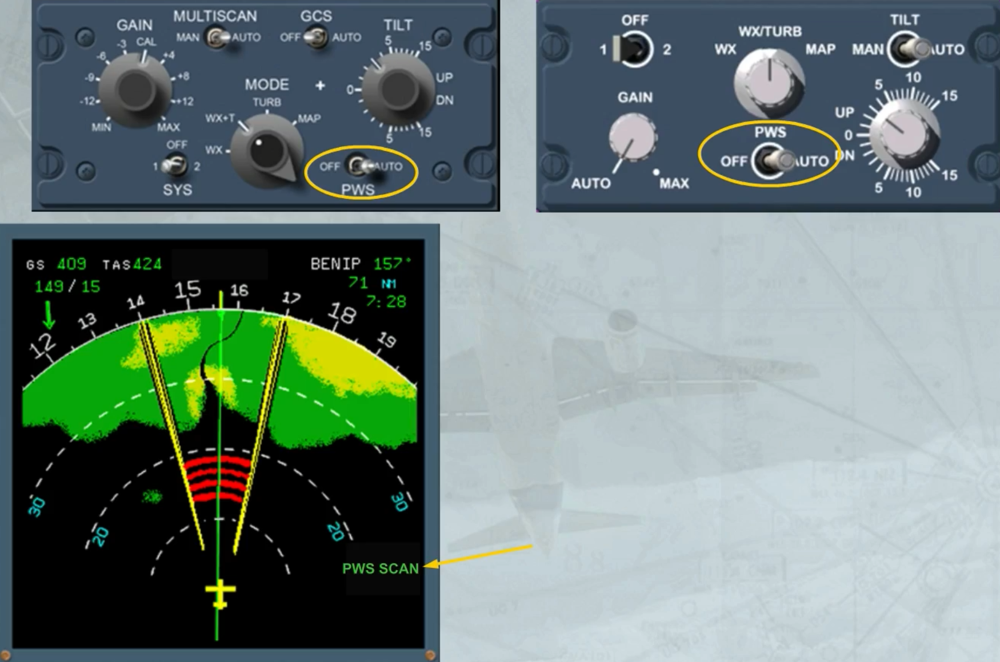

***Module completed***