The A320 family has:
- Two VOR receivers
- Two DME systems
- Two ILS receivers
- Two ADF systems.

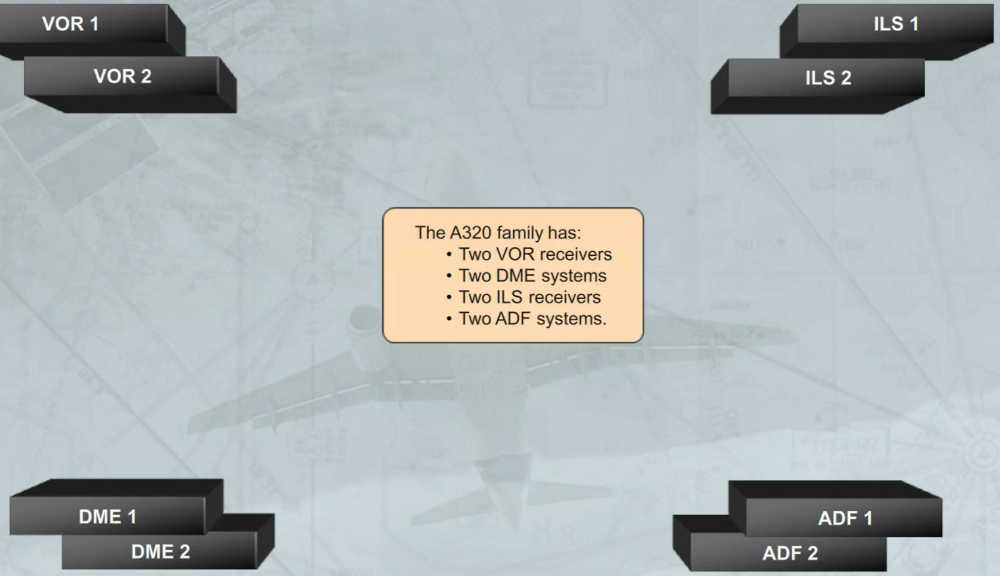

The FMGC is the basic means for tuning the navaids.

In normal operation, each FMGC controls automatically its own receivers, as shown.

Note: In case of one FMGC failure, the remaining FMGC may control all receivers.

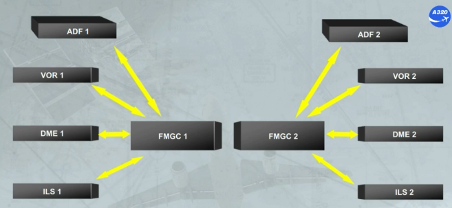

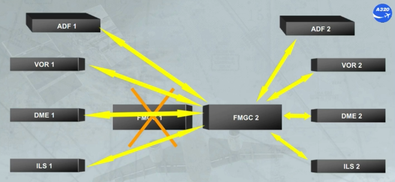

The navaids auto tuning or manual tuning can be controlled and monitored through the MCDU pages:
- The RADIO NAV page, accessed by the RAD NAV key
- The SELECTED NAVAIDS page, accessed from the POSITION MONITOR page.

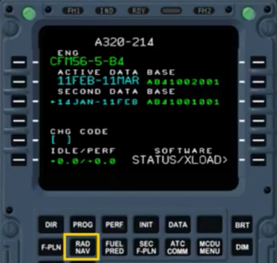

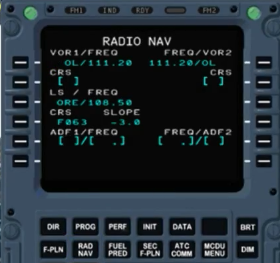

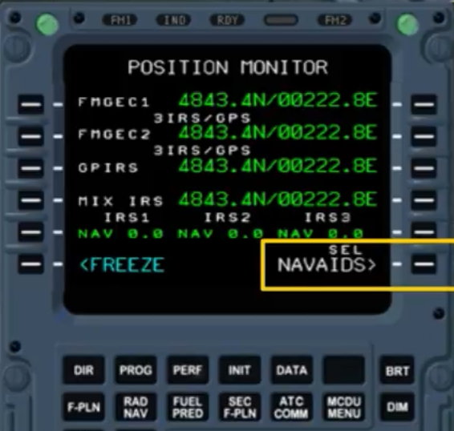

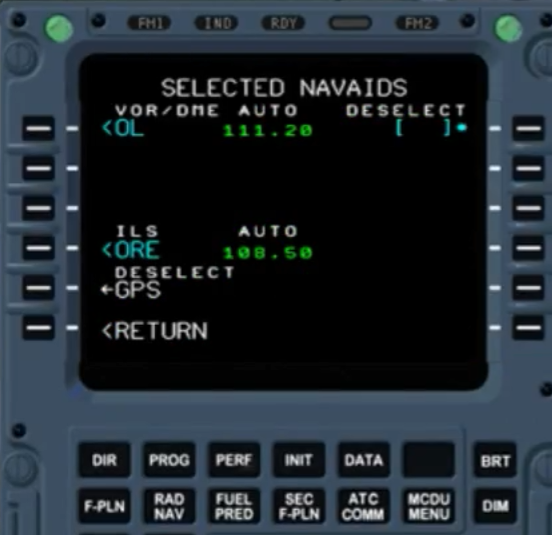

For visual display, the RADIO NAV page displays the navaids auto tuned. But the crew may force the navaids to be manually tuned, as shown.

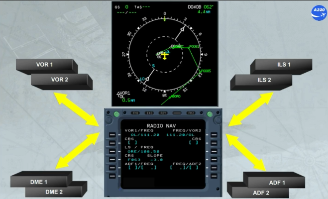

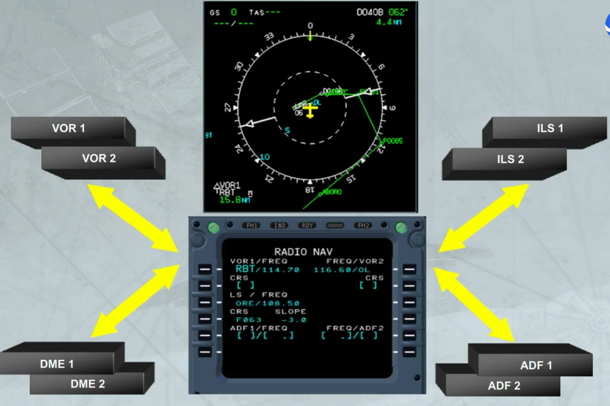

Note that, when an ILS approach is selected:
- ILS 1 is displayed on PFD 1 and ND 2
- ILS 2 is displayed on PFD 2 and ND 1.

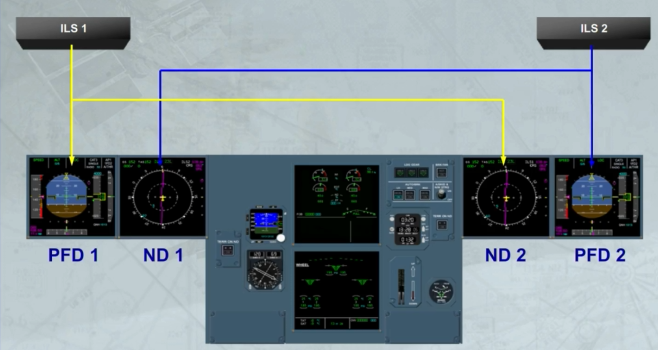

In all the modes except PLAN, the navaids can be displayed if the ADF-VOR selectors have been switched to VOR or ADF position.

Here, as an example, the ROSE VOR mode with ADF 1 and VOR 2 selected.

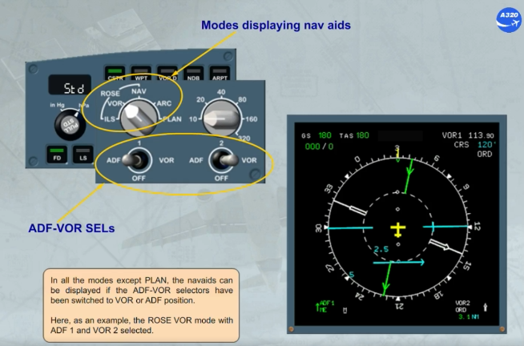

ADFs are shown as green pointers, here ADF 1. VORs are white pointers, in this example VOR 2.

Note also that the receiver 1 data is displayed on the left side of the ND and the receiver 2 data on the right side.

The associated navaid data is displayed at the bottom of the ND in their respective colors and sides.

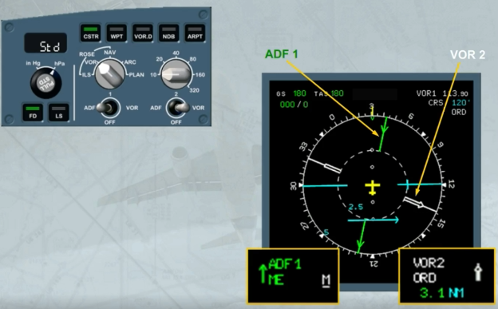

You will see the different ND modes and navaid tuning, later in the course.

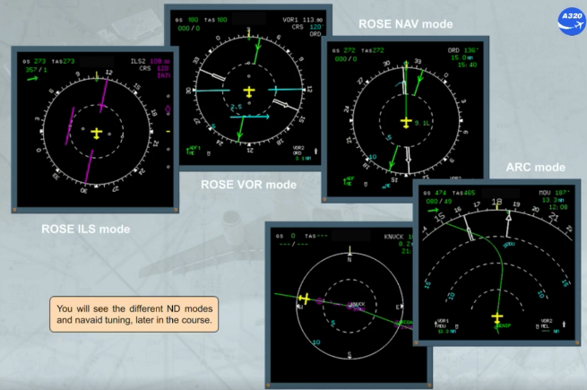

In the unlikely event of a double FMGC failure, the back up tuning mode provides radio navigation redundancy to the crew.

The back up tuning mode is accessed via the Radio Management Panels (RMP).

Note: RMP 3 has no back up tuning capability.

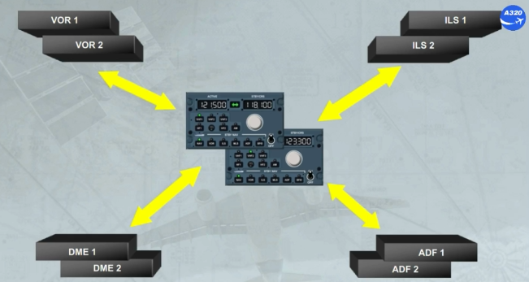

To access the back up tuning mode, the NAV key has to be pressed.

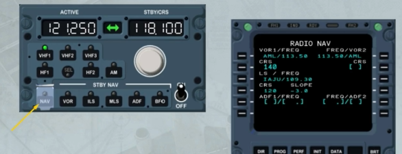

When the back up tuning mode is selected, the control of the associated receivers is transferred to the RMP and the navaid tuning capability of both FMGCs is lost.

This is indicated on the MCDU by a change on the RADIO NAV page which now shows only the titles.

To return the control to the FMGC, the NAV key has to be pressed again.

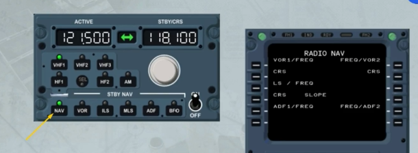

In back up tuning mode, the selection of one of the STBY NAV keys enables the crew to tune the associated navaid.

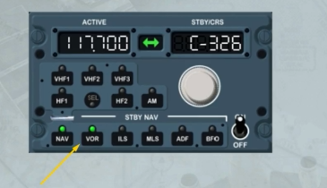

For navaid tuning, RMP 1 STBY NAV keys are associated with VOR/DME 1 and ADF 1 while RMP 2 keys are associated with VOR/DME 2 and ADF 2.

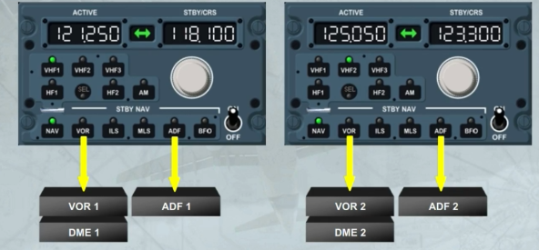

The ILS keys are slightly different. The ILS frequency tuned on either RMP is sent to both ILSs.

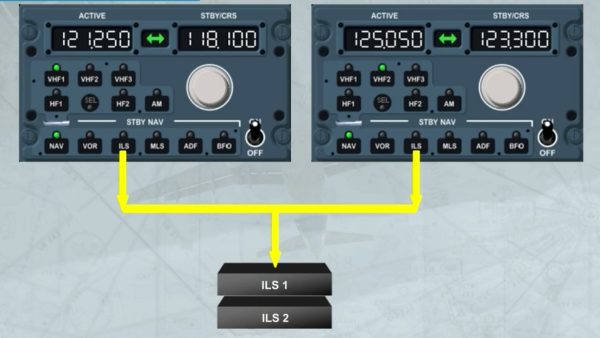

The Digital Distance and Radio Magnetic Indicator (DDRMI) is located on the main panel.

The DDRMI displays ADF, VOR and DME raw data. It combines traditional RMI and bearing pointer presentation.

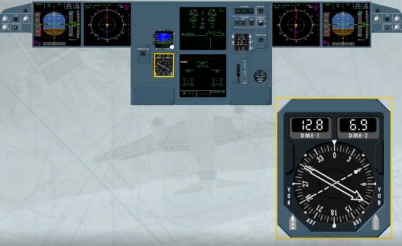

Two bearing pointers are provided, each with a well identified shape.

Each can display either VOR or ADF information.

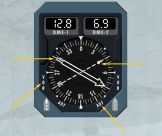

Each pointer has an associated selector:

- The left selector selects either VOR 1 or ADF 1
- The right selector selects VOR 2 or ADF 2.

Here, VOR 1 and VOR 2 are selected.

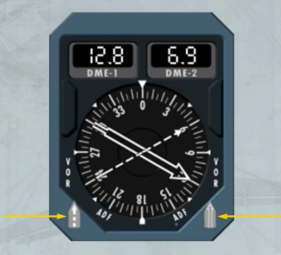

The compass card displays the bearing as supplied by ADIRU 1 in normal condition or by ADIRU 3 if selected by the ATT HDG SWITCHING selector.

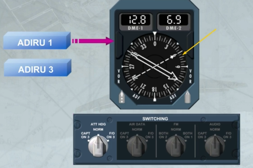

The counters indicate the DME distance.

However, the window will display only dashes if an ADF is selected.

Here, ADF 2 is selected.

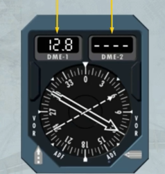

***Module completed***