The purpose of the Air Data Inertial Reference System(ADIRS) is to provide air data and inertial information to the EFIS system, the FMGC and other users.

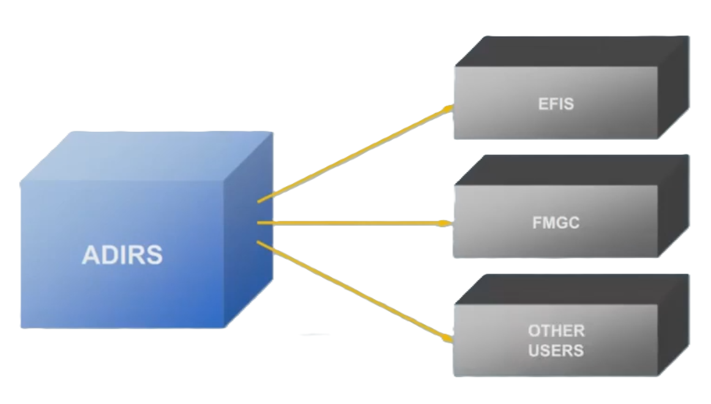

The A320 has three separate but identical Air Data Inertial Reference Units.

---
## ADR & IR

Each ADIRU combines an Air Data Reference computer, or ADR and a laser gyro Inertial Reference system, or IR.

The ADR and IR systems of each ADIRU operate independently, and failure of one system will not cause failure of the other.

---
## Probes & Sensors

The ADR part receives information from aircraft probes and sensors.

The ADR part provides various items of air data to the Flight Management and Guidance Computers (FMGCs) and other users.

The air data provided includes:
- Mach
- Airspeed
- Temperature
- Overspeed warnings
- Barometric altitude
- Angle Of Attack.

The IR part provides inertial data to the FMGC, EFIS andother users.

The inertial data provided includes:
- Track
- Heading
- Acceleration
- Flight path vector
- Aircraft position
- Ground speed
- Attitude.

:::note[My Note]

How to memorise

ADR

- March/IAS, Over SPD Warning
- TAT, AOA (-> TAS)  
- Baro ALT

IR
- Heading, Attitude (ATT Mode)
- Acceleration + Position
    - Ground Speed
    - Flight path vector
    - Track

:::

---
## ADIRS Control

The three ADIRS are controlled through the ADIRS panel located on the overhead panel.

They are initialized through the two MCDUs located on the pedestal...

...and by two of the switches on the SWITCHING panel located at the front of the pedestal.

---
## Data Supply

Independent data is supplied by each ADIRU. Let's see an example of this.

In the EFIS system, ADIRU 1 supplies the Captain's EFIS, and ADIRU 2 supplies the First Officer's EFIS.

ADIRU 3 is available as a back-up to either EFIS system via the switching panel.

---
## ADIRS MSU

Now let's look at the ADIRS Mode Selector Unit (ADIRS MSU).

The panel is divided into two parts. The upper section for the IR and the lower section for the ADR.

The three rotary mode selectors have control over both the IR and the ADR.

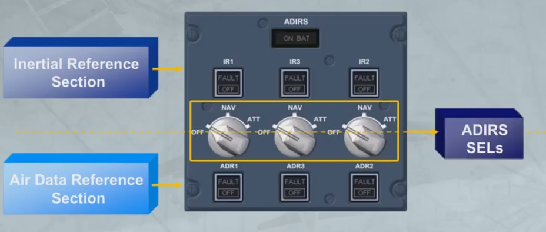

The controls and indicators for the individual ADIRUs are grouped and arranged in the following order: 1, 3 and 2.

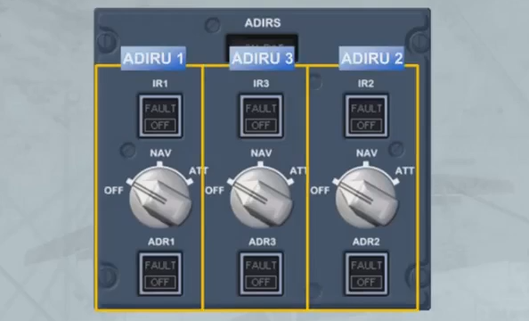

Each ADIRU has an associated rotary mode selector.

In the "OFF" position, the ADIRU is not energized, so ADR and IR data are not available.

The three ADR and the three IR switches normally remain on, but they can be selected offin response to ECAM procedures.

 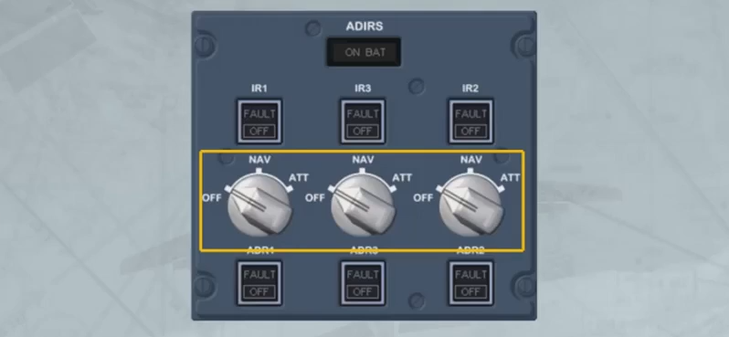

In the "NAV" position the ADIRU is energized. The "NAV"position is the normal mode of operation and full inertial datais provided to the aircraft systems.

 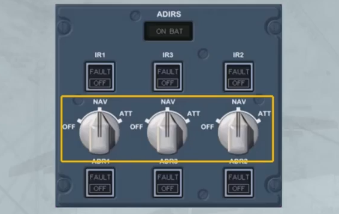

The ON BAT light comes on to inform the crew that the ADIRUsystem is being powered by aircraft batteries only.
The light also comes on for a few seconds at the beginning of a
full alignment as a test of the battery circuit.

 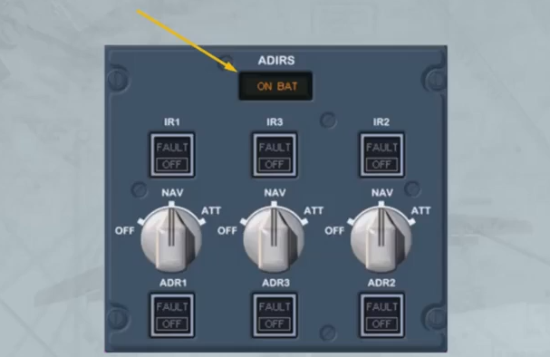

The following items can also be used in case of given failures:

- The ATT position of the ADIRU selector allows the selection of this IR mode providing only heading and attitude information, in case of loss of navigation capability.

 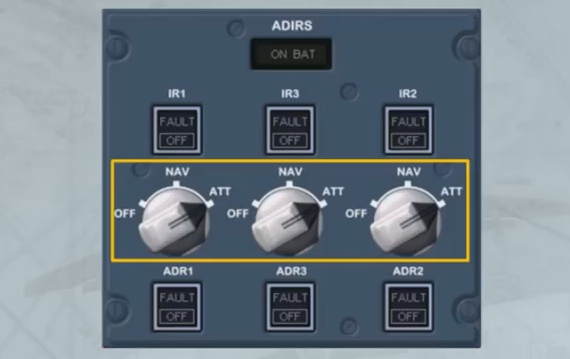

- The three ADR pushbutton switches normally remain on, but they can be selected OFF in response to ECAM procedures. When done, it only stops the related ADR part and not the IR part.
- The three IR pushbutton switches operate in the same way for the ADR pushbutton switches. But if an IR FAULT light is
flashing, the related ADIRU selector can be selected to ATT, in order to recover the atttude and heading information.

 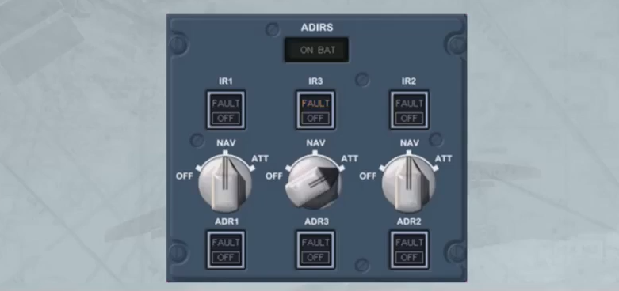

 ---
## Alignment

The alignment phase is completed when the ADIRUs are initialized to an appropriate position.

With GPS available, initialization is automatic, using the GPS position, and does not require pilot action. However, automatic initialization may be manually overridden, during the alignment phase, by accessing to the IRS INIT page. This method will be explained later, in the OPERATION module.

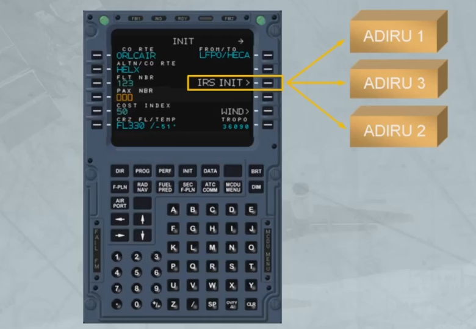

---
## Back Up SPD & ALT Indication
In case of unreliable airspeed indications, for example after the 3 ADRs failure, the back-up speed and the altitude indication are available on both PFDs, provided the three ADRs have been set to OFF.

The speed scale is replaced by a Back-Up Speed Scale (BUSS) based on the aircraft angle of attack information and on the Slat/Flap configuration (from SFCC).

The Back-Up Altitude Scale is based on GPS altitude information. Due to the GPS altitude inaccuracy, the last two digits are doubled dashed. 

The vertical speed indication is not available.

Note: On the FMA, an amber USE MAN PITCH TRIM is displayed when the landing gear is down.

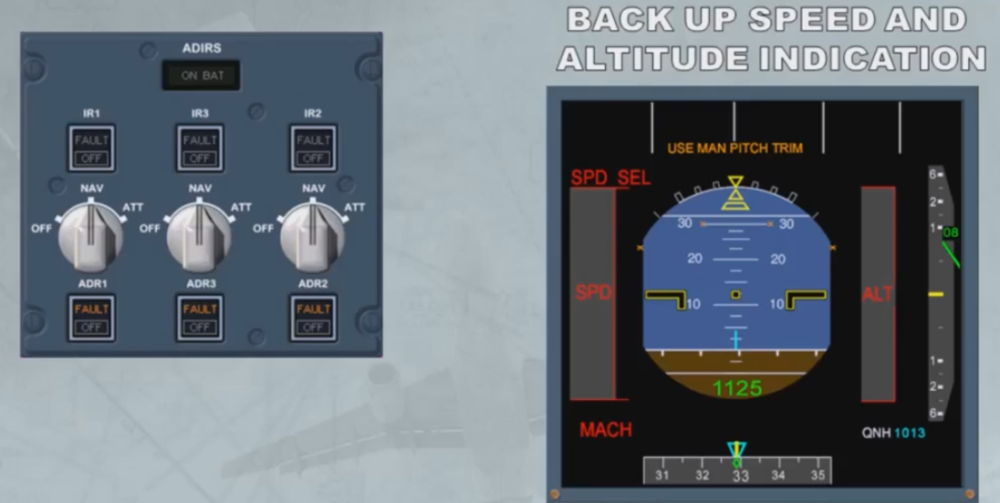

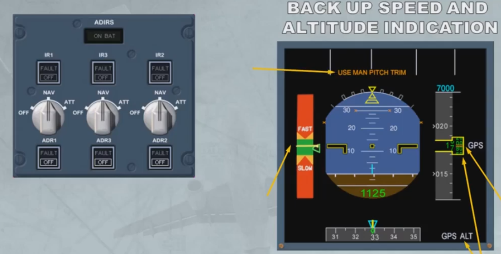

The Back-Up Speed Scale (BUSS) behaves like a normal speed scale:
- High speeds (FAST) towards the top
- Low speeds (SLOW) towards the bottom

Two different images can be displayed:
- One for clean configuration
- Another one for high lift configuration (refer to the end of the
presentation).

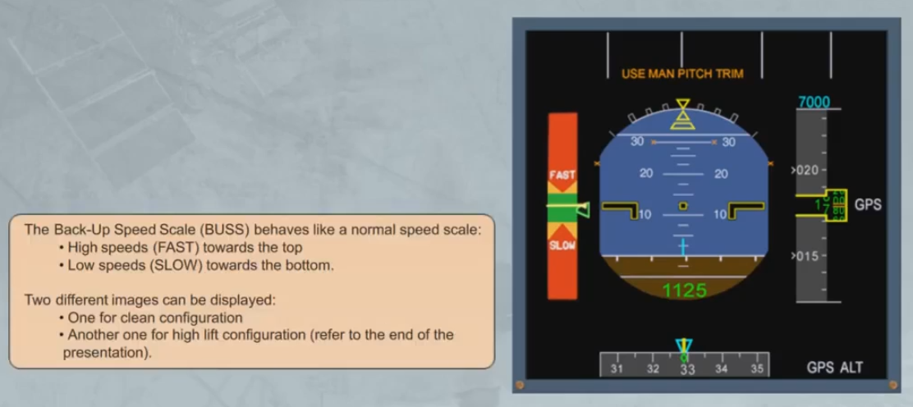

The scale is divided into five colored ranges:
- A red upper area above Vmax with decreased load margin
- An amber/red upper area between Vmax with decreased load margin and Vmax with normal load margin
- The green area is in accordance with the normal speedrange (between VLS and Vmax)
- An amber/red lower area between VLS and VSW
- A red lower area which indicates the stall speed area

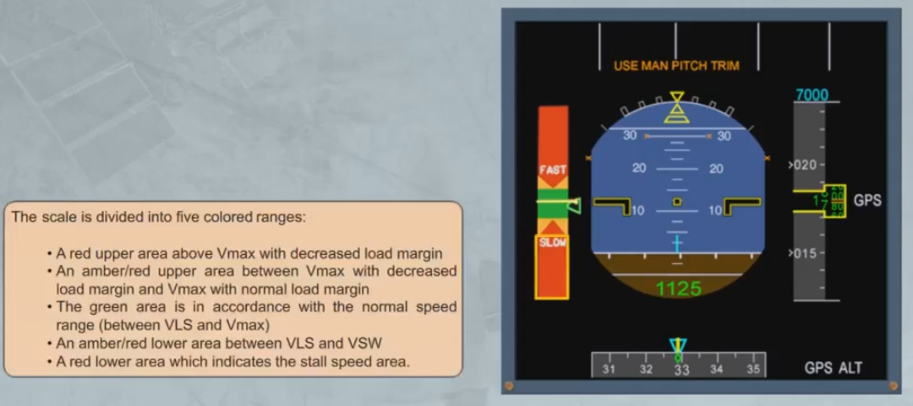

The aircraft AOA/speed must remain in the green area.
For each configuration, a green bug indicates the target speedwhich is the optimum speed that the flight crew must maintain, especially during approach and landing. The target speed is automatically set by the system.

The aircraft current speed is indicated by a fixed yellow horizontal bar with a yellow triangle

The back up speed scale is designed for a load factor of 1. Therefore roll maneuvers must be flown with care.

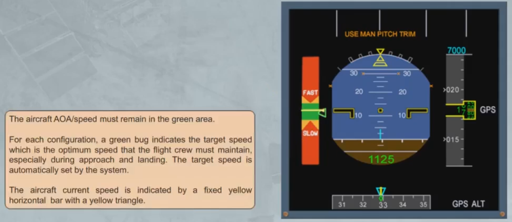

---
## BUSS Operation

BUSS OPERATION: FLY THE GREEN

The following video is a computer animation showing BUSS operation for a "generic" Airbus FBW aircraft.

Note: Flight parameters, displayed on the video, are based on an A380.

The goal is to show the BUSS display through different configurations.

The aircraft is flown with the BUSS displayed on the PFD, ATHR is OFF, ALTERNATE LAW is in force until landing gear down, then DIRECT LAW.

The ISIS speed scale is indicated for information.

:::note[Question]
Is ISIS Speed affected?
:::

To start with, the aircraft is stable at target speed. Then, an acceleration is performed, in order to reach the high speed amber-green limit for a short time. The pilot then decelerates towards the low speed green-amber limit.

After a short stabilization, an intermediate approach is carried out, then an ILS approach.

Final configuration is CONF3, landing gear down.

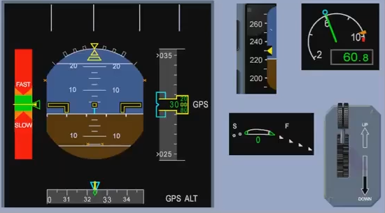

Acceleration

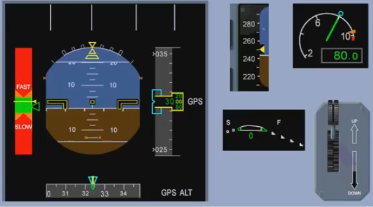

Stabilization

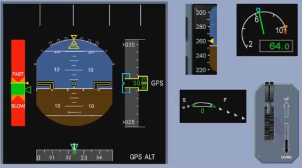

Decceleration

Stabilization

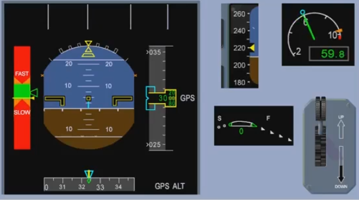

ILS ON

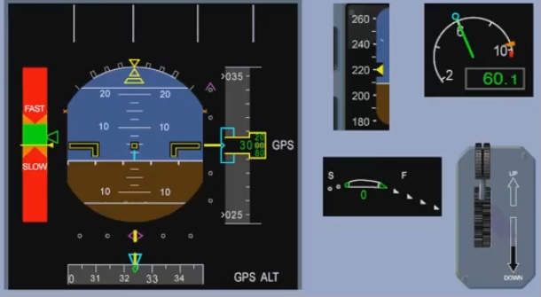

Flaps 1

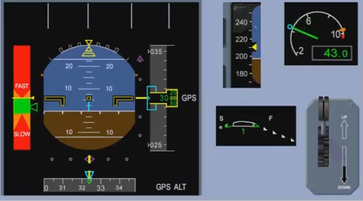

Flaps 2
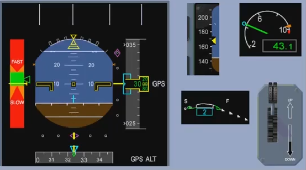
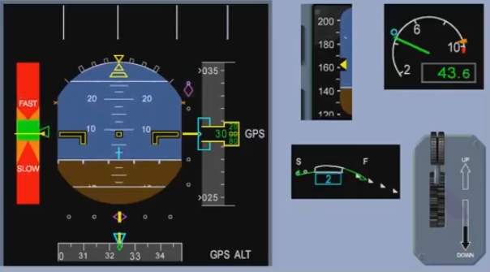
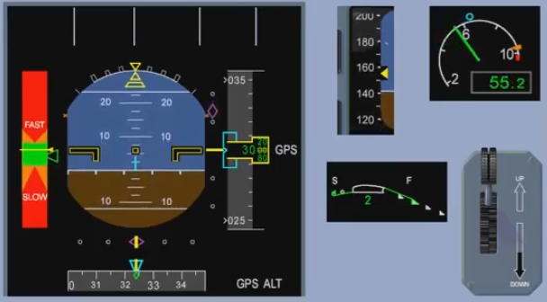

Gear Down
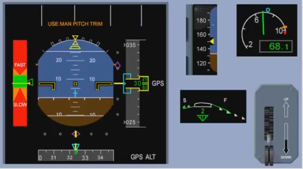

Flaps 3
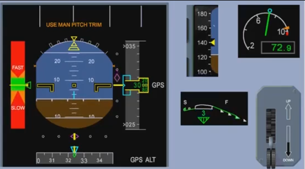

Final Approach
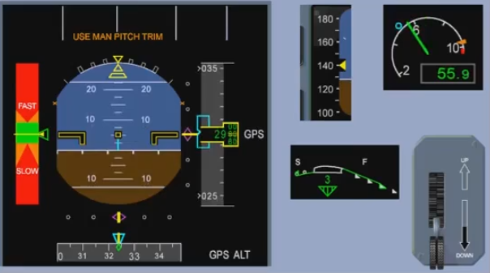
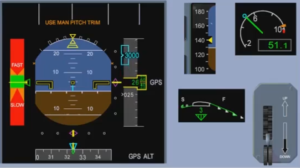

## Video study

- Watch the video available on [YouTube](https://www.youtube.com/watch?v=siiLO4qziAg&list=PLKEybvo562LtwmnZOjo8jN7J75vXGqMzq&index=53)