The purpose of the Air Data Inertial Reference System(ADIRS) is to provide air data and inertial information to the EFIS system, the FMGC and other users.

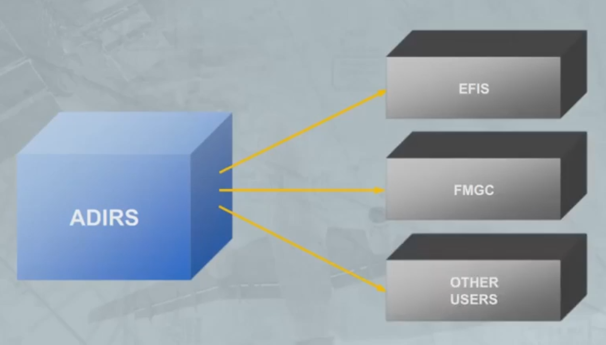

The A320 has three separate but identical Air Data Inertial Reference Units.

Each ADIRU combines an Air Data Reference computer, orADR and a laser gyro Inertial Reference system, or IR.

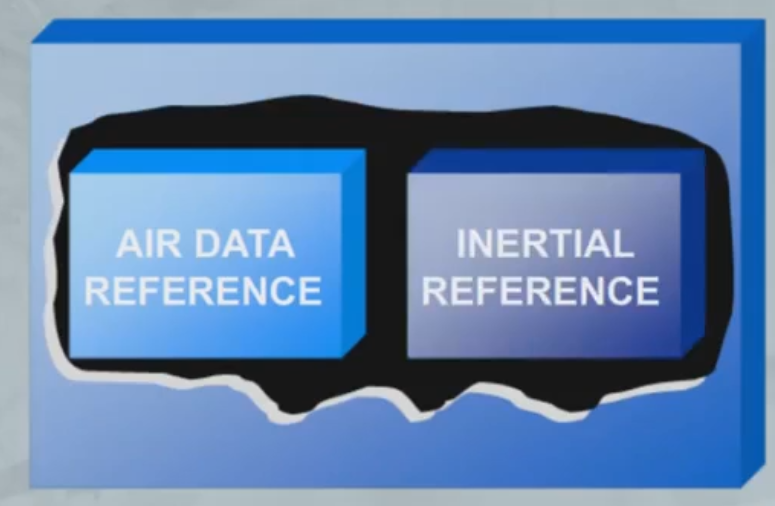

The ADR and IR systems of each ADIRU operateindependently, and failure of one system will not causefailure of the other.

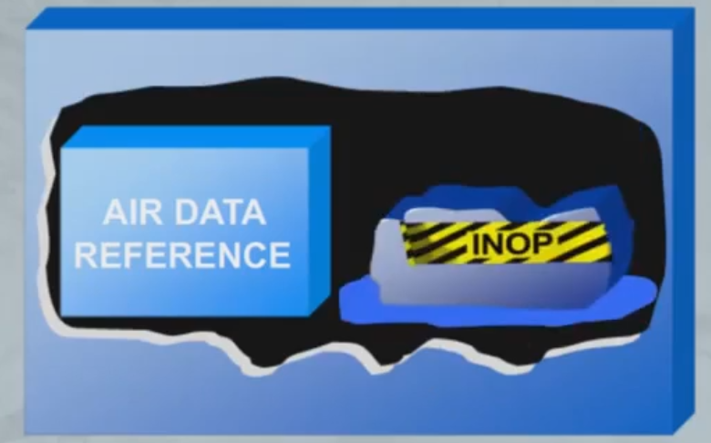

The ADR part receives information from aircraft probes
and sensors.

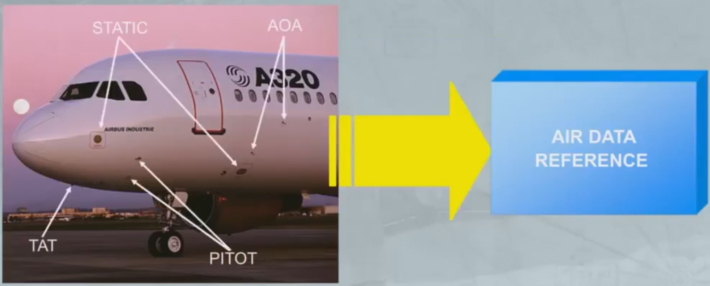

The ADR part provides various items of air data to the FlightManagement and Guidance Computers (FMGCs) and other users.The air data provided includes:
·Mach
·Airspeed
·Temperature
· Overspeed warnings
· Barometric altitude·Angle Of Attack.

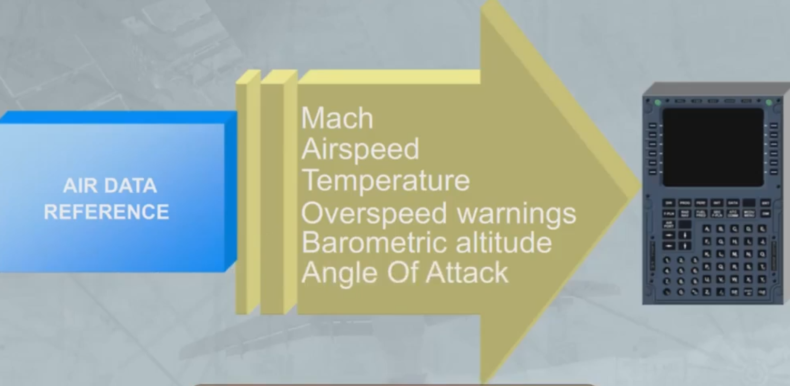

The IR part provides inertial data to the FMGC, EFIS andother users. The inertial data provided includes:
·Track
·Heading
·Acceleration
·Flight path vector
·Aircraft position
· Ground speed
·Attitude.

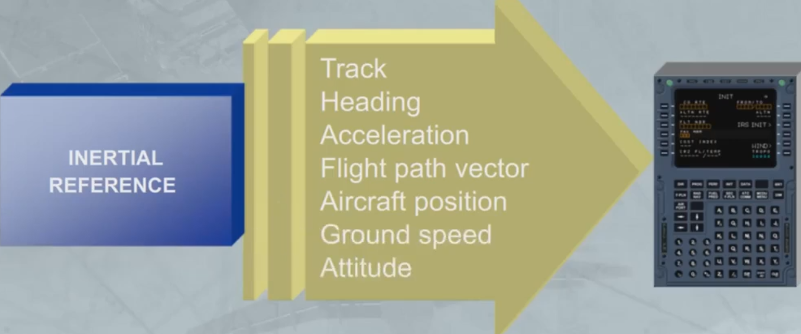

The three ADIRS are controlled through the ADIRS
panel located on the overhead panel.

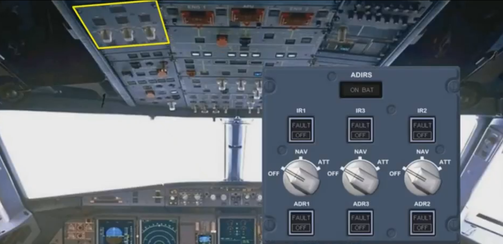

They are initialized through the two MCDUs located on the pedestal...

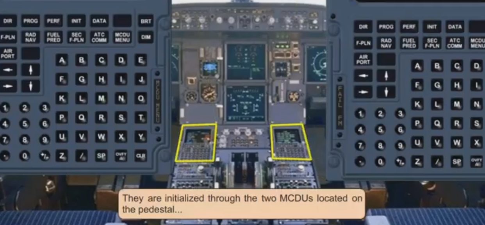

...and by two of the switches on the SWITCHING panel located at the front of the pedestal.

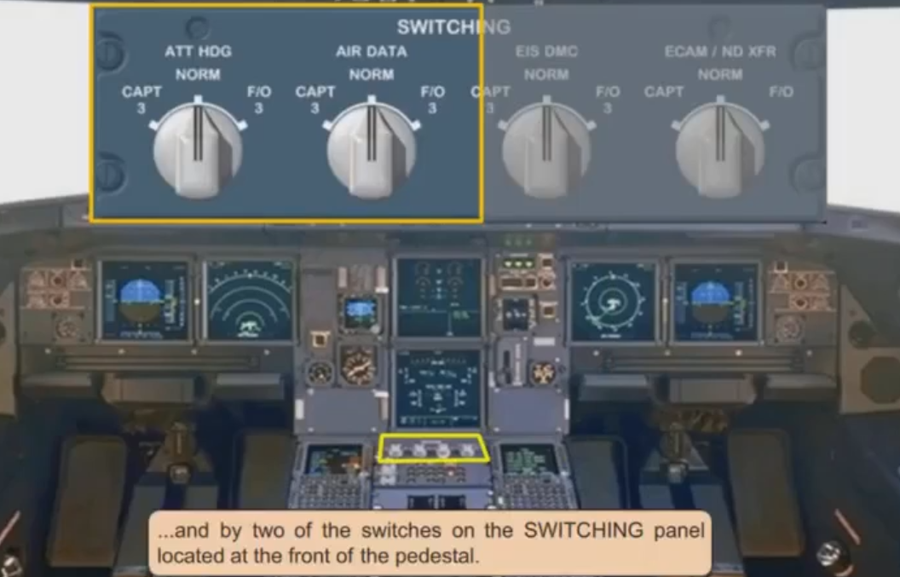

Independent data is supplied by each ADIRU.
Let's see an example of this.

In the EFIS system, ADIRU 1 supplies the Captain's EFIS,and ADIRU 2 supplies the First Officer's EFIS.

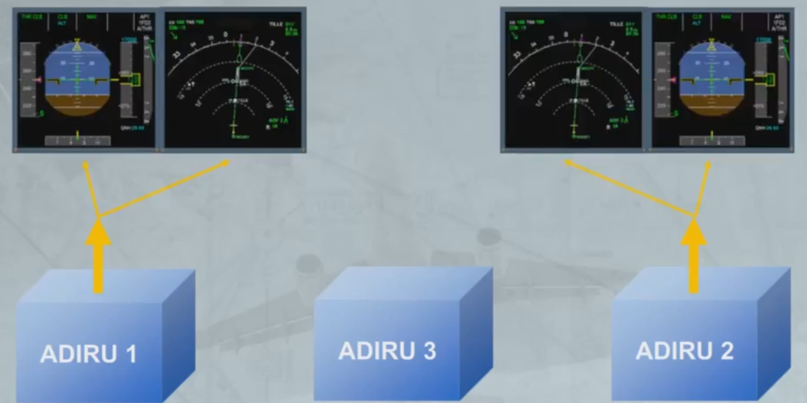

ADIRU 3 is available as a back-up to either EFIS system
via the switching panel.

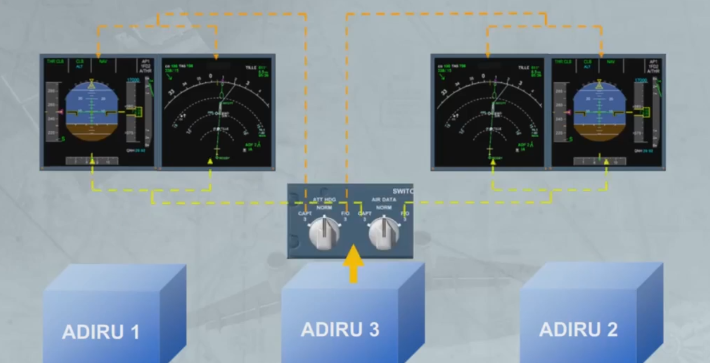