As part of the preliminary cockpit preparation, you have to check that:
- The full face oxygen masks are stowed in their respective boxes
- The portable oxygen equipment is in its place.

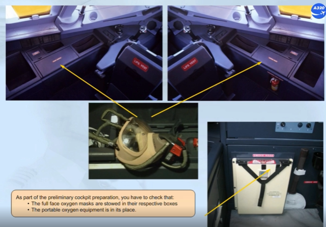

During the external inspection, only 2 items related to the oxygen system have to be checked:
- The oxygen bay should be closed
- The green "OXYGEN DISCHARGE" overpressure disk should be present.

A missing disk indicates an overpressure of the crew oxygen system.

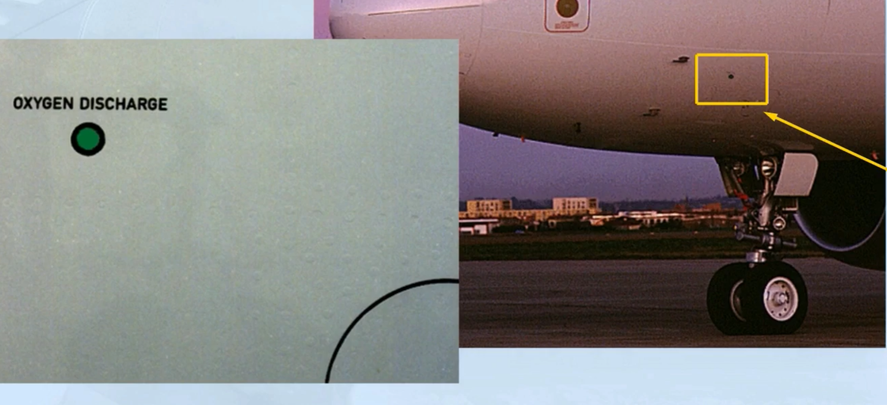

The aircraft has just been electrically powered.

The OXY indication is amber indicating that the CREW SUPPLY pb-sw on the OXYGEN panel is in the OFF position.

Note: After a long stop, the amber REGUL LO PR indication may be also displayed.

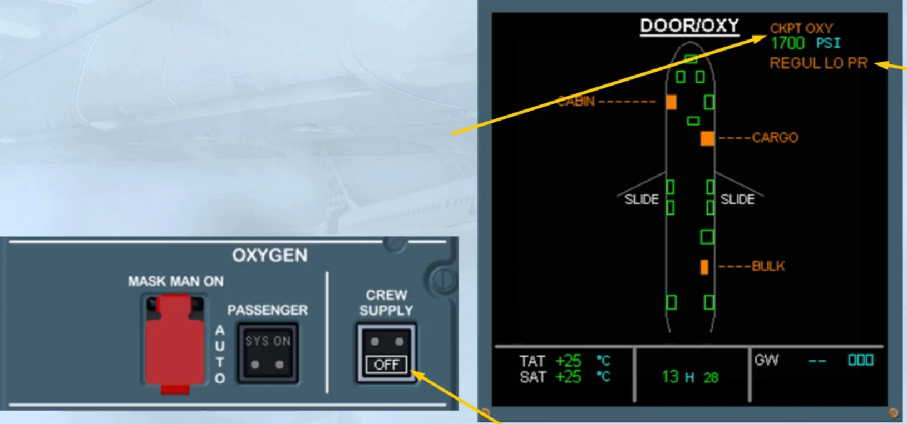

We have pressed the CREW SUPPLY pb-sw for you.

Make sure that the OXY indication has turned white indicating that the oxygen is available.

Also check that the high pressure indication (pressure in the bottle before it is regulated) is also displayed in green.

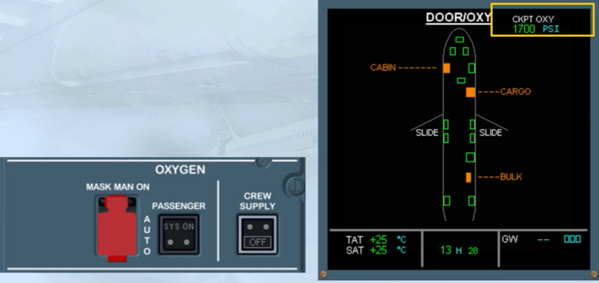

If the high pressure indication (below 1500 psi) is green and half boxed amber, you have to refer to the FCOM - LIM-35 section and look at the "MIN FLT CREW OXY CHART" to check if the remaining oxygen quantity is sufficient for the flight.

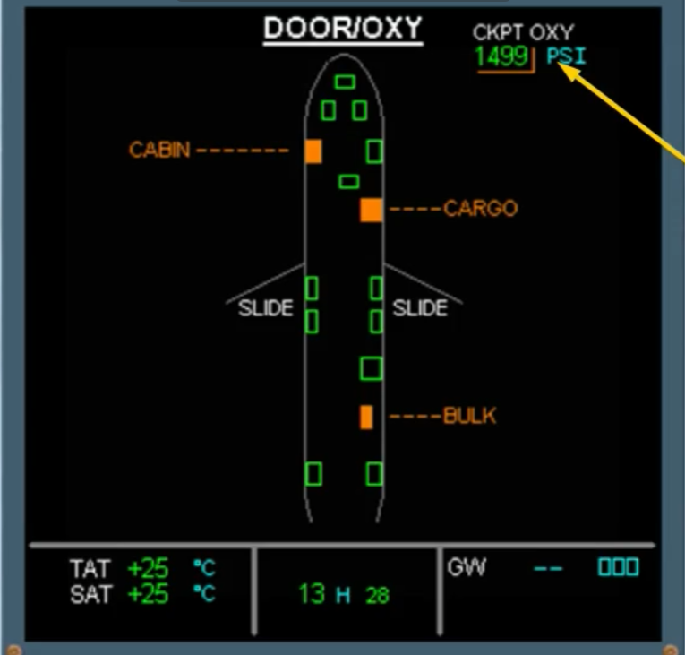

If the high pressure indication drops below a threshold which depends on the version, an ECAM ADVISORY will be triggered and you should refern to your QRH to find the recommended action to do.

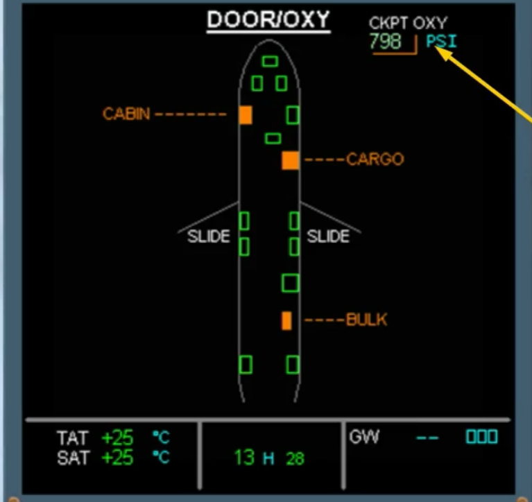

If the high pressure indication continues to drop, it will turn to amber when below a threshold which depends on the version.

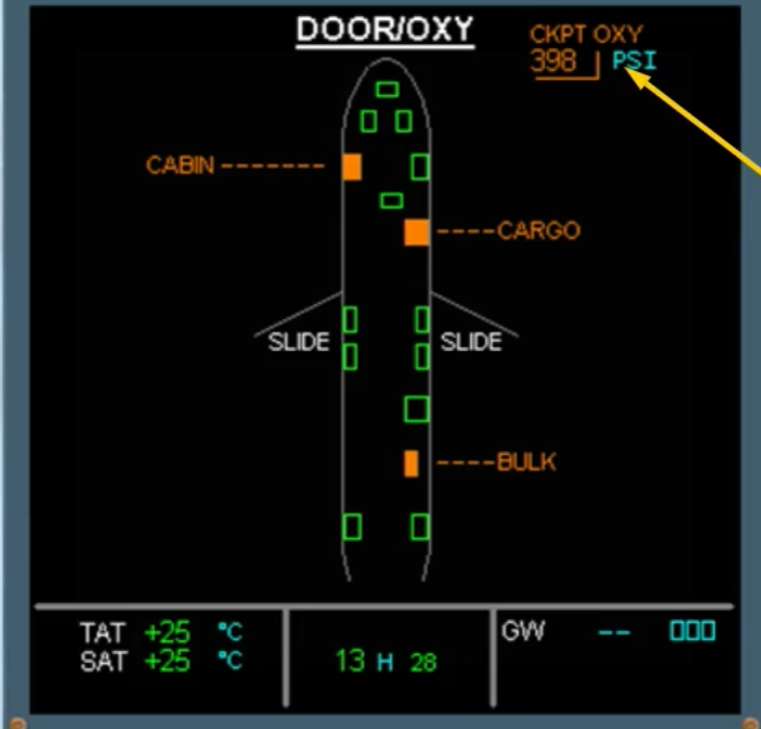

If, with the CREW SUPPLY pb-sw ON, the amber REGUL LO PR message is displayed, it indicates a low pressure in
the circuit supplying the crew oxygen mask storage boxes.

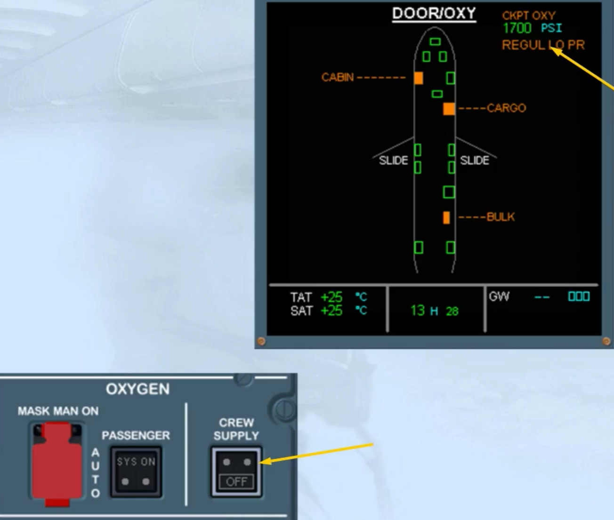

In order to test an oxygen mask, including its mike, check that:
- The loudspeaker controls located on the glareshield are set to an appropriate level
- The INT reception knob, on the Audio Control Panel, is selected and adjusted
- The INT/RAD switch is set to the INT position.

Note: As soon as the oxygen mask is unstowed, its hot mike has priority over the normal interphone.

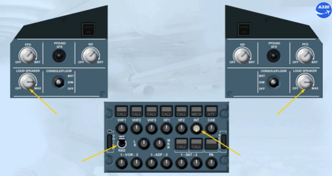

You can test a cockpit oxygen mask without removing it from its storage box.

Test the flow of oxygen by pressing the TEST AND RESET control.

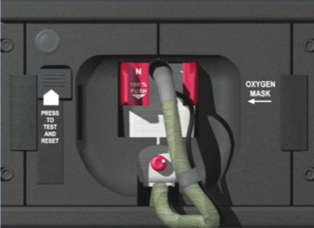

Notice that the blinker flowmeter turns yellow meaning that oxygen is flowing, and then, after a short time, goes black, due to the tightness of the storage box.

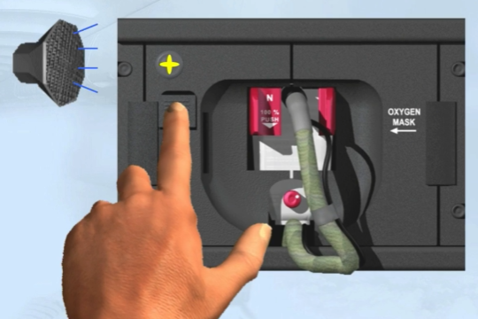

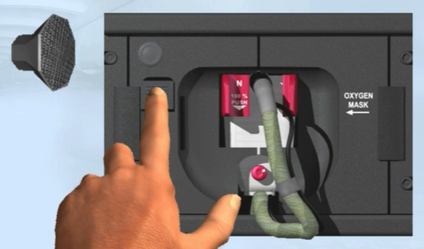

Next, in order to test the emergency oxygen pressure, you must press and hold the TEST AND RESET control and the emergency pressure selector simultaneously.

Press and hold the TEST AND RESET control in the down position.

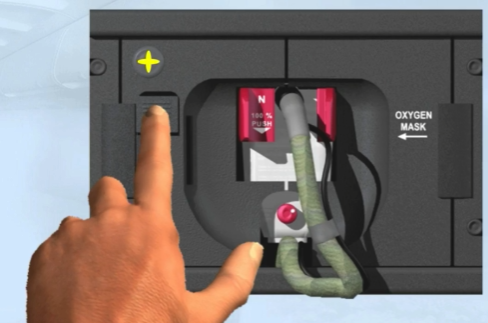

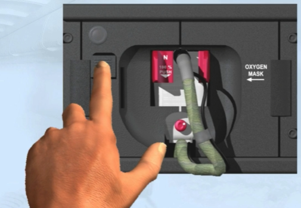

And press the emergency pressure Selector.

The yellow flow indicator shows us that oxygen is flowing continuously and remains on as long as the EMERGENCY pressure selector is pressed.

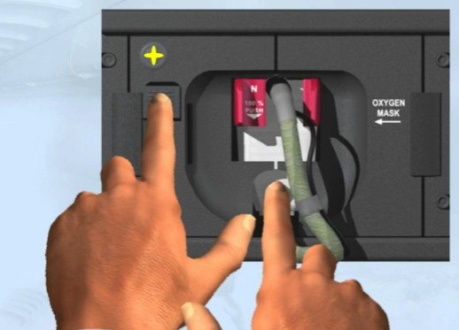

You can hear the oxygen flow through the loudspeakers.

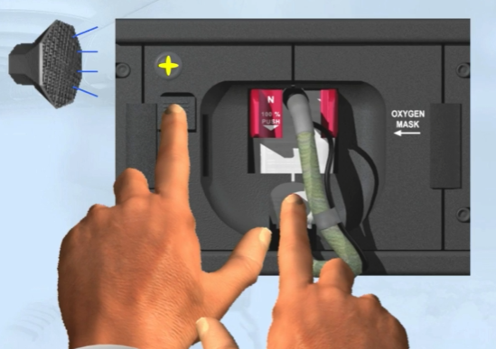

The final check of the mask is to verify that:
- When released, the TEST AND RESET button returns to the UP position
- The supply selector is on the 100% oxygen position
- Then, the blinker stays black, when the EMERGENCY pressure selector is pressed again.

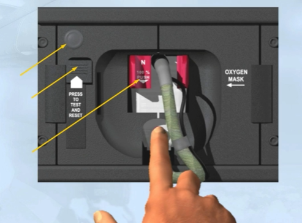

Suppose you are now in flight and a cabin depressurization occurs.

In order to retrieve your oxygen mask from its container, you must squeeze the red grips.

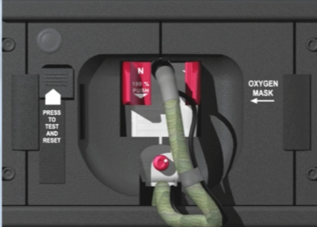

To put the mask on:
- Maintain the red grips squeezed
- Fit the mask over your face
- Release the red grips to secure the fit.

The harness deflates, fitting the mask tightly.

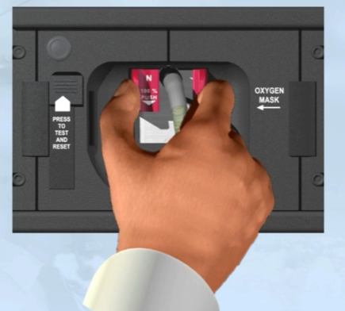

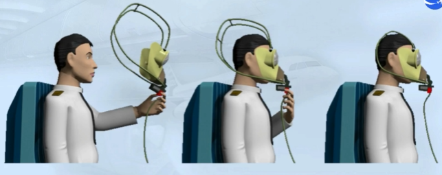

Let's assume you have used the mask and restored it. You observe a white OXY ON flag.

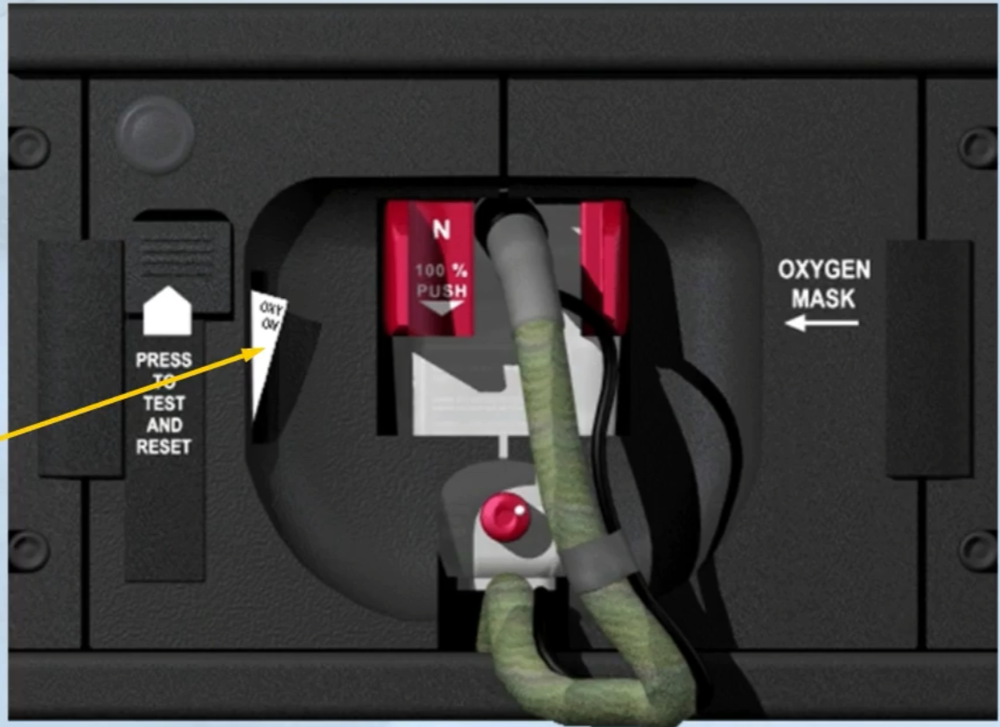

Press the TEST AND RESET control.

Notice that:
- The OXY ON flag has disappeared, meaning that the mask oxygen supply is stopped
- The oxygen microphone is de-energized
- The oxygen flow is stopped.

The mask is now reset.

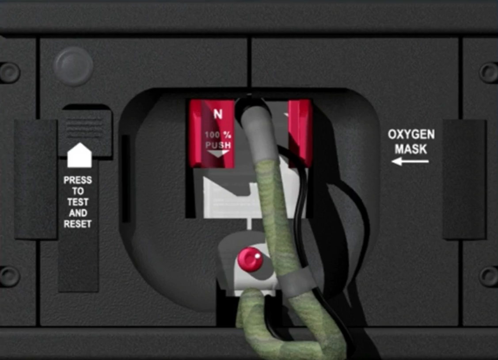

Let's now go to the cabin.

When the MASK MAN ON guarded pushbutton located on the OXYGEN panel is in the AUTO position, the passenger oxygen masks automatically deploy if the cabin altitude exceeds 14 000 feet.

Note: The MASK MAN ON pushbutton can also be used to deploy the passenger oxygen masks manually.

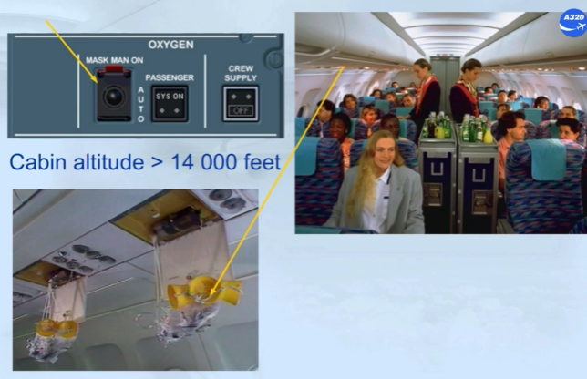

On the OXYGEN panel, the PASSENGER SYS ON white light comes on, indicating that the control of the oxygen mask doors is activated. So, the masks fall down by gravity.

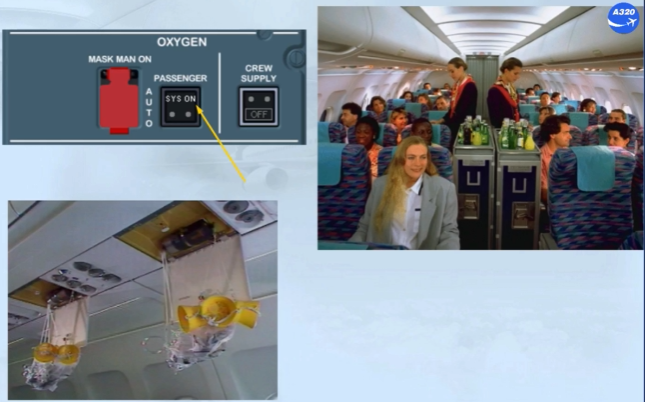

Oxygen generation starts when the mask is pulled down towards the passenger seat.

There are approximately 13, 15 or 22 minutes of oxygen available depending on the generator size.

Note: For a standard generator it will be approximately 15 minutes.

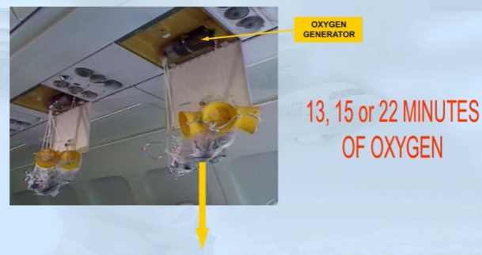

***Module completed***