This is a demonstration of an in-flight loss of EPR mode. It will be replaced by N1 MODE. This reversion is called rated N1 MODE.

If additional parameters to compute EPR are not available, the degraded mode is called unrated N1 MODE.

You are the PNF. You are in cruise, everything is normal ...

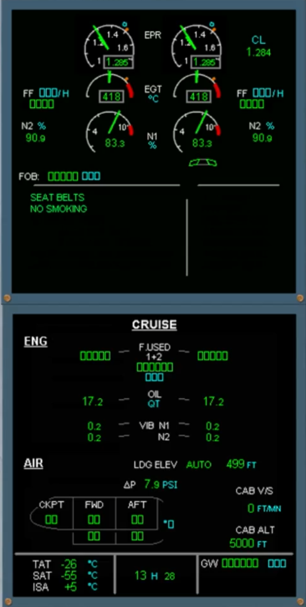

The amber caution and associated checklist are displayed on the EWD.

Read the title of the failure.

When EPR is lost the autothrust is disconnected.

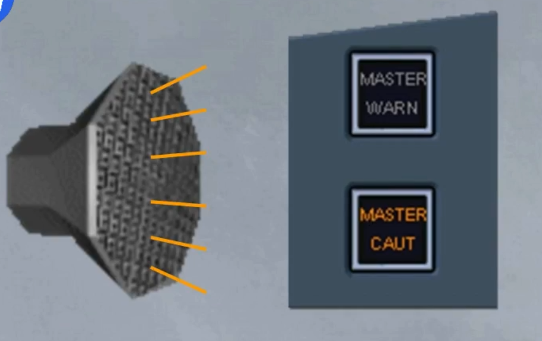

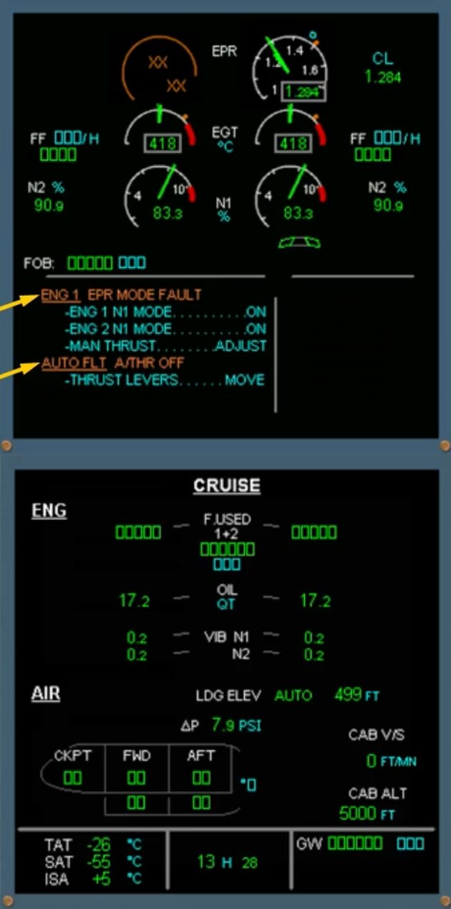

The EPR indicator is amber and the value is crossed amber showing that EPR 1 MODE is lost.

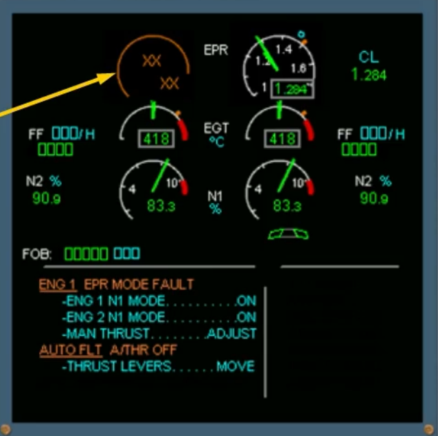

The PF will ask you to perform the ECAM actions.

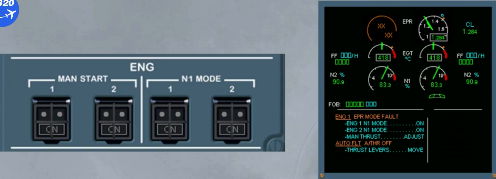

On the ENG panel, the ON label on the engine 1 N1 MODE pb-sw illuminates blue.

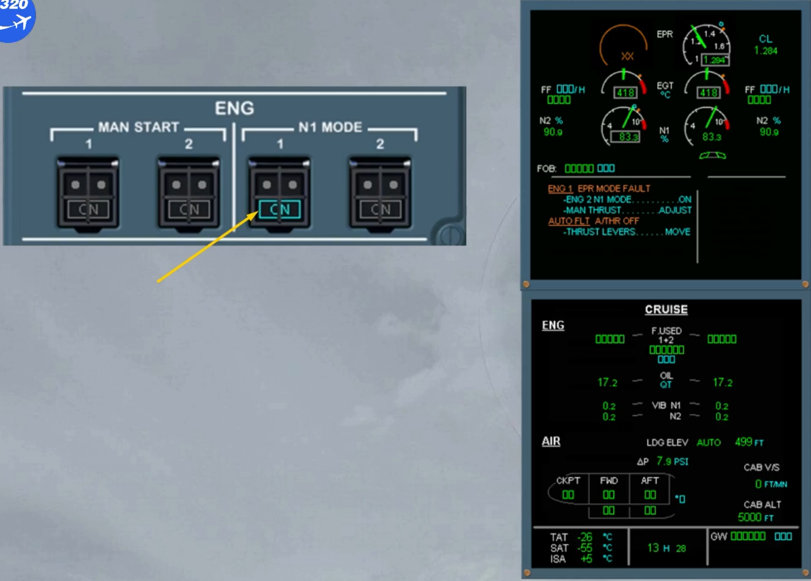

On the EWD, let's look at the N1 indicator.

The actual N1 is shown both numerically and by the needle in green.

They pulse red when N1 is greater than 100 %.

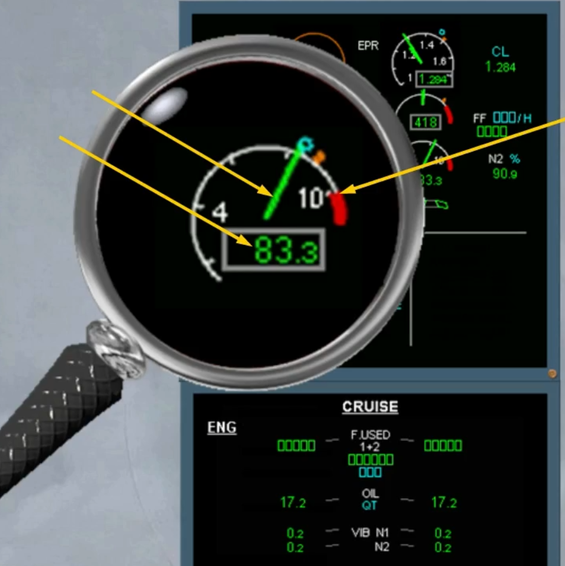

The blue circle, indicates the thrust lever position. It is not displayed, in unrated mode.

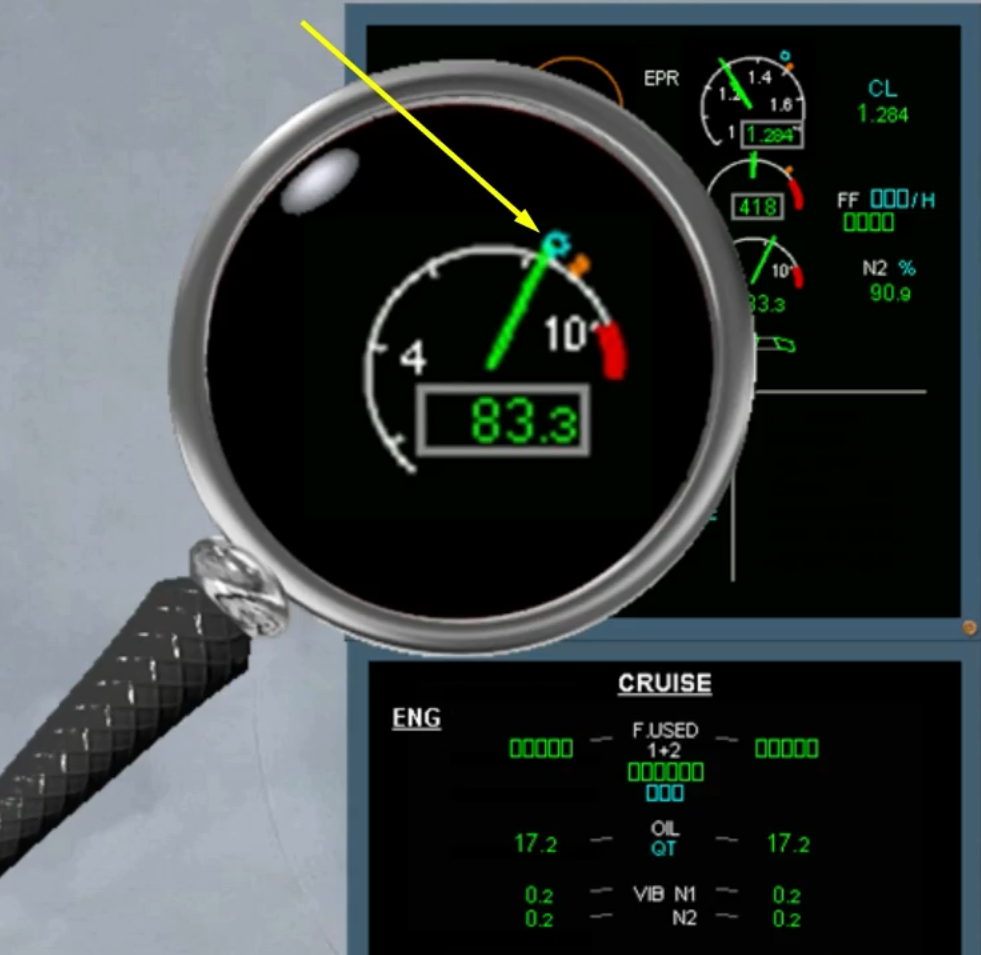

The amber index indicates the full forward position of the thrust lever (MAX N1).

MAX N1 is not displayed in unrated mode.

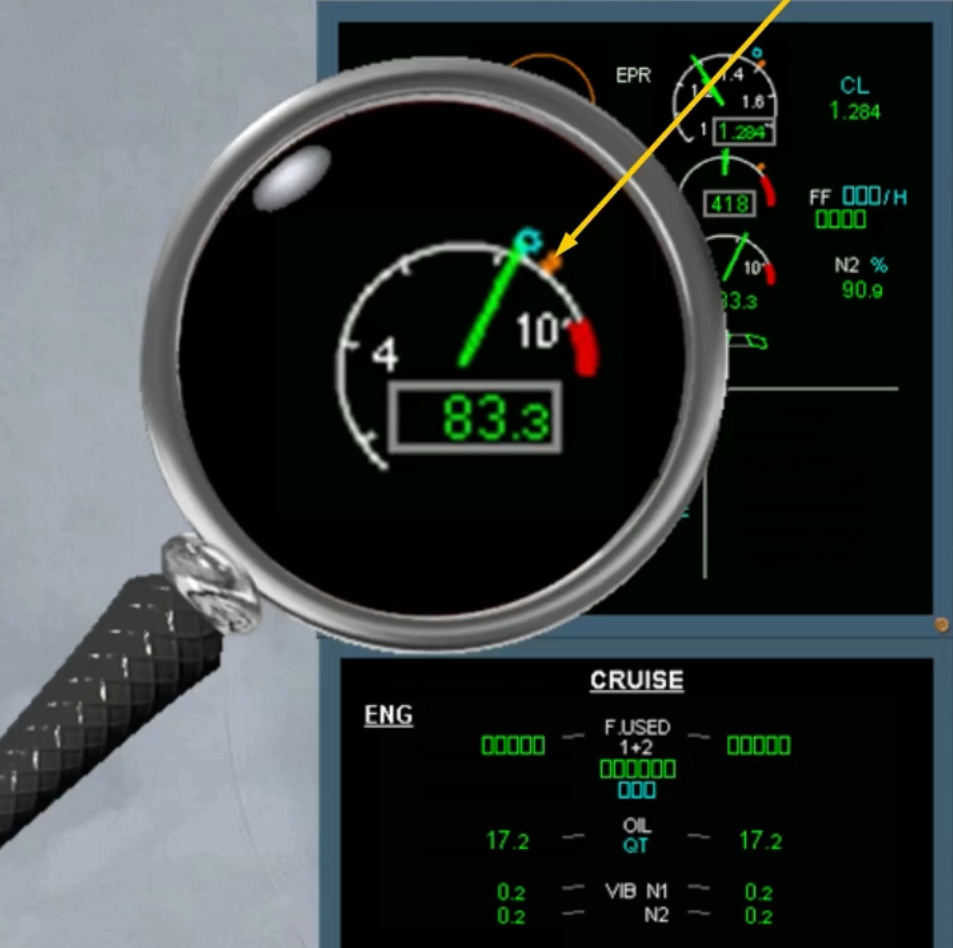

Continue ECAM action.

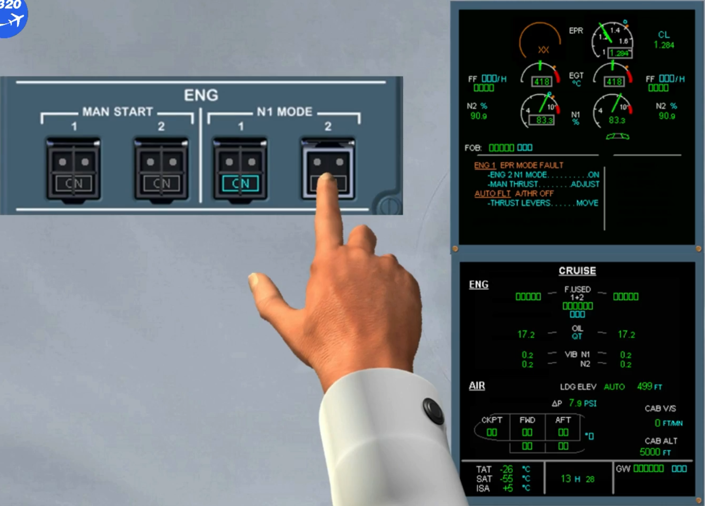

The engine 2 EPR indication turns amber indicating that the EPR MODE is lost.

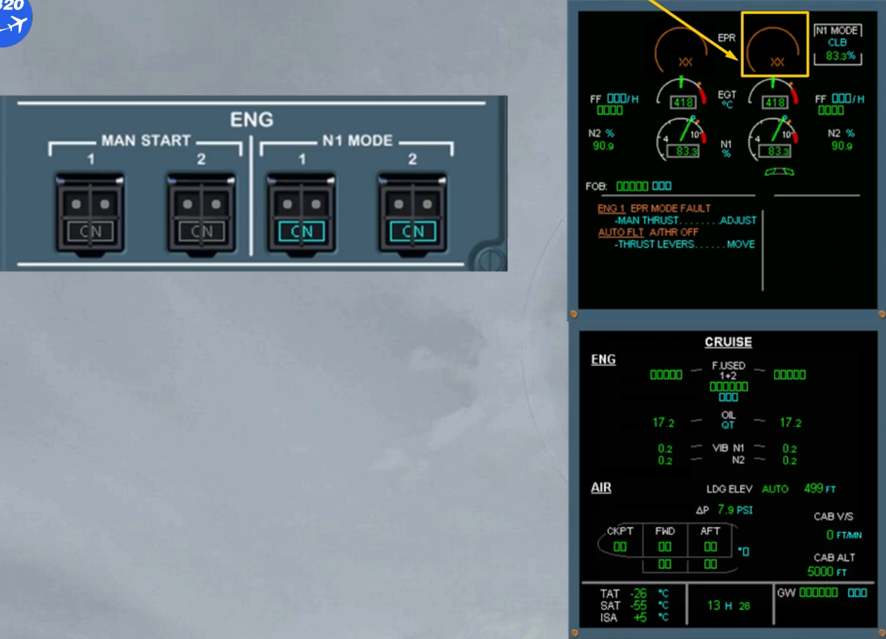

The N1 indications are now the same for both engines.

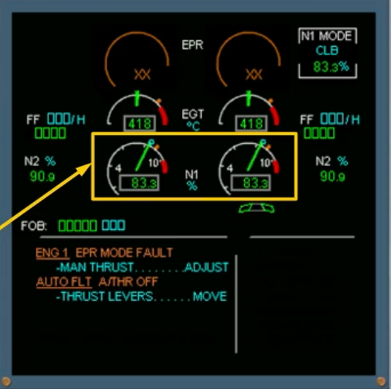

The EPR LIMIT mode is replaced by a specific N1 LIMIT mode box showing clearly that the engines are controlled in the N1 MODE.

In unrated mode, the N1 MODE and N1 limit mode are crossed amber.

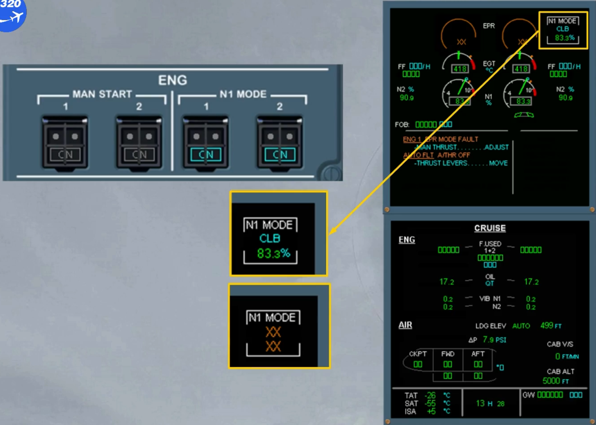

The next action is to adjust the thrust manually depending on the request.

We will assume that this has been done. ECAM actions complete.

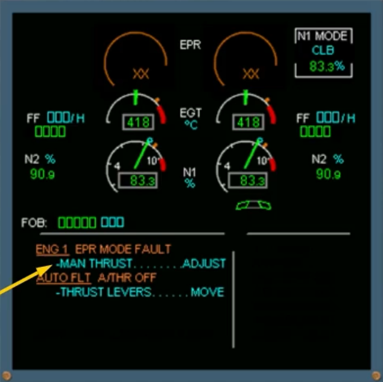

Let's look briefly at some other engine abnormal indications.

The amber caution is displayed on the EWD. Read the title of the failure.

On the system display, the ECAM ENGINE page is automatically displayed.

The oil filter indication appears and the CLOG in amber indicates the corresponding oil filter.

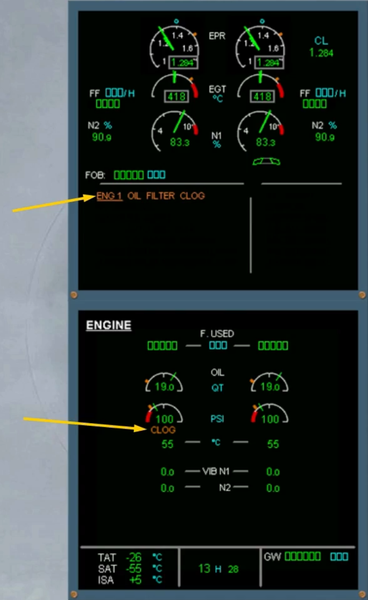

The same kind of message can occur with the fuel system.

The amber caution is displayed on the EWD.

On the system display, the ECAM ENGINE page is automatically displayed.

The fuel filter indication appears and the CLOG in amber indicates the corresponding fuel filter.

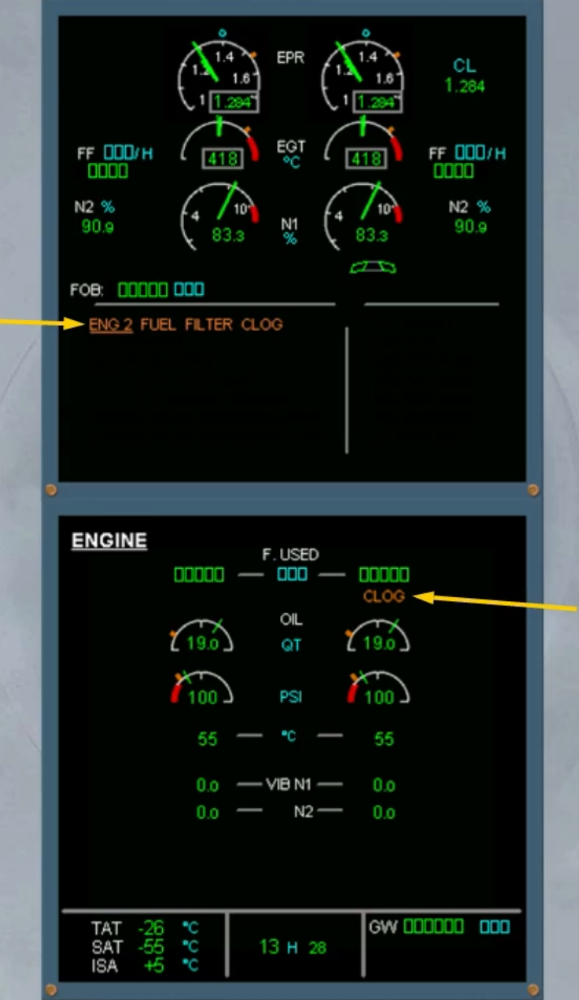

***Module completed***