This is a demonstration of an abnormal engine start.

Start engine 2.

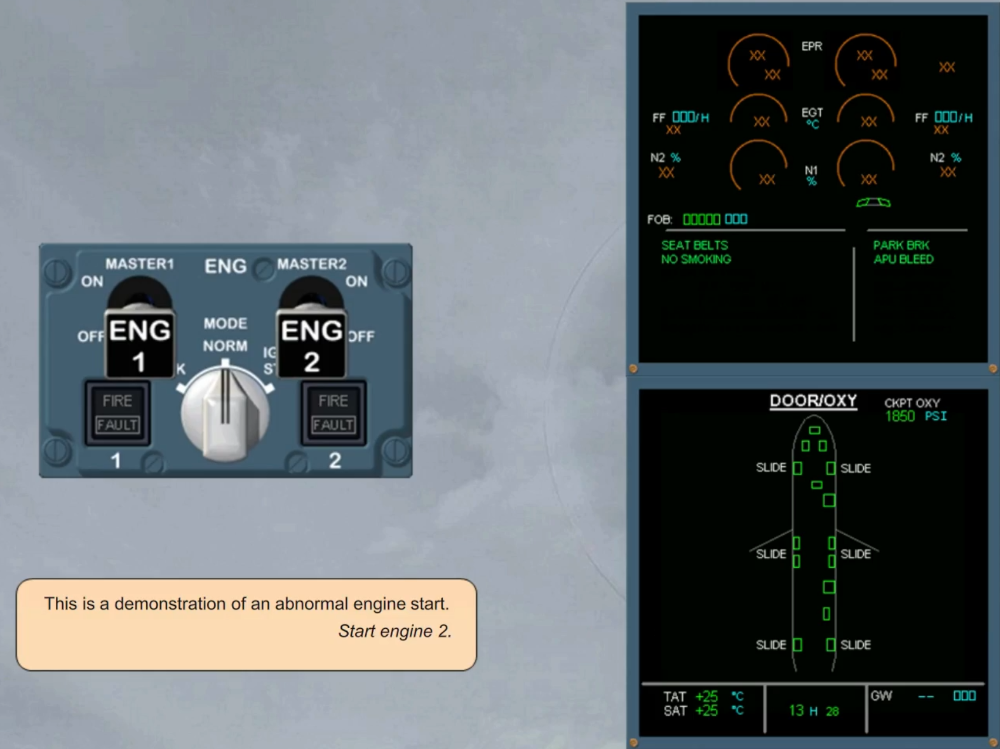

As there is no ignition, the caution is activated. The amber caution and associated checklist are displayed on the EWD.

Read the title of the failure.

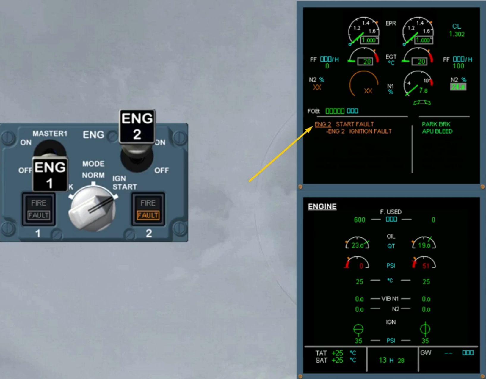

On the ENG panel, the amber FAULT light comes on, indicating that the automatic start is aborted

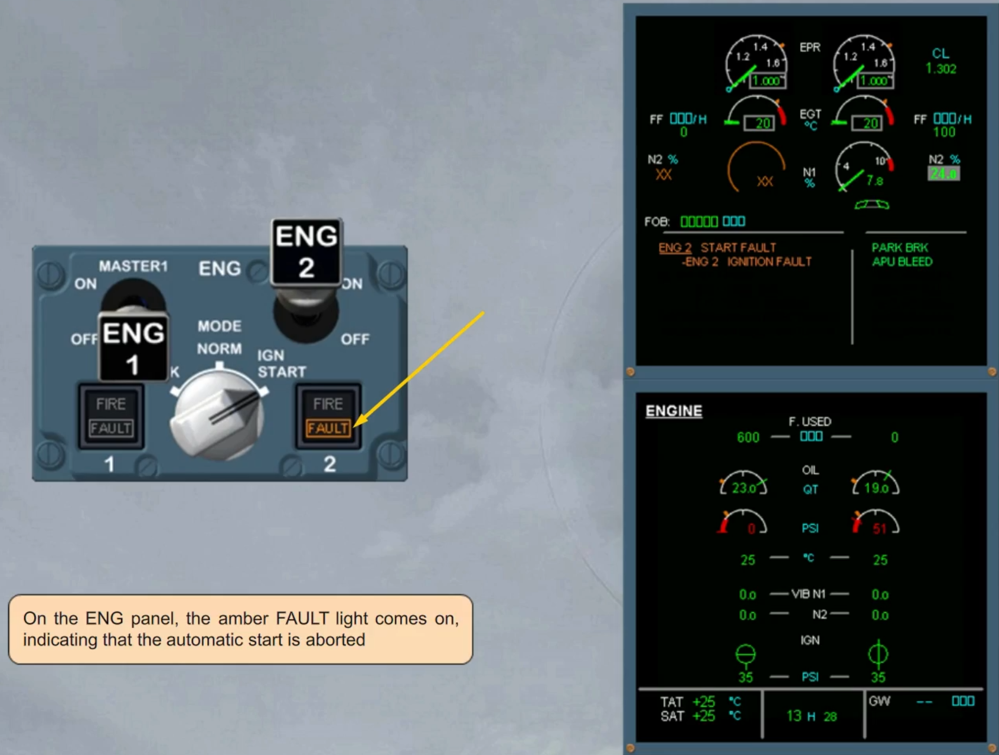

Automatically the FADEC shuts off the fuel and turns off the ignition.

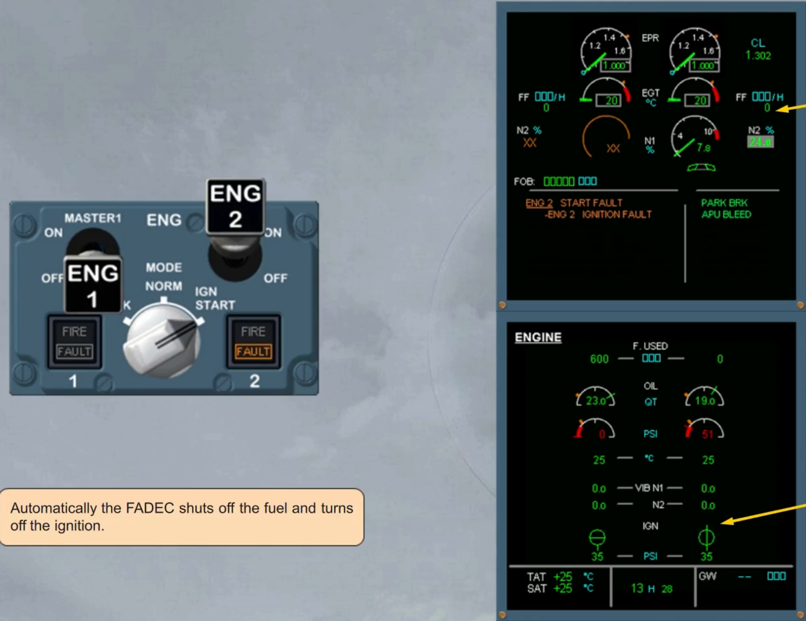

The message AUTO CRANK IN PROGRESS is displayed on the EWD indicating that the FADEC automatically performs a dry crank.

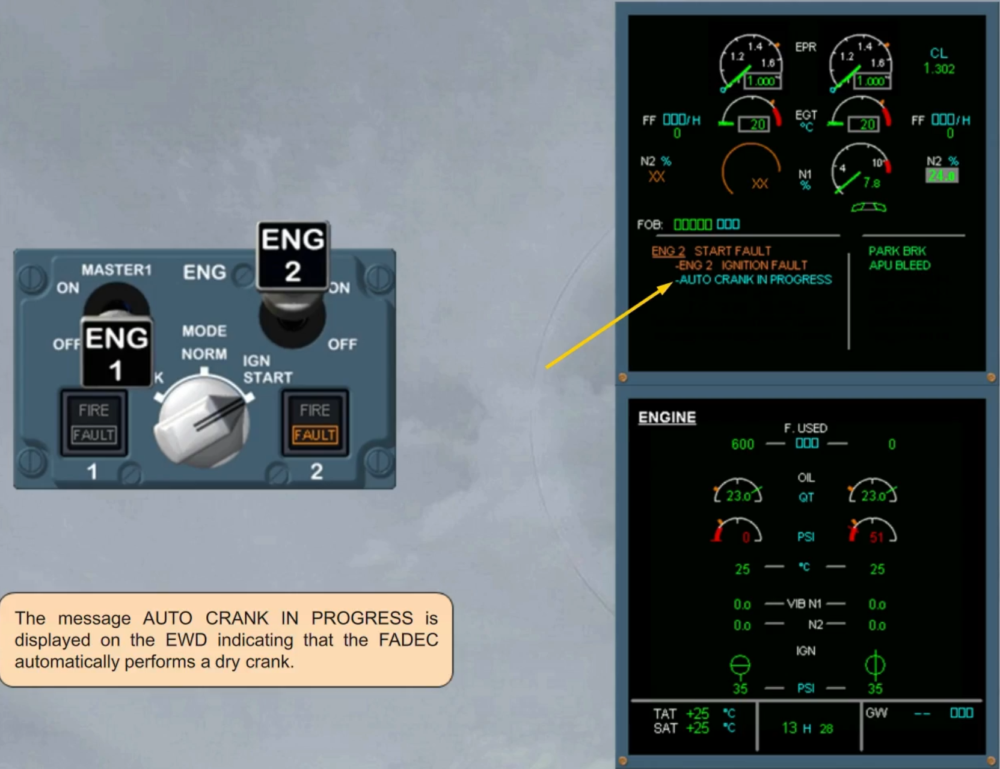

At the end of the dry crank sequence , the start valve is closed.

The message on the EWD asks you to confirm the automatic start abort.

The PF will ask you to perform the ECAM actions.

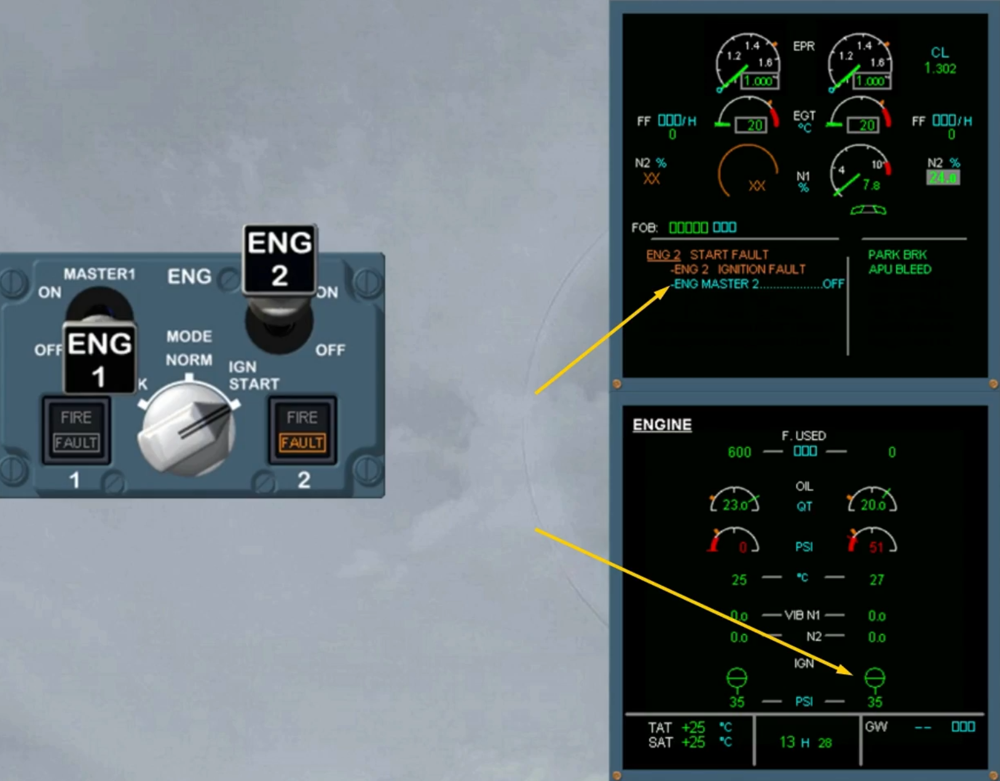

When the ENG 2 MASTER switch is off, the message disappears on the EWD and the fault light is switched off.

We will assume that the procedure is complete. Let's now study some other failure cases.

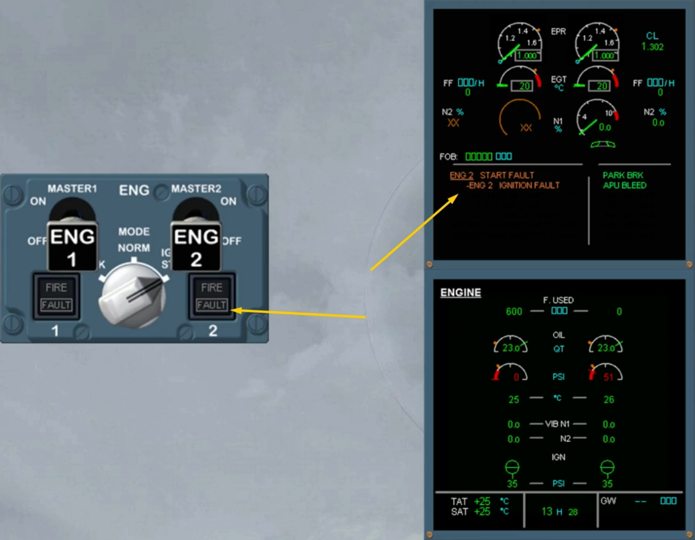

---

If the EGT exceeds a certain value, a red mark is displayed at the max achieved value and stays displayed after setting the related thrust lever below limit.

The over limit mark will disappear after a new take off or following a maintenance action.

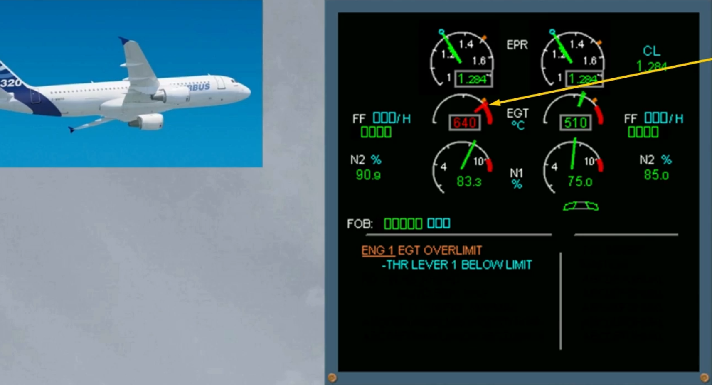

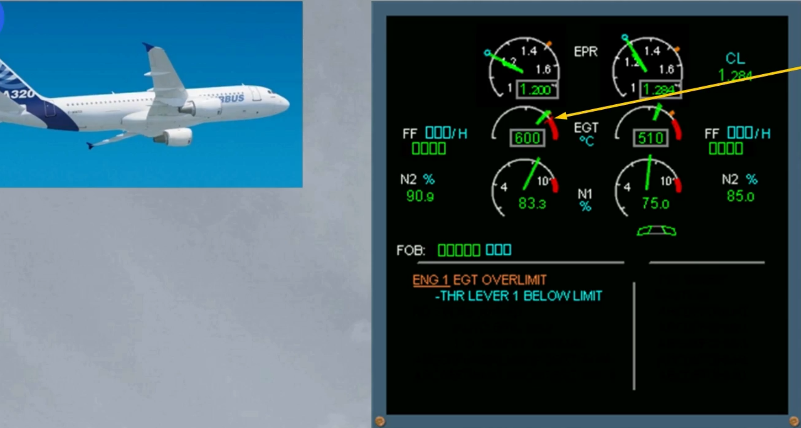

A similar indication will be displayed in case of N1 over limit.

Above the N1 MAX, the needle and the digital value pulse in amber.

The ECAM caution is triggered when the N1 enters the red arc area, the needle and the digital value pulse in red. A red mark is displayed at the max achieved value and stays displayed after setting the related thrust lever below limit. The over limit mark will disappear after a new take-off or following a maintenance action.

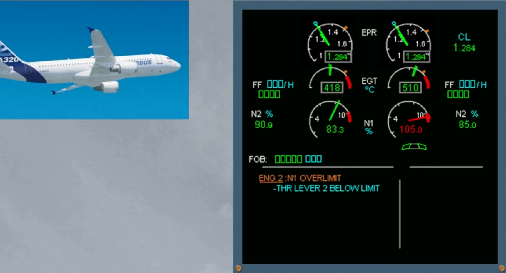

If the N1 has exceeded a value greater than previously, the message will ask you to shutdown the engine.

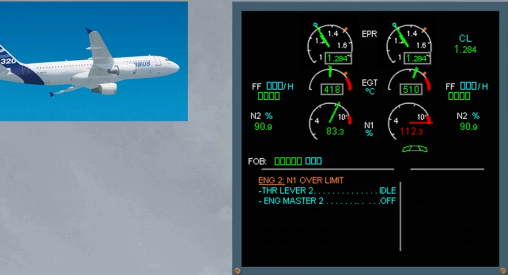

When N2 exceeds a certain value, the digital value turns steady red and a red cross appears next to it and will stay displayed when the thrust lever is set below limit.

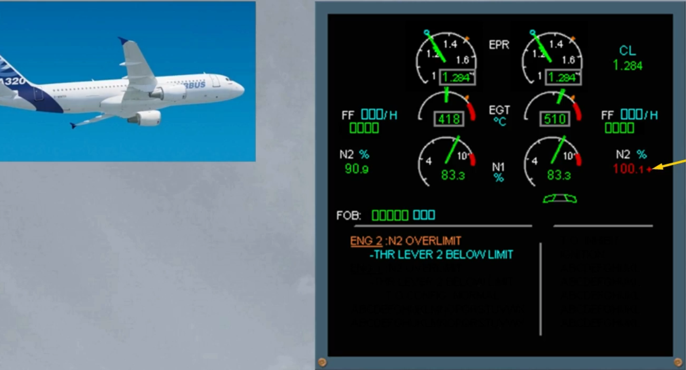

If the N2 has exceeded a value greater than previously, the message will ask you to shutdown the engine.

The over limit red cross will stay displayed even if the N2 is back to the normal range.

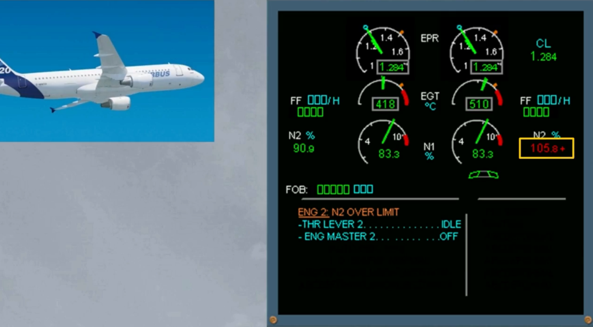

***Module completed***