Let's look at the things that you need to know about the engines during normal operation.

As soon as the aircraft is powered, the FADECs are automatically on for 5 min. They provide some engine indications on the EWD.

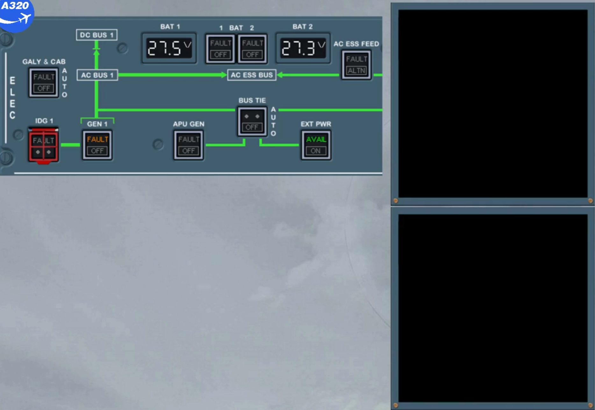

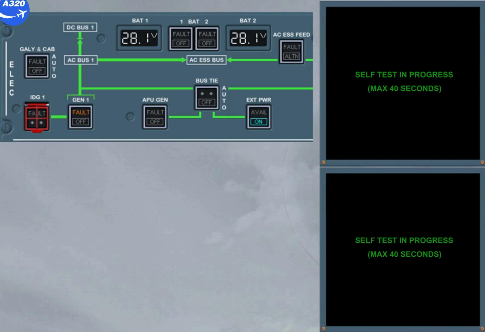

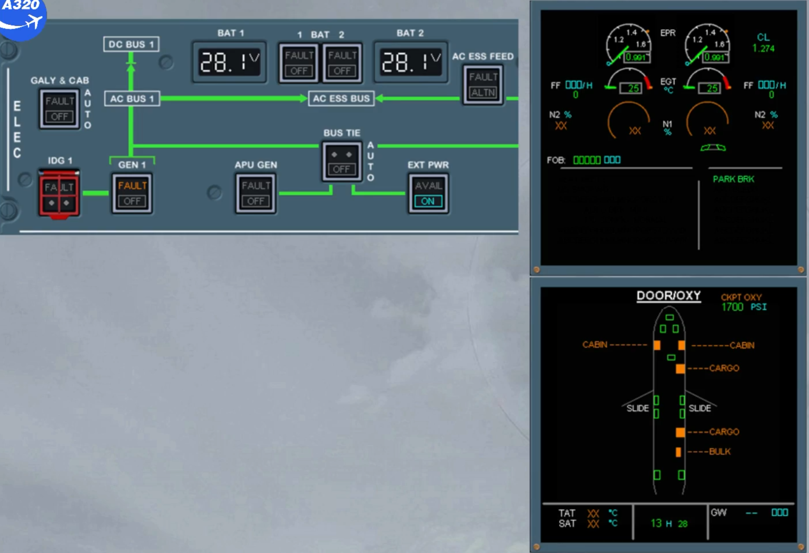

After 5 min the FADECs shut down automatically and all the engine indications change from normal to amber.

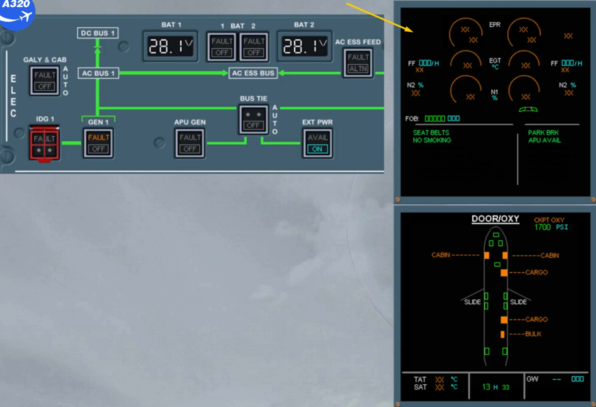

Let's first talk about manual engine start.

There are several reasons why a manual start may be required including low pneumatic pressure.

The main difference between a manual and an automatic start is that the pilot controls the time at which fuel and ignition are supplied to the engine.

The FADEC only provides passive monitoring of the engine during the start sequence. This means that the pilots take on the responsibility to prevent an abnormal start.

The FADEC only controls:
- The position of the HP fuel valve and ignition operation when the associated ENG MASTER SW is on
- The closure of the start valve at 43% N2
- Ignition cut off, on the ground.

Note: Manual starts are completed by using the procedure detailed in the FCOM - PRO-SUP 70 section.

---

Let's start the engines using the automatic engine start procedure.

During the cockpit preparation, you checked that the thrust levers are in the idle position. This is to prevent excessive thrust at engine start.

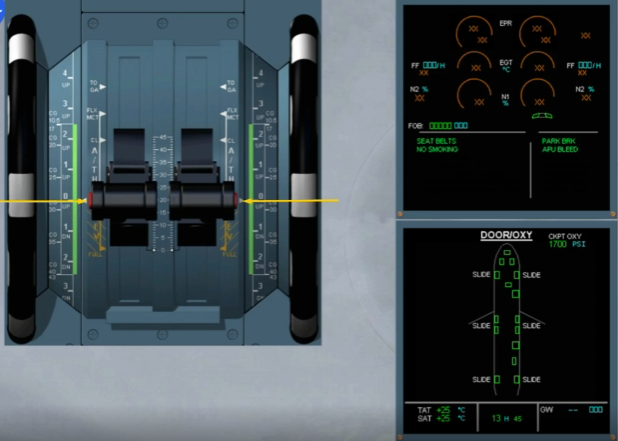

During the start sequence, all the engine parameters are monitored, controlled and protected by the FADECs.

APU is running.

In order to start the engines, the ENG MODE sel must first be switched to IGN/START.

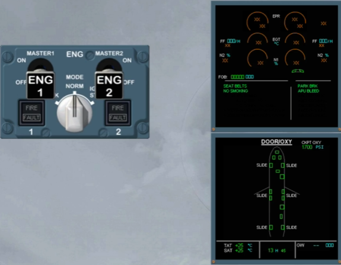

When ignition start is selected, the FADECs are powered again.

This is indicated on the EWD by the indications which change from amber to normal.

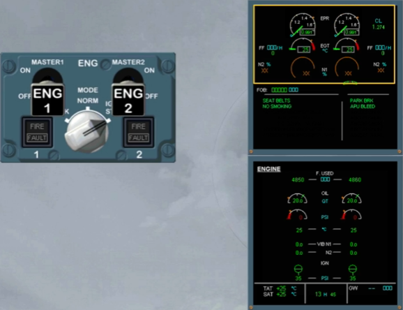

On the system display, the ECAM ENGINE page is automatically presented for more engine indications, also called secondary parameters.

Let's now look at the engine indications specifically.

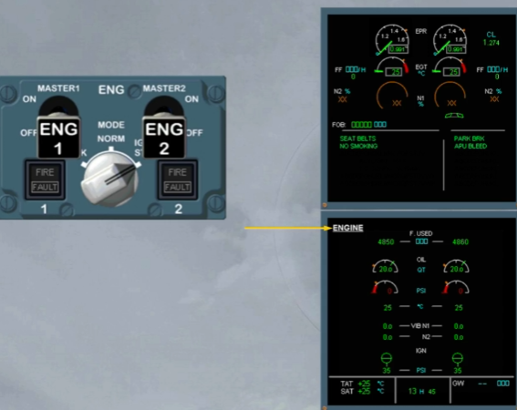

The first indications on the EWD are the Engine Pressure Ratio (EPR) for each engine. Both indicators are identical.

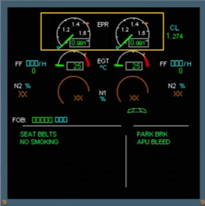

The green needle indicates the actual EPR. This value is also displayed digitally.

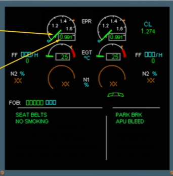

The blue circle represents the EPR related to the thrust lever position.

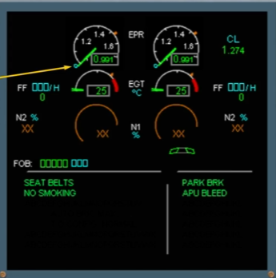

The amber mark represents the maximum EPR.

This is the EPR that would be produced with the thrust levers fully forward.

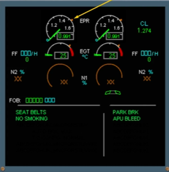

On the right side of the EWD, the thrust limit mode and EPR rating limit are displayed.

This will be explained and demonstrated as the mode changes later in the module.

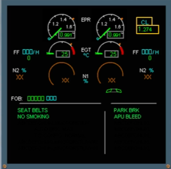

The next set of indicators display the Exhaust Gas Temperature (EGT) of each engine.

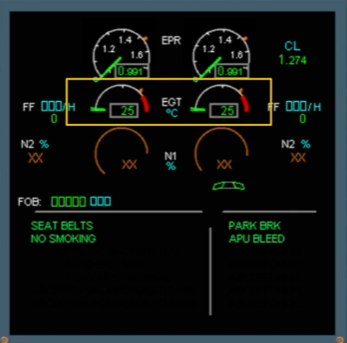

The green needle indicates the actual EGT. This value is also displayed digitally.

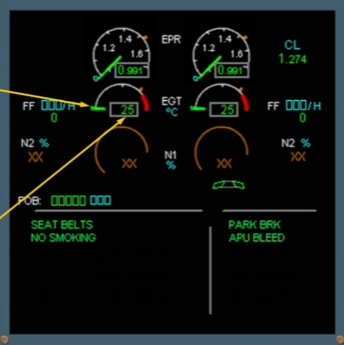

The amber tick indicates the maximum EGT (MAX EGT).

Note: Depending on the engine version, the amber tick will disappear during engine start or during takeoff.

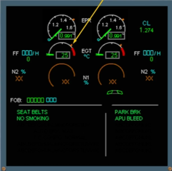

The fuel flow is displayed digitally for each engine.

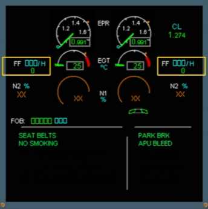

Let's look now at the indications on the ECAM ENGINE page.

The first indication displayed is the fuel used by each engine. Notice that there is a fuel used indication and the engines have not been started. This is because this value is frozen at engine shut down and reset on the ground, at engine start.

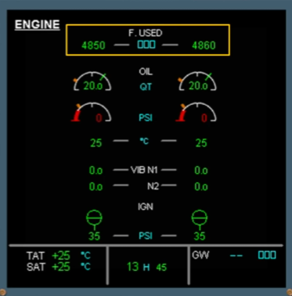

The next indications are:
- The engine oil quantity
- The oil pressure
- The oil temperature.

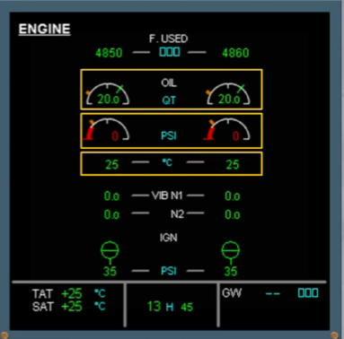

Vibration indications are displayed below the oil temperature.

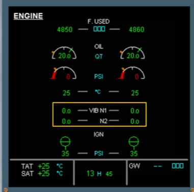

There are additional indications displayed during engine start on the ground. They are only displayed when the ENG MODE sel is in the IGN/START or CRANK position.

They are:
- The start valve position indication
- The air pressure available for start.

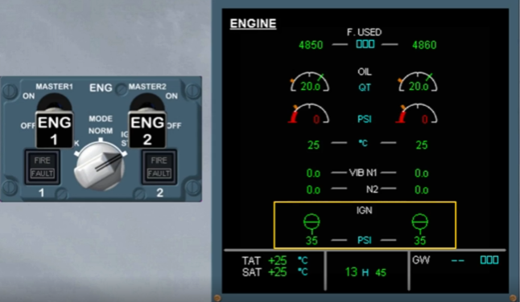

When the engines are started, the valve indications are removed, as shown.

Note: This blanked area will be also used to display the nacelle temperature when at least one is above the advisory threshold.

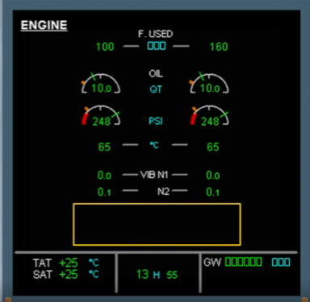

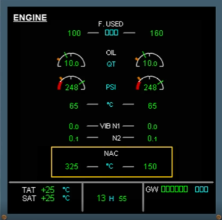

We will start the engines using the available APU BLEED as indicated on the MEMO and the pressure indication at the bottom of the SD.

We start engine 2 first because the yellow hydraulic system engine driven pump is on engine 2 and the yellow system supplies park brake pressure.

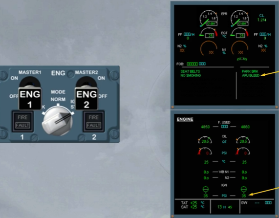

The corresponding start valve opens.

This is indicated by the start valve indication changing from green cross-line to green in-line.

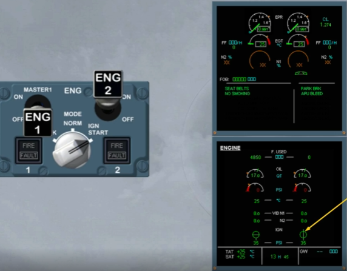

The fuel used is reset to zero.

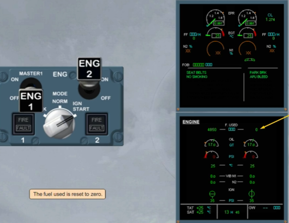

On the EWD, N2 increases. It is displayed on a grey background.

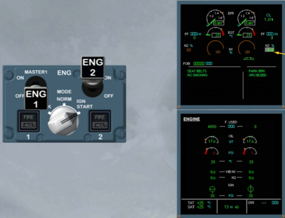

On the ECAM ENGINE page the oil pressure increases.

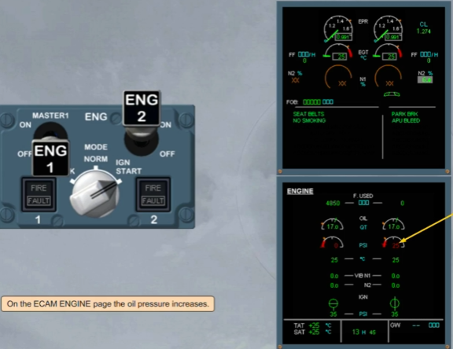

As N2 increases, N1 will be displayed. Approximately 30 s after selecting ENG 2 MASTER sw ON, an igniter is powered.

The active igniter is indicated by a letter (A or B) on the ECAM ENGINE page.

Note: The igniters alternate on successive starts.

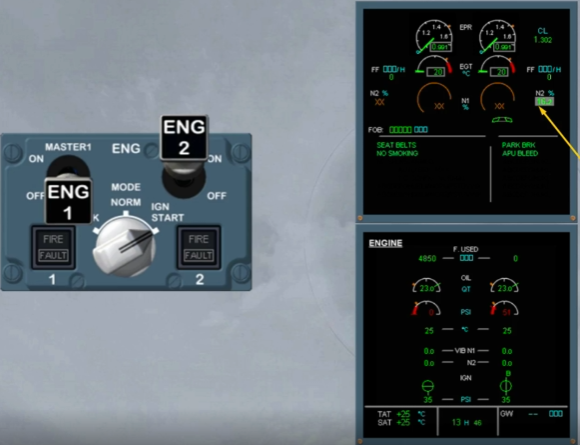

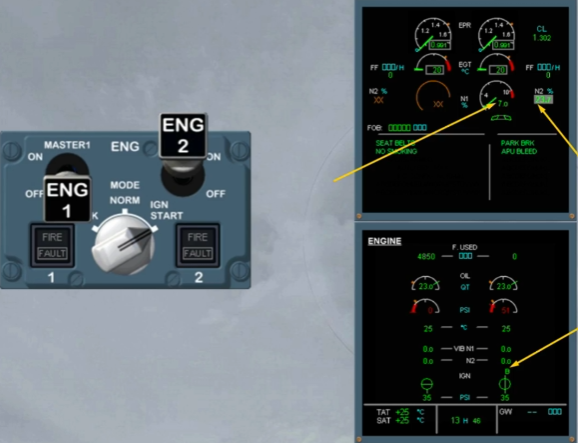

On the EWD we see that the fuel begins to flow.

When the fuel is ignited, the EGT increases.

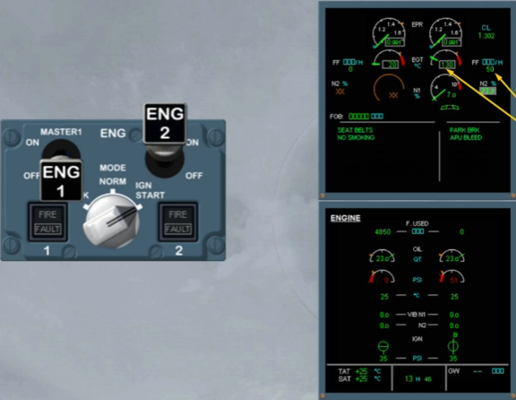

When N2 reaches 43%, the start valve closes and the ignition is switched off.

Notice on the ECAM ENGINE page the start valve is closed and the igniter indication disappears.

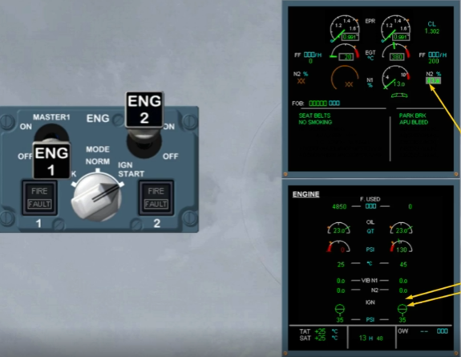

N2 continues to increase.

At approximately 58% it stabilizes and the grey background disappears indicating that the start sequence is finished.

ENG 2 is now running and all its parameters have stabilized.

As soon as one engine is started, the limit mode changes to TOGA (orFLEX if temperature has been entered on the MCDU PERF T.O page), also GW is displayed.

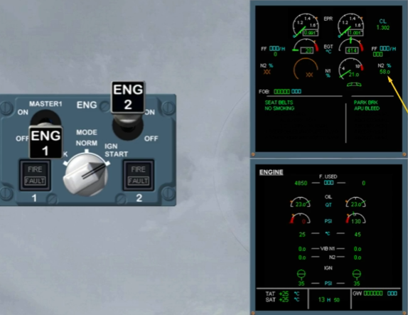

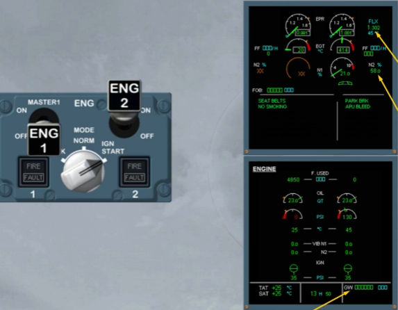

On the N1 gauge the green needle indicates the actual N1. This value is also displayed digitally.

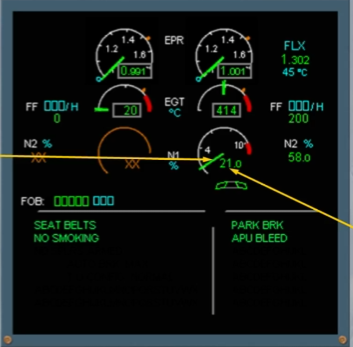

Let's start engine 1 now. We will show you the full sequence without stopping.

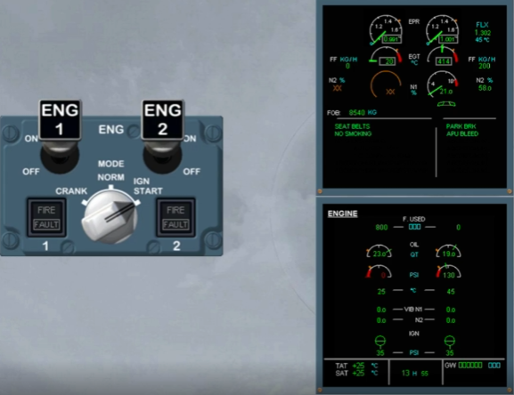

- Start valve opens

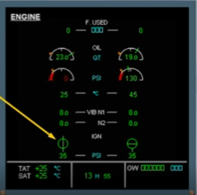

- Fuel used is reset

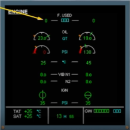

- N2 increases

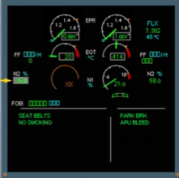

- 30 seconds after the start MASTER sw was put on, an igniter is powered

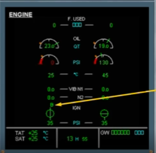

- Fuel flow begins

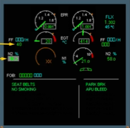

- EGT increases

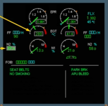

- When N2 is approximately 43%, the start valve closes and the ignition is switched off.

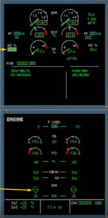

At about 58% N2 stabilizes and the grey background disappears indicating that the engine 1 start sequence is finished.

For both engines all parameters have stabilized.

At ISA sea level, idle parameters should be:
- N1 about 21.4 %
- EGT about 414℃
- N2 about 57.8 %
- FF about 350 kg/h or 775 lb/h
- EPR about 1.01.

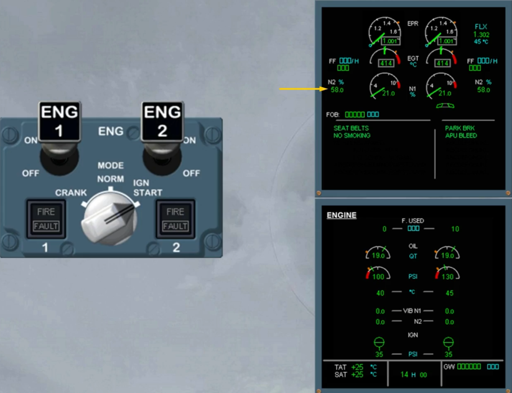

The last action is to switch the ENG MODE sel to normal.

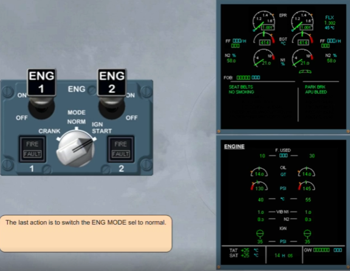

On the system display, the ECAM ENGINE page is replaced by the ECAM WHEEL page.

Note: After start, to avoid thermal shock, it is recommended that the engines are operated at or near idle for at least 2 min.

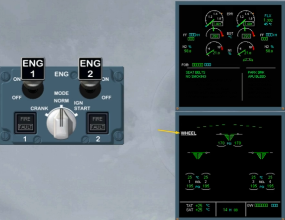

This ends the engine automatic start sequence.

***Module completed***