The A320 family is equipped with International Aero Engines (IAE) V2500 series engines.

Like most engines today, this engine comprises:
- A Low Pressure (LP) compressor stage
- A High Pressure (HP) compressor stage
- A combustion chamber
- A turbine stage.

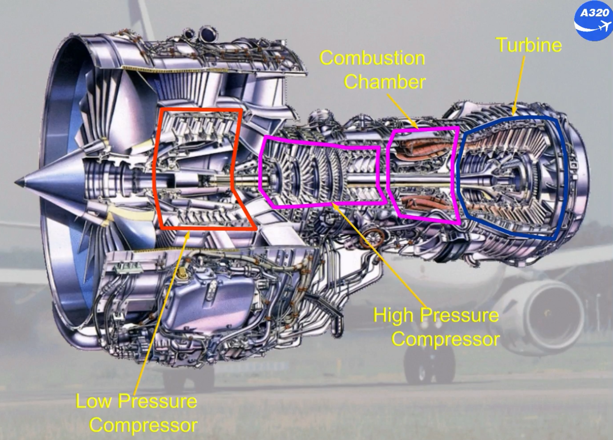

The front fan, the Low Pressure compressor and the Low Pressure turbine are connected to form the low speed rotor (N1).

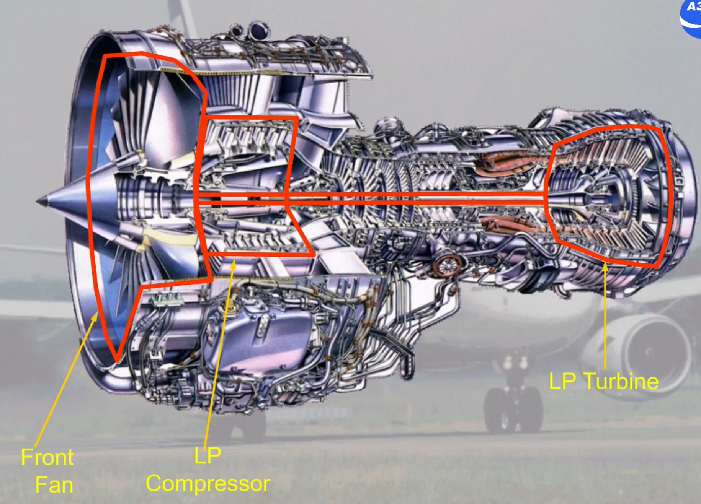

The High Pressure compressor and the High Pressure turbine are connected to form the high speed rotor (N2).

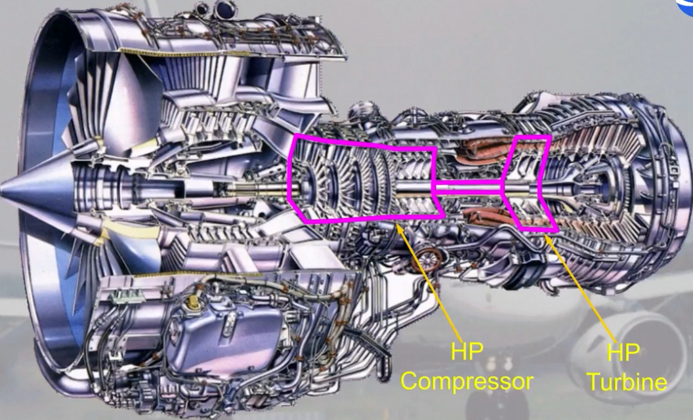

The accessory gear box is located at the bottom of the fan case and is driven by the high pressure rotor.

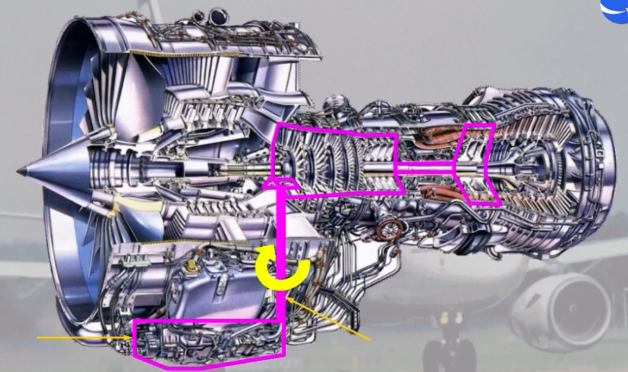

The combustion chamber is equipped with two igniters, called A and B.

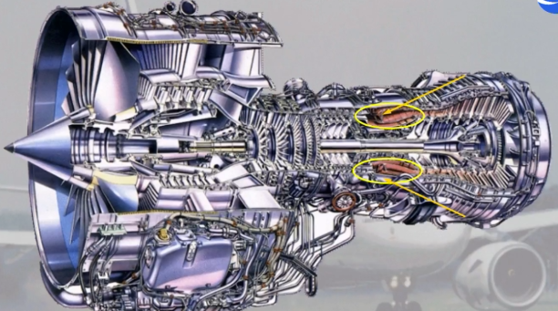

Each engine is equipped with a Full Authority Digital Engine Control system (FADEC) which provides complete engine management.

For redundancy, each FADEC has two channels A and B, one active and one in standby.

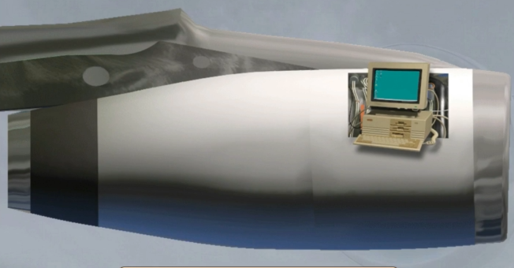

Each engine has reversers which are hydraulically actuated.

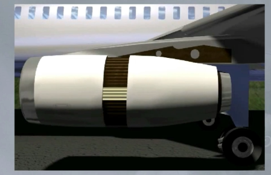

The engines are controlled by thrust levers which are located on the center pedestal.

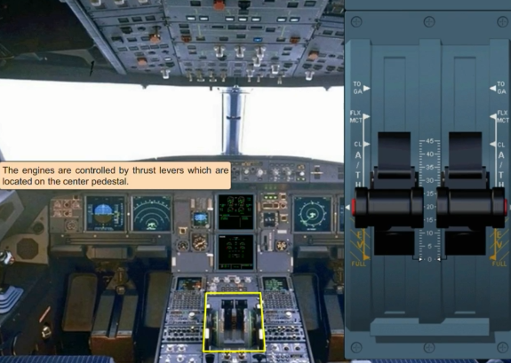

These two levers control the reversers.

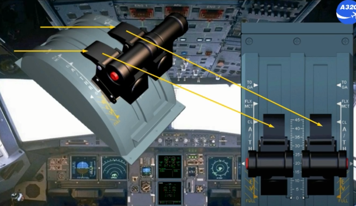

The autothrust can be disconnected with either of these red pushbuttons which are called instinctive disconnect pushbuttons.

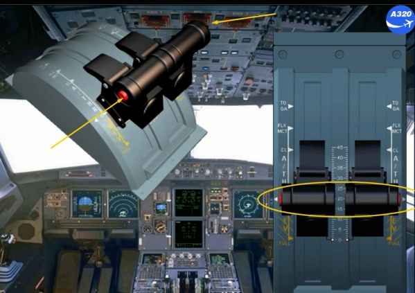

The controls for engine starting and shut down are located on the center pedestal just behind the thrust levers.

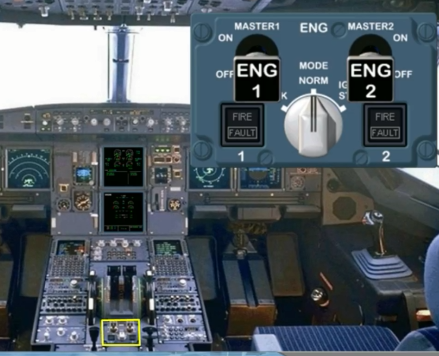

The ENG MASTER switches and the ENG MODE selector enable the pilots for:
- Engine automatic and manual starting

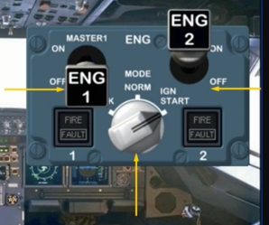

- Engine ventilation (dry cranking)

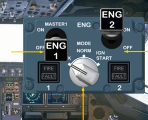

- Engine shut down.

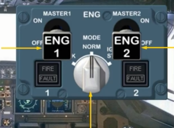

Once the engines are running, the mode selector can also provide continuous ignition. The panel has also a FIRE and FAULT light for each engine.

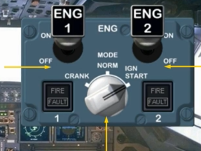

On the overhead panel there is an additional panel which is used for manual start and in abnormal operation.

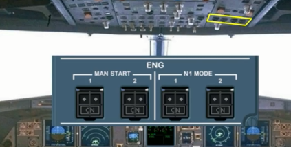

For all these controls, indications are displayed on the E/WD and ENGINE ECAM page.

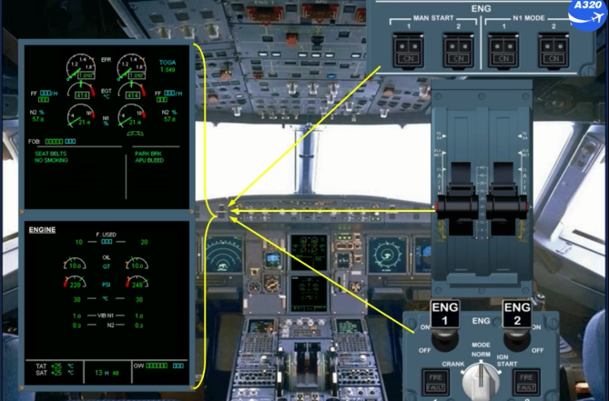

The engines also have a fire protection system.

You will see the complete operation of this system in the ATA 26
- FIRE PROTECTION chapter.

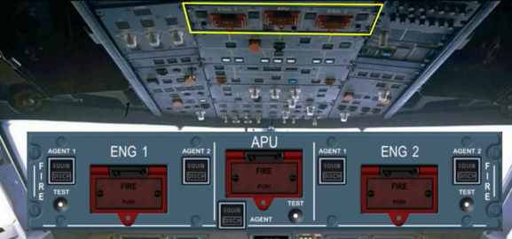

***Module completed***