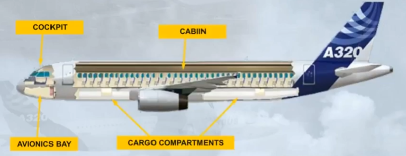
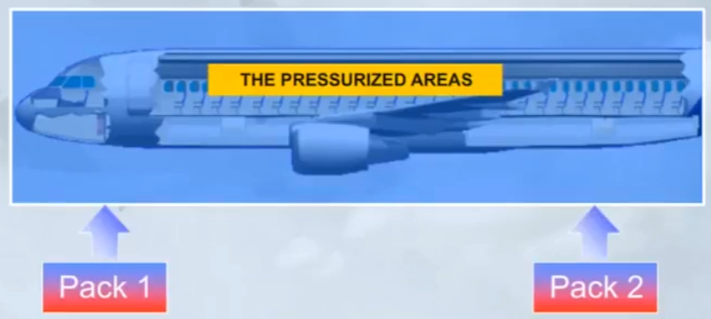
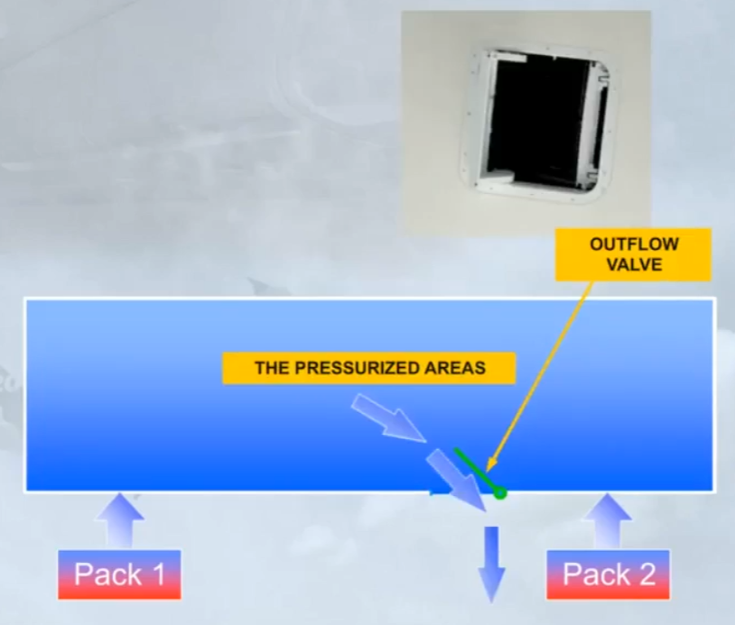
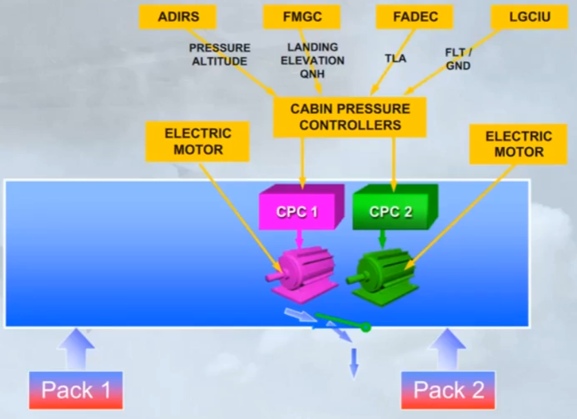
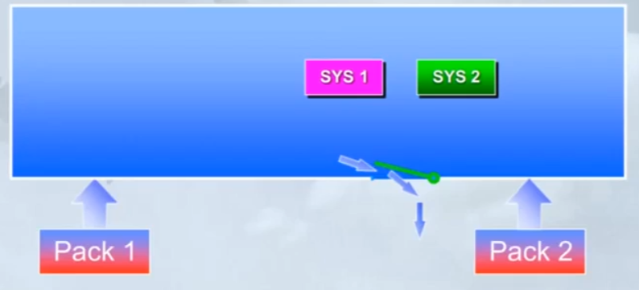
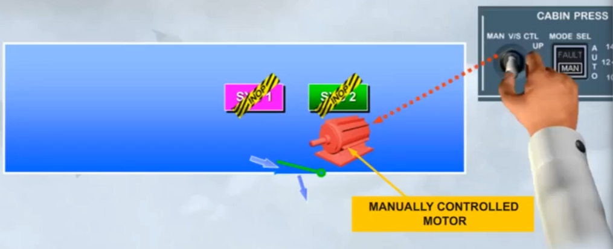

The pressurization system, on the A320, normally operates automatically to adjust the cabin altitude and its rate of change, to ensure maximum passenger comfort and safety.

The pressurized areas are:
- The cockpit
- The avionics bay
- The cabin
- The cargo compartments.

The concept of the system is simple. Air is supplied from the air conditioning packs to the pressurized areas.

An outflow valve is used to regulate the amount of air allowed to escape from the pressurized areas.

Automatic control of the outfow valve is provided by two Cabin Pressure Controllers (CPC). Each controller has an electric motor to move the outflow valve.

Note: the CPC receives data from the Air Data Inertial and Reference System (ADIRS). the Flght Management and Guidance Computer (FMGC), the Full Authority Digital Engine Control (FADEC) and the Landing Gear Control and Interface Unit (LGCIU) in order to elaborate the different pressurization control laws.

A controller/ motor combination is known as a system. Only one system will operate at any one time with the other system acting as backup.

A third motor is installed for use in the event of both automatic systems failing and requires a manual input to open or close the outflow valve.

