On the A320, there are two ventilation systems:
- Lavatory and galley system
- Avionics system.

Note: Air around the batteries is drawn directly overboard by a venturi.

The lavatory and galley system is fully automatic.

Cabin air is passed through the lavatory and galley areas, and is removed by an extraction fan.
This fan pulls air into an extraction duct and then releases it overboard through the outflow valve.

Note: The extraction fan runs continuously provided electrical power is available.

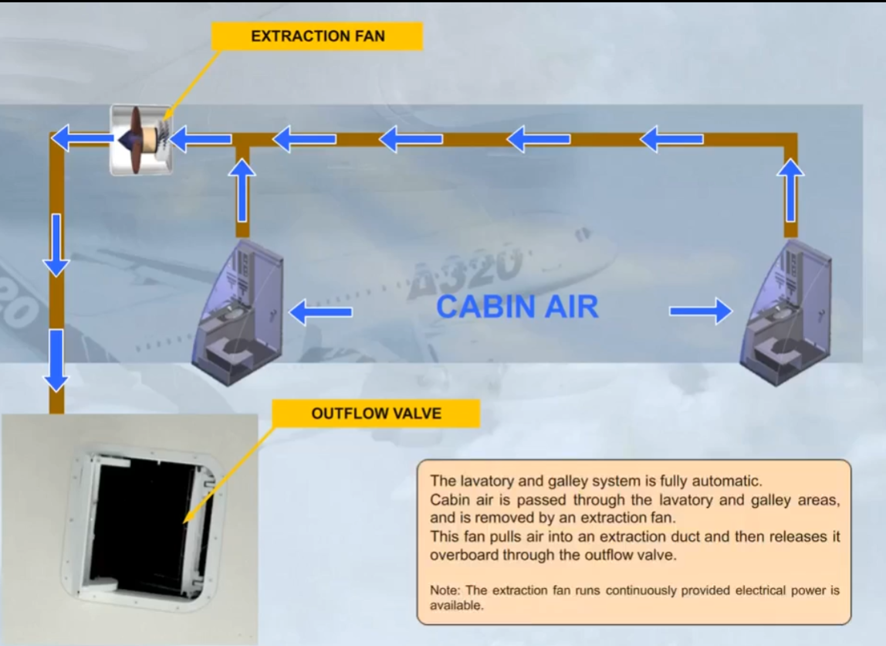

The following systems have no controls or indications:
- The lavatory and galley ventilation system
- The battery ventilation system.

Now let's look at the avionics ventilation system.

The avionics ventilation system provides cooling air for the avionics equipment.

This equipment includes:
- The avionics compartment
- The flight deck instruments
- The circuit breaker panels.

Let's now look at how the system works.

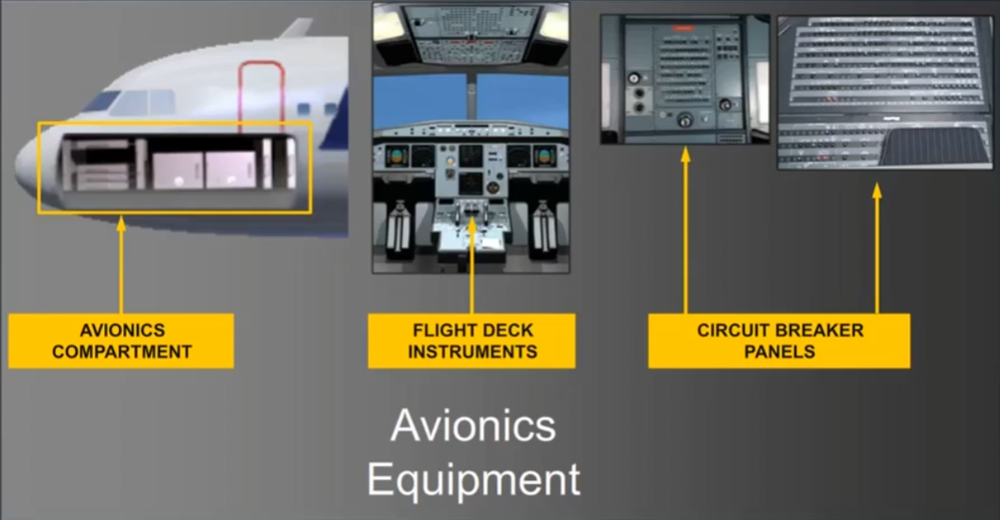

Air is circulated by two fans, a blower and an extract.
These fans operate continuously, as long as the aircraft electrical system is supplied.
Note: The operation of the avionics ventilation system is controlled and monitored by an Avionics Equipment Ventilation Controller (AEVC).

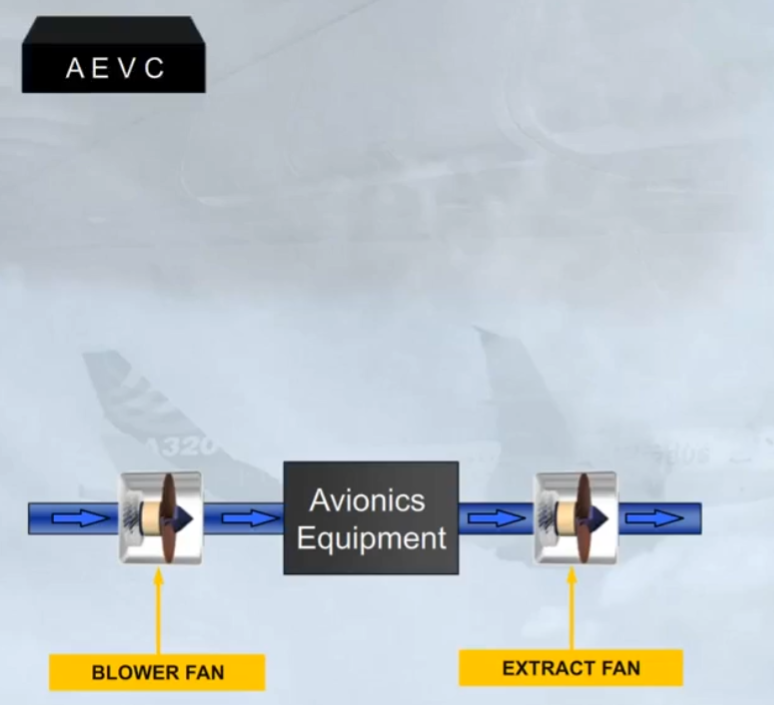

A section of the ECAM CAB PRESS page displays avionics ventilation system information.

The VENT, INLET, and OUTLET indications provide information on the state of the inlet and extract systems. Normally they remain white.

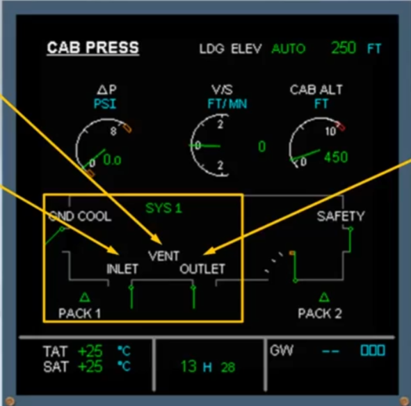

On the ground, provided that the skin temperature is above a specified value, air is taken from outside the aircraft, via a skin air inlet valve.

The air is blown through the avionics equipment, extracted and then discharged overboard via a skin air extract valve. As both valves are open, this is the OPEN CIRCUIT configuration.

Note: In most cases, you will see this indication when the aircraft is on the ground and, engine not running or engine thrust not at takeoff

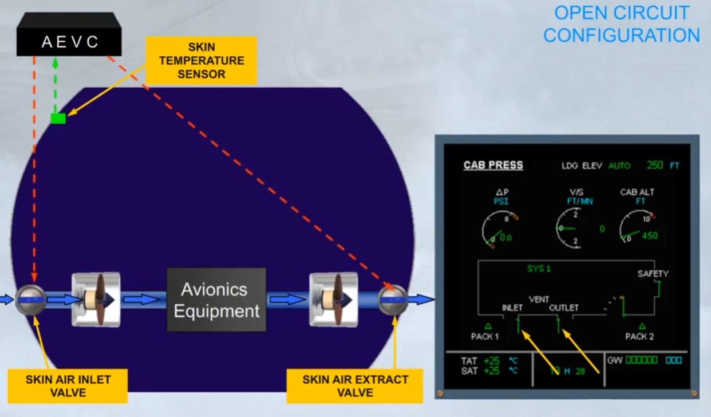

As soon as the skin temperature is low enough, on ground or in flight, the skin air inlet and extract valves are closed and air is directed to the skin heat exchanger for cooling. This is the closed circuit configuration.

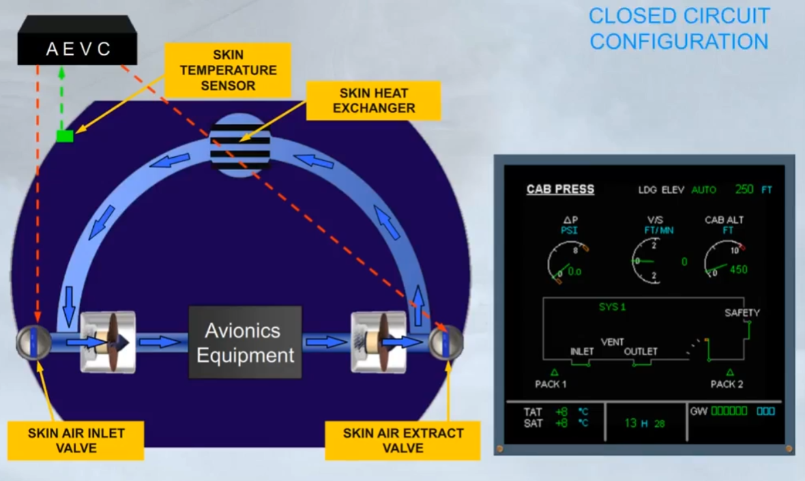

On ground with thrust at takeoff or in flight, if the skin temperature is high, a small flap opens in the closed extract valve. This is the intermediate configuration.

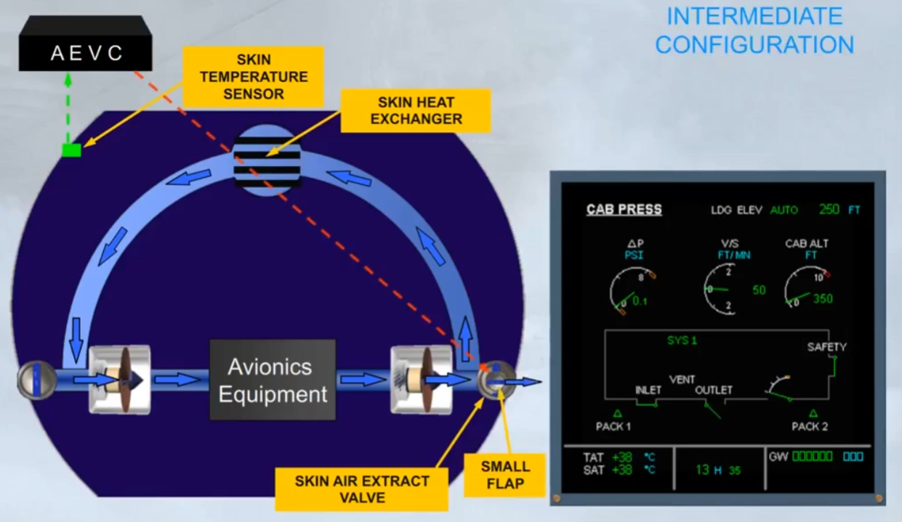

To summarize:
- OPEN CIRCUIT:
The equipment is cooled by blown outside air
- CLOSED CIRCUIT:
The equipment is cooled by blown air through a skin heat exchanger
- INTERMEDIATE:
The equipment is cooled by blown air through a skin heat exchanger plus partially exhausted overboard.

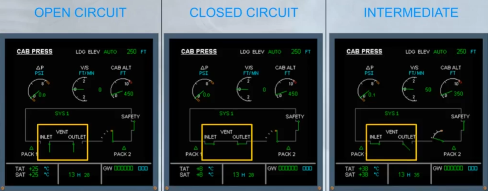

The skin air inlet valve is located on the left hand side of the aircraft, and the skin air extract valve with its small flap, on the right hand side.

Both valves are inspected during the pre-flight walk around for damage or obstruction.
 
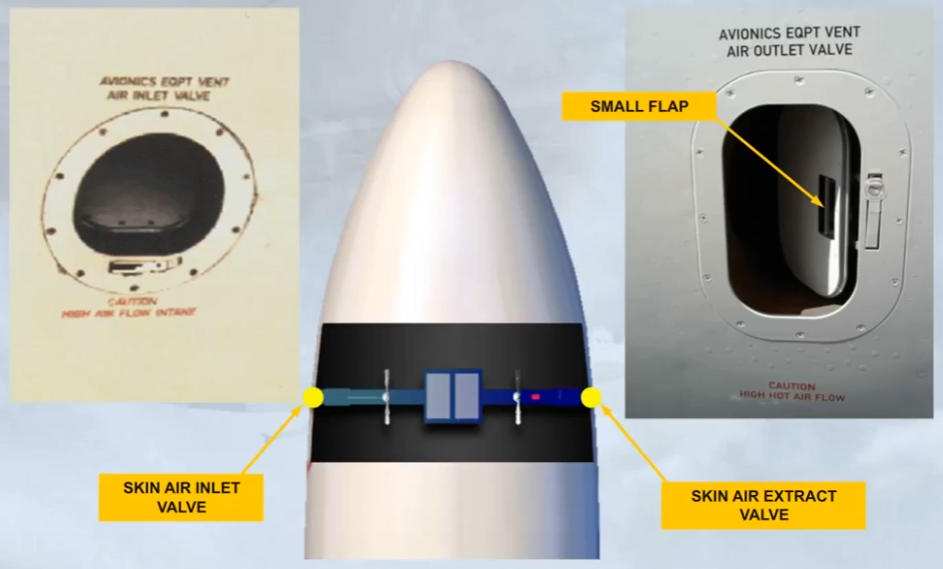

On the overhead panel, there is a VENTILATION panel that contains three pushbutton switches associated with the ventilation system.
During the pre-flight cockpit scan, you should confirm that these switches are in their lights out position.
The avionics ventilation system will then operate automatically, and requires no further pilot input.

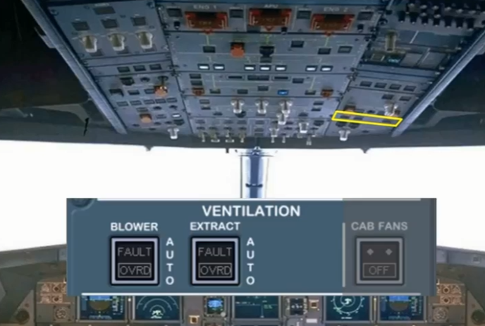

A FAULT light comes on on the related pb-sw, in case of a blower flow problem, or a duct overheat.

Setting that pb-sw to OVRD, allows the ventilation system to be reconfigured by activating the CLOSED CIRCUIT configuration, by stopping the blower fan and by adding air from air conditioning duct through an AIR COND INLET valve.

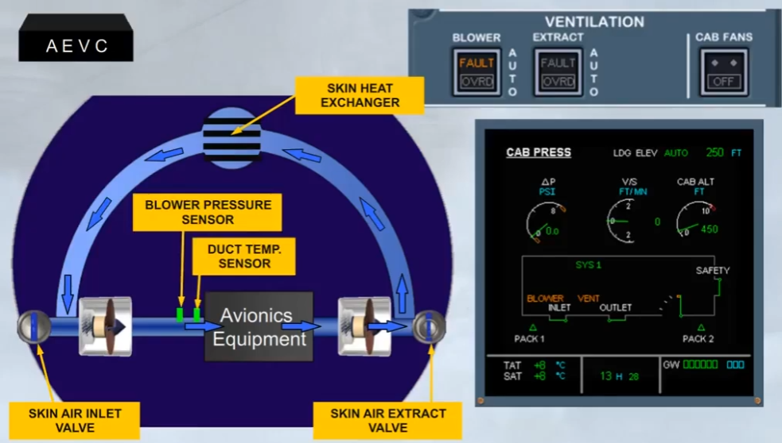
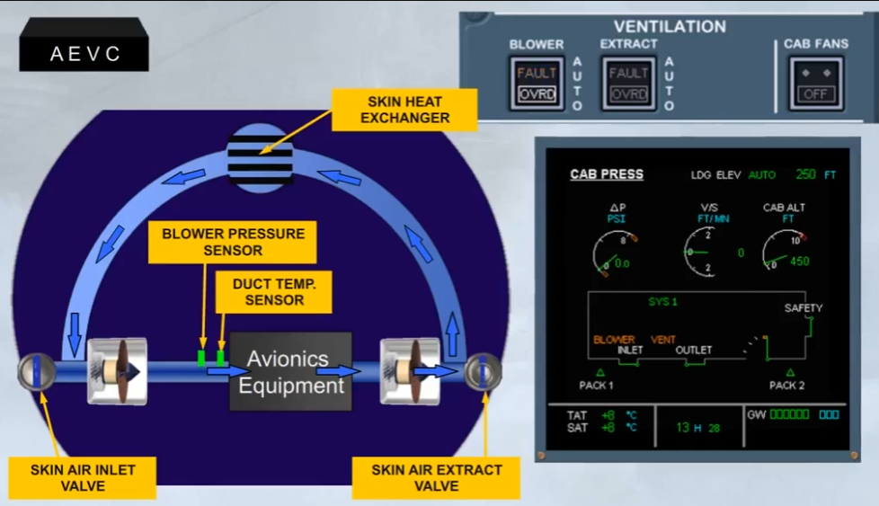
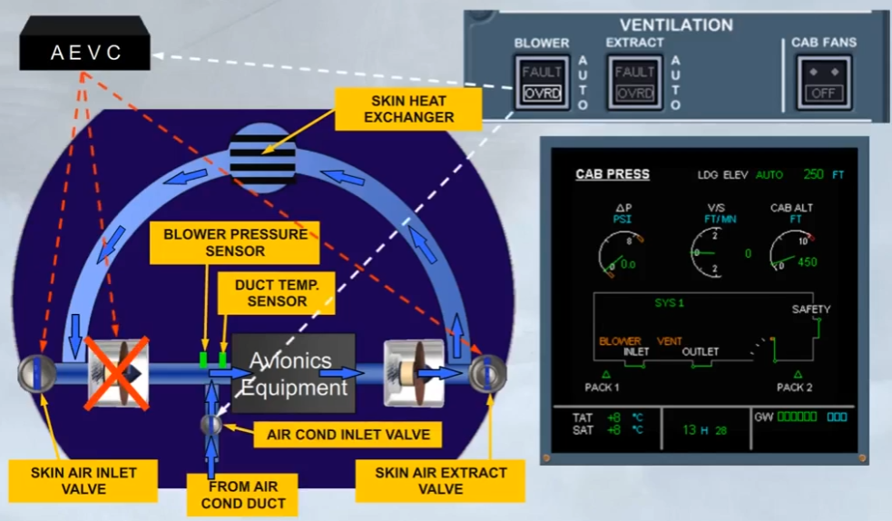

A FAULT light comes on on the related pb-sw, in case of an extraction flow problem.

Setting that pb-sw to OVRD, allows the ventilation system to be reconfigured by activating the CLOSED CIRCUIT configuration, by transferring the control of the extract fan to the pb-sw and by adding air from air conditioning duct through an AIR COND INLET valve.

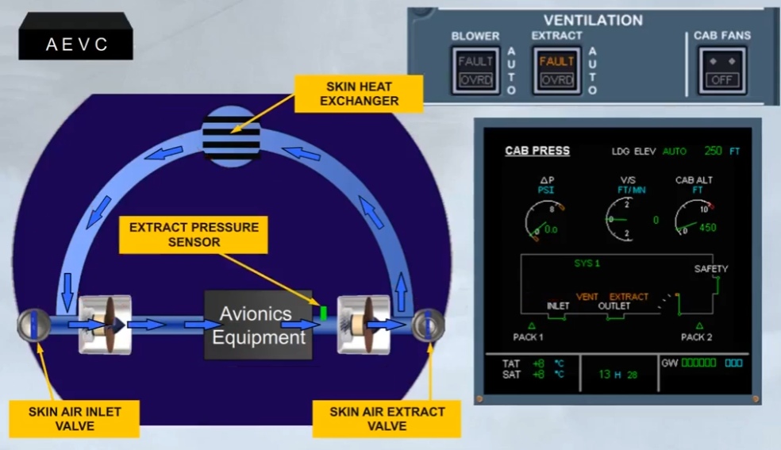
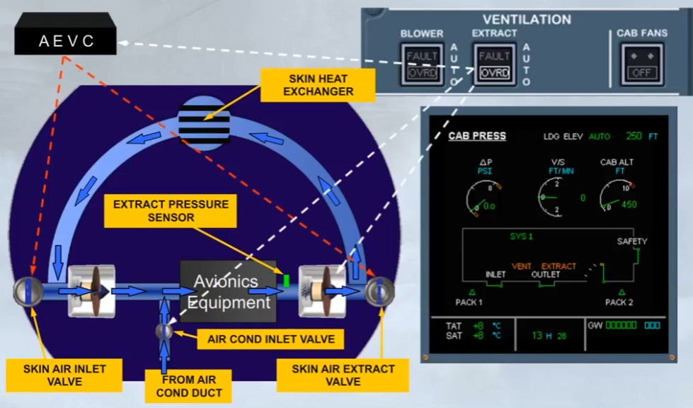

In case of smoke detection, both FAULT lights come on.
Setting both pushbutton switches to OVRD, allow the ventilation system to be reconfigured by isolating the skin heat exchanger through the closure of a skin exchanger isolation valve, by stopping the blower fan, by opening the small fap of the skin air extract valve, by transferring the control of the extract fan to the pb-sw and by adding air from air conditioning duct through an AIR COND INLET valve.

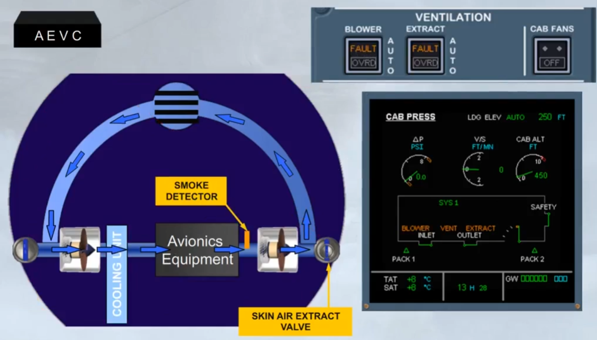
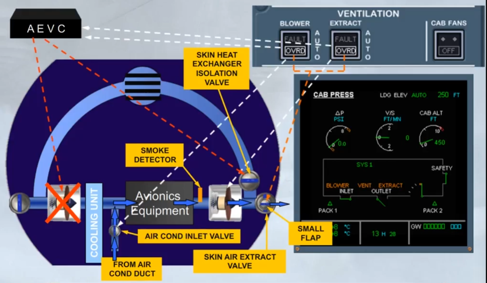

On ground, in case of AEVC failure, both FAULT lights come on.

Setting both pushbutton switches to OVRD, allow the ventlation system to be reconfigured by keeping the skin exchanger isolation valve open, by opening the small fap of the closed skin air extract valve, by transferring the control of the extract fan to the pb-sw and by adding air from air conditioning duct through an air conditioning inlet valve.

Note: As the control of skin air inlet valve is lost, its position will be the one before the fault occurs.

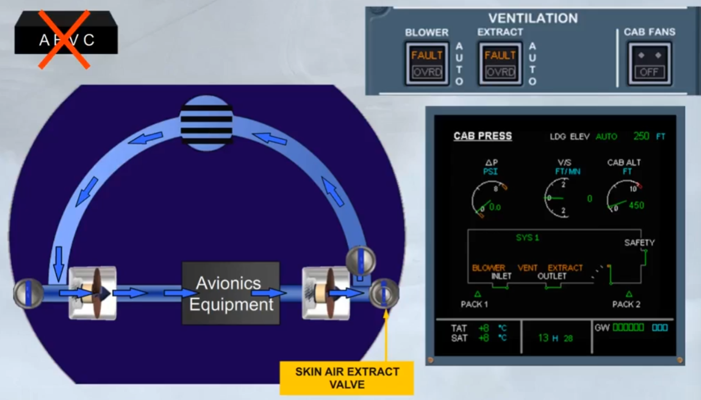
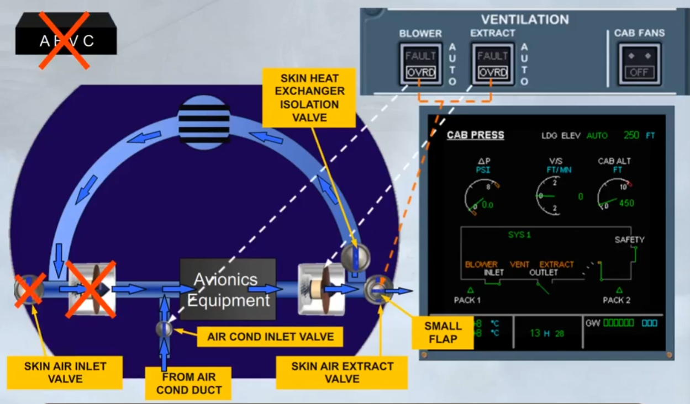

***Module completed***

## Video study

- Watch the video available on [YouTube](https://www.youtube.com/watch?v=vtcXsAF-DTM&list=PLKEybvo562LtwmnZOjo8jN7J75vXGqMzq&index=40)